

## **Universidad Peruana de Ciencias Aplicadas**
### **Carrera de Ingeniería de Software**
 

**Curso: Aplicaciones Web**

**NRC: 16129**

**Docente: Alberto Wilmer Sanchez Seña**

### **Informe del Trabajo Final**

**Nombre de la Startup:** DevTech

**Nombre del producto:** WashTrack

### **Integrantes**

<table align="center" style="border-collapse: collapse; border: none; margin-left: auto; margin-right: auto;">
    <tr>
        <th style="border: none; padding: 0 18px 6px 0; text-align: center;">Código</th>
        <th style="border: none; padding: 0 0 6px 0; text-align: center;">Apellidos y Nombres</th>
    </tr>
    <tr>
        <td style="border: none; padding: 0 18px 4px 0; text-align: center;">U20241D338</td>
        <td style="border: none; padding: 0 0 4px 0; text-align: center;">Pérez Vásquez, Ariana Valeria</td>
    </tr>
    <tr>
        <td style="border: none; padding: 0 18px 4px 0; text-align: center;">U202416053</td>
        <td style="border: none; padding: 0 0 4px 0; text-align: center;">Ramirez Gutierrez, Gabriel</td>
    </tr>
    <tr>
        <td style="border: none; padding: 0 18px 4px 0; text-align: center;">U202018427</td>
        <td style="border: none; padding: 0 0 4px 0; text-align: center;">Ramos Fuentes Rivera, Adriana Nicole</td>
    </tr>
    <tr>
        <td style="border: none; padding: 0 18px 4px 0; text-align: center;">U202422642</td>
        <td style="border: none; padding: 0 0 4px 0; text-align: center;">Sayago Vidal, Sebastián Leonardo</td>
    </tr>
    <tr>
        <td style="border: none; padding: 0 18px 0 0; text-align: center;">U202216240</td>
        <td style="border: none; padding: 0; text-align: center;">Tufiño Argüelles, Luis Angel</td>
    </tr>
</table>

*Setiembre, 2026*

---

# Registro de Versiones del Informe

| Versión | Fecha      | Autor                         | Descripcion                                              |
| :--- |:-----------|:------------------------------|:---------------------------------------------------------|
| 1.0.0 | 28/08/2026 | Gabriel Ramirez y Luis Tufiño | Creó el repositorio junto a los branch de cada capítulo. |
| 1.1.0 | 02/09/2026 | Adriana Ramos | Agregó el Capítulo I |
| 1.1.0 | 04/09/2026 | Ariana Perez | Agregó su parte en student Outcome y desarrollo avance del capítulo IV junto a la Landing Page |
---

## Project Report Collaboration Insights

// Enlaces  de repositorios

*Reporte de colaboración de la entrega del TP:*

// Falta Imagen 

---

# Contenido

## Tabla de Contenidos

- [Registro de Versiones del Informe](#registro-de-versiones-del-informe)
- [Project Report Collaboration Insights](#project-report-collaboration-insights)
- [Contenido](#contenido)
  - [Tabla de Contenidos](#tabla-de-contenidos)
- [Student Outcome](#student-outcome)
- [Capítulo I: Introducción](#capítulo-i-introducción)
  - [1.1. Startup Profile](#11-startup-profile)
    - [1.1.1. Descripción de la Startup](#111-descripción-de-la-startup)
    - [1.1.2. Perfiles de integrantes del equipo](#112-perfiles-de-integrantes-del-equipo)
  - [1.2. Solution Profile](#12-solution-profile)
    - [1.2.1. Antecedentes y problemática](#121-antecedentes-y-problemática)
    - [1.2.2. Lean UX Process](#122-lean-ux-process)
      - [1.2.2.1. Lean UX Problem Statements](#1221-lean-ux-problem-statements)
      - [1.2.2.2. Lean UX Assumptions](#1222-lean-ux-assumptions)
      - [1.2.2.3. Lean UX Hypothesis Statements](#1223-lean-ux-hypothesis-statements)
      - [1.2.2.4. Lean UX Canvas](#1224-lean-ux-canvas)
  - [1.3. Segmentos objetivo](#13-segmentos-objetivo)
- [Capítulo II: Requirements Elicitation \& Analysis](#capítulo-ii-requirements-elicitation--analysis)
  - [2.1. Competidores](#21-competidores)
    - [2.1.1. Análisis competitivo](#211-análisis-competitivo)
    - [2.1.2. Estrategias y tácticas frente a competidores](#212-estrategias-y-tácticas-frente-a-competidores)
  - [2.2. Entrevistas](#22-entrevistas)
    - [2.2.1. Diseño de entrevistas](#221-diseño-de-entrevistas)
    - [2.2.2. Registro de entrevistas](#222-registro-de-entrevistas)
    - [2.2.3. Análisis de entrevistas](#223-análisis-de-entrevistas)
  - [2.3. Needfinding](#23-needfinding)
    - [2.3.1. User Personas](#231-user-personas)
    - [2.3.2. User Task Matrix](#232-user-task-matrix)
    - [2.3.3. User Journey Mapping](#233-user-journey-mapping)
    - [2.3.4. Empathy Mapping](#234-empathy-mapping)
  - [2.4. Big Picture Event Storming](#24-big-picture-event-storming)
  - [2.5. Ubiquitous Language](#25-ubiquitous-language)
- [Capítulo III: Requirements Specification](#capítulo-iii-requirements-specification)
  - [3.1. User Stories](#31-user-stories)
  - [3.2. Impact Mapping](#32-impact-mapping)
  - [3.3. Product Backlog](#33-product-backlog)
- [Capítulo IV: Product Design](#capítulo-iv-product-design)
  - [4.1. Style Guidelines](#41-style-guidelines)
    - [4.1.1. General Style Guidelines](#411-general-style-guidelines)
    - [4.1.2. Web Style Guidelines](#412-web-style-guidelines)
  - [4.2. Information Architecture](#42-information-architecture)
    - [4.2.1. Organization Systems](#421-organization-systems)
    - [4.2.2. Labeling Systems](#422-labeling-systems)
    - [4.2.3. SEO Tags and Meta Tags](#423-seo-tags-and-meta-tags)
    - [4.2.4. Searching Systems](#424-searching-systems)
    - [4.2.5. Navigation Systems](#425-navigation-systems)
  - [4.3. Landing Page UI Design](#43-landing-page-ui-design)
    - [4.3.1. Landing Page Wireframe](#431-landing-page-wireframe)
    - [4.3.2. Landing Page Mock-up](#432-landing-page-mock-up)
  - [4.4. Web Applications UX/UI Design](#44-web-applications-uxui-design)
    - [4.4.1. Web Applications Wireframes](#441-web-applications-wireframes)
    - [4.4.2. Web Applications Wireflow Diagrams](#442-web-applications-wireflow-diagrams)
    - [4.4.3. Web Applications Mock-ups](#443-web-applications-mock-ups)
    - [4.4.4. Web Applications User Flow Diagrams](#444-web-applications-user-flow-diagrams)
  - [4.5. Web Applications Prototyping](#45-web-applications-prototyping)
  - [4.6. Domain-Driven Software Architecture](#46-domain-driven-software-architecture)
    - [4.6.1. Design-Level EventStorming](#461-design-level-eventstorming)
    - [4.6.2. Software Architecture Context Diagram](#462-software-architecture-context-diagram)
    - [4.6.3. Software Architecture Container Diagrams](#463-software-architecture-container-diagrams)
    - [4.6.4. Software Architecture Components Diagrams](#464-software-architecture-components-diagrams)
  - [4.7. Software Object-Oriented Design](#47-software-object-oriented-design)
    - [4.7.1. Class Diagrams](#471-class-diagrams)
  - [4.8. Database Design](#48-database-design)
    - [4.8.1. Database Diagrams](#481-database-diagrams)

- [Capítulo V: Product Implementation, Validation & Deployment](#capítulo-v-product-implementation-validation--deployment)
  - [5.1. Software Configuration Management](#51-software-configuration-management)
    - [5.1.1. Software Development Environment Configuration](#511-software-development-environment-configuration)
    - [5.1.2. Source Code Management](#512-source-code-management)
    - [5.1.3. Source Code Style Guide & Conventions](#513-source-code-style-guide--conventions)
    - [5.1.4. Software Deployment Configuration](#514-software-deployment-configuration)
  - [5.2. Landing Page, Services & Applications Implementation](#52-landing-page-services--applications-implementation)
    - [5.2.1. Sprint 1](#521-sprint-1)
      - [5.2.1.1. Sprint Planning 1](#5211-sprint-planning-1)
      - [5.2.1.2. Aspect Leaders and Collaborators](#5212-aspect-leaders-and-collaborators)
      - [5.2.1.3. Sprint Backlog 1](#5213-sprint-backlog-1)
      - [5.2.1.4. Development Evidence for Sprint Review](#5214-development-evidence-for-sprint-review)
      - [5.2.1.5. Execution Evidence for Sprint Review](#5215-execution-evidence-for-sprint-review)
      - [5.2.1.6. Services Documentation Evidence for Sprint Review](#5216-services-documentation-evidence-for-sprint-review)
      - [5.2.1.7. Software Deployment Evidence for Sprint Review](#5217-software-deployment-evidence-for-sprint-review)
      - [5.2.1.8. Team Collaboration Insights during Sprint](#5218-team-collaboration-insights-during-sprint)
  - [5.3. Validation Interviews](#53-validation-interviews)
    - [5.3.1. Diseño de Entrevistas](#531-diseño-de-entrevistas)
    - [5.3.2. Registro de Entrevistas](#532-registro-de-entrevistas)
    - [5.3.3. Evaluaciones según heurísticas](#533-evaluaciones-según-heurísticas)
  - [5.4. Video About-the-Product](#54-video-about-the-product)

- [Bibliografía](#bibliografía)

- [Anexos](#anexos)

---

# Student Outcome
El curso contribuye al cumplimiento del Student Outcome ABET:
**ABET – EAC - Student Outcome 5**

<b>Criterio: La capacidad de funcionar efectivamente en un equipo cuyos miembros juntos proporcionan liderazgo, crean un entorno de colaboración e inclusivo, establecen objetivos, planifican tareas y cumplen objetivos.</b>

En el siguiente cuadro se describe las acciones realizadas y enunciados de conclusiones por parte del grupo, que permiten sustentar el haber alcanzado el logro del ABET – EAC - Student Outcome 5.

<table>
  <thead>
    <tr>
      <th>Criterio específico</th>
      <th>Acciones realizadas</th>
      <th>Conclusiones</th>
    </tr>
  </thead>
  <tbody>
    <tr>
      <td><strong>Trabaja en equipo para proporcionar liderazgo en forma conjunta</strong></td>
      <td>
        <b>Pérez Vásquez, Ariana Valeria</b> 
        <em><b>AV1</b></em> 
        Elaboré el Capítulo IV del proyecto WashTrack, desarrollando las Style Guidelines, donde se establecieron los lineamientos generales y web para mantener una interfaz consistente, clara, accesible y fácil de utilizar. 
        <em><b>AV2</b></em> 
        Desarrollé la Information Architecture, la Landing Page UI, elaborando el wireframe y mock-up de la página principal de WashTrack, considerando la distribución de los elementos, jerarquía visual, navegación y presentación de la propuesta de valor del producto. 
        ... 
        <b>Ramirez Gutierrez, Gabriel</b> 
        <em><b>AV1</b></em> 
        Poner avances av1 
        <em><b>AV2</b></em> 
        Poner avances av2 
        ... 
        <b>Ramos Fuentes Rivera, Adriana Nicole</b> 
        <em><b>AV1</b></em> 
        Poner avances av1 
        <em><b>AV2</b></em> 
        Poner avances av2 
        ... 
        <b>Sayago Vidal, Sebastián Leonardo</b> 
        <em><b>AV1</b></em> 
        Poner avances av1 
        <em><b>AV2</b></em> 
        Poner avances av2 
        ... 
        <b>Tufiño Argüelles, Luis Angel</b> 
        <em><b>AV1</b></em> 
        Poner avances av1 
        <em><b>AV2</b></em> 
        Poner avances av2 
        ... 
      </td>
      <td>
        Fusce cursus dolor et nulla suscipit, sit amet ullamcorper nibh vestibulum. 
        Nam ornare massa eu lobortis porttitor. 
        Nam ut erat feugiat libero pretium semper at ac metus. 
        Sed at eros dapibus, fermentum quam ut, bibendum lacus. 
        Curabitur eget orci eget urna varius commodo. 
        ...
      </td>
    </tr>
    <tr>
      <td><strong>Crea un entorno colaborativo e inclusivo, establece metas, planifica tareas y cumple objetivos.</strong></td>
      <td>
        <b>Pérez Vásquez, Ariana Valeria</b> 
        <em><b>AV1</b></em> 
        Participé en la planificación y organización de las actividades del equipo, coordinando las tareas asignadas para el desarrollo del proyecto WashTrack y contribuyendo al cumplimiento de los objetivos establecidos para el avance 
        <em><b>AV2</b></em> 
        Desarrollé las secciones asignadas del Capítulo IV, relacionadas con Style Guidelines, Information Architecture y Landing Page UI Design, coordinando con los integrantes del equipo para mantener la coherencia del proyecto y cumplir con las actividades planificadas 
        ... 
        <b>Ramirez Gutierrez, Gabriel</b> 
        <em><b>AV1</b></em> 
        Poner avances av1 
        <em><b>AV2</b></em> 
        Poner avances av2 
        ... 
        <b>Ramos Fuentes Rivera, Adriana Nicole</b> 
        <em><b>AV1</b></em> 
        Poner avances av1 
        <em><b>AV2</b></em> 
        Poner avances av2 
        ... 
        <b>Sayago Vidal, Sebastián Leonardo</b> 
        <em><b>AV1</b></em> 
        Poner avances av1 
        <em><b>AV2</b></em> 
        Poner avances av2 
        ... 
        <b>Tufiño Argüelles, Luis Angel</b> 
        <em><b>AV1</b></em> 
        Poner avances av1 
        <em><b>AV2</b></em> 
        Poner avances av2 
        ... 
      </td>
      <td>
        Fusce mattis augue a nisl bibendum, quis fringilla neque scelerisque. 
        Vivamus commodo libero eget venenatis imperdiet. 
        Etiam imperdiet quam condimentum velit tempor porttitor. 
        Suspendisse blandit nisl quis mauris vehicula faucibus. 
        ...
      </td>
    </tr>
  </tbody>
</table>

---

## Capítulo I: Introducción

### 1.1. Startup Profile

#### 1.1.1. Descripción de la Startup

    Somos DevTech, una startup tecnológica creada por estudiantes de la Universidad Peruana de Ciencias Aplicadas, enfocada en el desarrollo de soluciones digitales innovadoras para optimizar y transformar la gestión de negocios tradicionales mediante el uso de software. Nuestra startup busca facilitar la digitalización de procesos que actualmente se realizan de manera manual, permitiendo a los negocios mejorar su organización, reducir errores, optimizar sus tiempos de atención y ofrecer una mejor experiencia a sus clientes.

    Nuestro producto principal es WashTrack, una plataforma digital orientada a la gestión integral de lavanderías, esta solución permitirá a los negocios y sus clientes, registrar y administrar clientes, gestionar pedidos y prendas, realizar el seguimiento del estado de cada pedido y mantener un historial de las operaciones realizadas.

    La misión de DevTech es desarrollar soluciones tecnológicas accesibles, intuitivas y eficientes que permitan a los negocios tradicionales digitalizar sus procesos, optimizar su gestión y mejorar la experiencia de sus clientes.

    Nuestra visión es consolidarnos como una startup innovadora en el desarrollo de soluciones digitales para pequeñas y medianas empresas en Latinoamérica, contribuyendo a su transformación digital mediante plataformas que simplifiquen sus operaciones y generen valor tanto para los negocios como para sus clientes.

    Nuestros valores son:
    <ul>
        <li>Innovación: Desarrollar soluciones tecnológicas que respondan a las necesidades actuales de los negocios y sus clientes.</li>
        <li>Compromiso: Crear herramientas enfocadas en resolver problemas reales y generar valor para nuestros usuarios.</li>
        <li>Accesibilidad: Diseñar soluciones fáciles de utilizar y accesibles para pequeñas y medianas empresas.</li>
        <li>Transparencia: Facilitar información clara y actualizada sobre los procesos y pedidos de los clientes.</li>
    </ul>

#### 1.1.2. Perfiles de integrantes del equipo

<table>
  <tr>
    <td rowspan="4" align="center">
      
    </td>
    <td><b>Nombre:</b> Perez Vasquez Ariana Valeria</td>
  </tr>
  <tr>
    <td><b>Código:</b> U20241D338</td>
  </tr>
  <tr>
    <td>
      <b>Descripción:</b> 
      Tengo un fuerte interés en el <b>desarrollo de soluciones tecnológicas que permitan optimizar procesos y mejorar la experiencia de los usuarios</b>. Me considero una persona <b>responsable, organizada y comprometida </b>con las actividades que realizo. Además, me interesa el diseño de interfaces y la organización de la información, buscando que las soluciones desarrolladas sean claras, funcionales y fáciles de utilizar.
        
      Dentro del equipo, participo en el <b>desarrollo y diseño de la propuesta de WashTrack</b>, aportando principalmente en la elaboración de las Style Guidelines, la arquitectura de información y el diseño de la Landing Page. Mi objetivo es contribuir a que la plataforma presente una estructura visual coherente, una navegación sencilla y una experiencia adecuada tanto para los negocios de lavandería como para sus clientes. Asimismo, valoro el trabajo colaborativo y la comunicación con los demás integrantes para lograr una propuesta integrada y cumplir con los objetivos establecidos del proyecto.
    </td>
  </tr>
  <tr>
  </tr>

  <tr>
    <td rowspan="4" align="center">
      
    </td>
    <td><b>Nombre:</b> Gabriel Ramirez Gutierrez</td>
  </tr>
  <tr>
    <td><b>Código:</b> U202416053</td>
  </tr>
  <tr>
    <td>
      <b>Descripción:</b> 
            Mi nombre es <b>Gabriel Ramirez Gutierrez</b> y estudio Ingeniería de Software en la UPC. Me interesa transformar necesidades reales en soluciones tecnológicas prácticas y seguir fortaleciendo mis habilidades mediante nuevos retos de aprendizaje. Tengo experiencia trabajando con C++, C# y Python, así como con bases de datos relacionales y no relacionales, como SQL y MongoDB.
        
      Dentro del equipo cumplo con la funcion del diseño de funcionalidades de la aplicacion, ademas del desarrollo de esta, tomando en cuenta mis conocimientos en Domain Driven Design y diseño Web.
    </td>
  </tr>
<tr>

</tr>
  <tr>
    <td rowspan="4" align="center">
      
    </td>
    <td><b>Nombre:</b> Sebastián Leonardo Sayago Vidal</td>
  </tr>
  <tr>
    <td><b>Código:</b> U202422642</td>
  </tr>
  <tr>
    <td>
    

      <b>Descripción:</b> 
       Mi nombre es <b>Sebastián Leonardo Sayago Vidal</b>, estudio Ingeniería de Software en la UPC, estando presente en el 5to ciclo de la carrera.  Me considero una persona responsable al cumplir con mi trabajo asignado en el plazo respectivo. Busco que lo que tenga que hacer, se haga de la forma correcta y tenga una buena presentación y priorizar la calidad de mis resultados. 
        
      Dentro del equipo, participo principalmente en el desarrollo técnico y la documentación del proyecto, apoyando en el diseño de la arquitectura de software, el modelado del sistema y la elaboración de los diagramas correspondientes. También colaboro en la organización y revisión de la documentación técnica, procurando que las propuestas mantengan coherencia con los requerimientos y objetivos de WashTrack.
      

    </td>
  </tr>

  <tr>
  </tr>
  <tr>
    <td rowspan="4" align="center">
      
    </td>
    <td><b>Nombre:</b> Adriana Nicole Ramos Fuentes Rivera</td>
  </tr>
  <tr>
    <td><b>Código:</b> u202018427</td>
  </tr>
  <tr>
    <td>
      <b>Descripción:</b> 
      Soy <b>Adriana Nicole Ramos Fuentes Rivera</b>, estudio la carrera de Ingeniería de Software en la UPC, actualmente estoy en el 5to ciclo. Me gusta aprender nuevas tecnologias y conocimientos complementarios que me permitan desarrollar soluciones a problematicas dentro de un contexto real. Cuento con experiencia en lenguajes de programación como C++ y Python, además de conocimientos en base de datos relacional y no relacional como SQL y MongoDB.
        
      Dentro del equipo, me enfoco en el desarrollo de backend, aplicando principios de Domain Driven Design para mantener una lógica de negocio clara. Me considero una persona organizada y empática.
    </td>
  </tr>

  <tr>
  </tr>
  <tr>
    <td rowspan="4" align="center">
      
    </td>
    <td><b>Nombre:</b> NOMBRE COMPLETO </td>
  </tr>
  <tr>
    <td><b>Código:</b> PONER TU CODIGO DE U </td>
  </tr>
  <tr>
    <td>
      <b>Descripción:</b> 
    Breve descripcion
        
    Dentro del equipo... (que funcion cumples)  
    </td>
  </tr>

</table>

### 1.2. Solution Profile

    WashTrack es una plataforma digital desarrollada por la startup DevTech, orientada a optimizar la gestión de lavanderías y mejorar la experiencia de sus clientes mediante herramientas tecnológicas accesibles y eficientes. La plataforma busca centralizar en un solo sistema los principales procesos relacionados con la recepción, gestión y seguimiento de los pedidos de lavandería. 

    Para las lavanderías, WashTrack permite registrar y gestionar clientes, crear pedidos, registrar las prendas y servicios solicitados, actualizar el estado de cada pedido y consultar el historial de operaciones, reemplazando procesos manuales como el registro de información en cuadernos, hojas de cálculo o mensajes dispersos y facilitando el control de los pedidos, mientras que, para los clientes, ofrece un espacio digital donde pueden consultar sus pedidos, visualizar el estado de sus prendas, revisar el historial de servicios, realizar pagos digitales y solicitar servicios de recojo y entrega a domicilio, brindándoles mayor visibilidad, comodidad y facilidad para gestionar sus servicios de lavandería sin necesidad de comunicarse constantemente con el negocio.

    Además, como valor diferencial, WashTrack integra la gestión operativa de la lavandería con el seguimiento del pedido por parte del cliente, permitiendo mantener la información sincronizada durante las diferentes etapas del servicio. Esto busca mejorar la transparencia del proceso, reducir la incertidumbre del cliente y facilitar la organización de las lavanderías.

    WashTrack se plantea como una solución escalable, que puede incorporar progresivamente nuevas funcionalidades de acuerdo con las necesidades de las lavanderías y sus clientes, como pagos digitales, servicios de recojo y entrega a domicilio, promociones, programas de fidelización y herramientas avanzadas de análisis.

#### 1.2.1. Antecedentes y problemática

**1.2.1.1. What**

    Nuestra propuesta de solución, Easy Wash, se propone resolver las siguientes 3 problemáticas recurrentes en la vida personal, específicamente, cuando se desempeña el trabajo doméstico:
    <ul>
        <li>Uno de los principales problemas a los que se enfrentan las personas independientes que consumen el servicio de lavandería es la limitada disponibilidad de tiempo para realizar tareas domésticas, ya que resulta difícil equilibrar la vida laboral con las responsabilidades domésticas y las actividades personales. Según la Encuesta Nacional de Uso del Tiempo (ENUT) correspondiente al año 2024 realizada por el INEI, la población peruana dedica una cantidad significativa de tiempo al trabajo doméstico no remunerado, donde en un día de semana, las mujeres destinan en promedio 3 horas y 35 minutos y los hombres 1 hora y 37 minutos a estas actividades, además, dentro ellas se encuentra la limpieza y cuidado de la ropa, que demanda en promedio 1 hora y 22 minutos diarios para las mujeres y 58 minutos para los hombres. Por consiguiente, destinar este tiempo diario a las actividades de limpieza y cuidado de la ropa, reduce el tiempo disponible para otras actividades personales, como el descanso, ejercicio, etc. por lo que resulta ideal contratar un servicio externo que realice estas actividades.</li> 
        <li>El segundo problema es la falta de recursos para el lavado de ropa dentro de los hogares. Según el informe técnico de Condiciones de Vida en el Perú con los resultados de la Encuesta Nacional de Hogares (ENAHO) correspondiente al primer trimestre del año 2026, indica que el 90,5% de los hogares tiene cocina a gas, 57,0% cuenta con refrigeradora/congeladora, 36,4% cuenta con computadora/laptop y 32,2% tiene lavadora de ropa. Asimismo, al comparar los resultados de los primeros trimestres de los años 2023, 2024 y 2025, se observa que la proporción de hogares que cuenta con una lavadora se ha mantenido relativamente estable, pasando de 33,2 % en 2023 a 34,2 % en 2024 y disminuyendo a 32,0 % en 2025, para posteriormente alcanzar el 32,2 % en 2026. Esto evidencia que una cantidad significativa de hogares peruanos no cuentan con una lavadora de ropa, en consecuencia, representa una gran limitación para realizar esta actividad de manera eficiente dentro del hogar.</li> 
        <li>Por último, las lavanderías y sus clientes pueden enfrentar dificultades relacionadas con la gestión, seguimiento y entrega de los pedidos, debido al uso de métodos tradicionales como cuadernos, mensajes de texto, recibos informales u otros registros que dificultan el acceso a la información de manera rápida, precisa y confiable. Esta falta de centralización puede generar errores durante las diferentes etapas del servicio. Asimismo, cuando no existe un sistema que permita actualizar y consultar el estado de los pedidos, los clientes deben comunicarse directamente con la lavandería para conocer el avance de sus prendas, generando una mayor carga de trabajo para el negocio y una experiencia menos eficiente para el usuario. Por lo tanto, es necesario contar con una plataforma digital que permita centralizar la información y los principales procesos de la lavandería, permitiendo que esta información sea consultada y actualizada de manera rápida, precisa y confiable.</li>
    </ul>

**1.2.1.2. Where**

    El problema se presenta principalmente en el sector de servicios de lavandería en el Perú, especialmente en lavanderías independientes, pequeñas y medianas que gestionan diariamente múltiples clientes y pedidos. Estas dificultades pueden presentarse tanto dentro del establecimiento físico, durante la recepción, clasificación, procesamiento y entrega de las prendas, como fuera de este, en la interacción entre la lavandería y sus clientes. Asimismo, desde la perspectiva del cliente, la necesidad se presenta en los hogares y en las actividades cotidianas de las personas que cuentan con poco tiempo para realizar tareas domésticas o que no disponen de una lavadora, por lo que requieren acceder a servicios de lavandería de manera más cómoda y eficiente. Por ello, la solución se orienta inicialmente al mercado peruano, conectando digitalmente a las lavanderías con sus clientes y facilitando tanto la gestión interna del negocio como el acceso y seguimiento de los servicios.

**1.2.1.3. When**

    Las problemáticas aparecen durante las diferentes etapas del servicio, por ejemplo, cuando se registra un pedido, durante el procesamiento de las prendas, al consultar su estado, al realizar el pago y al momento de coordinar la entrega. Estas dificultades pueden incrementarse conforme aumenta el número de clientes y pedidos que debe administrar una lavandería.

**1.2.1.4. Who**

    Las principales personas afectadas son, los propietarios y trabajadores de lavanderías, especialmente aquellos negocios que todavía gestionan clientes, pedidos y pagos mediante registros manuales o herramientas poco integradas, por otro lado, los clientes de las lavanderías, quienes necesitan conocer el estado de sus pedidos y acceder a servicios más cómodos y ágiles.

**1.2.1.5. Why**

    La problemática se presenta porque el lavado y cuidado de la ropa es una actividad doméstica recurrente que requiere tiempo y esfuerzo, lo que puede representar una dificultad para las personas que deben distribuir su tiempo entre responsabilidades laborales, académicas, familiares y personales, especialmente en los hogares que no cuentan con una lavadora y necesitan recurrir a servicios externos. Asimismo, las lavanderías deben gestionar diariamente información sobre clientes, pedidos, prendas, servicios, pagos y fechas de entrega, pero cuando estos procesos se realizan mediante cuadernos, mensajes, recibos u otras herramientas no integradas, aumenta la posibilidad de pérdida de información, confusiones y errores en la atención y entrega de los pedidos. En consecuencia, surge la necesidad de una solución que facilite tanto el acceso de los clientes al servicio como la organización de las lavanderías, mediante una plataforma digital que permita centralizar y gestionar los principales procesos del servicio de lavandería, haciendo que la información sea más accesible, ordenada y confiable para ambas partes.

**1.2.1.6. How**

    La problemática será abordada mediante el desarrollo de una plataforma digital que centralice y conecte los principales procesos de una lavandería con las necesidades de sus clientes. Por un lado, permitirá al personal de la lavandería registrar y administrar la información de los clientes, crear y gestionar pedidos, registrar las prendas y servicios solicitados, actualizar el estado de cada pedido y consultar el historial de operaciones desde un único sistema. Por otro lado, los clientes podrán acceder a la información de sus pedidos, consultar el estado de sus prendas, revisar su historial de servicios, realizar pagos digitales y solicitar servicios de recojo y entrega a domicilio. De esta manera, la plataforma permitirá mantener la información actualizada entre ambas partes, reducir la dependencia de registros manuales y canales de comunicación dispersos, disminuir posibles errores en la gestión y entrega de los pedidos, y facilitar el acceso a los servicios de lavandería sin que el cliente tenga que realizar todas las gestiones de manera presencial.

**1.2.1.6. How much**

    La solución adoptará un modelo de suscripción mensual dirigido principalmente a las lavanderías, permitiendo que los negocios seleccionen el plan que mejor se adapte a su tamaño, cantidad de pedidos y necesidades de gestión. Se plantean inicialmente tres alternativas, un plan gratuito, orientado a lavanderías que deseen comenzar a digitalizar sus operaciones y conocer la plataforma, un plan básico de S/ 49 mensuales, dirigido a pequeños negocios que requieren mayores capacidades de gestión y seguimiento, y un plan avanzado de S/ 99 mensuales, orientado a lavanderías con un mayor volumen de operaciones y que necesitan acceder a funcionalidades más completas. Además, el acceso de los clientes de las lavanderías no tendría un costo adicional, ya que su participación forma parte del servicio contratado por el negocio. Por lo tanto, esta estructura permitirá establecer una estrategia de monetización escalonada, facilitando la captación de nuevos usuarios mediante el plan gratuito y generando ingresos recurrentes a través de los planes de pago.

**1.2.2. Lean UX Process**

**1.2.2.1. Lean UX Problem Statements**

**Problem statement 1:**

    Nuestro producto fue diseñado para optimizar la gestión operativa de pequeñas y medianas lavanderías, brindándoles una herramienta digital que les permita centralizar la información de sus clientes, pedidos, prendas y servicios, con el propósito de reducir el tiempo destinado a tareas administrativas y disminuir errores durante la gestión de las órdenes.

    Hemos observado que las lavanderías pueden presentar dificultades para organizar y realizar el seguimiento de sus pedidos debido al uso de cuadernos, recibos, hojas de cálculo, mensajes de texto y otros medios no integrados, lo que dificulta mantener la información actualizada y acceder a ella de manera rápida y confiable.

    Esto puede generar confusiones en el registro de pedidos, pérdida de información, errores en las fechas de entrega, dificultades para identificar las prendas y entregas incorrectas, afectando tanto la eficiencia operativa del negocio como la satisfacción de sus clientes.

    Por tanto, nos preguntamos: ¿Cómo podríamos centralizar y simplificar la gestión de pedidos y prendas de las lavanderías para reducir los errores operativos y mejorar el control de sus servicios, medido a través de la reducción de incidencias y del tiempo destinado a la gestión de los pedidos?

**Problem statement 2:**

    Nuestro producto fue diseñado para facilitar el acceso a los servicios de lavandería a personas que disponen de poco tiempo para realizar tareas domésticas o que no cuentan con una lavadora en sus hogares, permitiéndoles gestionar sus servicios de manera más cómoda y reducir el tiempo y esfuerzo asociados al lavado de sus prendas.

    Hemos observado que las personas deben distribuir su tiempo entre actividades laborales, académicas, familiares y personales, mientras que el lavado y cuidado de la ropa continúa siendo una tarea doméstica recurrente. Asimismo, no todos los hogares cuentan con los recursos necesarios para realizar esta actividad de manera independiente, por lo que deben recurrir a lavanderías y trasladarse hasta estos establecimientos para solicitar y recoger sus servicios.

    Esto genera mayor inversión de tiempo y esfuerzo por parte de los clientes, además de dificultades para conocer el estado de sus prendas, coordinar el recojo y entrega de sus pedidos y realizar otras gestiones relacionadas con el servicio.

    Por tanto, nos preguntamos: ¿Cómo podríamos facilitar el acceso y la gestión de los servicios de lavandería para que los clientes reduzcan el tiempo y esfuerzo destinado a estas actividades, medido a través del uso de servicios digitales y de recojo y entrega a domicilio?

**Problem statement 3:**

    Nuestro producto fue diseñado para mejorar la comunicación y el seguimiento entre las lavanderías y sus clientes, proporcionando un espacio digital donde ambas partes puedan acceder a información actualizada sobre los pedidos durante las diferentes etapas del servicio.

    Hemos observado que los clientes pueden depender de llamadas, mensajes de texto o consultas presenciales para conocer el estado de sus prendas, mientras que las lavanderías deben responder individualmente a estas solicitudes y mantener actualizada la información mediante diferentes canales.

    Esto genera incertidumbre para los clientes, mayor carga de atención para las lavanderías y posibles inconsistencias en la información proporcionada, especialmente cuando existen múltiples pedidos en proceso y diferentes fechas de entrega.

    Por tanto, nos preguntamos: ¿Cómo podríamos mejorar la comunicación y el seguimiento de los pedidos entre las lavanderías y sus clientes para brindar información más oportuna y confiable, medido a través de la reducción de consultas sobre el estado de los pedidos y el incremento en la satisfacción de los usuarios?

**1.2.2.2. Lean UX Assumptions**

**1.2.2.2.1. ¿Quién es el usuario?**

    Los usuarios de la solución se dividen principalmente en dos grupos. El primero está conformado por los propietarios, administradores y trabajadores de pequeñas y medianas lavanderías, quienes necesitan gestionar clientes, pedidos, prendas, servicios, pagos y entregas de manera organizada. El segundo grupo corresponde a los clientes de las lavanderías, especialmente personas que cuentan con una disponibilidad limitada de tiempo para realizar tareas domésticas o que no disponen de una lavadora en sus hogares, y que buscan una alternativa más cómoda para solicitar, pagar y realizar el seguimiento de sus servicios de lavandería.

**1.2.2.2.2. ¿Dónde encaja nuestro producto en su trabajo o vida?**

    La solución se integra en el proceso cotidiano de gestión y prestación del servicio de lavandería. Para las lavanderías, funcionará como una herramienta central para registrar clientes y pedidos, administrar las prendas, actualizar el estado de las órdenes y consultar el historial de operaciones, reduciendo la dependencia de cuadernos, recibos, hojas de cálculo y mensajes dispersos. Para los clientes, se integrará en las actividades relacionadas con la solicitud y seguimiento del servicio, permitiéndoles consultar sus pedidos, conocer el estado de sus prendas, realizar pagos digitales y coordinar servicios de recojo y entrega a domicilio sin necesidad de realizar todas las gestiones presencialmente.

**1.2.2.2.3. ¿Qué problemas tiene nuestro producto y cómo se pueden resolver?**

    <ul>
        <li>Resistencia a la adopción de herramientas digitales: Algunas lavanderías pueden estar acostumbradas a gestionar sus operaciones mediante métodos tradicionales y presentar dificultades para adaptarse a un nuevo sistema.  Solución: Desarrollar una interfaz sencilla e intuitiva, acompañada de un proceso de incorporación que permita al personal aprender las funciones principales rápidamente.</li> 
        <li>Limitaciones económicas de las pequeñas lavanderías: Algunos negocios pueden considerar que implementar una nueva herramienta representa un gasto adicional.  Solución: Establecer un modelo de suscripción escalonado, con un plan gratuito y planes de pago con funcionalidades adicionales, permitiendo que cada negocio seleccione la alternativa de acuerdo con sus necesidades.</li> 
        <li>Información desactualizada o incorrecta: Si los estados de los pedidos no se actualizan oportunamente, los clientes podrían recibir información incorrecta sobre sus prendas.  Solución: Permitir que el personal actualice el estado de cada pedido desde la plataforma y que dicha información se refleje para el cliente.</li> 
        <li>Dependencia de la conectividad: Algunas operaciones podrían verse afectadas ante problemas de conexión a internet.  Solución: Evaluar mecanismos de almacenamiento temporal y sincronización de información para garantizar la continuidad de las operaciones esenciales.</li>
    </ul>

**1.2.2.2.4. ¿Cuándo y cómo es usado nuestro producto?**

    WashTrack será utilizada durante las diferentes etapas del servicio de lavandería, donde el personal podrá utilizarla al recibir un pedido para registrar los datos del cliente, las prendas y los servicios solicitados, durante el procesamiento para actualizar el estado de la orden, y al finalizar para verificar la información y gestionar su entrega. Por otro lado, los clientes podrán utilizarla cuando necesiten solicitar un servicio, consultar el estado de sus prendas, revisar pedidos anteriores, realizar un pago o coordinar el recojo y la entrega. En resumen, se espera que la plataforma tenga un uso recurrente, tanto durante la operación diaria de la lavandería como durante las interacciones del cliente con el servicio.

**1.2.2.2.5. ¿Qué características son importantes?**

    <ul>
        <li>Gestión de clientes y pedidos: Registro y consulta de información de clientes y órdenes.</li>
        <li>Gestión de prendas y servicios: Registro de las prendas recibidas y de los servicios solicitados.</li>
        <li>Seguimiento de pedidos: Actualización y visualización del estado de las prendas durante el proceso</li>
        <li>Historial de operaciones: Consulta de pedidos y servicios realizados anteriormente.</li>
        <li>Pagos digitales: Posibilidad de realizar y gestionar pagos desde la plataforma.</li>
        <li>Recojo y entrega a domicilio: Solicitud y coordinación de servicios de recojo y devolución.</li>
        <li>Notificaciones: Comunicación al cliente sobre cambios relevantes en el estado de su pedido.</li>
        <li>Dashboard para lavanderías: Visualización de indicadores básicos sobre pedidos, clientes y operaciones.</li>
    </ul>

**1.2.2.2.6. ¿Cómo debe verse nuestro producto y cómo debe comportarse?**

    En primer lugar, la plataforma debe presentar una interfaz limpia, sencilla e intuitiva, priorizando la facilidad de uso tanto para el personal de las lavanderías como para los clientes. En segundo lugar, las principales acciones, como registrar un pedido, consultar el estado de una prenda o realizar un pago, deben poder ejecutarse con pocos pasos y con información claramente organizada. También, el sistema debe proporcionar retroalimentación inmediata cuando se registre o actualice una operación y mantener sincronizada la información entre la lavandería y el cliente. Por último, debe transmitir una sensación de confianza y orden, especialmente en procesos sensibles como el registro de prendas, pagos y entrega de pedidos.

**1.2.2.2.7. Business Outcomes**

    <ul>
        <li>Generación de ingresos recurrentes mediante un modelo de suscripción mensual para lavanderías.</li>
        <li>Adopción progresiva de la plataforma, utilizando el plan gratuito como mecanismo de entrada y los planes premium como fuente de monetización.</li>
        <li>Incremento de lavanderías afiliadas, consolidando progresivamente la solución dentro del mercado peruano.</li>
        <li>Fidelización de lavanderías y clientes mediante una experiencia de servicio más organizada y conveniente.</li>
        <li>Reducción de incidencias operativas relacionadas con errores de registro, pérdida de información y entrega incorrecta de pedidos.</li>
        <li>Escalabilidad del producto, incorporando nuevas funcionalidades según las necesidades identificadas en las lavanderías y sus clientes.</li>
    </ul>

**1.2.2.2.8. User Outcomes**

    <ul>
        <li>Ahorro de tiempo: Los clientes pueden gestionar sus servicios sin tener que realizar todas las consultas o coordinaciones presencialmente.</li>
        <li>Mayor comodidad: Posibilidad de solicitar servicios, realizar pagos y coordinar recojos y entregas desde un mismo espacio.</li>
        <li>Mayor transparencia: Los clientes pueden conocer el estado de sus prendas durante las diferentes etapas del servicio.</li>
        <li>Mejor organización: Las lavanderías pueden centralizar la información de clientes, pedidos y prendas.</li>
        <li>Reducción de errores: Disminución de confusiones relacionadas con pedidos, fechas, prendas y entregas.</li>
        <li>Mayor control operativo: Los responsables de la lavandería pueden consultar el historial y estado de sus operaciones de manera más rápida.</li>
    </ul>

**1.2.2.2.9. Features**

    <ul>
        <li>Módulo de gestión de clientes: Registro, consulta y actualización de información.</li>
        <li>Módulo de pedidos: Creación, modificación y seguimiento de órdenes.</li>
        <li>Registro de prendas: Identificación de prendas asociadas a cada pedido.</li>
        <li>Estados del pedido: Recibido, en proceso, listo para entrega, entregado, entre otros.</li>
        <li>Historial de servicios: Consulta de pedidos anteriores y servicios realizados.</li>
        <li>Dashboard del cliente: Acceso a pedidos, estados, historial y datos del servicio.</li>
        <li>Pagos digitales: Gestión de pagos asociados a los pedidos.</li>
        <li>Recojo y entrega a domicilio: Solicitud y coordinación de servicios logísticos.</li>
        <li>Notificaciones: Avisos sobre cambios en el estado del pedido y próximas entregas.</li>
        <li>Dashboard de lavandería: Indicadores sobre pedidos, clientes y operaciones.</li>
        <li>Planes de suscripción: Administración de los planes gratuito, básico y avanzado.</li>
    </ul>

**1.2.2.3. Lean UX Hypothesis Statements**

**Hypothesis Statement 1**

    Creemos que centralizar la gestión de clientes, pedidos y prendas en una plataforma digital intuitiva permitirá a los propietarios y trabajadores de las lavanderías reducir los errores asociados al registro y seguimiento manual de las órdenes y mejorar el control sobre sus operaciones. Sabremos que esto es cierto cuando observemos una reducción de al menos 30% en las incidencias relacionadas con pedidos, prendas y fechas de entrega, así como una disminución en el tiempo promedio destinado al registro y consulta de información.

**Hypothesis Statement 2**

    Creemos que permitir a los clientes consultar digitalmente el estado de sus pedidos y prendas mejorará la transparencia del servicio y disminuirá la necesidad de comunicarse directamente con la lavandería para realizar consultas. Sabremos que esto es cierto cuando al menos el 70% de los clientes utilice la función de seguimiento y se registre una reducción de al menos 30% en las consultas relacionadas con el estado de los pedidos.

**Hypothesis Statement 3**

    Creemos que incorporar pagos digitales y servicios de recojo y entrega a domicilio permitirá a los clientes gestionar sus servicios de lavandería de manera más cómoda y reducir el tiempo y esfuerzo asociado a estas actividades. Sabremos que esto es cierto cuando al menos el 60% de los usuarios activos utilice alguna de estas funcionalidades y los clientes reporten una mejora de al menos 30% en su percepción de comodidad y facilidad de uso.

**Hypothesis Statement 4**

    Creemos que ofrecer un modelo de suscripción escalonado, compuesto por un plan gratuito y planes de pago con funcionalidades adicionales, facilitará la adopción de la plataforma por parte de pequeñas y medianas lavanderías, permitiéndoles probar la solución antes de asumir un costo mensual. Sabremos que esto es cierto cuando al menos el 40% de las lavanderías que comiencen utilizando el plan gratuito permanezcan activas después del periodo inicial de prueba y un porcentaje de ellas migre posteriormente hacia alguno de los planes de pago.

**1.2.2.4. Lean UX Canvas**

  

### 1.3. Segmentos objetivo

**1.3.1. Dueños de lavanderías independientes**

    Propietarios de pequeñas y medianas lavanderías que gestionan de manera directa las operaciones de sus establecimientos, incluyendo el registro de clientes, recepción de pedidos, control de prendas, actualización de estados, coordinación de entregas y seguimiento de los servicios realizados. Este segmento presenta una necesidad de mejorar la organización y centralización de sus procesos, especialmente cuando emplea métodos manuales o herramientas no integradas para administrar la información. WashTrack está orientada a facilitar la gestión operativa, reducir posibles errores y proporcionar un mayor control sobre los pedidos y servicios ofrecidos.

**1.3.2. Personas independientes que utilicen el servicio de lavanderías**

    Personas que recurren a servicios de lavandería para el cuidado y limpieza de sus prendas, principalmente aquellas que cuentan con una disponibilidad limitada de tiempo debido a sus actividades laborales, académicas, familiares o personales, así como aquellas que no disponen de una lavadora en sus hogares. Este segmento busca una alternativa que le permita gestionar sus servicios de manera práctica, conocer el estado de sus pedidos, realizar pagos digitales y acceder a opciones de recojo y entrega a domicilio. WashTrack busca brindarles mayor comodidad, reducir el tiempo y esfuerzo asociado a estas actividades y mejorar la transparencia durante todo el proceso del servicio.

---

## Capítulo II: Requirements Elicitation & Analysis

### 2.1. Competidores

  En esta sección se realiza la identificación y descripción de los principales competidores directos de Easy Wash, considerando aquellas soluciones digitales orientadas a la gestión y administración de lavanderías.

 - **Clean Cloud**

  CleanCloud es una plataforma integral de gestión dirigida a lavanderías, tintorerías y otros negocios relacionados con el cuidado de prendas. Su propuesta centraliza diferentes procesos operativos y comerciales en un mismo sistema, incluyendo punto de venta, gestión de pedidos, seguimiento de prendas, pagos, recojo y entrega a domicilio, notificaciones, reportes, marketing y administración de múltiples establecimientos. También incorpora herramientas como códigos de barras para el seguimiento de prendas y funcionalidades para gestionar los procesos de lavado y doblado.

- **Tunki Wash**

  Tunki Wash es un sistema web desarrollado específicamente para la gestión de lavanderías y tintorerías en Perú, orientado principalmente a optimizar la administración y control de las operaciones del negocio. Entre sus principales funcionalidades se encuentran el registro de ventas de servicios, órdenes de compra, facturación electrónica, gestión de caja, reportes e indicadores de gestión, promociones, programas de fidelización mediante puntos, convenios con empresas e instituciones y administración de múltiples sucursales y usuarios. Además, funciona en la nube y puede utilizarse desde diferentes dispositivos con conexión a internet.

- **Laundry Soft**

  LaundrySoft es un software peruano especializado en la administración y control de lavanderías, con una propuesta orientada a facilitar la gestión de las operaciones del negocio. Sus principales funcionalidades incluyen gestión de pedidos y clientes, control de inventario, facturación electrónica, reportes de ventas, ingresos y entregas, monitoreo de las operaciones en tiempo real y acceso multiplataforma. Asimismo, ofrece una solución adaptable a las necesidades de cada lavandería, junto con soporte, capacitación y actualizaciones periódicas.

#### 2.1.1. Análisis competitivo

<table>
  <tr>
    <th colspan="7" valign="top"><b>Competitive Analysis Landscape</b></th>
  </tr>
  <tr>
    <td colspan="2" rowspan="2">¿Por qué llevar a cabo este análisis?</td>
    <td colspan="5">Escriba en el recuadro la pregunta que busca responder o el objetivo de este análisis.</td>
  </tr>
  <tr>
    <td colspan="5">El análisis competitivo es fundamental para entender el entorno en el que DebtGo opera, identificar las fortalezas y debilidades de los competidores, y descubrir oportunidades y amenazas en el mercado. Este análisis ayuda a posicionar mejor nuestra startup en relación con los competidores y a definir estrategias que maximicen nuestra ventaja competitiva.</td>
  </tr>
  <tr>
    <td colspan="3">Nombre y Logo</td>
    <td colspan="1" valign="top" style="font-weight: bold;">
        Wash Track
         
        

                </img>
        

    <td colspan="1" valign="top" style="font-weight: bold;">
    Clean Cloud
    

                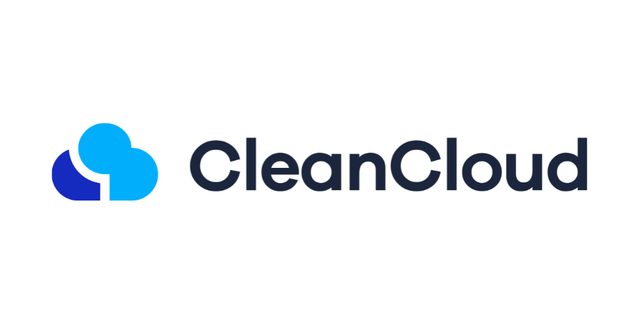</img>
        

    </td>
    <td colspan="1" valign="top" style="font-weight: bold;">
      Tunki Wash
      

      </td>
    <td colspan="1" valign="top" style="font-weight: bold;" >
      Laundry Soft
      

                </img>
            

    </td>
  </tr>
  <tr>
    <td colspan="1" rowspan="2">
Perfil
</td>
    <td colspan="2">Overview</td>
    <td colspan="1" valign="top">Plataforma digital orientada a la gestión de lavanderías y a mejorar la experiencia de sus clientes mediante la gestión de pedidos, prendas, estados, pagos y servicios de recojo y entrega.</td>
    <td colspan="1" valign="top">Plataforma integral para lavanderías y tintorerías que centraliza operaciones, punto de venta, seguimiento de prendas, pagos, marketing, reportes y recojo y entrega.</td>
    <td colspan="1" valign="top">Sistema web especializado en la gestión de lavanderías, orientado al control de ventas, compras, facturación, caja, promociones, convenios y reportes.</td>
    <td colspan="1" valign="top">Software peruano para la administración y control de lavanderías, que permite gestionar pedidos, clientes, inventario, facturación y reportes del negocio.</td>
  </tr>
  <tr>
    <td colspan="2">Ventaja competitiva ¿Qué valor ofrece a los clientes?</td>
    <td colspan="1" valign="top">Integra la gestión de la lavandería con la experiencia digital del cliente, facilitando el seguimiento de pedidos, pagos y servicios de recojo y entrega.</td>
    <td colspan="1" valign="top">Solución integral y altamente escalable que reúne operaciones, pagos, seguimiento, marketing, reportes, aplicaciones y gestión multitienda. </td>
    <td colspan="1" valign="top">Sistema especializado y personalizable para administrar las operaciones comerciales y administrativas de una lavandería. </td>
    <td colspan="1" valign="top">Solución orientada al control y administración del negocio, con facturación electrónica, gestión de pedidos, clientes e inventario. </td>
  </tr>
  <tr>
    <td colspan="1" rowspan="2">
Perfil de Marketing
</td>
    <td colspan="2">Mercado objetivo</td>
    <td colspan="1" valign="top">Lavanderías independientes y pequeñas/medianas, junto con sus clientes que requieren servicios de lavandería.</td>
    <td colspan="1" valign="top">Lavanderías, tintorerías, lavanderías autoservicio y negocios relacionados, desde establecimientos independientes hasta operaciones multi-tienda. </td>
    <td colspan="1" valign="top">Lavanderías y tintorerías que buscan digitalizar y controlar sus procesos administrativos y comerciales.</td>
    <td colspan="1" valign="top">Lavanderías peruanas que buscan mejorar la administración, control y seguimiento de sus operaciones. </td>
  </tr>
  <tr>
    <td colspan="2">Estrategias de marketing</td>
    <td colspan="1" valign="top">Modelo freemium, prueba de la plataforma, presencia digital y captación de lavanderías mediante una propuesta de valor centrada en la digitalización y experiencia del cliente.</td>
    <td colspan="1" valign="top">Prueba gratuita, demostraciones, marketing automatizado, campañas por email/SMS, herramientas SEO, programas de referidos y fidelización.</td>
    <td colspan="1" valign="top">Solicitud de cotización y prueba gratuita, demostración del sistema y comunicación de sus beneficios de gestión.</td>
    <td colspan="1" valign="top">Solicitud de demo, presentación de planes, contenido informativo y comunicación de beneficios relacionados con la digitalización de lavanderías.</td>
  </tr>
  <tr>
    <td colspan="1" rowspan="3">
Perfil de Producto
</td>
    <td colspan="2">Productos & Servicios</td>
    <td colspan="1" valign="top">Gestión de clientes, pedidos, prendas, estados e historial, seguimiento para clientes, pagos digitales, recojo y entrega a domicilio. </td>
    <td colspan="1" valign="top">POS, gestión de pedidos y prendas, seguimiento mediante códigos de barras, pagos, recogida y entrega, aplicaciones, marketing, reportes, inventario, multitienda y otras herramientas avanzadas. </td>
    <td colspan="1" valign="top">Gestión de ventas de servicios, compras, facturación electrónica, caja, indicadores, promociones, convenios y múltiples sucursales/usuarios. </td>
    <td colspan="1" valign="top">Gestión de pedidos, clientes e inventario, facturación electrónica, reportes de ventas, ingresos y entregas, software multiplataforma y soporte. </td>
  </tr>
  <tr>
    <td colspan="2">Precios & Costos</td>
    <td colspan="1" valign="top">Cuenta con un plan gratuito, un plan Básico de S/49 al mes y un plan Premium de S/99 al mes.</td>
    <td colspan="1" valign="top">Ofrece 4 planes de pago mensuales, el plan Lite a &#36;43, el plan Pro a &#36;60, el plan Grow a &#36;95 y el plan Grow+ a &#36;325.</td>
    <td colspan="1" valign="top">Brindan un precio mediante cotización, pero ofrecen prueba gratuita del sistema.</td>
    <td colspan="1" valign="top">Ofrecen un plan mensual de S/89 y un plan anual de S/945</td>
  </tr>
  <tr>
    <td colspan="2">Canales de distribución (Web y/o Móvil)</td>
    <td colspan="1" valign="top">Web y móvil.</td>
    <td colspan="1" valign="top">Web y móvil.</td>
    <td colspan="1" valign="top">Web.</td>
    <td colspan="1" valign="top">Web.</td>
  </tr>
  <tr>
    <td colspan="1" rowspan="5">
Análisis SWOT
</td>
    <td colspan="6">Realice esto para su startup y sus competidores. Sus fortalezas deberían apoyar sus oportunidades y contribuir a lo que ustedes definen como su posible ventaja competitiva.</td>
  </tr>
  <tr>
    <td colspan="2">Fortalezas</td>
    <td colspan="1" valign="top">Integración entre gestión de lavandería y experiencia del cliente, seguimiento de pedidos, pagos digitales, posibilidad de recojo y entrega, modelo escalonado de precios.</td>
    <td colspan="1" valign="top">Amplia variedad de funcionalidades, seguimiento de prendas, pagos, recogida y entrega, aplicaciones, marketing, reportes, escalabilidad y gestión multitienda.</td>
    <td colspan="1" valign="top">Especialización en lavanderías, plataforma web, personalización, facturación electrónica, gestión de caja, reportes, promociones y convenios. </td>
    <td colspan="1" valign="top">Experiencia en el sector, especialización en lavanderías, gestión de pedidos, clientes e inventario, facturación electrónica, reportes y soporte.</td>
  </tr>
  <tr>
    <td colspan="2">Debilidades</td>
    <td colspan="1" valign="top">Producto en etapa inicial, menor reconocimiento de marca, menor cantidad de funcionalidades avanzadas frente a plataformas consolidadas, necesidad de validar disposición de pago y adopción.</td>
    <td colspan="1" valign="top">Amplia cantidad de funcionalidades puede generar mayor complejidad para negocios pequeños, solución orientada a un mercado internacional y no exclusivamente al contexto peruano.</td>
    <td colspan="1" valign="top">Menor énfasis visible en la experiencia digital del cliente final y seguimiento del pedido frente a Easy Wash y CleanCloud, precio mediante cotización.</td>
    <td colspan="1" valign="top">Menor énfasis en funcionalidades orientadas directamente al cliente final, menor amplitud funcional frente a CleanCloud.</td>
  </tr>
  <tr>
    <td colspan="2">Oportunidades</td>
    <td colspan="1" valign="top">Digitalización de pequeñas lavanderías, crecimiento de servicios bajo demanda, mayor uso de pagos digitales, necesidad de mejorar la comunicación entre lavanderías y clientes.</td>
    <td colspan="1" valign="top">Expansión hacia nuevos mercados, crecimiento de servicios de recogida y entrega, incorporación de nuevas tecnologías e integraciones.</td>
    <td colspan="1" valign="top">Digitalización de lavanderías peruanas, expansión de funcionalidades, incorporación de herramientas orientadas directamente al cliente.</td>
    <td colspan="1" valign="top">Continuar digitalizando lavanderías peruanas, incorporar funcionalidades móviles y servicios orientados al cliente.</td>
  </tr>
  <tr>
    <td colspan="2">Amenazas</td>
    <td colspan="1" valign="top">Competidores con mayor trayectoria y funcionalidades, resistencia de algunas lavanderías a adoptar tecnología, aparición de nuevas plataformas especializadas.</td>
    <td colspan="1" valign="top">Competidores locales especializados, soluciones de menor costo, necesidades específicas de adaptación a mercados nacionales.</td>
    <td colspan="1" valign="top">Competidores con mayor variedad de funcionalidades, nuevas plataformas SaaS, cambios en las necesidades tecnológicas de las lavanderías.</td>
    <td colspan="1" valign="top">Competidores SaaS más modernos, soluciones con modelos freemium, nuevas plataformas con mayor enfoque en experiencia del cliente.</td>
  </tr>
</table>

#### 2.1.2. Estrategias y tácticas frente a competidores

  A partir del análisis competitivo realizado, se plantean las estrategias y tácticas preliminares que serán implementadas por Easy Wash para responder a las fortalezas y debilidades identificadas en sus principales competidores, así como para aprovechar las oportunidades y afrontar las amenazas presentes en el mercado.

**Estrategia 1: Competir mediante accesibilidad y facilidad de adopción**

  Objetivo: Reducir la barrera de entrada para pequeñas y medianas lavanderías que todavía utilizan procesos manuales.

**Tácticas:**

<ul>
  <li>Mantener un plan gratuito con funcionalidades básicas.</li>
  <li>Ofrecer planes de pago escalonados según las necesidades del negocio.</li>
  <li>Diseñar un proceso de registro y configuración sencillo.</li>
  <li>Proporcionar tutoriales y material de capacitación.</li>
  <li>Ofrecer acompañamiento durante la implementación inicial.</li>
  <li>Evitar que la lavandería necesite conocimientos técnicos especializados para utilizar la plataforma.</li>
</ul>

  Frente a soluciones con una gran cantidad de funcionalidades, Easy Wash puede posicionarse inicialmente como una alternativa fácil de comprender y utilizar, especialmente para negocios que recién comienzan su proceso de digitalización.

 

**Estrategia 2: Estrategia de fidelización y construcción de relaciones a largo plazo**

  Objetivo: Reducir la posibilidad de que las lavanderías y sus clientes abandonen Easy Wash frente a otras alternativas.

**Tácticas:**

<ul>
  <li>Brindar soporte técnico y atención rápida a las lavanderías.</li>
  <li>Recoger periódicamente opiniones y sugerencias de los usuarios.</li>
  <li>Implementar programas de fidelización para los clientes finales.</li>
  <li>Ofrecer beneficios por permanencia o renovación de la suscripción.</li>
  <li>Enviar notificaciones y promociones personalizadas.</li>
  <li>Facilitar la comunicación entre lavandería y cliente.</li>
  <li>Crear un sistema de recomendaciones que incentive a los clientes a invitar a otros usuarios.</li>
</ul>

  La fidelización es particularmente relevante porque los competidores ya incorporan herramientas de marketing y retención. CleanCloud, por ejemplo, ofrece puntos de fidelidad, códigos de referidos, promociones y campañas automatizadas.

### 2.2. Entrevistas

#### 2.2.1. Diseño de entrevistas

**1. Preguntas generales**

- ¿Cuál es su nombre?
- ¿Cuál es su edad?
- ¿En qué distrito reside actualmente?
 

**2. Primer Segmento: Propietarios de lavanderías independientes**
- ¿Podrías contarnos brevemente cómo funciona el servicio de la lavandería desde que un cliente llega hasta que recibe sus prendas?
- ¿Qué actividades realizas personalmente dentro del proceso de atención de los clientes?
- ¿Qué tipos de servicios ofrecen actualmente?
- ¿Cómo registran actualmente la información de los clientes y sus pedidos? ¿Qué herramientas utilizan para organizar esta información?(cuadernos, hojas de cálculo, WhatsApp, sistemas propios, etc.)
- Cuando un cliente deja sus prendas, ¿qué información registran y cómo lo hacen?
- ¿Alguna vez se ha perdido, confundido o registrado incorrectamente información de un pedido? ¿Qué ocurrió?
- ¿Qué sucede cuando un cliente modifica su pedido después de haberlo registrado?
- ¿Alguna vez una prenda o pedido se ha retrasado? ¿Cómo se solucionó?
- ¿Qué ocurre cuando tienen varios pedidos con fechas de entrega cercanas?
- ¿Cómo priorizan los pedidos que deben ser procesados o entregados?
- ¿Cómo se comunica actualmente la lavandería con sus clientes durante el proceso?
- ¿Con qué frecuencia los clientes se comunican para preguntar por el estado de sus prendas?
- ¿Ofrecen actualmente recojo o entrega a domicilio? Si no, ¿por qué?
- En caso de realizar entregas a domicilio, ¿cómo coordinan actualmente las direcciones, horarios y pedidos?
- ¿Qué actividad te quita más tiempo durante la gestión diaria de la lavandería?
- ¿Qué tipo de error te genera mayores inconvenientes o costos?

 

**3. Segundo Segmento: Personas independientes que utilicen el servicio de lavanderías**

- ¿Con qué frecuencia utilizas servicios de lavandería?
- ¿Qué tipo de prendas o servicios sueles llevar a una lavandería?
- ¿Qué factores son importantes para ti al momento de elegir una lavandería?
- Cuéntame cómo es normalmente tu proceso desde que decides llevar ropa a una lavandería hasta que la dejas en el establecimiento. 
- ¿Cómo sabes qué prendas dejaste y qué servicio solicitaste? 
- ¿Alguna vez has tenido algún problema al registrar o entregar tus prendas? ¿Qué ocurrió?
- Después de dejar tus prendas, ¿cómo sabes en qué estado se encuentra tu pedido?
- ¿Sueles comunicarte con la lavandería para preguntar si tus prendas ya están listas?
- ¿Con qué frecuencia realizas este tipo de consultas?
- ¿Has tenido algún problema porque tu pedido no estuvo listo en la fecha acordada? ¿Qué sucedió?
- ¿Qué información te gustaría poder consultar sobre un pedido mientras está siendo procesado?
- ¿Cómo recoges normalmente tus prendas cuando el pedido está listo?
- ¿Cuánto tiempo aproximadamente te toma realizar el traslado para recogerlas?
- ¿Has utilizado anteriormente servicios de recojo o entrega a domicilio de lavanderías?
- Si has utilizado este servicio, ¿qué problemas has experimentado?
- ¿Qué parte del proceso te resulta más incómoda o te toma más tiempo? 
- ¿Qué tendría que mejorar una lavandería para que estuvieras más satisfecho con su servicio? 

#### 2.2.2. Registro de entrevistas
#### 2.2.3. Análisis de entrevistas
**Primer segmento: Propietarios de lavanderias independientes**
<ul>
  <li>El 100% de los propietarios entrevistados registra información relacionada con los clientes y sus pedidos, incluyendo datos de contacto, prendas, cantidades, servicio solicitado y tiempo estimado de entrega.</li> 
  <li>El 66,7% de los propietarios entrevistados utiliza WhatsApp y llamadas telefónicas para comunicarse con sus clientes, principalmente para informar que un pedido está listo, atender consultas o comunicar inconvenientes relacionados con la entrega.</li> 
  <li>El 66,7% de los propietarios entrevistados prioriza los pedidos considerando principalmente la fecha prevista de entrega, aunque también puede tomar en cuenta características especiales del pedido o compromisos de recojo y entrega.</li> 
  <li>El 33,3% de los propietarios entrevistados ofrece el servicio de entrega a domicilio de manera no sistematizada, coordinando las direcciones y horarios directamente con los clientes mediante WhatsApp.</li> 
  <li>El 66,7% de los propietarios entrevistados considera que el registro de los pedidos representa una actividad que consume una cantidad considerable de tiempo, especialmente cuando aumenta el número de clientes y es necesario revisar diferentes registros.</li> 
  <li>El 66,7% de los propietarios entrevistados evidencia dificultades para realizar un seguimiento eficiente de los pedidos cuando existe una alta demanda, debido a que deben consultar registros manuales y organizar los pedidos de acuerdo con sus fechas de entrega.</li> 
  <li>El 100% de los propietarios entrevistados ha experimentado situaciones relacionadas con la confusión, pérdida o incorrecta asignación de prendas, aunque la frecuencia de estos problemas varía entre los establecimientos.</li> 
</ul>

**Segundo segmento: Personas independientes que utilicen el servicio de lavanderías**
<ul>
  <li>El 100% de los entrevistados manifestó interés en conocer el estado de su pedido durante el proceso de lavado. </li> 
  <li>El 100% de los entrevistados considera relevante conocer con precisión cuándo estará listo su pedido, evidenciándose una necesidad de mayor certeza respecto al tiempo de entrega. </li> 
  <li>El 100% de los entrevistados evidencia la necesidad de contar con seguridad y confianza en la gestión de sus prendas, ya sea mediante el registro adecuado, la identificación de las prendas o la garantía de que estas serán entregadas correctamente.</li> 
  <li>El 66,7% de los entrevistados considera que el traslado de las prendas hacia la lavandería puede resultar incómodo o tedioso, especialmente cuando se trata de prendas voluminosas o pesadas.</li> 
  <li>El 66,7% de los entrevistados considera el precio como un factor relevante al elegir una lavandería, aunque su importancia puede variar de acuerdo con el tipo de prendas y servicio requerido.</li> 
  <li>El 100% de los entrevistados realiza un registro de las prendas y del servicio solicitado al momento de dejarlas en la lavandería.</li> 
  <li>El 100% de los entrevistados evidencia una necesidad de mejorar la comunicación con la lavandería, aunque el nivel de interacción esperado varía según el cliente y su nivel de confianza en el establecimiento.</li> 
</ul>

### 2.3. Needfinding

#### 2.3.1. User Personas

  En esta sección se elaboran los User Personas a partir del análisis de entrevistas a propietarios de lavanderías independientes y personas independientes que utilicen el servicio de lavanderías. Por consecuencia, cada perfil representa las necesidades, comportamientos y dificultades de cada segmento objetivo, lo cual nos permite comprender con mayor profundidad a los usuarios, identificar oportunidades de mejora y orientar el diseño de la solución hacia sus necesidades reales, priorizando funcionalidades y características que generen valor para cada tipo de usuario.

**Primer segmento: Propietarios de lavanderias independientes**

  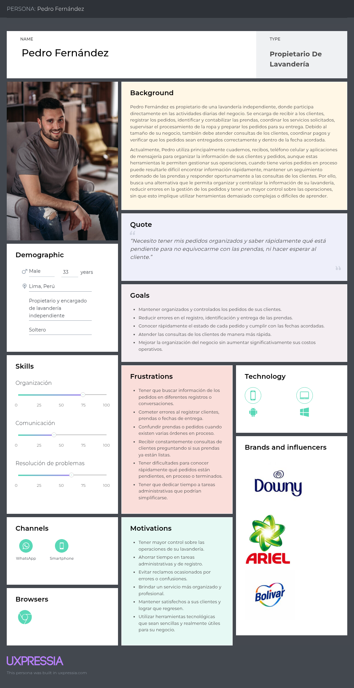
   <i>User Persona: Pedro Fernández</i>

**Segundo segmento: Personas independientes que utilicen el servicio de lavanderías**

  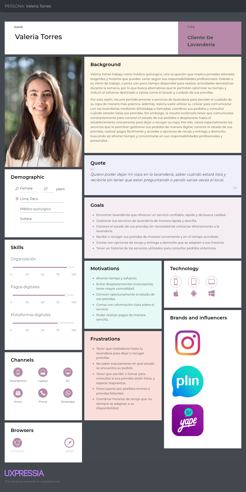
   <i>User Persona: Valeria Torres</i>

#### 2.3.2. User Task Matrix

  En esta sección se presenta el User Task Matrix, elaborado a partir de los dos segmentos objetivo identificados, que nos permite identificar las principales tareas que cada segmento realiza para alcanzar sus objetivos y clasificarlas según su frecuencia e importancia, sin considerar las funcionalidades de una solución tecnológica específica.

| Tarea | Pedro Fernández - Frecuencia | Pedro Fernández - Importancia | Valeria Torres - Frecuencia | Valeria Torres - Importancia |
|---|---|---|---|---|
| Identificar la necesidad de lavar sus prendas | — | — | Alta | Alta |
| Buscar y elegir una lavandería | — | — | Media | Alta |
| Solicitar un servicio de lavandería | — | — | Alta | Alta |
| Entregar las prendas e indicar el servicio requerido | Alta | Alta | Alta | Alta |
| Registrar y gestionar un pedido | Alta | Alta | — | — |
| Identificar y contabilizar las prendas | Alta | Alta | — | — |
| Supervisar el procesamiento de las prendas | Alta | Alta | — | — |
| Consultar o verificar el estado del pedido | Alta | Alta | Alta | Alta |
| Comunicarse con la otra parte sobre el pedido | Alta | Alta | Media | Alta |
| Coordinar la fecha de entrega | Alta | Alta | Alta | Alta |
| Preparar/verificar el pedido para la entrega | Alta | Alta | — | — |
| Coordinar el recojo o entrega de las prendas | Alta | Alta | Alta | Alta |
| Realizar o recibir el pago del servicio | Alta | Alta | Alta | Alta |
| Verificar que las prendas estén completas y correctas | Alta | Alta | Alta | Alta |
| Recoger o entregar las prendas | Alta | Alta | Alta | Alta |
| Resolver inconvenientes relacionados con el pedido | Media | Alta | Baja | Alta |
| Consultar servicios realizados anteriormente | Media | Media | Media | Media |

#### 2.3.3. User Journey Mapping

  En esta sección se presenta el User Journey Mapping de los principales segmentos objetivo de Wash Track, con el propósito de representar el recorrido que realizan Pedro Fernández, como dueño de una lavandería, y Valeria Torres, como persona que consume el servicio de lavandería, identificando sus acciones, puntos de contacto, pensamientos, emociones, dificultades y oportunidades de mejora a lo largo del servicio.

**Primer segmento: Propietarios de lavanderías independientes**

  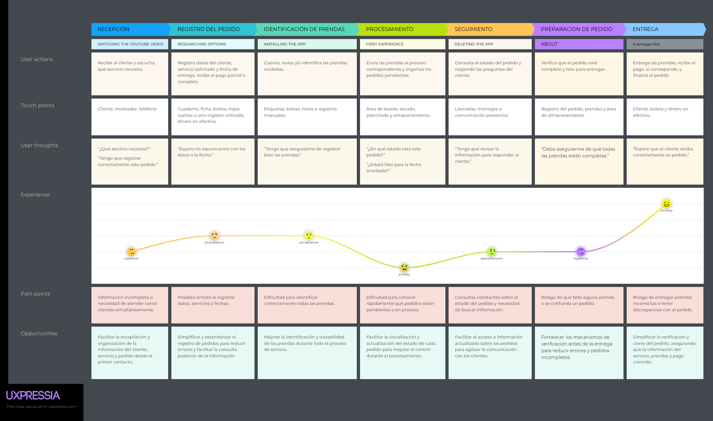
   <i>User Journey Mapping de Pedro Fernández</i>

 

**Segundo segmento: Personas independientes que utilicen el servicio de lavanderías**

  
   <i>User Journey Mapping de Valeria Torres</i>

#### 2.3.4. Empathy Mapping

  En esta sección se presenta el Empathy Map de los principales User Persona de Easy Wash, con el propósito de comprender mejor sus necesidades, comportamientos, pensamientos, emociones, dificultades y expectativas durante el uso de los servicios de lavandería. Esta herramienta permite organizar la información obtenida de la investigación de usuarios y generar una visión más clara de su experiencia, facilitando la identificación de oportunidades de mejora para la solución.

**Primer segmento: Propietarios de lavanderías independientes**

  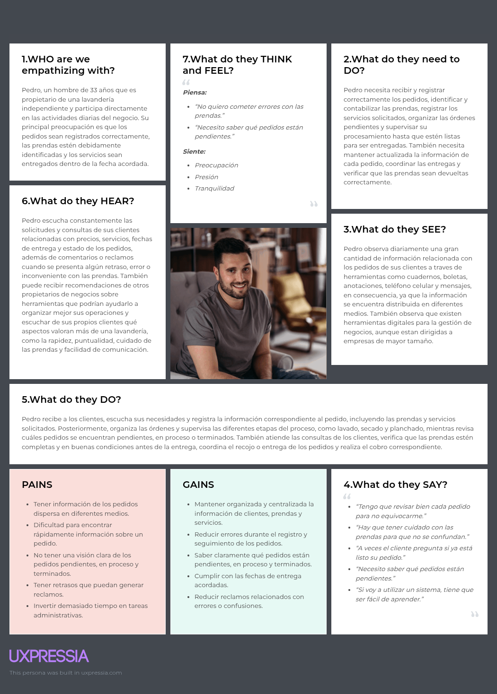
   <i>Empathy Map de Pedro Fernández</i>

 

**Segundo segmento: Personas independientes que utilicen el servicio de lavanderías**

  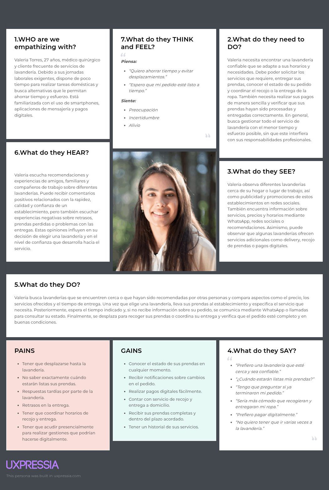
   <i>Empathy Map de Valeria Torres</i>

### 2.4. Big Picture EventStorming

### 2.5. Ubiquitous Language

---

## Capítulo III: Requirements Specification

### 3.1. User Stories

<table style="border-collapse: collapse; width: 100%;">
  <thead>
    <tr>
      <th style="border: 1px solid black; padding: 8px; text-align: left;">Epic / Story ID</th>
      <th style="border: 1px solid black; padding: 8px; text-align: left;">Título</th>
      <th style="border: 1px solid black; padding: 8px; text-align: left;">Descripción</th>
      <th style="border: 1px solid black; padding: 8px; text-align: left;">Criterios de Aceptación</th>
      <th style="border: 1px solid black; padding: 8px; text-align: left;">Relacionado con (Epic ID)</th>
    </tr>
  </thead>
  <tbody>
    <tr>
      <td style="border: 1px solid black; padding: 8px;">US-001</td>
      <td style="border: 1px solid black; padding: 8px;">Recibir notificaciones del estado del pedido</td>
      <td style="border: 1px solid black; padding: 8px;">Como cliente, quiero recibir notificaciones sobre los cambios de estado de mis prendas, para conocer el avance de mi pedido sin tener que comunicarme con la lavandería.</td>
      <td style="border: 1px solid black; padding: 8px;">
        <b>Escenario: Notificación automática por cambio de estado</b> 
        <b>Dado</b> que el cliente tiene las notificaciones activadas en la aplicación 
        <b>Cuando</b> el pedido cambie a estado de recepción, lavado, secado, planchado o finalización 
        <b>Entonces</b> el sistema envía una notificación identificando el pedido y la fecha 
        <b>Y</b> el cliente puede visualizar el nuevo estado en el historial.  
        <b>Escenario: Configuración de notificaciones</b> 
        <b>Dado</b> que el cliente se encuentra en la configuración de su perfil 
        <b>Cuando</b> selecciona desactivar o activar las notificaciones 
        <b>Entonces</b> el sistema guarda su preferencia.
      </td>
      <td style="border: 1px solid black; padding: 8px;">EP-001: Seguimiento de pedidos</td>
    </tr>
  </tbody>
  <tbody>
    <tr>
      <td style="border: 1px solid black; padding: 8px;">US-002</td>
      <td style="border: 1px solid black; padding: 8px;">Consultar la hora estimada de finalización</td>
      <td style="border: 1px solid black; padding: 8px;">Como cliente, quiero consultar la hora estimada en la que estarán listas mis prendas, para organizar mi tiempo y decidir cuándo recogerlas o solicitar su entrega.</td>
      <td style="border: 1px solid black; padding: 8px;">
        <b>Escenario: Visualización de fecha y hora estimadas</b> 
        <b>Dado</b> que el cliente tiene un pedido en proceso 
        <b>Cuando</b> ingresa a los detalles de su pedido 
        <b>Entonces</b> el sistema muestra la fecha y hora estimadas de finalización.  
        <b>Escenario: Actualización por retraso</b> 
        <b>Dado</b> que un pedido sufre un retraso 
        <b>Cuando</b> se actualiza la hora estimada de finalización 
        <b>Entonces</b> el sistema muestra la nueva hora junto con el motivo 
        <b>Y</b> se notifica al cliente cuando las prendas están listas.
      </td>
      <td style="border: 1px solid black; padding: 8px;">EP-001: Seguimiento de pedidos</td>
    </tr>
  </tbody>
  <tbody>
    <tr>
      <td style="border: 1px solid black; padding: 8px;">US-003</td>
      <td style="border: 1px solid black; padding: 8px;">Solicitar recojo de prendas a domicilio</td>
      <td style="border: 1px solid black; padding: 8px;">Como cliente, quiero solicitar el recojo de mis prendas desde mi domicilio, para enviar mi ropa a la lavandería sin trasladarme al establecimiento.</td>
      <td style="border: 1px solid black; padding: 8px;">
        <b>Escenario: Solicitud exitosa de recojo a domicilio</b> 
        <b>Dado</b> que el cliente desea enviar prendas a la lavandería 
        <b>Cuando</b> registra/selecciona una dirección y elige una fecha y rango horario 
        <b>Entonces</b> el sistema muestra el costo del servicio 
        <b>Y</b> al confirmar, el cliente recibe la confirmación y el estado del recojo.
      </td>
      <td style="border: 1px solid black; padding: 8px;">EP-002: Logística a domicilio</td>
    </tr>
  </tbody>
  <tbody>
    <tr>
      <td style="border: 1px solid black; padding: 8px;">US-004</td>
      <td style="border: 1px solid black; padding: 8px;">Solicitar entrega de prendas a domicilio</td>
      <td style="border: 1px solid black; padding: 8px;">Como cliente, quiero solicitar la entrega de mis prendas a domicilio cuando estén listas, para recibirlas sin tener que ir a la lavandería.</td>
      <td style="border: 1px solid black; padding: 8px;">
        <b>Escenario: Programación de entrega a domicilio</b> 
        <b>Dado</b> que el pedido se encuentra en estado "Listo" 
        <b>Cuando</b> el cliente selecciona entrega a domicilio, dirección y rango horario 
        <b>Entonces</b> el sistema muestra el costo total antes de confirmar 
        <b>Y</b> tras confirmar, se envían notificaciones de asignación, salida y entrega 
        <b>Y</b> la entrega se marca completada solo tras la confirmación final.
      </td>
      <td style="border: 1px solid black; padding: 8px;">EP-002: Logística a domicilio</td>
    </tr>
  </tbody>
  <tbody>
    <tr>
      <td style="border: 1px solid black; padding: 8px;">US-005</td>
      <td style="border: 1px solid black; padding: 8px;">Registrar clientes</td>
      <td style="border: 1px solid black; padding: 8px;">Como encargado de lavandería, quiero registrar los datos de mis clientes para mantener organizada su información.</td>
      <td style="border: 1px solid black; padding: 8px;">
        <b>Escenario: Registro de un nuevo cliente</b> 
        <b>Dado</b> que el encargado está en el módulo de clientes 
        <b>Cuando</b> ingresa el nombre, teléfono y correo electrónico cumpliendo las validaciones 
        <b>Entonces</b> el sistema guarda el perfil del cliente 
        <b>Y</b> permite editar y consultar la información posteriormente.
      </td>
      <td style="border: 1px solid black; padding: 8px;">EP-003: Gestión de clientes</td>
    </tr>
  </tbody>
  <tbody>
    <tr>
      <td style="border: 1px solid black; padding: 8px;">US-006</td>
      <td style="border: 1px solid black; padding: 8px;">Crear pedidos</td>
      <td style="border: 1px solid black; padding: 8px;">Como encargado de lavandería, quiero crear un pedido asociado a un cliente para controlar el servicio solicitado.</td>
      <td style="border: 1px solid black; padding: 8px;">
        <b>Escenario: Creación exitosa de un pedido</b> 
        <b>Dado</b> que el encargado tiene un cliente registrado y sus prendas 
        <b>Cuando</b> ingresa los servicios, las prendas, el precio y la fecha estimada 
        <b>Entonces</b> el sistema genera un código único asociado al cliente 
        <b>Y</b> muestra una confirmación de creación.
      </td>
      <td style="border: 1px solid black; padding: 8px;">EP-004: Gestión de pedidos</td>
    </tr>
  </tbody>
  <tbody>
    <tr>
      <td style="border: 1px solid black; padding: 8px;">US-007</td>
      <td style="border: 1px solid black; padding: 8px;">Registrar prendas</td>
      <td style="border: 1px solid black; padding: 8px;">Como encargado, quiero registrar las prendas incluidas en un pedido para evitar pérdidas o confusiones.</td>
      <td style="border: 1px solid black; padding: 8px;">
        <b>Escenario: Detalle de prendas por pedido</b> 
        <b>Dado</b> que el encargado está creando o editando un pedido 
        <b>Cuando</b> registra el tipo, cantidad, características y observaciones de cada prenda 
        <b>Entonces</b> cada prenda queda asociada de forma segura a ese pedido 
        <b>Y</b> el encargado puede consultar el detalle individual.
      </td>
      <td style="border: 1px solid black; padding: 8px;">EP-004: Gestión de pedidos</td>
    </tr>
  </tbody>
  <tbody>
    <tr>
      <td style="border: 1px solid black; padding: 8px;">US-008</td>
      <td style="border: 1px solid black; padding: 8px;">Actualizar estado del pedido</td>
      <td style="border: 1px solid black; padding: 8px;">Como trabajador de lavandería, quiero actualizar el estado de un pedido para que el cliente conozca su progreso.</td>
      <td style="border: 1px solid black; padding: 8px;">
        <b>Escenario: Actualización manual de estado</b> 
        <b>Dado</b> que el trabajador ha procesado un pedido 
        <b>Cuando</b> selecciona un nuevo estado (ej. lavado, secado, listo) 
        <b>Entonces</b> el sistema guarda la fecha, hora y el usuario que realizó el cambio 
        <b>Y</b> envía una notificación al cliente.
      </td>
      <td style="border: 1px solid black; padding: 8px;">EP-001: Seguimiento de pedidos</td>
    </tr>
  </tbody>
  <tbody>
    <tr>
      <td style="border: 1px solid black; padding: 8px;">US-009</td>
      <td style="border: 1px solid black; padding: 8px;">Consultar historial de pedidos</td>
      <td style="border: 1px solid black; padding: 8px;">Como cliente, quiero consultar mis pedidos anteriores para revisar los servicios realizados y sus detalles.</td>
      <td style="border: 1px solid black; padding: 8px;">
        <b>Escenario: Consulta del listado histórico</b> 
        <b>Dado</b> que el cliente ha completado pedidos en el pasado 
        <b>Cuando</b> accede a la sección de historial 
        <b>Entonces</b> el sistema muestra los pedidos ordenados por fecha 
        <b>Y</b> permite buscar y visualizar prendas, servicios, precio y estado.
      </td>
      <td style="border: 1px solid black; padding: 8px;">EP-005: Historial de operaciones</td>
    </tr>
  </tbody>
  <tbody>
    <tr>
      <td style="border: 1px solid black; padding: 8px;">US-010</td>
      <td style="border: 1px solid black; padding: 8px;">Buscar y filtrar pedidos</td>
      <td style="border: 1px solid black; padding: 8px;">Como encargado, quiero buscar y filtrar pedidos para encontrar rápidamente una orden.</td>
      <td style="border: 1px solid black; padding: 8px;">
        <b>Escenario: Búsqueda ágil de pedidos</b> 
        <b>Dado</b> que el encargado necesita localizar una orden 
        <b>Cuando</b> ingresa un código, cliente, teléfono o aplica filtros de estado/fecha 
        <b>Entonces</b> el sistema muestra los resultados correspondientes en pantalla.
      </td>
      <td style="border: 1px solid black; padding: 8px;">EP-004: Gestión de pedidos</td>
    </tr>
  </tbody>
  <tbody>
    <tr>
      <td style="border: 1px solid black; padding: 8px;">US-011</td>
      <td style="border: 1px solid black; padding: 8px;">Registrar pagos</td>
      <td style="border: 1px solid black; padding: 8px;">Como encargado, quiero registrar el pago de un pedido para mantener actualizado el estado financiero de la orden.</td>
      <td style="border: 1px solid black; padding: 8px;">
        <b>Escenario: Actualización de estado financiero local</b> 
        <b>Dado</b> que el cliente realiza un abono en el local 
        <b>Cuando</b> el encargado registra el monto, método y fecha 
        <b>Entonces</b> el pago queda asociado al pedido 
        <b>Y</b> el pedido cambia a estado "Pendiente", "Parcial" o "Pagado".
      </td>
      <td style="border: 1px solid black; padding: 8px;">EP-006: Gestión de pagos</td>
    </tr>
  </tbody>
  <tbody>
    <tr>
      <td style="border: 1px solid black; padding: 8px;">US-012</td>
      <td style="border: 1px solid black; padding: 8px;">Realizar pagos digitales</td>
      <td style="border: 1px solid black; padding: 8px;">Como cliente, quiero pagar mi pedido desde la plataforma para completar el servicio de forma rápida y segura.</td>
      <td style="border: 1px solid black; padding: 8px;">
        <b>Escenario: Procesamiento de pago digital</b> 
        <b>Dado</b> que el cliente revisa un pedido con saldo pendiente 
        <b>Cuando</b> selecciona un medio de pago y la pasarela confirma la operación 
        <b>Entonces</b> el estado del pago se actualiza automáticamente en el sistema.
      </td>
      <td style="border: 1px solid black; padding: 8px;">EP-006: Gestión de pagos</td>
    </tr>
  </tbody>
  <tbody>
    <tr>
      <td style="border: 1px solid black; padding: 8px;">US-013</td>
      <td style="border: 1px solid black; padding: 8px;">Gestionar incidencias</td>
      <td style="border: 1px solid black; padding: 8px;">Como encargado, quiero registrar incidencias relacionadas con prendas o pedidos para comunicar una solución al cliente.</td>
      <td style="border: 1px solid black; padding: 8px;">
        <b>Escenario: Registro de incidencia</b> 
        <b>Dado</b> que ocurre un problema con un pedido 
        <b>Cuando</b> el encargado registra el tipo, descripción y evidencia 
        <b>Entonces</b> el cliente recibe una notificación 
        <b>Y</b> la incidencia puede marcarse como abierta, en revisión o resuelta.
      </td>
      <td style="border: 1px solid black; padding: 8px;">EP-007: Atención de incidencias</td>
    </tr>
  </tbody>
  <tbody>
    <tr>
      <td style="border: 1px solid black; padding: 8px;">US-014</td>
      <td style="border: 1px solid black; padding: 8px;">Visualizar dashboard operativo</td>
      <td style="border: 1px solid black; padding: 8px;">Como propietario de lavandería, quiero consultar indicadores del negocio para conocer el estado de mis operaciones.</td>
      <td style="border: 1px solid black; padding: 8px;">
        <b>Escenario: Visualización de métricas</b> 
        <b>Dado</b> que el propietario accede al dashboard 
        <b>Cuando</b> el panel carga los datos del periodo seleccionado 
        <b>Entonces</b> se muestran los pedidos por estado, ingresos y nuevos clientes.
      </td>
      <td style="border: 1px solid black; padding: 8px;">EP-008: Reportes y dashboard</td>
    </tr>
  </tbody>
  <tbody>
    <tr>
      <td style="border: 1px solid black; padding: 8px;">US-015</td>
      <td style="border: 1px solid black; padding: 8px;">Administrar servicios y precios</td>
      <td style="border: 1px solid black; padding: 8px;">Como propietario, quiero configurar los servicios y precios de mi lavandería para mantener actualizada la oferta.</td>
      <td style="border: 1px solid black; padding: 8px;">
        <b>Escenario: Modificación del catálogo</b> 
        <b>Dado</b> que el propietario se encuentra en la configuración 
        <b>Cuando</b> crea, edita o desactiva servicios indicando su precio y tiempo 
        <b>Entonces</b> los cambios se guardan y reflejan solo en los nuevos pedidos.
      </td>
      <td style="border: 1px solid black; padding: 8px;">EP-009: Configuración de la lavandería</td>
    </tr>
  </tbody>
  <tbody>
    <tr>
      <td style="border: 1px solid black; padding: 8px;">US-016</td>
      <td style="border: 1px solid black; padding: 8px;">Gestionar usuarios y roles</td>
      <td style="border: 1px solid black; padding: 8px;">Como propietario, quiero administrar los accesos del personal para controlar qué acciones puede realizar cada usuario.</td>
      <td style="border: 1px solid black; padding: 8px;">
        <b>Escenario: Asignación de roles</b> 
        <b>Dado</b> que el propietario necesita dar acceso a un trabajador 
        <b>Cuando</b> crea el usuario y le asigna un rol específico 
        <b>Entonces</b> el sistema restringe las funciones según los permisos asignados.
      </td>
      <td style="border: 1px solid black; padding: 8px;">EP-010: Administración de usuarios</td>
    </tr>
  </tbody>
  <tbody>
    <tr>
      <td style="border: 1px solid black; padding: 8px;">US-017</td>
      <td style="border: 1px solid black; padding: 8px;">Confirmar entrega del pedido</td>
      <td style="border: 1px solid black; padding: 8px;">Como encargado, quiero registrar la entrega de un pedido para cerrar correctamente el proceso.</td>
      <td style="border: 1px solid black; padding: 8px;">
        <b>Escenario: Cierre de proceso por entrega</b> 
        <b>Dado</b> que el pedido ha llegado al cliente 
        <b>Cuando</b> se solicita y obtiene la confirmación de recepción 
        <b>Entonces</b> se registra la fecha, hora y responsable 
        <b>Y</b> el pedido cambia a estado "Entregado" en el historial.
      </td>
      <td style="border: 1px solid black; padding: 8px;">EP-002: Logística a domicilio</td>
    </tr>
  </tbody>
  <tbody>
    <tr>
      <td style="border: 1px solid black; padding: 8px;">US-018</td>
      <td style="border: 1px solid black; padding: 8px;">Calificar el servicio</td>
      <td style="border: 1px solid black; padding: 8px;">Como cliente, quiero calificar el servicio recibido para expresar mi nivel de satisfacción y ayudar a la lavandería a mejorar.</td>
      <td style="border: 1px solid black; padding: 8px;">
        <b>Escenario: Envío de calificación</b> 
        <b>Dado</b> que un pedido ha sido entregado 
        <b>Cuando</b> el cliente califica de 1 a 5 y añade un comentario opcional 
        <b>Entonces</b> la evaluación queda asociada al pedido para los reportes.
      </td>
      <td style="border: 1px solid black; padding: 8px;">EP-011: Satisfacción del cliente</td>
    </tr>
  </tbody>
  <tbody>
    <tr>
      <td style="border: 1px solid black; padding: 8px;">US-019</td>
      <td style="border: 1px solid black; padding: 8px;">Gestionar suscripción</td>
      <td style="border: 1px solid black; padding: 8px;">Como propietario, quiero seleccionar un plan de suscripción para utilizar las funcionalidades disponibles según las necesidades de mi lavandería.</td>
      <td style="border: 1px solid black; padding: 8px;">
        <b>Escenario: Cambio de plan de suscripción</b> 
        <b>Dado</b> que el propietario ingresa al módulo de suscripciones 
        <b>Cuando</b> visualiza los planes y selecciona uno nuevo 
        <b>Entonces</b> el sistema actualiza el estado y habilita/restringe funcionalidades.
      </td>
      <td style="border: 1px solid black; padding: 8px;">EP-012: Suscripciones</td>
    </tr>
  </tbody>
  <tbody>
    <tr>
      <td style="border: 1px solid black; padding: 8px;">US-020</td>
      <td style="border: 1px solid black; padding: 8px;">Exportar reportes</td>
      <td style="border: 1px solid black; padding: 8px;">Como propietario, quiero exportar reportes de pedidos y pagos para analizarlos o conservarlos como respaldo.</td>
      <td style="border: 1px solid black; padding: 8px;">
        <b>Escenario: Exportación de documentos</b> 
        <b>Dado</b> que el propietario requiere respaldar información 
        <b>Cuando</b> filtra por periodo y selecciona exportar 
        <b>Entonces</b> el sistema genera un PDF o Excel con los detalles y totales.
      </td>
      <td style="border: 1px solid black; padding: 8px;">EP-008: Reportes y dashboard</td>
    </tr>
  </tbody>
  <tbody>
    <tr>
      <td style="border: 1px solid black; padding: 8px;">US-021</td>
      <td style="border: 1px solid black; padding: 8px;">Priorizar pedidos por fecha de entrega</td>
      <td style="border: 1px solid black; padding: 8px;">Como propietario de lavandería, quiero ordenar los pedidos según su fecha prevista de entrega para atender primero los pedidos más próximos a vencer.</td>
      <td style="border: 1px solid black; padding: 8px;">
        <b>Escenario: Ordenamiento y alertas visuales</b> 
        <b>Dado</b> que existen múltiples pedidos en proceso 
        <b>Cuando</b> el propietario visualiza la lista 
        <b>Entonces</b> el sistema los ordena por fecha prevista 
        <b>Y</b> resalta visualmente los atrasados y muestra observaciones clave.
      </td>
      <td style="border: 1px solid black; padding: 8px;">EP-004: Gestión de pedidos</td>
    </tr>
  </tbody>
  <tbody>
    <tr>
      <td style="border: 1px solid black; padding: 8px;">US-022</td>
      <td style="border: 1px solid black; padding: 8px;">Visualizar pedidos pendientes y próximos a entregar</td>
      <td style="border: 1px solid black; padding: 8px;">Como trabajador de lavandería, quiero visualizar los pedidos pendientes y próximos a entregar en una sola pantalla para organizar el trabajo durante los periodos de alta demanda.</td>
      <td style="border: 1px solid black; padding: 8px;">
        <b>Escenario: Panel centralizado</b> 
        <b>Dado</b> que el trabajador ingresa al panel de control 
        <b>Cuando</b> visualiza los pedidos en curso 
        <b>Entonces</b> puede filtrarlos por estado y fecha 
        <b>Y</b> el sistema diferencia los atrasados de los que están en plazo.
      </td>
      <td style="border: 1px solid black; padding: 8px;">EP-001: Seguimiento de pedidos</td>
    </tr>
  </tbody>
  <tbody>
    <tr>
      <td style="border: 1px solid black; padding: 8px;">US-023</td>
      <td style="border: 1px solid black; padding: 8px;">Registrar instrucciones especiales del pedido</td>
      <td style="border: 1px solid black; padding: 8px;">Como encargado de lavandería, quiero registrar instrucciones especiales y compromisos de recojo o entrega para asegurar que el pedido sea atendido según lo acordado con el cliente.</td>
      <td style="border: 1px solid black; padding: 8px;">
        <b>Escenario: Registro de observaciones</b> 
        <b>Dado</b> que un pedido tiene requerimientos específicos 
        <b>Cuando</b> el encargado las registra en el sistema 
        <b>Entonces</b> se muestran visiblemente durante la gestión y entrega 
        <b>Y</b> se conservan en el historial.
      </td>
      <td style="border: 1px solid black; padding: 8px;">EP-004: Gestión de pedidos</td>
    </tr>
  </tbody>
  <tbody>
    <tr>
      <td style="border: 1px solid black; padding: 8px;">US-024</td>
      <td style="border: 1px solid black; padding: 8px;">Registrar comunicaciones con el cliente</td>
      <td style="border: 1px solid black; padding: 8px;">Como encargado de lavandería, quiero registrar las comunicaciones realizadas mediante WhatsApp o llamadas telefónicas para mantener un historial de avisos, consultas e inconvenientes del pedido.</td>
      <td style="border: 1px solid black; padding: 8px;">
        <b>Escenario: Historial de interacciones</b> 
        <b>Dado</b> que el encargado contacta al cliente 
        <b>Cuando</b> registra el canal, motivo y resumen 
        <b>Entonces</b> se guarda la fecha y hora exacta 
        <b>Y</b> queda enlazado al cliente y pedido.
      </td>
      <td style="border: 1px solid black; padding: 8px;">EP-007: Atención de incidencias</td>
    </tr>
  </tbody>
  <tbody>
    <tr>
      <td style="border: 1px solid black; padding: 8px;">US-025</td>
      <td style="border: 1px solid black; padding: 8px;">Coordinar entregas a domicilio</td>
      <td style="border: 1px solid black; padding: 8px;">Como propietario de lavandería, quiero consultar las direcciones y horarios acordados para organizar las entregas a domicilio de manera ordenada.</td>
      <td style="border: 1px solid black; padding: 8px;">
        <b>Escenario: Gestión de logística</b> 
        <b>Dado</b> que existen entregas a domicilio programadas 
        <b>Cuando</b> el propietario consulta el panel 
        <b>Entonces</b> puede ver direcciones y horarios 
        <b>Y</b> marcar la entrega como programada, realizada o no realizada.
      </td>
      <td style="border: 1px solid black; padding: 8px;">EP-002: Logística a domicilio</td>
    </tr>
  </tbody>
  <tbody>
    <tr>
      <td style="border: 1px solid black; padding: 8px;">US-026</td>
      <td style="border: 1px solid black; padding: 8px;">Identificar las prendas mediante un código</td>
      <td style="border: 1px solid black; padding: 8px;">Como trabajador de lavandería, quiero identificar cada pedido mediante un código o etiqueta para evitar la pérdida, confusión o asignación incorrecta de prendas.</td>
      <td style="border: 1px solid black; padding: 8px;">
        <b>Escenario: Trazabilidad por código</b> 
        <b>Dado</b> que un pedido ha sido creado 
        <b>Cuando</b> el trabajador consulta el detalle o prepara prendas 
        <b>Entonces</b> visualiza el código único para procesarlas correctamente.
      </td>
      <td style="border: 1px solid black; padding: 8px;">EP-004: Gestión de pedidos</td>
    </tr>
  </tbody>
  <tbody>
    <tr>
      <td style="border: 1px solid black; padding: 8px;">US-027</td>
      <td style="border: 1px solid black; padding: 8px;">Validar las prendas antes de entregar el pedido</td>
      <td style="border: 1px solid black; padding: 8px;">Como trabajador de lavandería, quiero revisar el detalle de las prendas antes de entregar un pedido para confirmar que corresponde al cliente correcto.</td>
      <td style="border: 1px solid black; padding: 8px;">
        <b>Escenario: Validación y registro de discrepancias</b> 
        <b>Dado</b> que el trabajador está por entregar un pedido 
        <b>Cuando</b> verifica las prendas y cantidades en el sistema 
        <b>Entonces</b> puede confirmar la entrega exitosa 
        <b>O</b> registrar una incidencia antes de cerrarla si existe una diferencia.
      </td>
      <td style="border: 1px solid black; padding: 8px;">EP-007: Atención de incidencias</td>
    </tr>
  </tbody>
<!--
  <thead>
    <tr>
      <th style="border: 1px solid black; padding: 8px; text-align: left;">Epic / Story ID</th>
      <th style="border: 1px solid black; padding: 8px; text-align: left;">Título</th>
      <th style="border: 1px solid black; padding: 8px; text-align: left;">Descripción</th>
      <th style="border: 1px solid black; padding: 8px; text-align: left;">Criterios de Aceptación</th>
      <th style="border: 1px solid black; padding: 8px; text-align: left;">Relacionado con (Epic ID)</th>
    </tr>
  </thead>
  <tbody>
    <tr>
      <td style="border: 1px solid black; padding: 8px;">US-001</td>
      <td style="border: 1px solid black; padding: 8px;">Recibir notificaciones del estado del pedido</td>
      <td style="border: 1px solid black; padding: 8px;">Como cliente, quiero recibir notificaciones sobre los cambios de estado de mis prendas, para conocer el avance de mi pedido sin tener que comunicarme con la lavandería.</td>
      <td style="border: 1px solid black; padding: 8px;">1. El sistema notifica la recepción, lavado, secado, planchado y finalización del pedido. 2. La notificación identifica el pedido y la fecha de actualización. 3. El cliente puede consultar el historial de estados desde la aplicación. 4. El cliente puede activar o desactivar las notificaciones.</td>
      <td style="border: 1px solid black; padding: 8px;">EP-001: Seguimiento de pedidos</td>
    </tr>
  </tbody>
  <tbody>
    <tr>
      <td style="border: 1px solid black; padding: 8px;">US-002</td>
      <td style="border: 1px solid black; padding: 8px;">Consultar la hora estimada de finalización</td>
      <td style="border: 1px solid black; padding: 8px;">Como cliente, quiero consultar la hora estimada en la que estarán listas mis prendas, para organizar mi tiempo y decidir cuándo recogerlas o solicitar su entrega.</td>
      <td style="border: 1px solid black; padding: 8px;">1. El sistema muestra una fecha y hora estimadas de finalización. 2. La estimación se actualiza si ocurre un retraso o cambio en el servicio. 3. El cliente recibe una notificación cuando las prendas están listas. 4. Si existe un retraso, se muestra la nueva hora estimada y el motivo registrado.</td>
      <td style="border: 1px solid black; padding: 8px;">EP-001: Seguimiento de pedidos</td>
    </tr>
  </tbody>
  <tbody>
    <tr>
      <td style="border: 1px solid black; padding: 8px;">US-003</td>
      <td style="border: 1px solid black; padding: 8px;">Solicitar recojo de prendas a domicilio</td>
      <td style="border: 1px solid black; padding: 8px;">Como cliente, quiero solicitar el recojo de mis prendas desde mi domicilio, para enviar mi ropa a la lavandería sin trasladarme al establecimiento.</td>
      <td style="border: 1px solid black; padding: 8px;">1. El cliente puede registrar o seleccionar una dirección de recojo. 2. El cliente puede elegir una fecha y un rango horario disponible. 3. El sistema muestra el costo del servicio antes de confirmar. 4. El cliente recibe la confirmación y el estado del recojo.</td>
      <td style="border: 1px solid black; padding: 8px;">EP-002: Logística a domicilio</td>
    </tr>
  </tbody>
  <tbody>
    <tr>
      <td style="border: 1px solid black; padding: 8px;">US-004</td>
      <td style="border: 1px solid black; padding: 8px;">Solicitar entrega de prendas a domicilio</td>
      <td style="border: 1px solid black; padding: 8px;">Como cliente, quiero solicitar la entrega de mis prendas a domicilio cuando estén listas, para recibirlas sin tener que ir a la lavandería.</td>
      <td style="border: 1px solid black; padding: 8px;">1. La opción de entrega está disponible cuando el pedido se encuentra listo. 2. El cliente puede seleccionar una dirección y un rango horario de entrega. 3. El sistema muestra el costo total antes de confirmar. 4. El cliente recibe notificaciones sobre la asignación, salida y entrega del pedido. 5. La entrega se marca como completada únicamente después de la confirmación del cliente o repartidor.</td>
      <td style="border: 1px solid black; padding: 8px;">EP-002: Logística a domicilio</td>
    </tr>
  </tbody>
  <tbody>
    <tr>
      <td style="border: 1px solid black; padding: 8px;">US-005</td>
      <td style="border: 1px solid black; padding: 8px;">Registrar clientes</td>
      <td style="border: 1px solid black; padding: 8px;">Como encargado de lavandería, quiero registrar los datos de mis clientes para mantener organizada su información.</td>
      <td style="border: 1px solid black; padding: 8px;">1. El sistema permite registrar nombre, teléfono y correo. 2. Se validan los campos obligatorios. 3. El encargado puede editar y consultar la información registrada.</td>
      <td style="border: 1px solid black; padding: 8px;">EP-003: Gestión de clientes</td>
    </tr>
  </tbody>
  <tbody>
    <tr>
      <td style="border: 1px solid black; padding: 8px;">US-006</td>
      <td style="border: 1px solid black; padding: 8px;">Crear pedidos</td>
      <td style="border: 1px solid black; padding: 8px;">Como encargado de lavandería, quiero crear un pedido asociado a un cliente para controlar el servicio solicitado.</td>
      <td style="border: 1px solid black; padding: 8px;">1. Se registra el cliente, los servicios, las prendas, el precio y la fecha estimada. 2. El sistema genera un código único para el pedido. 3. El sistema muestra una confirmación de creación.</td>
      <td style="border: 1px solid black; padding: 8px;">EP-004: Gestión de pedidos</td>
    </tr>
  </tbody>
  <tbody>
    <tr>
      <td style="border: 1px solid black; padding: 8px;">US-007</td>
      <td style="border: 1px solid black; padding: 8px;">Registrar prendas</td>
      <td style="border: 1px solid black; padding: 8px;">Como encargado, quiero registrar las prendas incluidas en un pedido para evitar pérdidas o confusiones.</td>
      <td style="border: 1px solid black; padding: 8px;">1. Se registra el tipo, cantidad, características y observaciones de cada prenda. 2. Cada prenda queda asociada a un pedido. 3. El encargado puede consultar el detalle de las prendas.</td>
      <td style="border: 1px solid black; padding: 8px;">EP-004: Gestión de pedidos</td>
    </tr>
  </tbody>
  <tbody>
    <tr>
      <td style="border: 1px solid black; padding: 8px;">US-008</td>
      <td style="border: 1px solid black; padding: 8px;">Actualizar estado del pedido</td>
      <td style="border: 1px solid black; padding: 8px;">Como trabajador de lavandería, quiero actualizar el estado de un pedido para que el cliente conozca su progreso.</td>
      <td style="border: 1px solid black; padding: 8px;">1. El sistema permite seleccionar estados como recibido, en lavado, secado, planchado, listo y entregado. 2. Se guarda la fecha, hora y usuario del cambio. 3. El cliente recibe una notificación del cambio.</td>
      <td style="border: 1px solid black; padding: 8px;">EP-001: Seguimiento de pedidos</td>
    </tr>
  </tbody>
  <tbody>
    <tr>
      <td style="border: 1px solid black; padding: 8px;">US-009</td>
      <td style="border: 1px solid black; padding: 8px;">Consultar historial de pedidos</td>
      <td style="border: 1px solid black; padding: 8px;">Como cliente, quiero consultar mis pedidos anteriores para revisar los servicios realizados y sus detalles.</td>
      <td style="border: 1px solid black; padding: 8px;">1. El sistema muestra los pedidos ordenados por fecha. 2. El cliente puede consultar prendas, servicios, precio y estado final. 3. El cliente puede buscar un pedido específico.</td>
      <td style="border: 1px solid black; padding: 8px;">EP-005: Historial de operaciones</td>
    </tr>
  </tbody>
  <tbody>
    <tr>
      <td style="border: 1px solid black; padding: 8px;">US-010</td>
      <td style="border: 1px solid black; padding: 8px;">Buscar y filtrar pedidos</td>
      <td style="border: 1px solid black; padding: 8px;">Como encargado, quiero buscar y filtrar pedidos para encontrar rápidamente una orden.</td>
      <td style="border: 1px solid black; padding: 8px;">1. Se puede buscar por código, cliente o teléfono. 2. Se puede filtrar por estado y fecha. 3. El sistema muestra los resultados correspondientes.</td>
      <td style="border: 1px solid black; padding: 8px;">EP-004: Gestión de pedidos</td>
    </tr>
  </tbody>
  <tbody>
    <tr>
      <td style="border: 1px solid black; padding: 8px;">US-011</td>
      <td style="border: 1px solid black; padding: 8px;">Registrar pagos</td>
      <td style="border: 1px solid black; padding: 8px;">Como encargado, quiero registrar el pago de un pedido para mantener actualizado el estado financiero de la orden.</td>
      <td style="border: 1px solid black; padding: 8px;">1. Se registra el monto, método y fecha de pago. 2. El pedido muestra el estado pendiente, parcial o pagado. 3. El pago queda asociado al pedido correspondiente.</td>
      <td style="border: 1px solid black; padding: 8px;">EP-006: Gestión de pagos</td>
    </tr>
  </tbody>
  <tbody>
    <tr>
      <td style="border: 1px solid black; padding: 8px;">US-012</td>
      <td style="border: 1px solid black; padding: 8px;">Realizar pagos digitales</td>
      <td style="border: 1px solid black; padding: 8px;">Como cliente, quiero pagar mi pedido desde la plataforma para completar el servicio de forma rápida y segura.</td>
      <td style="border: 1px solid black; padding: 8px;">1. El sistema muestra el monto total. 2. El cliente puede seleccionar un medio de pago. 3. Se confirma o rechaza la operación. 4. El estado del pago se actualiza automáticamente.</td>
      <td style="border: 1px solid black; padding: 8px;">EP-006: Gestión de pagos</td>
    </tr>
  </tbody>
  <tbody>
    <tr>
      <td style="border: 1px solid black; padding: 8px;">US-013</td>
      <td style="border: 1px solid black; padding: 8px;">Gestionar incidencias</td>
      <td style="border: 1px solid black; padding: 8px;">Como encargado, quiero registrar incidencias relacionadas con prendas o pedidos para comunicar una solución al cliente.</td>
      <td style="border: 1px solid black; padding: 8px;">1. Se registra el tipo, descripción y evidencia de la incidencia. 2. El cliente recibe una notificación. 3. La incidencia puede marcarse como abierta, en revisión o resuelta.</td>
      <td style="border: 1px solid black; padding: 8px;">EP-007: Atención de incidencias</td>
    </tr>
  </tbody>
  <tbody>
    <tr>
      <td style="border: 1px solid black; padding: 8px;">US-014</td>
      <td style="border: 1px solid black; padding: 8px;">Visualizar dashboard operativo</td>
      <td style="border: 1px solid black; padding: 8px;">Como propietario de lavandería, quiero consultar indicadores del negocio para conocer el estado de mis operaciones.</td>
      <td style="border: 1px solid black; padding: 8px;">1. Se muestran pedidos pendientes, en proceso, listos y entregados. 2. Se muestran ingresos y clientes registrados. 3. Los indicadores pueden filtrarse por periodo.</td>
      <td style="border: 1px solid black; padding: 8px;">EP-008: Reportes y dashboard</td>
    </tr>
  </tbody>
  <tbody>
    <tr>
      <td style="border: 1px solid black; padding: 8px;">US-015</td>
      <td style="border: 1px solid black; padding: 8px;">Administrar servicios y precios</td>
      <td style="border: 1px solid black; padding: 8px;">Como propietario, quiero configurar los servicios y precios de mi lavandería para mantener actualizada la oferta.</td>
      <td style="border: 1px solid black; padding: 8px;">1. Se pueden crear, editar, activar y desactivar servicios. 2. Cada servicio tiene un precio y tiempo estimado. 3. Los cambios se reflejan en los nuevos pedidos.</td>
      <td style="border: 1px solid black; padding: 8px;">EP-009: Configuración de la lavandería</td>
    </tr>
  </tbody>
  <tbody>
    <tr>
      <td style="border: 1px solid black; padding: 8px;">US-016</td>
      <td style="border: 1px solid black; padding: 8px;">Gestionar usuarios y roles</td>
      <td style="border: 1px solid black; padding: 8px;">Como propietario, quiero administrar los accesos del personal para controlar qué acciones puede realizar cada usuario.</td>
      <td style="border: 1px solid black; padding: 8px;">1. El propietario puede crear y desactivar usuarios. 2. Puede asignar roles de propietario, administrador o trabajador. 3. El sistema restringe las funciones según los permisos asignados.</td>
      <td style="border: 1px solid black; padding: 8px;">EP-010: Administración de usuarios</td>
    </tr>
  </tbody>
  <tbody>
    <tr>
      <td style="border: 1px solid black; padding: 8px;">US-017</td>
      <td style="border: 1px solid black; padding: 8px;">Confirmar entrega del pedido</td>
      <td style="border: 1px solid black; padding: 8px;">Como encargado, quiero registrar la entrega de un pedido para cerrar correctamente el proceso.</td>
      <td style="border: 1px solid black; padding: 8px;">1. Se registra la fecha, hora y responsable de la entrega. 2. Se solicita confirmación del cliente o encargado. 3. El pedido cambia al estado entregado y permanece en el historial.</td>
      <td style="border: 1px solid black; padding: 8px;">EP-002: Logística a domicilio</td>
    </tr>
  </tbody>
  <tbody>
    <tr>
      <td style="border: 1px solid black; padding: 8px;">US-018</td>
      <td style="border: 1px solid black; padding: 8px;">Calificar el servicio</td>
      <td style="border: 1px solid black; padding: 8px;">Como cliente, quiero calificar el servicio recibido para expresar mi nivel de satisfacción y ayudar a la lavandería a mejorar.</td>
      <td style="border: 1px solid black; padding: 8px;">1. El cliente puede calificar de 1 a 5. 2. Puede agregar un comentario opcional. 3. La evaluación queda asociada al pedido y aparece en los reportes.</td>
      <td style="border: 1px solid black; padding: 8px;">EP-011: Satisfacción del cliente</td>
    </tr>
  </tbody>
  <tbody>
    <tr>
      <td style="border: 1px solid black; padding: 8px;">US-019</td>
      <td style="border: 1px solid black; padding: 8px;">Gestionar suscripción</td>
      <td style="border: 1px solid black; padding: 8px;">Como propietario, quiero seleccionar un plan de suscripción para utilizar las funcionalidades disponibles según las necesidades de mi lavandería.</td>
      <td style="border: 1px solid black; padding: 8px;">1. Se muestran los planes, precios, límites y beneficios. 2. El propietario puede cambiar de plan. 3. El sistema informa el estado de la suscripción.</td>
      <td style="border: 1px solid black; padding: 8px;">EP-012: Suscripciones</td>
    </tr>
  </tbody>
  <tbody>
    <tr>
      <td style="border: 1px solid black; padding: 8px;">US-020</td>
      <td style="border: 1px solid black; padding: 8px;">Exportar reportes</td>
      <td style="border: 1px solid black; padding: 8px;">Como propietario, quiero exportar reportes de pedidos y pagos para analizarlos o conservarlos como respaldo.</td>
      <td style="border: 1px solid black; padding: 8px;">1. Se puede filtrar la información por periodo. 2. El sistema permite exportar el reporte en PDF o Excel. 3. El reporte incluye totales y detalle de las operaciones.</td>
      <td style="border: 1px solid black; padding: 8px;">EP-008: Reportes y dashboard</td>
    </tr>
  </tbody>
  <tbody>
    <tr>
      <td style="border: 1px solid black; padding: 8px;">US-021</td>
      <td style="border: 1px solid black; padding: 8px;">Priorizar pedidos por fecha de entrega</td>
      <td style="border: 1px solid black; padding: 8px;">Como propietario de lavandería, quiero ordenar los pedidos según su fecha prevista de entrega para atender primero los pedidos más próximos a vencer.</td>
      <td style="border: 1px solid black; padding: 8px;">1. El sistema ordena los pedidos por fecha prevista de entrega. 2. Los pedidos próximos a vencer o atrasados se identifican visualmente. 3. El propietario puede considerar observaciones sobre características especiales del pedido o compromisos de recojo y entrega.</td>
      <td style="border: 1px solid black; padding: 8px;">EP-004: Gestión de pedidos</td>
    </tr>
  </tbody>
  <tbody>
    <tr>
      <td style="border: 1px solid black; padding: 8px;">US-022</td>
      <td style="border: 1px solid black; padding: 8px;">Visualizar pedidos pendientes y próximos a entregar</td>
      <td style="border: 1px solid black; padding: 8px;">Como trabajador de lavandería, quiero visualizar los pedidos pendientes y próximos a entregar en una sola pantalla para organizar el trabajo durante los periodos de alta demanda.</td>
      <td style="border: 1px solid black; padding: 8px;">1. El sistema muestra los pedidos pendientes en una vista centralizada. 2. Se pueden filtrar los pedidos por estado y fecha de entrega. 3. Los pedidos atrasados se diferencian de los pedidos dentro del plazo.</td>
      <td style="border: 1px solid black; padding: 8px;">EP-001: Seguimiento de pedidos</td>
    </tr>
  </tbody>
  <tbody>
    <tr>
      <td style="border: 1px solid black; padding: 8px;">US-023</td>
      <td style="border: 1px solid black; padding: 8px;">Registrar instrucciones especiales del pedido</td>
      <td style="border: 1px solid black; padding: 8px;">Como encargado de lavandería, quiero registrar instrucciones especiales y compromisos de recojo o entrega para asegurar que el pedido sea atendido según lo acordado con el cliente.</td>
      <td style="border: 1px solid black; padding: 8px;">1. El encargado puede registrar observaciones del pedido. 2. Las observaciones se muestran durante la gestión y entrega del pedido. 3. El sistema conserva las instrucciones en el historial del pedido.</td>
      <td style="border: 1px solid black; padding: 8px;">EP-004: Gestión de pedidos</td>
    </tr>
  </tbody>
  <tbody>
    <tr>
      <td style="border: 1px solid black; padding: 8px;">US-024</td>
      <td style="border: 1px solid black; padding: 8px;">Registrar comunicaciones con el cliente</td>
      <td style="border: 1px solid black; padding: 8px;">Como encargado de lavandería, quiero registrar las comunicaciones realizadas mediante WhatsApp o llamadas telefónicas para mantener un historial de avisos, consultas e inconvenientes del pedido.</td>
      <td style="border: 1px solid black; padding: 8px;">1. Se puede registrar el canal de comunicación utilizado. 2. Se puede indicar el motivo y el resumen de la comunicación. 3. El registro queda asociado al cliente y al pedido correspondiente. 4. Se guarda la fecha y hora de la comunicación.</td>
      <td style="border: 1px solid black; padding: 8px;">EP-007: Atención de incidencias</td>
    </tr>
  </tbody>
  <tbody>
    <tr>
      <td style="border: 1px solid black; padding: 8px;">US-025</td>
      <td style="border: 1px solid black; padding: 8px;">Coordinar entregas a domicilio</td>
      <td style="border: 1px solid black; padding: 8px;">Como propietario de lavandería, quiero consultar las direcciones y horarios acordados para organizar las entregas a domicilio de manera ordenada.</td>
      <td style="border: 1px solid black; padding: 8px;">1. El sistema muestra las entregas pendientes de coordinación. 2. Se puede consultar la dirección y el horario acordado con el cliente. 3. La entrega puede marcarse como programada, realizada o no realizada. 4. El pedido conserva el historial de coordinación.</td>
      <td style="border: 1px solid black; padding: 8px;">EP-002: Logística a domicilio</td>
    </tr>
  </tbody>
  <tbody>
    <tr>
      <td style="border: 1px solid black; padding: 8px;">US-026</td>
      <td style="border: 1px solid black; padding: 8px;">Identificar las prendas mediante un código</td>
      <td style="border: 1px solid black; padding: 8px;">Como trabajador de lavandería, quiero identificar cada pedido mediante un código o etiqueta para evitar la pérdida, confusión o asignación incorrecta de prendas.</td>
      <td style="border: 1px solid black; padding: 8px;">1. Cada pedido tiene un código único visible en su detalle. 2. El código puede asociarse a las prendas del pedido. 3. El trabajador puede consultar el código antes de procesar o entregar las prendas.</td>
      <td style="border: 1px solid black; padding: 8px;">EP-004: Gestión de pedidos</td>
    </tr>
  </tbody>
  <tbody>
    <tr>
      <td style="border: 1px solid black; padding: 8px;">US-027</td>
      <td style="border: 1px solid black; padding: 8px;">Validar las prendas antes de entregar el pedido</td>
      <td style="border: 1px solid black; padding: 8px;">Como trabajador de lavandería, quiero revisar el detalle de las prendas antes de entregar un pedido para confirmar que corresponde al cliente correcto.</td>
      <td style="border: 1px solid black; padding: 8px;">1. El sistema muestra las prendas y cantidades registradas. 2. El trabajador puede confirmar la validación del pedido. 3. La entrega queda registrada con fecha, hora y responsable. 4. Si existe una diferencia, el trabajador puede registrar una incidencia antes de cerrar la entrega.</td>
      <td style="border: 1px solid black; padding: 8px;">EP-007: Atención de incidencias</td>
    </tr>
  </tbody>
  </tbody>
-->
  <tbody>
    <tr>
      <td style="border: 1px solid black; padding: 8px;">US-028</td>
      <td style="border: 1px solid black; padding: 8px;">Panel de Control en Vivo</td>
      <td style="border: 1px solid black; padding: 8px;">Como dueño de lavandería, quiero ver un panel central con métricas en tiempo real (pedidos hoy, entregados, alertas IoT) para tener control total de mi operación sin pausas.</td>
      <td style="border: 1px solid black; padding: 8px;"><b>Escenario: Visualización del panel en vivo</b> <b>Dado</b> que el dueño de la lavandería accede al panel principal <b>Cuando</b> consulta la operación del día <b>Entonces</b> el sistema muestra contadores actualizados de pedidos y entregas <b>Y</b> presenta una comparación porcentual con el periodo anterior.  <b>Escenario: Alerta de uso de equipos</b> <b>Dado</b> que una lavadora se encuentra cerca de su límite de uso <b>Cuando</b> el sensor IoT reporta el umbral configurado <b>Entonces</b> el panel muestra una alerta visual con el nombre del equipo <b>Y</b> la información se actualiza sin recargar la página.</td>
      <td style="border: 1px solid black; padding: 8px;">EP-008: Reportes y dashboard</td>
    </tr>
  </tbody>
  <tbody>
    <tr>
      <td style="border: 1px solid black; padding: 8px;">US-029</td>
      <td style="border: 1px solid black; padding: 8px;">Consultar el seguimiento del pedido en seis etapas</td>
      <td style="border: 1px solid black; padding: 8px;">Como cliente final, quiero ver el estado exacto de mi ropa en seis etapas claras para conocer el avance sin llamar a la lavandería.</td>
      <td style="border: 1px solid black; padding: 8px;"><b>Escenario: Consulta del seguimiento por pedido</b> <b>Dado</b> que el cliente cuenta con un número de pedido, por ejemplo #WT-001 <b>Cuando</b> ingresa el código en el módulo de seguimiento <b>Entonces</b> el sistema muestra Recepción, Clasificación, Lavado, Secado/Planchado, Empaquetado y Listo <b>Y</b> cada etapa indica si está Completada o Pendiente.  <b>Escenario: Seguimiento desde celular</b> <b>Dado</b> que el cliente consulta su pedido desde un dispositivo móvil <b>Cuando</b> la lavandería actualiza una etapa <b>Entonces</b> el estado se refleja automáticamente sin recargar la página <b>Y</b> la información permanece visible y legible.</td>
      <td style="border: 1px solid black; padding: 8px;">EP-001: Seguimiento de pedidos</td>
    </tr>
  </tbody>
  <tbody>
    <tr>
      <td style="border: 1px solid black; padding: 8px;">US-030</td>
      <td style="border: 1px solid black; padding: 8px;">Recibir notificaciones automáticas por etapa</td>
      <td style="border: 1px solid black; padding: 8px;">Como cliente final, quiero recibir notificaciones automáticas cuando cambie el estado de mi pedido para evitar llamadas de consulta.</td>
      <td style="border: 1px solid black; padding: 8px;"><b>Escenario: Notificación automática por cambio de etapa</b> <b>Dado</b> que un pedido tiene un cliente asociado <b>Cuando</b> la lavandería actualiza su etapa <b>Entonces</b> el sistema envía una notificación automática identificando el pedido y su nuevo avance <b>Y</b> el cliente puede consultarla claramente desde la plataforma sin realizar una llamada.</td>
      <td style="border: 1px solid black; padding: 8px;">EP-001: Seguimiento de pedidos</td>
    </tr>
  </tbody>
  <tbody>
    <tr>
      <td style="border: 1px solid black; padding: 8px;">US-031</td>
      <td style="border: 1px solid black; padding: 8px;">Recibir alertas IoT predictivas</td>
      <td style="border: 1px solid black; padding: 8px;">Como dueño de lavandería, quiero recibir alertas sobre el uso de mis equipos para anticipar fallas y planificar su reemplazo.</td>
      <td style="border: 1px solid black; padding: 8px;"><b>Escenario: Equipo cercano al límite de uso</b> <b>Dado</b> que un sensor IoT monitorea una lavadora en operación <b>Cuando</b> el uso alcanza el umbral cercano al límite configurado <b>Entonces</b> el panel genera una alerta visible con el nombre del equipo.  <b>Escenario: Fin de vida útil del equipo</b> <b>Dado</b> que el uso acumulado de una lavadora alcanza su límite <b>Cuando</b> el sensor reporta el fin de su vida útil <b>Entonces</b> el sistema genera una alerta de reemplazo <b>Y</b> el propietario puede consultar el uso y estado del equipo.</td>
      <td style="border: 1px solid black; padding: 8px;">EP-013: Monitoreo de equipos IoT</td>
    </tr>
  </tbody>
  <tbody>
    <tr>
      <td style="border: 1px solid black; padding: 8px;">US-032</td>
      <td style="border: 1px solid black; padding: 8px;">Enviar formulario de captura de leads</td>
      <td style="border: 1px solid black; padding: 8px;">Como nuevo usuario, quiero completar un formulario con mis datos y necesidades para recibir información sobre planes y servicios adecuados para mi negocio.</td>
      <td style="border: 1px solid black; padding: 8px;"><b>Escenario: Envío válido del formulario</b> <b>Dado</b> que el usuario accede a Contacto o Planes <b>Cuando</b> completa Nombres, Correo, Tipo de Usuario, Servicio y Mensaje, seleccionando Cliente o Dueño de lavandería <b>Entonces</b> el sistema confirma el envío de la solicitud.  <b>Escenario: Validación de campos obligatorios</b> <b>Dado</b> que falta uno o más campos del formulario <b>Cuando</b> el usuario intenta enviarlo <b>Entonces</b> el sistema muestra el mensaje "Complete todos los campos" <b>Y</b> no envía la solicitud.</td>
      <td style="border: 1px solid black; padding: 8px;">EP-014: Captura de leads</td>
    </tr>
  </tbody>
  <tbody>
    <tr>
      <td style="border: 1px solid black; padding: 8px;">US-033</td>
      <td style="border: 1px solid black; padding: 8px;">Gestionar integralmente los pedidos</td>
      <td style="border: 1px solid black; padding: 8px;">Como dueño de lavandería, quiero digitalizar la recepción de pedidos, prendas y notas de cuidado para evitar errores y pérdida de prendas.</td>
      <td style="border: 1px solid black; padding: 8px;"><b>Escenario: Registro integral de una orden</b> <b>Dado</b> que el dueño recibe una solicitud de servicio <b>Cuando</b> registra las prendas, cantidades y notas de cuidado especial <b>Entonces</b> el sistema asocia la información al pedido <b>Y</b> permite organizarlo en Recepción, Clasificación, Lavado, Secado/Planchado, Empaquetado y Listo.  <b>Escenario: Consulta centralizada</b> <b>Dado</b> que el pedido tiene información registrada <b>Cuando</b> el dueño consulta su detalle <b>Entonces</b> visualiza el historial y las observaciones sin depender de cuadernos o papeles sueltos.</td>
      <td style="border: 1px solid black; padding: 8px;">EP-004: Gestión de pedidos</td>
    </tr>
  </tbody>
  <tbody>
    <tr>
      <td style="border: 1px solid black; padding: 8px;">US-034</td>
      <td style="border: 1px solid black; padding: 8px;">Coordinar logística y pagos digitales</td>
      <td style="border: 1px solid black; padding: 8px;">Como cliente final, quiero coordinar el recojo o envío de mi pedido y realizar pagos digitales para gestionar el servicio sin complicaciones.</td>
      <td style="border: 1px solid black; padding: 8px;"><b>Escenario: Solicitud con modalidad y pago digital</b> <b>Dado</b> que el cliente crea una solicitud <b>Cuando</b> selecciona Recojo o Envío a domicilio, registra los datos logísticos y realiza el pago digital <b>Entonces</b> el sistema confirma el resultado del pago y lo asocia al pedido <b>Y</b> el dueño puede gestionar el estado logístico desde el panel central.</td>
      <td style="border: 1px solid black; padding: 8px;">EP-002: Logística a domicilio / EP-006: Gestión de pagos</td>
    </tr>
  </tbody>
  <tbody>
    <tr>
      <td style="border: 1px solid black; padding: 8px;">US-035</td>
      <td style="border: 1px solid black; padding: 8px;">Consultar el avance del pedido en tiempo real</td>
      <td style="border: 1px solid black; padding: 8px;">Como cliente, quiero consultar el avance de mi pedido durante el proceso de lavado para saber qué se ha realizado y qué falta completar.</td>
      <td style="border: 1px solid black; padding: 8px;"><b>Escenario: Consulta del avance del pedido</b> <b>Dado</b> que el cliente tiene un pedido en proceso <b>Cuando</b> ingresa a la plataforma <b>Entonces</b> visualiza la etapa completada, la etapa en curso y las etapas pendientes <b>Y</b> el estado se actualiza automáticamente sin necesidad de llamar a la lavandería.</td>
      <td style="border: 1px solid black; padding: 8px;">EP-001: Seguimiento de pedidos</td>
    </tr>
  </tbody>
  <tbody>
    <tr>
      <td style="border: 1px solid black; padding: 8px;">US-036</td>
      <td style="border: 1px solid black; padding: 8px;">Conocer la fecha comprometida de entrega</td>
      <td style="border: 1px solid black; padding: 8px;">Como cliente, quiero conocer con precisión cuándo estará listo mi pedido para organizar mi tiempo y tener certeza sobre la entrega.</td>
      <td style="border: 1px solid black; padding: 8px;"><b>Escenario: Visualización de fecha comprometida</b> <b>Dado</b> que el cliente tiene un pedido registrado <b>Cuando</b> consulta el resumen o detalle del pedido <b>Entonces</b> el sistema muestra la fecha y hora estimadas de disponibilidad.  <b>Escenario: Actualización por retraso</b> <b>Dado</b> que el pedido presenta un retraso <b>Cuando</b> la lavandería actualiza la fecha estimada <b>Entonces</b> el sistema comunica la nueva fecha y el motivo <b>Y</b> notifica al cliente cuando el pedido está listo.</td>
      <td style="border: 1px solid black; padding: 8px;">EP-001: Seguimiento de pedidos</td>
    </tr>
  </tbody>
  <tbody>
    <tr>
      <td style="border: 1px solid black; padding: 8px;">US-037</td>
      <td style="border: 1px solid black; padding: 8px;">Garantizar la trazabilidad de las prendas</td>
      <td style="border: 1px solid black; padding: 8px;">Como cliente, quiero que mis prendas estén identificadas y registradas correctamente para tener seguridad y confianza durante todo el servicio.</td>
      <td style="border: 1px solid black; padding: 8px;"><b>Escenario: Trazabilidad de las prendas</b> <b>Dado</b> que se recibe un pedido <b>Cuando</b> el personal registra las prendas, cantidades y características <b>Entonces</b> el sistema asigna un código único y conserva la información durante el proceso <b>Y</b> permite verificarla antes de cada etapa y de la entrega.  <b>Escenario: Diferencia en las prendas</b> <b>Dado</b> que existe una diferencia durante la verificación <b>Cuando</b> el personal la registra <b>Entonces</b> el sistema crea una incidencia visible en el historial del pedido.</td>
      <td style="border: 1px solid black; padding: 8px;">EP-004: Gestión de pedidos / EP-007: Atención de incidencias</td>
    </tr>
  </tbody>
  <tbody>
    <tr>
      <td style="border: 1px solid black; padding: 8px;">US-038</td>
      <td style="border: 1px solid black; padding: 8px;">Solicitar recojo para prendas voluminosas</td>
      <td style="border: 1px solid black; padding: 8px;">Como cliente, quiero solicitar el recojo de prendas voluminosas o pesadas para evitar traslados incómodos hacia la lavandería.</td>
      <td style="border: 1px solid black; padding: 8px;"><b>Escenario: Recojo de prendas voluminosas</b> <b>Dado</b> que el cliente necesita trasladar prendas voluminosas o pesadas <b>Cuando</b> selecciona el recojo a domicilio e indica el tipo o volumen de prendas <b>Entonces</b> el sistema muestra disponibilidad, costo y rango horario <b>Y</b> confirma la solicitud y permite consultar su estado.</td>
      <td style="border: 1px solid black; padding: 8px;">EP-002: Logística a domicilio</td>
    </tr>
  </tbody>
  <tbody>
    <tr>
      <td style="border: 1px solid black; padding: 8px;">US-039</td>
      <td style="border: 1px solid black; padding: 8px;">Consultar precios antes de confirmar el servicio</td>
      <td style="border: 1px solid black; padding: 8px;">Como cliente, quiero conocer el precio del servicio según mis prendas y modalidad para comparar alternativas y tomar una decisión informada.</td>
      <td style="border: 1px solid black; padding: 8px;"><b>Escenario: Consulta del precio del servicio</b> <b>Dado</b> que el cliente selecciona prendas, servicio y modalidad <b>Cuando</b> revisa el resumen de la solicitud <b>Entonces</b> el sistema muestra el precio estimado y separa el costo logístico cuando corresponda <b>Y</b> permite revisar el total antes de confirmar o pagar.  <b>Escenario: Cambio del precio final</b> <b>Dado</b> que el precio cambia después de recibir las prendas <b>Cuando</b> la lavandería registra el nuevo monto <b>Entonces</b> el sistema solicita la confirmación del cliente y conserva el motivo del cambio.</td>
      <td style="border: 1px solid black; padding: 8px;">EP-006: Gestión de pagos</td>
    </tr>
  </tbody>
  <tbody>
    <tr>
      <td style="border: 1px solid black; padding: 8px;">US-040</td>
      <td style="border: 1px solid black; padding: 8px;">Registrar prendas y servicio solicitado</td>
      <td style="border: 1px solid black; padding: 8px;">Como encargado de lavandería, quiero registrar las prendas y el servicio solicitado al recibirlas para conservar un detalle completo de la orden.</td>
      <td style="border: 1px solid black; padding: 8px;"><b>Escenario: Registro de prendas y servicio</b> <b>Dado</b> que el encargado recibe las prendas del cliente <b>Cuando</b> registra el tipo, cantidad, servicio solicitado y observaciones de cuidado <b>Entonces</b> el sistema guarda el detalle asociado al pedido <b>Y</b> el cliente y el encargado pueden consultarlo antes de iniciar el procesamiento.</td>
      <td style="border: 1px solid black; padding: 8px;">EP-004: Gestión de pedidos</td>
    </tr>
  </tbody>
  <tbody>
    <tr>
      <td style="border: 1px solid black; padding: 8px;">US-041</td>
      <td style="border: 1px solid black; padding: 8px;">Mantener una comunicación clara con el cliente</td>
      <td style="border: 1px solid black; padding: 8px;">Como cliente, quiero recibir comunicaciones claras y oportunas sobre mi pedido para confiar en el servicio y reducir consultas repetitivas.</td>
      <td style="border: 1px solid black; padding: 8px;"><b>Escenario: Comunicación automática del pedido</b> <b>Dado</b> que ocurre la recepción, un cambio relevante, un retraso o la disponibilidad del pedido <b>Cuando</b> el sistema registra el evento <b>Entonces</b> comunica al cliente un mensaje breve, claro e identificado con su pedido <b>Y</b> conserva la comunicación en el historial.  <b>Escenario: Comunicación manual</b> <b>Dado</b> que el encargado necesita informar una situación al cliente <b>Cuando</b> registra la comunicación desde el pedido <b>Entonces</b> el sistema la asocia al historial correspondiente.</td>
      <td style="border: 1px solid black; padding: 8px;">EP-001: Seguimiento de pedidos / EP-007: Atención de incidencias</td>
    </tr>
  </tbody>
</table>

### 3.2. Impact Mapping

### 3.3. Product Backlog

---

## Capítulo IV: Product Design

### 4.1. Style Guidelines

WashTrack es una plataforma web enfocada en la gestión y seguimiento digital de servicios de lavandería, conectando a clientes con lavanderías para facilitar la programación, procesamiento y monitoreo de sus pedidos. Para brindar una experiencia moderna, clara e intuitiva, se ha optado por un diseño visual limpio, minimalista y funcional. Predominan colores como azul, celeste, blanco y tonos oscuros, que transmiten confianza, limpieza, tecnología y rapidez. El diseño prioriza la simplicidad, organización y accesibilidad, permitiendo que tanto los clientes como los encargados de las lavanderías puedan navegar y gestionar las órdenes de manera sencilla. Además, se emplean elementos visuales diferenciados para representar el estado de cada pedido, facilitando el seguimiento del proceso desde la recepción de las prendas hasta su entrega.

#### 4.1.1. General Style Guidelines

Las guías generales de estilo de WashTrack establecen los principios visuales y comunicacionales que orientan el diseño de la plataforma, buscando mantener una experiencia consistente, clara y fácil de utilizar. Las decisiones se basan en principios de diseño como consistencia, jerarquía visual, legibilidad, simplicidad y accesibilidad, aplicados a los diferentes componentes de la interfaz. Asimismo, se consideran aspectos de branding, tipografía, colores, espaciado y tono de comunicación, con el propósito de transmitir una identidad relacionada con la tecnología, limpieza, confianza y eficiencia que caracteriza al servicio de lavandería digital.

Para mantener una identidad visual coherente, WashTrack utiliza una combinación de <b>tonos azules, celestes, blancos y grises, acompañados de una tipografía diferenciada para títulos y contenido general.</b> La distribución de los elementos utiliza espacios y márgenes que permiten organizar la información sin sobrecargar la interfaz, mientras que botones, tarjetas, indicadores y formularios mantienen características visuales consistentes. En cuanto al lenguaje, la comunicación de WashTrack <b>adopta un tono serio, profesional, cercano y entusiasta</b>, evitando expresiones excesivamente formales o técnicas para facilitar la comprensión tanto de los clientes como de los encargados de las lavanderías.

A continuación, se detallan las <b>principales decisiones de estilo </b>consideradas para la construcción de la interfaz de WashTrack.

<ul>
  <li>
    <b>Branding:</b> 
    
El logotipo de WashTrack representa su enfoque en la digitalización, el monitoreo y la rapidez de los servicios de lavandería mediante un diseño moderno, claro y simbólico. En el centro, se muestra una lavadora estilizada acompañada de una pila de prendas dobladas de manera ordenada, reflejando el <b>cuidado textil y la gestión eficiente de los pedidos</b>. Al lado, se integra la silueta de una prenda en su interior de la lavadora, el cual <b>simboliza el seguimiento en tiempo real y la logística de recojo y entrega.</b> Asimismo, la línea de ruta discontinua refuerza visualmente la idea de conectividad, desplazamiento y seguimiento del servicio.

    
Todo este conjunto visual utiliza una paleta de colores basada en tonos <b >azules oscuros y celestes vibrantes, complementados con blanco y destellos brillantes</b>. Los tonos azules transmiten confianza, tecnología y seguridad, mientras que los celestes y blancos se relacionan con la limpieza, frescura y claridad, conceptos asociados directamente al servicio de lavandería. Los destellos aportan una sensación de dinamismo y rapidez, reforzando la propuesta de valor de WashTrack.

    
Finalmente, el nombre WashTrack se presenta mediante una <b>tipografía amigable y dinámica</b>, buscando facilitar su reconocimiento y transmitir cercanía e innovación. El eslogan <b>“TU ROPA, LISTA EN MENOS TIEMPO”</b> complementa la identidad de la marca al comunicar de manera directa su principal beneficio que es ofrecer un servicio eficiente, rápido y fácil de gestionar, logrando una identidad que permite asociar fácilmente a WashTrack con los conceptos de <b>lavandería, tecnología, seguimiento y rapidez.</b>

  </li>
</ul>

  

<ul>
  <li>
    <b>Typography (Tipografía):
    </b> 
    
WashTrack utiliza una jerarquía tipográfica clara y consistente para <b>garantizar una adecuada legibilidad</b> tanto en interfaces de escritorio como en dispositivos móviles. Se emplea <b>Poppins como tipografía principal</b> para los elementos generales de la interfaz, como menús, botones, etiquetas, párrafos y textos secundarios. Su diseño limpio y moderno <b>permite transmitir una identidad amigable, tecnológica y fácil de utilizar.</b>

    
Para los títulos principales, encabezados y elementos visuales destacados, se utiliza <b>Playfair Display como tipografía complementaria.</b> Su estilo elegante con serifas genera un contraste visual con la simplicidad de Poppins, permitiendo establecer una mayor jerarquía y otorgando personalidad a la identidad de WashTrack.

    
La combinación de <b>Poppins y Playfair Display permite equilibrar funcionalidad e identidad visual.</b> Poppins prioriza la claridad y facilidad de lectura, mientras que Playfair Display aporta elegancia y énfasis a los contenidos importantes. Esta jerarquía facilita que el usuario identifique rápidamente la información relevante sin sobrecargar visualmente la interfaz.

    <b>Escala y Métricas:</b>
    
Se establece una escala tipográfica basada en un tamaño de referencia de 16px, utilizando una escala de 1.25. El interlineado o line-height se establece en 1.2 para los títulos y elementos destacados, mientras que los textos de lectura pueden utilizar un interlineado mayor para mejorar la legibilidad y proporcionar un adecuado respiro visual.

    <b>Weights:</b>
<ul>
    <li>Delgado (Thin)</li>
    <li>Extra Fino (Extra Light)</li>
    <li>Fino (Light)</li>
    <li>Normal (Regular)</li>
    <li>Mediano (Medium)</li>
    <li>Semi Negrita (Semi Bold)</li>
    <li>Negrita (Bold)</li>
    <li>Extra Negrita (Extra Bold)</li>
    <li>Grueso (Black)</li>
  
</ul>
<b>Nomenclatura:</b>

    

  </li>
</ul>

<ul>
  <li>
    <b>Colors o Paleta de colores:</b> 
    

      La paleta de colores de WashTrack está diseñada para transmitir limpieza,
      confianza, modernidad y eficiencia tecnológica. Los colores se organizan
      según su función dentro de la interfaz, manteniendo una identidad visual
      coherente y una experiencia agradable para el usuario.
    

     <ul>
      <li>
        <b>Color Primario:</b> Azul Oscuro / Marino
        (<code>#123B7A</code> / <code>#0B192C</code>): 
        Se utiliza en la barra de navegación superior, textos principales,
        encabezados y botones de llamada a la acción (CTA). Transmite
        confianza, solidez y profesionalismo.
      </li>
      <li>
        <b>Color Secundario:</b> Celeste Brillante / Azul Interactivo
        (<code>#087FEA</code> / <code>#22B8F0</code>): 
        Se emplea en elementos interactivos, enlaces activos, bordes de enfoque
        (<i>focus</i>) y gráficos estadísticos destacados. Aporta dinamismo,
        frescura y modernidad a la interfaz.
      </li>
      <li>
        <b>Fondos y Superficies:</b> Celeste Suave / Blanco
        (<code>#EAF8FF</code> / <code>#FFFFFF</code>): 
        Se aplican en tarjetas, contenedores, secciones principales
        (<i>hero sections</i>) y fondos generales. Estos colores aportan
        amplitud visual, limpieza y frescura, conceptos relacionados con el
        servicio de lavandería.
      </li>
      <li>
        <b>Colores de Soporte y Estados:</b>
        <ul>
          <li>
            <b>Verde Éxito (<code>#1A8A5F</code>):</b>
            Se utiliza para indicadores como "En línea", pedidos completados
            y métricas positivas.
          </li>
          <li>
            <b>Rojo Alerta (<code>#C2452F</code>):</b>
            Se utiliza para notificaciones críticas y situaciones que requieren
            atención inmediata.
          </li>
          <li>
            <b>Naranja Alerta (<code>#D97706</code>):</b>
            Se emplea para avisos de mantenimiento de las lavadoras y alertas
            IoT que requieren revisión por parte del administrador.
          </li>
        </ul>
      </li>
    </ul>
     

      En conjunto, esta paleta permite diferenciar visualmente las funciones y
      estados de la plataforma, manteniendo una identidad asociada con la
      <b>limpieza, tecnología, confianza y eficiencia</b>.
    

  </li>
</ul>

    

  
    

#### 4.1.2. Web Style Guidelines

La versión web de WashTrack ha sido diseñada bajo un enfoque Responsive-First y modular, buscando garantizar una experiencia consistente y accesible para administradores de lavanderías y usuarios finales, independientemente del dispositivo utilizado. Los estándares visuales y de interacción definidos para la interfaz son los siguientes:

<ul>
  <li>
    <b>Diseño Responsivo (Responsive Layout):
    </b> 
    
La interfaz utiliza una estructura flexible que permite adaptar la distribución y el tamaño de los componentes según el dispositivo. Se consideran diferentes puntos de quiebre que son los breakpoints para dispositivos móviles, tabletas y pantallas de escritorio, asegurando que los contenidos, elementos visuales y controles táctiles mantengan una correcta distribución y legibilidad.

  </li>
  <table align="center" style="border: none;">
  <tr>
    <td align="center" style="border: none;">
      
    </td>
    <td align="center" style="border: none;">
      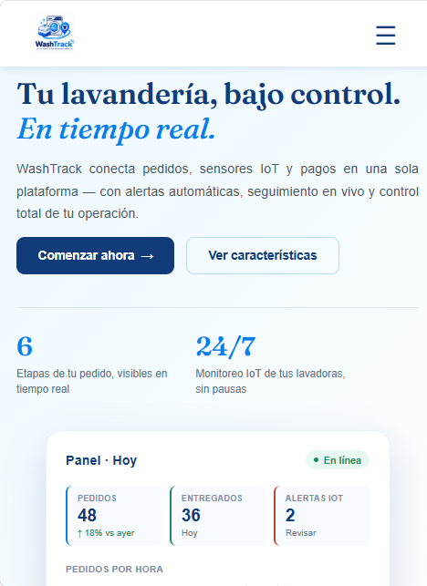
    </td>
  </tr>
</table>
<li>
    <b>Sistema de Navegación (Navbar & Menús):
    </b> 
    
La barra de navegación superior (Navbar) permite acceder de forma rápida a las principales funcionalidades de la plataforma, como Inicio, Monitoreo de Lavadoras, Reportes, Alertas IoT y Soporte. En dispositivos móviles, la navegación se adapta mediante un menú tipo hamburguesa, reduciendo la cantidad de elementos visibles y facilitando su interacción.

  </li>
  

    

 

    

  <li>
    <b>Sistema de Espaciado y Distribución:
    </b> 
    
Los contenidos se organizan mediante una <b>estructura modular basada en columnas, márgenes y espacios consistentes entre componentes.</b> Se mantiene una separación visual adecuada entre títulos, textos, botones, tarjetas y secciones para evitar la saturación de información y facilitar la lectura.

  </li>
  <li>
    <b>Componentes y Botones:
    </b> 
    
Los botones y elementos interactivos mantienen una apariencia consistente con la identidad visual de WashTrack. Los botones principales utilizan el color primario de la marca, mientras que los elementos secundarios emplean colores complementarios. Se consideran diferentes estados de interacción, como estado normal, hover, focus y disabled, proporcionando una respuesta visual clara ante las acciones del usuario.

  </li>
  <table align="center" style="border: none;">

  <tr>
    <td align="center" style="border: none;">
      
    </td>
    <td align="center" style="border: none;">
      
    </td>
  </tr>

  <tr>
    <td align="center" style="border: none;">
      
    </td>
    <td align="center" style="border: none;">
      
    </td>
  </tr>

  <tr>
    <td align="center" style="border: none;">
      
    </td>
    <td align="center" style="border: none;">
      
    </td>
  </tr>
</table>
<li>
    <b>Paneles Modulares y Visualización de Datos:
    </b> 
    
La información se presenta mediante tarjetas con bordes redondeados y fondos claros sobre superficies en tonos celestes suaves. Este sistema permite organizar métricas, estados de las máquinas, alertas y gráficos de manera independiente, facilitando la lectura y el monitoreo de la información.

  </li>
  

    

<li>
    <b>Estados, Alertas y Retroalimentación:
    </b> 
    
El sistema utiliza colores diferenciados para comunicar estados y acciones. El verde representa operaciones exitosas o máquinas en línea, mientras que el rojo y naranja se utilizan para alertas, errores o situaciones que requieren atención. De esta manera, la información crítica puede identificarse rápidamente.

  </li>
   

    

 <li>
    <b>Transiciones y Animaciones:
    </b> 
    
Las transiciones se utilizan de manera moderada para acompañar cambios de estado, apertura de modales, despliegue de menús y acciones interactivas. <b>Se emplean animaciones suaves para evitar cambios abruptos y mantener una experiencia fluida </b>sin distraer al usuario.

  </li>
 <li>
    <b>Consistencia Visual:
    </b> 
    
Los componentes mantienen patrones visuales consistentes en toda la plataforma, utilizando la misma paleta de colores, tipografías, bordes, botones, iconografía y estilos de interacción definidos previamente en el sistema de diseño. Esto permite que el usuario reconozca y comprenda los elementos de la interfaz con mayor facilidad.

  </li>
  

    

</ul>

Todas ellas se representan mediante las diferentes vistas de la interfaz web de WashTrack, incluyendo la versión de escritorio, adaptación para dispositivos móviles, sistema de navegación, tarjetas informativas, botones, estados y paneles de monitoreo.

### 4.2. Information Architecture

La arquitectura de la información de **WashTrack** busca ofrecer una experiencia fluida e intuitiva para los diferentes perfiles de usuarios de la plataforma, como clientes y administradores de lavanderías. La organización y el etiquetado de los contenidos se diseñaron para guiar al usuario de manera eficiente desde el acceso inicial y registro hasta el monitoreo de las lavadoras, la consulta del historial de ciclos de lavado y el acceso a las funcionalidades relacionadas con el sistema IoT.

La información se estructura mediante una jerarquía clara y una categorización modular, permitiendo que cada usuario encuentre rápidamente las funcionalidades correspondientes a su perfil. Asimismo, la navegación <b>sigue una secuencia lógica que facilita el acceso a las principales secciones del sistema</b>, tales como la barra de navegación superior, la sección de características, que presenta el seguimiento en tiempo real de las seis etapas del proceso de lavado, la sección orientada a los diferentes perfiles de usuario ("Para quién"), la presentación institucional ("Sobre nosotros") y el formulario de atención ubicado al final de la página. Esta organización <b>permite reducir la carga cognitiva y mejorar la experiencia de uso.</b>

#### 4.2.1. Organization Systems

- <b>Organización jerárquica (Visual Hierarchy):</b> 
  Se aplica principalmente en la página principal y en la presentación de los contenidos informativos. La información se organiza de acuerdo con diferentes niveles de importancia, utilizando títulos, subtítulos, tamaños de texto, colores, espacios y botones para dirigir la atención del usuario hacia los elementos principales. Por ejemplo, en la página de inicio se prioriza la propuesta de valor de WashTrack y posteriormente se presentan sus características y demás contenidos.

- <b>Organización secuencial (Step-by-Step):</b> 
  Se utiliza en la representación del proceso de seguimiento del servicio de lavado. Las seis etapas del proceso se presentan siguiendo un orden determinado, permitiendo que el usuario comprenda progresivamente el estado de su ropa y conozca en qué etapa se encuentra. Este sistema resulta especialmente útil para representar procesos que requieren una secuencia lógica.

- <b>Organización matricial:</b> 
  Se utiliza para relacionar las funcionalidades de WashTrack con los diferentes perfiles de usuarios. La información puede organizarse considerando tanto el tipo de usuario como las necesidades o funcionalidades disponibles para cada perfil, facilitando la identificación de los servicios que corresponden a cada audiencia.

- <b>Categorización por tópicos:</b> 
  Se utiliza para agrupar la información de acuerdo con su temática. De esta manera, los contenidos se distribuyen en secciones como características de la plataforma, seguimiento del proceso, información sobre WashTrack y atención al usuario, evitando mezclar contenidos de diferente naturaleza.

- <b>Categorización según audiencia:</b> 
  Se aplica principalmente en la sección <b>“Para quién”</b>, donde la información se presenta de acuerdo con los diferentes perfiles a los que está dirigida la solución. Esta organización permite que cada grupo de usuarios identifique rápidamente los beneficios y funcionalidades relevantes para sus necesidades.

- <b>Categorización cronológica:</b> 
  Se aplica principalmente al seguimiento del proceso de lavado y al historial de ciclos. La información relacionada con las etapas del servicio se presenta siguiendo un orden temporal, permitiendo comprender la evolución del proceso desde su inicio hasta su finalización.

#### 4.2.2. Labeling Systems

Los sistemas de etiquetado en WashTrack han sido diseñados bajo <b>principios de simplicidad, concisión y claridad para representar los conjuntos de información y sus asociaciones</b> sin generar confusión en los visitantes y usuarios. Las etiquetas emplean el mínimo número de palabras posibles, utilizando una terminología intuitiva y estandarizada que facilita la navegación tanto en la versión pública como en el panel operativo del sistema.

<b>*Landing Page*</b>
| **Etiqueta** | **Descripción** |
|---|---|
| **Inicio** | Presenta la propuesta de valor principal de WashTrack mediante una interfaz visual y llamadas a la acción directas. |
| **Características** | Agrupa de forma modular las funcionalidades clave del servicio, como pedidos, seguimiento, IoT y pagos. |
| **Sobre nosotros** | Muestra la identidad corporativa de DevTech, su misión y sus valores orientados a la transformación digital. |
| **Para quién** | Segmenta los beneficios y soluciones dirigidas tanto a dueños de lavanderías como a clientes finales. |
| **Planes** | Detalla las opciones de servicio e integración tecnológica disponibles para los negocios. |
| **Comenzar ahora** | Botón de llamada a la acción (CTA) principal para el registro o acceso directo al formulario de atención. |

<b>*App Web*</b>

| **Etiqueta** | **Descripción** |
|---|---|
| **Panel Hoy / Dashboard** | Presenta una vista general del estado operativo actual, métricas clave y alertas de lavadoras en tiempo real. |
| **Monitoreo IoT** | Permite visualizar el estado, rendimiento y alertas predictivas de las lavadoras conectadas. |
| **Pedidos** | Permite gestionar órdenes, clientes, estados de entrega y filtrar información según las etapas del proceso de lavado. |
| **Seguimiento en Vivo** | Muestra de manera secuencial las seis etapas del proceso de lavado para facilitar el control del usuario. |
| **Reportes** | Presenta el historial de operaciones, métricas de rendimiento y estadísticas de la lavandería. |
| **Configuración** | Permite gestionar los ajustes de cuenta, preferencias del usuario y parámetros operativos del sistema. |
| **Cerrar Sesión** | Permite salir de forma segura de la plataforma para proteger los datos del negocio y del usuario. |

#### 4.2.3. SEO Tags and Meta Tags

Para mejorar la visibilidad de WashTrack en los motores de búsqueda y atraer a los usuarios adecuados, se han definido los siguientes SEO Tags y Meta Tags para las principales páginas de la experiencia, considerando tanto el sitio web estático que es la Landing Page como la Web Application. Para cada página se especifican los valores correspondientes a Title, Meta Description, Keywords y Author.

#### Landing Page

- <b>Title:</b> WashTrack - Gestión Inteligente y Monitoreo IoT para Lavanderías
- <b>Meta Description:</b> WashTrack conecta pedidos, sensores IoT y pagos en una sola plataforma. Digitaliza tu lavandería tradicional con alertas automáticas, seguimiento en vivo y control total de la operación.
- <b>Keywords:</b> lavandería digital, gestión de lavanderías, monitoreo IoT, seguimiento en tiempo real, software para lavanderías, recojo a domicilio, WashTrack.
- <b>Author:</b> DevTech Team

#### Dashboard / Inicio

- <b>Title:</b> Dashboard de WashTrack - Resumen de Operaciones y Estado de Lavadoras
- <b>Meta Description:</b> Accede al resumen general de tu actividad de lavado, estado operativo de las máquinas y métricas clave de tu negocio en tiempo real.
- <b>Keywords:</b> dashboard de lavandería, panel hoy, estado de lavadoras, control operativo, WashTrack app.
- <b>Author:</b> DevTech Team

#### Características

- <b>Title:</b> Características de WashTrack - Todo lo que tu Lavandería Necesita
- <b>Meta Description:</b> Explora las soluciones de WashTrack: gestión integral de pedidos, seguimiento en vivo de prendas, monitoreo IoT predictivo y logística de pagos digitales.
- <b>Keywords:</b> características de WashTrack, gestión de pedidos, seguimiento en vivo, monitoreo IoT, logística y pagos.
- <b>Author:</b> DevTech Team

#### Seguimiento en Vivo

- <b>Title:</b> Seguimiento en Vivo de Pedidos en WashTrack - Estado Exacto de tus Prendas
- <b>Meta Description:</b> Conoce el estado exacto de tu ropa sin necesidad de llamar. Visualiza las etapas desde la recepción y clasificación hasta el lavado, secado y entrega.
- <b>Keywords:</b> seguimiento en vivo, estado de pedidos, lavado de ropa, etapas de lavado, notificaciones automáticas.
- <b>Author:</b> DevTech Team

#### Sobre Nosotros

- <b>Title:</b> Sobre Nosotros - Conoce al Equipo de DevTech detrás de WashTrack
- <b>Meta Description:</b> Somos DevTech, estudiantes de la UPC construyendo tecnología para negocios tradicionales en Latinoamérica. Descubre nuestra misión, visión y valores.
- <b>Keywords:</b> DevTech, sobre nosotros, equipo UPC, tecnología para negocios tradicionales, transformación digital.
- <b>Author:</b> DevTech Team

#### Planes y Contacto

- <b>Title:</b> Planes y Precios de WashTrack - Digitaliza tu Negocio de Lavandería
- <b>Meta Description:</b> Elige el plan ideal para digitalizar tu lavandería o solicita más información completando nuestro formulario de atención para dueños de negocios y clientes.
- <b>Keywords:</b> planes de WashTrack, precios, digitalizar lavandería, contacto, formulario de atención.
- <b>Author:</b> DevTech Team

#### 4.2.4. Searching Systems

El sistema de búsqueda diseñado para <b>WashTrack</b> tiene como objetivo <b>facilitar a los usuarios y administradores la localización eficiente de información</b> relacionada con la gestión de pedidos, el estado de las prendas, las alertas de las lavadoras inteligentes y los reportes operativos. Para ello, <b>se emplean campos de búsqueda y filtros</b> que permiten reducir la cantidad de información mostrada y encontrar rápidamente los datos relevantes según el perfil del usuario y la actividad que desea consultar o gestionar.

| <b>Nombre del Filtro</b> | <b>Descripción</b> |
|---|---|
| <b>Buscar pedidos por código</b> | Permite ingresar el código de un pedido para localizar rápidamente la información correspondiente y consultar su estado actual. |
| <b>Filtrar pedidos por estado</b> | Permite organizar y visualizar los pedidos según su estado dentro del proceso de servicio, facilitando la identificación del progreso de cada pedido. |
| <b>Filtrar pedidos por fecha</b> | Permite consultar pedidos correspondientes a un periodo determinado, facilitando la búsqueda de información específica dentro del historial del servicio. |
| <b>Filtrar pedidos por prioridad</b> | Permite identificar los pedidos asociados al <b>plan VIP</b>, los cuales cuentan con prioridad en la atención y procesamiento del servicio. |
| <b>Consultar seguimiento del pedido</b> | Permite acceder a la información relacionada con el progreso del pedido y visualizar las diferentes etapas del proceso de lavado de manera ordenada. |

#### 4.2.5. Navigation Systems

El sistema de navegación de WashTrack ha sido diseñado para <b>guiar de manera intuitiva y fluida a los usuarios, tanto clientes finales como dueños de lavanderías</b>, a través de la Landing Page y la aplicación web. Para ello, se combinan diferentes técnicas de navegación y recorridos que permiten al usuario <b>encontrar la información necesaria, interactuar con las funcionalidades y alcanzar sus objetivos</b> con el menor esfuerzo posible.

#### Landing Page o Sitio Web 

- <b>Estructura y Recorrido:</b> 
  La navegación se plantea mediante un recorrido vertical de una sola página, complementado por una barra de navegación superior. El usuario comienza visualizando la propuesta de valor principal y continúa hacia las características del servicio, el funcionamiento del proceso, los beneficios según su perfil en la sección <b>“Para quién”</b>, los planes disponibles y finalmente el formulario de atención.

- <b>Acción del Usuario:</b> 
  El visitante puede desplazarse libremente por las diferentes secciones y utilizar los botones de llamada a la acción (<i>Call to Action</i>), como <b>“Comenzar ahora”</b>, para acceder al registro o formulario de atención según su interés.

#### App Web - Panel Hoy o Dashboard 

- <b>Estructura y Recorrido:</b> 
  El Dashboard funciona como punto principal de acceso después del inicio de sesión. La información se organiza mediante accesos directos y tarjetas visuales que permiten acceder rápidamente a las diferentes funcionalidades de la aplicación.

- <b>Acción del Usuario:</b> 
  El usuario consulta un resumen de su actividad y puede dirigirse hacia las secciones de pedidos, seguimiento, reportes u otras funcionalidades disponibles. En el caso del <b>plan VIP</b>, se contempla la identificación visual de los pedidos que requieren atención prioritaria.

#### Sección: Pedidos

- <b>Estructura y Recorrido:</b> 
  Presenta la información de los pedidos de manera organizada, permitiendo utilizar opciones de búsqueda y filtrado para localizar órdenes según diferentes criterios, como código, estado, fecha o prioridad.

- <b>Acción del Usuario:</b> 
  El usuario selecciona un pedido para consultar su información y verificar el estado en el que se encuentra. Asimismo, los pedidos asociados al <b>plan VIP</b> pueden identificarse mediante un indicador de prioridad.

#### Sección: Seguimiento en Vivo

- <b>Estructura y Recorrido:</b> 
  La navegación se organiza mediante un flujo visual secuencial (<i>step-by-step</i>) que representa las seis etapas del proceso: <b>Recepción, Clasificación, Lavado, Secado/Planchado, Empaquetado y Listo</b>.

- <b>Acción del Usuario:</b> 
  El cliente consulta el progreso de su pedido y reconoce visualmente la etapa actual en la que se encuentra su ropa. Para los usuarios con plan VIP, se contempla la identificación de la prioridad del servicio dentro del seguimiento.

#### Sección: Reportes

- <b>Estructura y Recorrido:</b> 
  La sección organiza la información histórica mediante filtros temporales, como día, mes o año, permitiendo acceder de manera ordenada a los registros y estadísticas disponibles.

- <b>Acción del Usuario:</b> 
  El administrador puede consultar información histórica para analizar el funcionamiento de la lavandería, mientras que el cliente puede acceder a información relacionada con sus servicios realizados, de acuerdo con las funcionalidades definidas para cada perfil.

#### Sección: Configuración

- <b>Estructura y Recorrido:</b> 
  La sección permite organizar las opciones relacionadas con la cuenta, los datos del perfil, las preferencias y la gestión del plan contratado.

- <b>Acción del Usuario:</b> 
  El usuario puede consultar o modificar la información disponible de su cuenta y gestionar las opciones relacionadas con su suscripción. Finalmente, puede utilizar la opción <b>“Cerrar Sesión”</b> para salir de manera segura de la plataforma.

### 4.3. Landing Page UI Design

El diseño de la interfaz de usuario (UI) de la Landing Page de <b>WashTrack</b> busca presentar de forma clara y atractiva la propuesta de valor de la plataforma. La interfaz organiza visualmente sus principales funcionalidades, beneficios y características, destacando la gestión de pedidos, el seguimiento en tiempo real, el monitoreo IoT y la automatización de procesos. Esta estructura sirve como base para la elaboración del wireframe y posteriormente del mock-up de la Landing Page.

#### 4.3.1. Landing Page Wireframe

A continuación, se presentan los wireframes correspondientes a la interfaz de la Landing Page de <b>WashTrack</b>. Estos bocetos de baja fidelidad estructuran la disposición visual de los elementos clave, permitiendo validar la jerarquía de la información, la distribución de los componentes y la experiencia de navegación inicial del usuario antes de proceder con el diseño de alta fidelidad.

  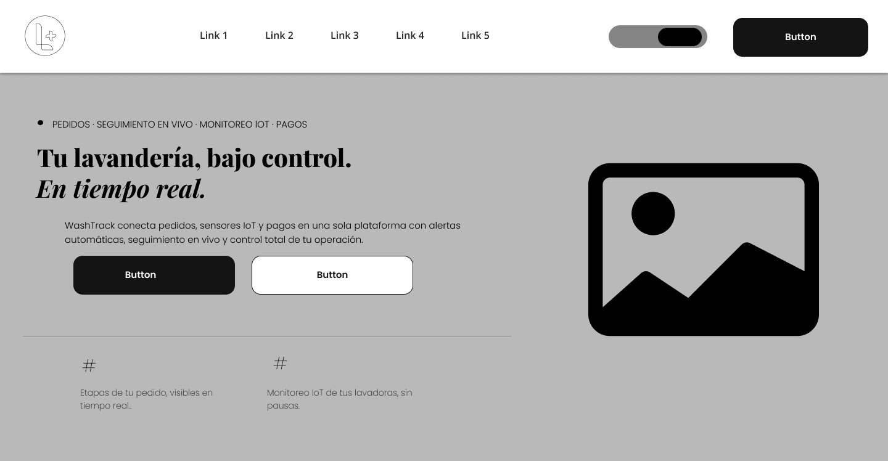
  
<b>Figura 1:</b> Sección principal con propuesta de valor, accesos rápidos y vista previa de la plataforma.

  

  
  
  
<b>Figura 2:</b> Sección de identificación del problema y solución principal para los negocios de lavandería.

  

  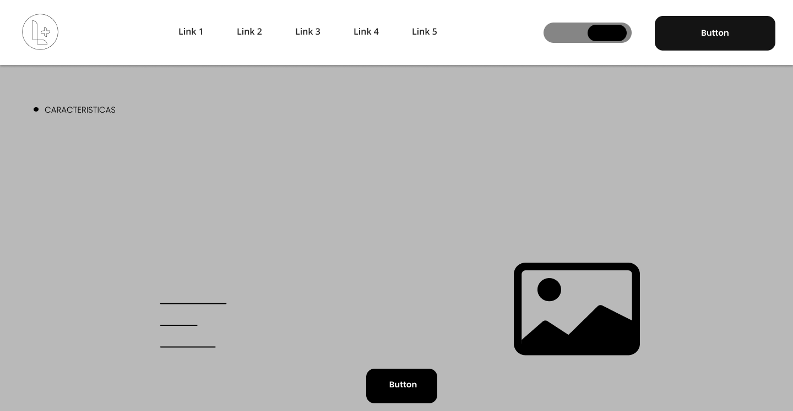
  
<b>Figura 3:</b> Sección de características clave y descripción del funcionamiento general de WashTrack.

  

  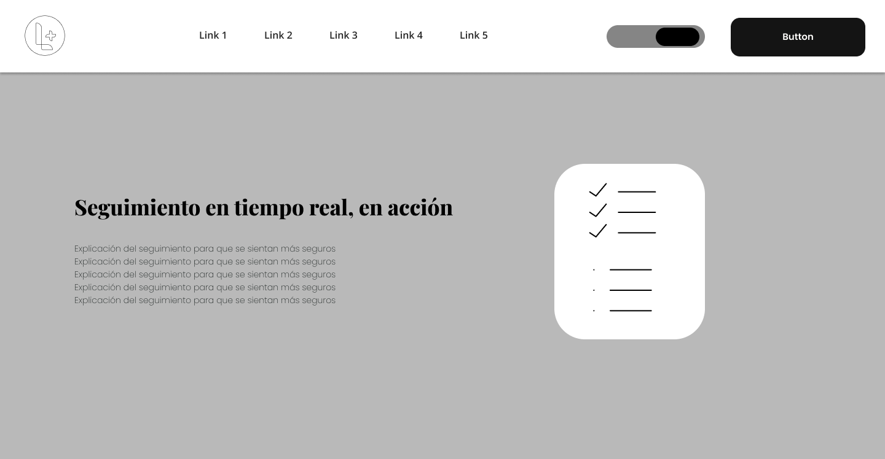
  
<b>Figura 4:</b> Módulo detallado de seguimiento en tiempo real y listas de control de operaciones.

  

  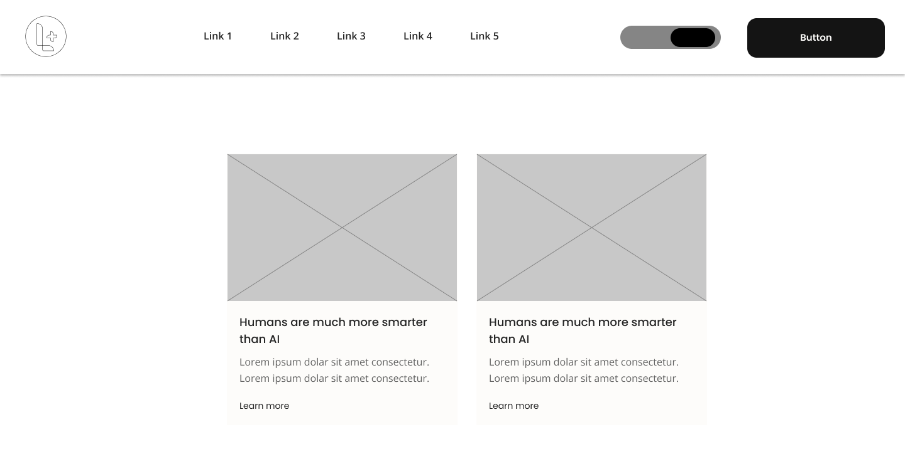
  
<b>Figura 5:</b> Sección orientada a los dos lados de la misma lavandería.

  

  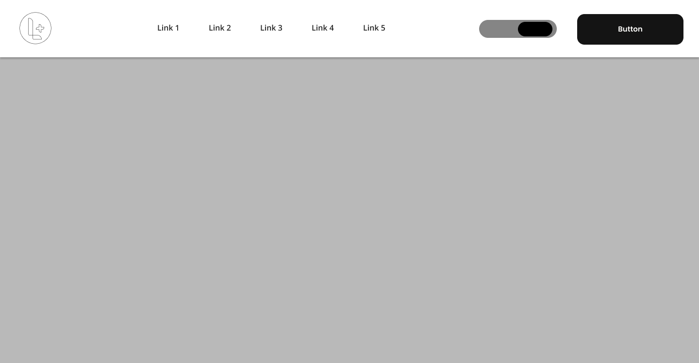
  
<b>Figura 6:</b> Sección "Sobre Nosotros" que presenta al equipo desarrollador y las cualidades de la plataforma.

  

  
  
<b>Figura 7:</b> Sección de planes y precios adaptados a cada tamaño de lavandería.

  

  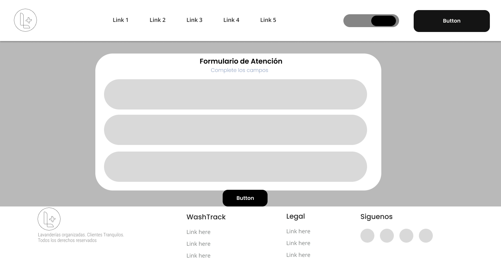
  
<b>Figura 8:</b> Formulario de atención, pie de página (footer) y enlaces legales de la plataforma.

#### 4.3.2. Landing Page Mock-up

### 4.4. Web Applications UX/UI Design

#### 4.4.1. Web Applications Wireframes
#### 4.4.2. Web Applications Wireflow Diagrams
#### 4.4.3. Web Applications Mock-ups
#### 4.4.4. Web Applications User Flow Diagrams

### 4.5. Web Applications Prototyping

### 4.6. Domain-Driven Software Architecture
La arquitectura de WashTrack se organiza utilizando conceptos de **Domain-Driven Design (DDD)** para separar las principales responsabilidades del dominio. Los Bounded Contexts permiten delimitar las reglas y responsabilidades de cada área funcional.

| Bounded Context | Responsabilidad |
|---|---|
| Identity & Access | Gestionar identidad, autenticación y autorización. |
| Order Management | Gestionar solicitudes y órdenes de servicio. |
| Laundry Operations | Gestionar el procesamiento interno de las órdenes. |
| Subscription & Payment | Gestionar membresías, créditos, beneficios y pagos. |
| Tracking & Notifications | Gestionar seguimiento y notificaciones. |
| Customer & Business Management | Gestionar clientes, lavanderías e información operativa. |

#### 4.6.1. Design-Level EventStorming
El Design-Level EventStorming identifica los principales **Commands, Aggregates, Domain Events y Policies** necesarios para representar el comportamiento del dominio.

### Commands principales

| Command | Aggregate | Domain Event |
|---|---|---|
| Create Order | Order | OrderCreated |
| Register Special Care | Order | SpecialCareRegistered |
| Select Delivery Method | Order | DeliveryMethodSelected |
| Validate Subscription | Subscription | SubscriptionValidated |
| Apply Benefit | Subscription | BenefitApplied |
| Process Payment | Payment | PaymentProcessed |
| Receive Order | LaundryOrder | OrderReceived |
| Classify Order | LaundryOrder | OrderClassified |
| Assign Washing Cycle | LaundryOrder | WashingCycleAssigned |
| Assign Resource | LaundryOrder | ResourceAssigned |
| Advance Stage | LaundryOrder | ProcessingStageAdvanced |
| Prioritize VIP Order | LaundryOrder | VIPPriorityAssigned |
| Register Status Update | Tracking | OrderStatusUpdated |
| Send Notification | Notification | NotificationSent |
| Detect Delivery Risk | LaundryOrder | VIPDeliveryRiskDetected |

### Aggregates

- **Order:** mantiene la información de una solicitud.
- **Subscription:** controla membresía, vigencia y créditos.
- **Payment:** representa una transacción.
- **LaundryOrder:** representa el procesamiento operativo de una orden.
- **Tracking:** mantiene el historial de estados.
- **Notification:** representa una comunicación generada por el sistema.

### EventStorming

```mermaid
flowchart LR
    C1["Command: Create Order"] --> E1["Event: OrderCreated"]
    E1 --> C2["Command: Validate Subscription"]
    C2 --> E2["Event: SubscriptionValidated"]
    E2 --> C3["Command: Apply Benefit"]
    C3 --> E3["Event: BenefitApplied"]
    E3 --> C4["Command: Process Payment"]
    C4 --> E4["Event: PaymentProcessed"]

    E4 --> C5["Command: Receive Order"]
    C5 --> E5["Event: OrderReceived"]
    E5 --> C6["Command: Classify Order"]
    C6 --> E6["Event: OrderClassified"]
    E6 --> C7["Command: Assign Washing Cycle"]
    C7 --> E7["Event: WashingCycleAssigned"]
    E7 --> C8["Command: Assign Resource"]
    C8 --> E8["Event: ResourceAssigned"]
    E8 --> C9["Command: Advance Stage"]
    C9 --> E9["Event: ProcessingStageAdvanced"]

    E9 --> C10["Command: Register Status Update"]
    C10 --> E10["Event: OrderStatusUpdated"]
    E10 --> C11["Command: Send Notification"]
    C11 --> E11["Event: NotificationSent"]

    E2 --> C12["Command: Prioritize VIP Order"]
    C12 --> E12["Event: VIPPriorityAssigned"]
    E9 --> C13["Policy: Detect VIP Delivery Risk"]
    C13 --> E13["Event: VIPDeliveryRiskDetected"]
```

#### 4.6.2. Software Architecture Context Diagram
El Context Diagram representa a WashTrack como el sistema central y muestra sus principales actores y sistemas externos.

### Actores

- **Customer:** solicita servicios, gestiona membresías, realiza pagos y consulta el seguimiento.
- **Laundry Provider:** administra órdenes, recursos, clientes y operación.

### Sistemas externos

- **Payment Gateway:** procesa pagos.
- **Email Service:** envía notificaciones.

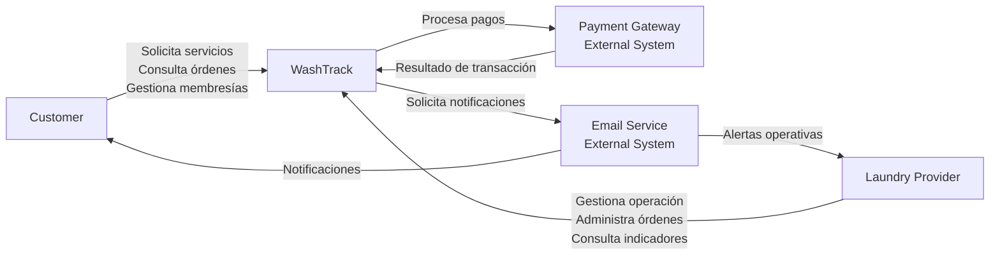
```mermaid
flowchart LR
    Customer["Customer"]
    Provider["Laundry Provider"]

    WashTrack["WashTrack"]

    Payment["Payment Gateway<br/>External System"]
    Email["Email Service<br/>External System"]

    Customer -->|"Solicita servicios<br/>Consulta órdenes<br/>Gestiona membresías"| WashTrack
    Provider -->|"Gestiona operación<br/>Administra órdenes<br/>Consulta indicadores"| WashTrack

    WashTrack -->|"Procesa pagos"| Payment
    Payment -->|"Resultado de transacción"| WashTrack

    WashTrack -->|"Solicita notificaciones"| Email
    Email -->|"Notificaciones"| Customer
    Email -->|"Alertas operativas"| Provider
```

#### 4.6.3. Software Architecture Container Diagrams
El Container Diagram representa las principales unidades de software que conforman la solución.

| Container | Tecnología propuesta | Responsabilidad |
|---|---|---|
| Landing Page | HTML, CSS, JavaScript | Presentar la propuesta de valor. |
| Web Application | Vue.js | Interfaces para Customer y Laundry Provider. |
| RESTful API | C# / ASP.NET Core | Servicios y lógica de negocio. |
| Database | PostgreSQL | Persistencia de información. |
| Notification Worker | C# / .NET Worker Service | Procesar eventos y generar notificaciones. |
| Payment Gateway | Servicio externo | Procesar pagos. |
| Email Service | Servicio externo | Enviar correos. |

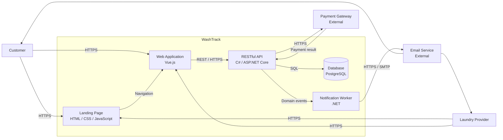
```mermaid
flowchart LR
    Customer["Customer"]
    Provider["Laundry Provider"]

    subgraph WashTrack["WashTrack"]
        Landing["Landing Page<br/>HTML / CSS / JavaScript"]
        WebApp["Web Application<br/>Vue.js"]
        API["RESTful API<br/>C# / ASP.NET Core"]
        DB[("Database<br/>PostgreSQL")]
        Worker["Notification Worker<br/>.NET"]
    end

    Payment["Payment Gateway<br/>External"]
    Email["Email Service<br/>External"]

    Customer -->|"HTTPS"| Landing
    Provider -->|"HTTPS"| Landing
    Customer -->|"HTTPS"| WebApp
    Provider -->|"HTTPS"| WebApp

    Landing -->|"Navigation"| WebApp
    WebApp -->|"REST / HTTPS"| API
    API -->|"SQL"| DB
    API -->|"HTTPS"| Payment
    Payment -->|"Payment result"| API
    API -->|"Domain events"| Worker
    Worker -->|"HTTPS / SMTP"| Email
    Email --> Customer
    Email --> Provider
```

#### 4.6.4. Software Architecture Components Diagrams
### 4.6.4.1. RESTful API

La API se divide en capas para separar la exposición HTTP, los casos de uso, las reglas de dominio y las integraciones.

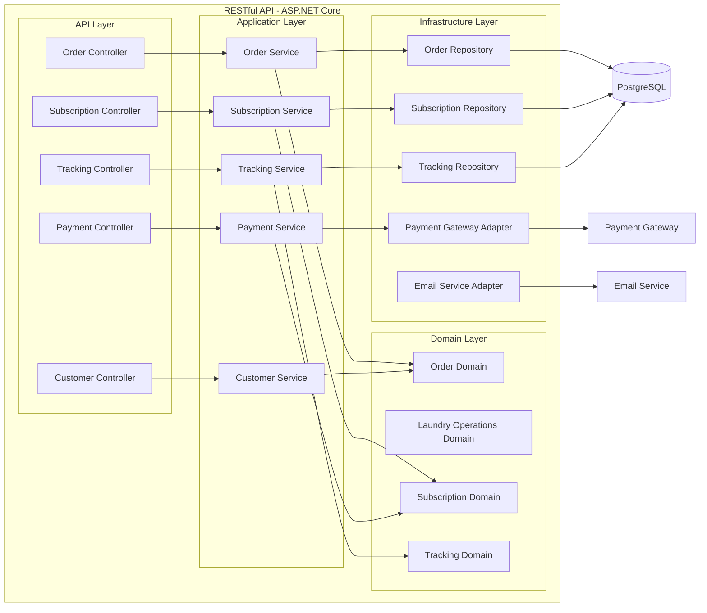
```mermaid
flowchart LR
    subgraph API["RESTful API - ASP.NET Core"]
        subgraph Presentation["API Layer"]
            OC["Order Controller"]
            SC["Subscription Controller"]
            TC["Tracking Controller"]
            PC["Payment Controller"]
            CC["Customer Controller"]
        end

        subgraph Application["Application Layer"]
            OS["Order Service"]
            SS["Subscription Service"]
            TS["Tracking Service"]
            PS["Payment Service"]
            CS["Customer Service"]
        end

        subgraph Domain["Domain Layer"]
            OD["Order Domain"]
            LD["Laundry Operations Domain"]
            SD["Subscription Domain"]
            TD["Tracking Domain"]
        end

        subgraph Infrastructure["Infrastructure Layer"]
            OR["Order Repository"]
            SR["Subscription Repository"]
            TR["Tracking Repository"]
            PA["Payment Gateway Adapter"]
            EA["Email Service Adapter"]
        end
    end

    DB[("PostgreSQL")]
    Payment["Payment Gateway"]
    Email["Email Service"]

    OC --> OS
    SC --> SS
    TC --> TS
    PC --> PS
    CC --> CS

    OS --> OD
    SS --> SD
    TS --> TD
    PS --> SD
    CS --> OD

    OS --> OR
    SS --> SR
    TS --> TR
    PS --> PA

    OR --> DB
    SR --> DB
    TR --> DB
    PA --> Payment
    EA --> Email
```

### 4.6.4.2. Web Application

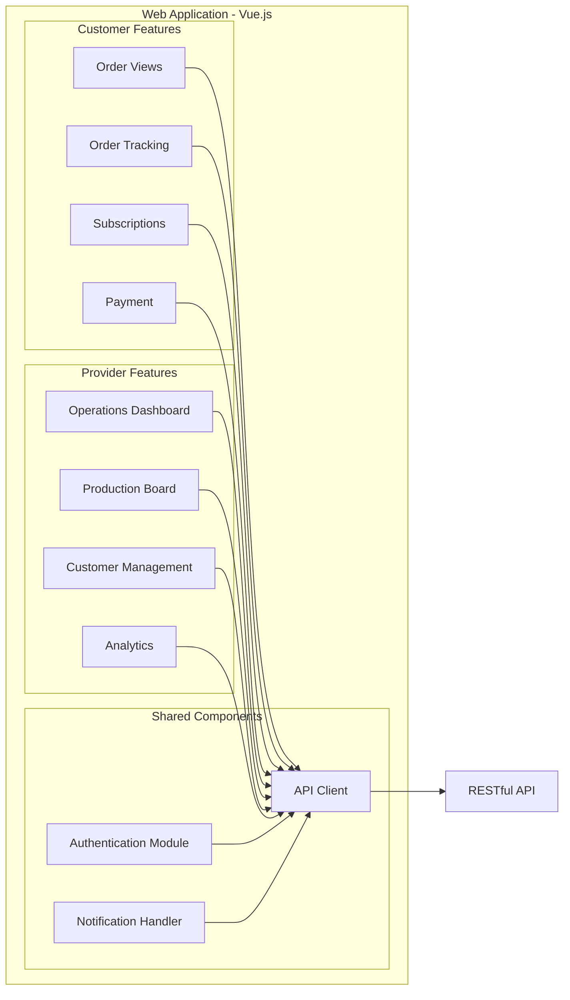
```mermaid
flowchart LR
    subgraph Web["Web Application - Vue.js"]
        subgraph CustomerFeatures["Customer Features"]
            Orders["Order Views"]
            Tracking["Order Tracking"]
            Subs["Subscriptions"]
            Pay["Payment"]
        end

        subgraph ProviderFeatures["Provider Features"]
            Dashboard["Operations Dashboard"]
            Board["Production Board"]
            Customers["Customer Management"]
            Analytics["Analytics"]
        end

        subgraph Shared["Shared Components"]
            Auth["Authentication Module"]
            Client["API Client"]
            Notify["Notification Handler"]
        end
    end

    API["RESTful API"]

    Orders --> Client
    Tracking --> Client
    Subs --> Client
    Pay --> Client
    Dashboard --> Client
    Board --> Client
    Customers --> Client
    Analytics --> Client
    Auth --> Client
    Notify --> Client
    Client --> API
```

### 4.6.4.3. Notification Worker

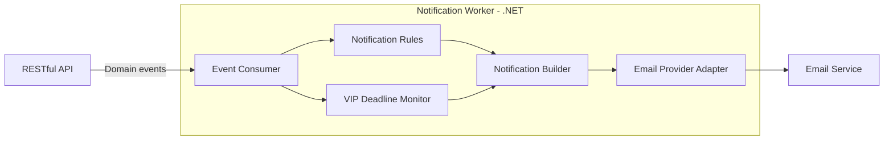
```mermaid
flowchart LR
    API["RESTful API"]

    subgraph Worker["Notification Worker - .NET"]
        Consumer["Event Consumer"]
        Rules["Notification Rules"]
        Monitor["VIP Deadline Monitor"]
        Builder["Notification Builder"]
        Adapter["Email Provider Adapter"]
    end

    Email["Email Service"]

    API -->|"Domain events"| Consumer
    Consumer --> Rules
    Consumer --> Monitor
    Rules --> Builder
    Monitor --> Builder
    Builder --> Adapter
    Adapter --> Email
```

### 4.7. Software Object-Oriented Design
El diseño orientado a objetos representa los principales elementos del dominio mediante clases, atributos, operaciones, enumeraciones e interfaces.

#### 4.7.1. Class Diagrams
### 4.7.1.1. Order Management

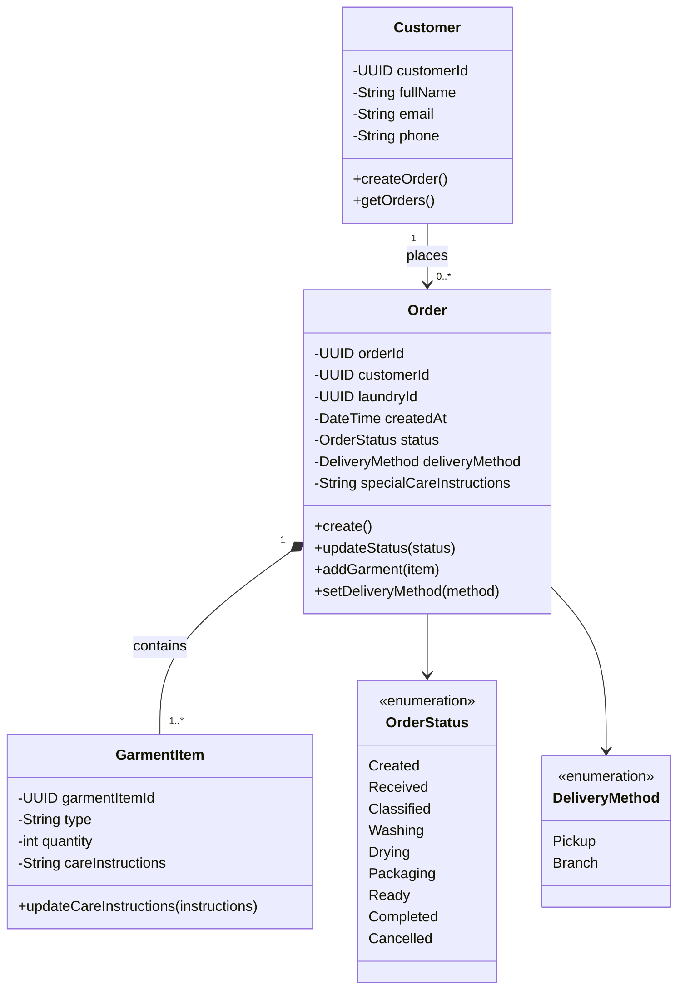
```mermaid
classDiagram
    class Customer {
        -UUID customerId
        -String fullName
        -String email
        -String phone
        +createOrder()
        +getOrders()
    }

    class Order {
        -UUID orderId
        -UUID customerId
        -UUID laundryId
        -DateTime createdAt
        -OrderStatus status
        -DeliveryMethod deliveryMethod
        -String specialCareInstructions
        +create()
        +updateStatus(status)
        +addGarment(item)
        +setDeliveryMethod(method)
    }

    class GarmentItem {
        -UUID garmentItemId
        -String type
        -int quantity
        -String careInstructions
        +updateCareInstructions(instructions)
    }

    class OrderStatus {
        <<enumeration>>
        Created
        Received
        Classified
        Washing
        Drying
        Packaging
        Ready
        Completed
        Cancelled
    }

    class DeliveryMethod {
        <<enumeration>>
        Pickup
        Branch
    }

    Customer "1" --> "0..*" Order : places
    Order "1" *-- "1..*" GarmentItem : contains
    Order --> OrderStatus
    Order --> DeliveryMethod
```

### 4.7.1.2. Subscription & Payment

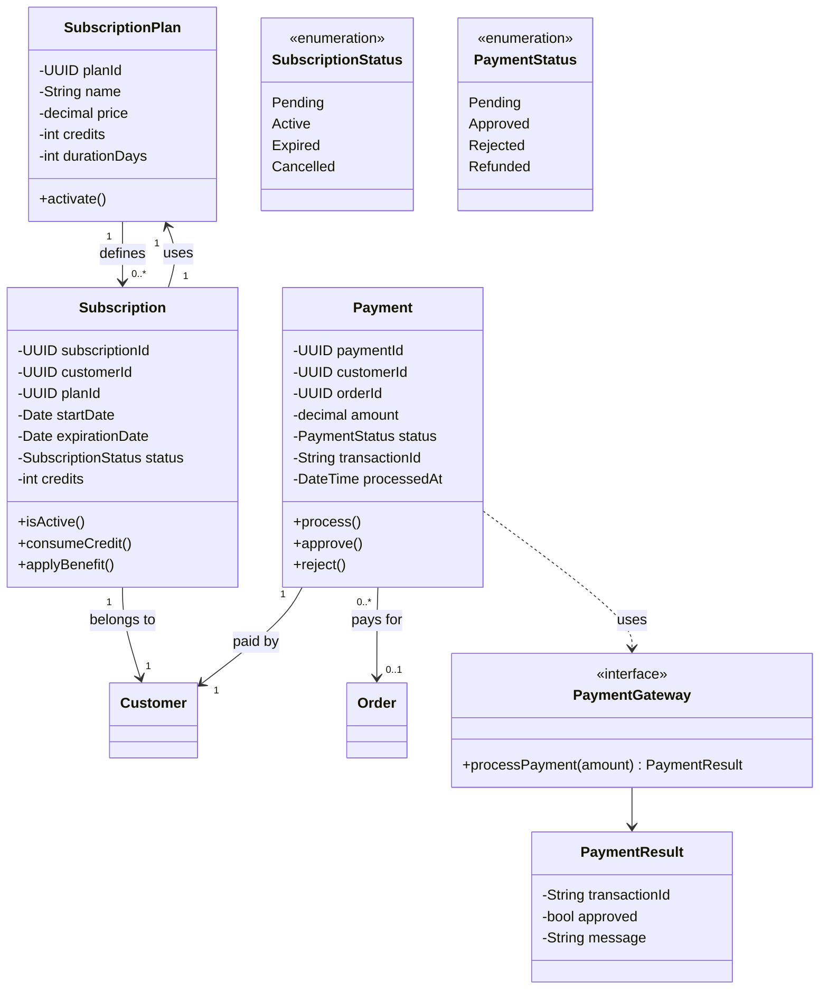
```mermaid
classDiagram
    class SubscriptionPlan {
        -UUID planId
        -String name
        -decimal price
        -int credits
        -int durationDays
        +activate()
    }

    class Subscription {
        -UUID subscriptionId
        -UUID customerId
        -UUID planId
        -Date startDate
        -Date expirationDate
        -SubscriptionStatus status
        -int credits
        +isActive()
        +consumeCredit()
        +applyBenefit()
    }

    class Payment {
        -UUID paymentId
        -UUID customerId
        -UUID orderId
        -decimal amount
        -PaymentStatus status
        -String transactionId
        -DateTime processedAt
        +process()
        +approve()
        +reject()
    }

    class PaymentGateway {
        <<interface>>
        +processPayment(amount) PaymentResult
    }

    class PaymentResult {
        -String transactionId
        -bool approved
        -String message
    }

    class SubscriptionStatus {
        <<enumeration>>
        Pending
        Active
        Expired
        Cancelled
    }

    class PaymentStatus {
        <<enumeration>>
        Pending
        Approved
        Rejected
        Refunded
    }

    SubscriptionPlan "1" --> "0..*" Subscription : defines
    Subscription "1" --> "1" SubscriptionPlan : uses
    Subscription "1" --> "1" Customer : belongs to
    Payment "1" --> "1" Customer : paid by
    Payment "0..*" --> "0..1" Order : pays for
    Payment ..> PaymentGateway : uses
    PaymentGateway --> PaymentResult
```

### 4.7.1.3. Laundry Operations

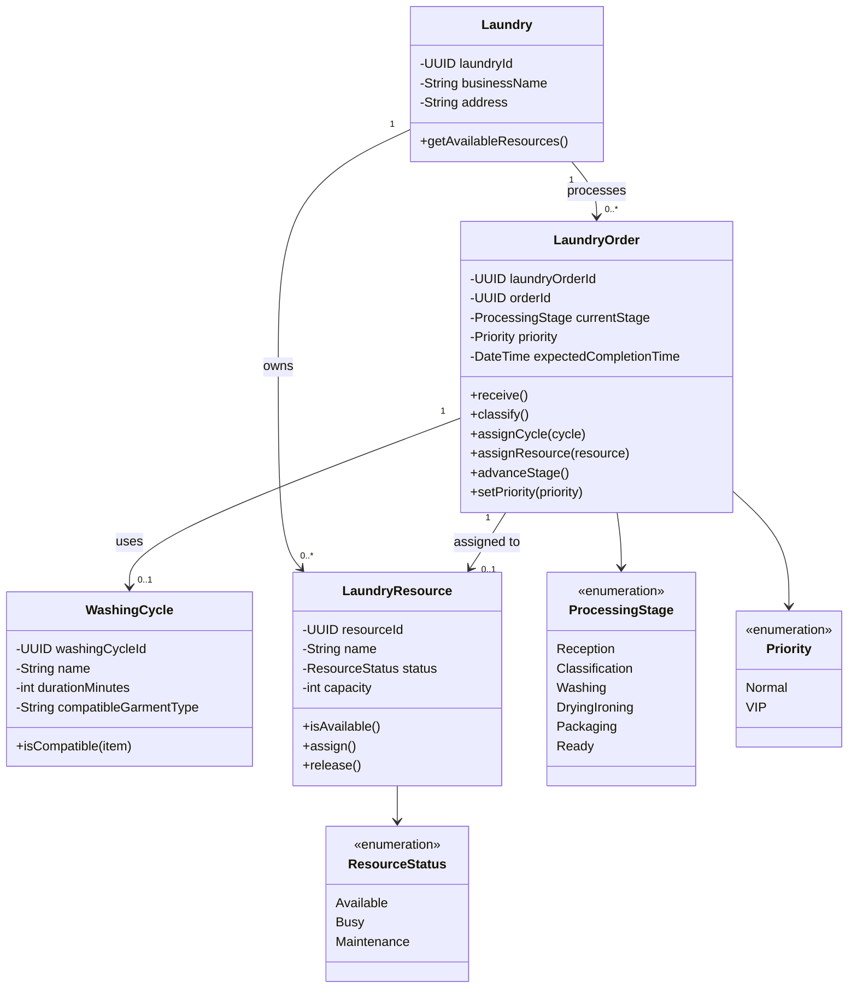
```mermaid
classDiagram
    class Laundry {
        -UUID laundryId
        -String businessName
        -String address
        +getAvailableResources()
    }

    class LaundryOrder {
        -UUID laundryOrderId
        -UUID orderId
        -ProcessingStage currentStage
        -Priority priority
        -DateTime expectedCompletionTime
        +receive()
        +classify()
        +assignCycle(cycle)
        +assignResource(resource)
        +advanceStage()
        +setPriority(priority)
    }

    class WashingCycle {
        -UUID washingCycleId
        -String name
        -int durationMinutes
        -String compatibleGarmentType
        +isCompatible(item)
    }

    class LaundryResource {
        -UUID resourceId
        -String name
        -ResourceStatus status
        -int capacity
        +isAvailable()
        +assign()
        +release()
    }

    class ProcessingStage {
        <<enumeration>>
        Reception
        Classification
        Washing
        DryingIroning
        Packaging
        Ready
    }

    class ResourceStatus {
        <<enumeration>>
        Available
        Busy
        Maintenance
    }

    class Priority {
        <<enumeration>>
        Normal
        VIP
    }

    Laundry "1" --> "0..*" LaundryOrder : processes
    Laundry "1" --> "0..*" LaundryResource : owns
    LaundryOrder "1" --> "0..1" WashingCycle : uses
    LaundryOrder "1" --> "0..1" LaundryResource : assigned to
    LaundryOrder --> ProcessingStage
    LaundryOrder --> Priority
    LaundryResource --> ResourceStatus
```

### 4.7.1.4. Tracking & Notifications

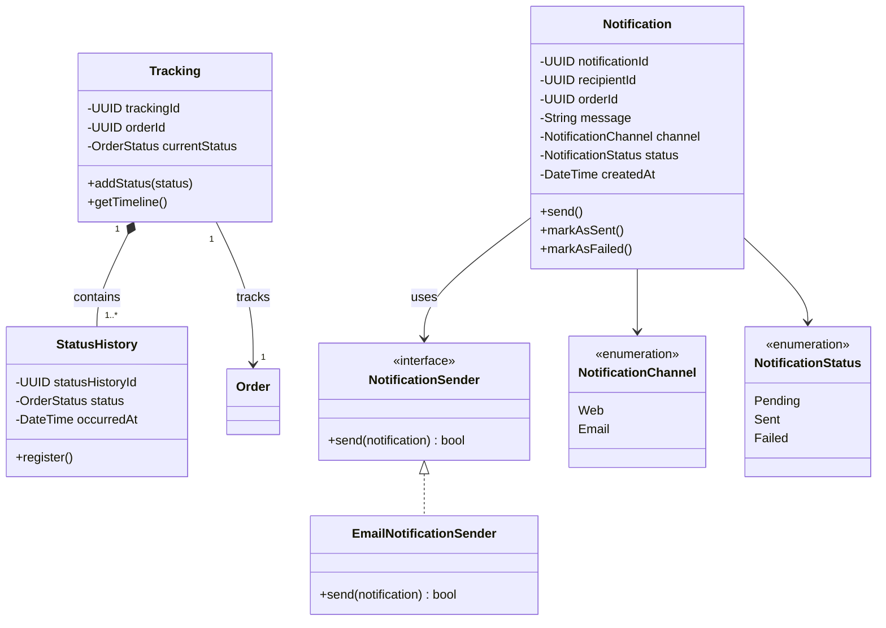
```mermaid
classDiagram
    class Tracking {
        -UUID trackingId
        -UUID orderId
        -OrderStatus currentStatus
        +addStatus(status)
        +getTimeline()
    }

    class StatusHistory {
        -UUID statusHistoryId
        -OrderStatus status
        -DateTime occurredAt
        +register()
    }

    class Notification {
        -UUID notificationId
        -UUID recipientId
        -UUID orderId
        -String message
        -NotificationChannel channel
        -NotificationStatus status
        -DateTime createdAt
        +send()
        +markAsSent()
        +markAsFailed()
    }

    class NotificationSender {
        <<interface>>
        +send(notification) bool
    }

    class EmailNotificationSender {
        +send(notification) bool
    }

    class NotificationChannel {
        <<enumeration>>
        Web
        Email
    }

    class NotificationStatus {
        <<enumeration>>
        Pending
        Sent
        Failed
    }

    Tracking "1" *-- "1..*" StatusHistory : contains
    Tracking "1" --> "1" Order : tracks
    Notification --> NotificationSender : uses
    NotificationSender <|.. EmailNotificationSender
    Notification --> NotificationChannel
    Notification --> NotificationStatus
```

### 4.8. Database Design
WashTrack requiere persistir información de clientes, lavanderías, órdenes, prendas, procesos operativos, membresías, pagos, seguimiento y notificaciones.

Se propone una base de datos relacional para organizar las relaciones entre las entidades principales.

#### 4.8.1. Database Diagrams

```mermaid
erDiagram
    USERS {
        uuid id PK
        varchar email
        varchar password_hash
        varchar role
        timestamp created_at
    }

    CUSTOMERS {
        uuid id PK
        uuid user_id FK
        varchar full_name
        varchar phone
    }

    LAUNDRIES {
        uuid id PK
        varchar business_name
        varchar address
        varchar phone
    }

    ORDERS {
        uuid id PK
        uuid customer_id FK
        uuid laundry_id FK
        varchar status
        varchar delivery_method
        text special_care_instructions
        timestamp created_at
    }

    GARMENT_ITEMS {
        uuid id PK
        uuid order_id FK
        varchar type
        int quantity
        text care_instructions
    }

    LAUNDRY_ORDERS {
        uuid id PK
        uuid order_id FK
        varchar current_stage
        varchar priority
        uuid washing_cycle_id FK
        uuid resource_id FK
        timestamp expected_completion
    }

    WASHING_CYCLES {
        uuid id PK
        varchar name
        int duration_minutes
        varchar compatible_type
    }

    LAUNDRY_RESOURCES {
        uuid id PK
        uuid laundry_id FK
        varchar name
        varchar status
        int capacity
    }

    SUBSCRIPTION_PLANS {
        uuid id PK
        varchar name
        decimal price
        int credits
        int duration_days
    }

    SUBSCRIPTIONS {
        uuid id PK
        uuid customer_id FK
        uuid plan_id FK
        date start_date
        date expiration_date
        varchar status
        int credits
    }

    PAYMENTS {
        uuid id PK
        uuid customer_id FK
        uuid order_id FK
        decimal amount
        varchar status
        varchar transaction_id
        timestamp processed_at
    }

    TRACKING {
        uuid id PK
        uuid order_id FK
        varchar current_status
    }

    STATUS_HISTORY {
        uuid id PK
        uuid tracking_id FK
        varchar status
        timestamp occurred_at
    }

    NOTIFICATIONS {
        uuid id PK
        uuid recipient_id FK
        uuid order_id FK
        varchar channel
        text message
        varchar status
        timestamp created_at
    }

    USERS ||--o| CUSTOMERS : has
    CUSTOMERS ||--o{ ORDERS : places
    LAUNDRIES ||--o{ ORDERS : processes
    ORDERS ||--|{ GARMENT_ITEMS : contains
    ORDERS ||--o| LAUNDRY_ORDERS : has
    WASHING_CYCLES ||--o{ LAUNDRY_ORDERS : used_by
    LAUNDRIES ||--o{ LAUNDRY_RESOURCES : owns
    LAUNDRY_RESOURCES ||--o{ LAUNDRY_ORDERS : assigned_to
    CUSTOMERS ||--o{ SUBSCRIPTIONS : owns
    SUBSCRIPTION_PLANS ||--o{ SUBSCRIPTIONS : defines
    CUSTOMERS ||--o{ PAYMENTS : makes
    ORDERS ||--o{ PAYMENTS : has
    ORDERS ||--o| TRACKING : has
    TRACKING ||--o{ STATUS_HISTORY : contains
    USERS ||--o{ NOTIFICATIONS : receives
    ORDERS ||--o{ NOTIFICATIONS : generates
```

### Relación entre Bounded Contexts y tablas

| Bounded Context | Tablas principales |
|---|---|
| Identity & Access | `users` |
| Customer & Business Management | `customers`, `laundries` |
| Order Management | `orders`, `garment_items` |
| Laundry Operations | `laundry_orders`, `washing_cycles`, `laundry_resources` |
| Subscription & Payment | `subscription_plans`, `subscriptions`, `payments` |
| Tracking & Notifications | `tracking`, `status_history`, `notifications` |

## Capítulo V: Product Implementation, Validation & Deployment

### 5.1. Software Configuration Management

#### 5.1.1. Software Development Environment Configuration
#### 5.1.2. Source Code Management
#### 5.1.3. Source Code Style Guide & Conventions
#### 5.1.4. Software Deployment Configuration

### 5.2. Landing Page, Services & Applications Implementation

#### 5.2.1. Sprint 1

##### 5.2.1.1. Sprint Planning 1
##### 5.2.1.2. Aspect Leaders and Collaborators
##### 5.2.1.3. Sprint Backlog 1
##### 5.2.1.4. Development Evidence for Sprint Review
##### 5.2.1.5. Execution Evidence for Sprint Review
##### 5.2.1.6. Services Documentation Evidence for Sprint Review
##### 5.2.1.7. Software Deployment Evidence for Sprint Review
##### 5.2.1.8. Team Collaboration Insights during Sprint

### 5.3. Validation Interviews

#### 5.3.1. Diseño de Entrevistas
#### 5.3.2. Registro de Entrevistas
#### 5.3.3. Evaluaciones según heurísticas

### 5.4. Video About-the-Product

---

# Bibliografía

---

# Anexos

---
