

## **Universidad Peruana de Ciencias Aplicadas**
### **Carrera de Ingeniería de Software**
 

**Curso: Aplicaciones Web**

**NRC: 16129**

**Docente: Alberto Wilmer Sanchez Seña**

### **Informe del Trabajo Final**

**Nombre de la Startup:** DevTech

**Nombre del producto:** WashTrack

### **Integrantes**

<table align="center" style="border-collapse: collapse; border: none; margin-left: auto; margin-right: auto;">
    <tr>
        <th style="border: none; padding: 0 18px 6px 0; text-align: center;">Código</th>
        <th style="border: none; padding: 0 0 6px 0; text-align: center;">Apellidos y Nombres</th>
    </tr>
    <tr>
        <td style="border: none; padding: 0 18px 4px 0; text-align: center;">U20241D338</td>
        <td style="border: none; padding: 0 0 4px 0; text-align: center;">Pérez Vásquez, Ariana Valeria</td>
    </tr>
    <tr>
        <td style="border: none; padding: 0 18px 4px 0; text-align: center;">U202416053</td>
        <td style="border: none; padding: 0 0 4px 0; text-align: center;">Ramirez Gutierrez, Gabriel</td>
    </tr>
    <tr>
        <td style="border: none; padding: 0 18px 4px 0; text-align: center;">U202018427</td>
        <td style="border: none; padding: 0 0 4px 0; text-align: center;">Ramos Fuentes Rivera, Adriana Nicole</td>
    </tr>
    <tr>
        <td style="border: none; padding: 0 18px 4px 0; text-align: center;">U202422642</td>
        <td style="border: none; padding: 0 0 4px 0; text-align: center;">Sayago Vidal, Sebastián Leonardo</td>
    </tr>
    <tr>
        <td style="border: none; padding: 0 18px 0 0; text-align: center;">U202216240</td>
        <td style="border: none; padding: 0; text-align: center;">Tufiño Argüelles, Luis Angel</td>
    </tr>
</table>

*Setiembre, 2026*

---

# Registro de Versiones del Informe

| Versión | Fecha      | Autor                         | Descripcion                                              |
| :--- |:-----------|:------------------------------|:---------------------------------------------------------|
| 1.0.0 | 28/08/2026 | Gabriel Ramirez y Luis Tufiño | Creó el repositorio junto a los branch de cada capítulo. |
| 1.1.0 | 02/09/2026 | Adriana Ramos | Agregó el Capítulo I |
| 1.1.0 | 04/09/2026 | Ariana Perez | Agregó su parte en student Outcome y desarrollo avance del capítulo IV junto a la Landing Page |
---

## Project Report Collaboration Insights

// Enlaces  de repositorios

*Reporte de colaboración de la entrega del TP:*

// Falta Imagen 

---

# Contenido

## Tabla de Contenidos

- [Registro de Versiones del Informe](#registro-de-versiones-del-informe)
- [Project Report Collaboration Insights](#project-report-collaboration-insights)
- [Contenido](#contenido)
  - [Tabla de Contenidos](#tabla-de-contenidos)
- [Student Outcome](#student-outcome)
- [Capítulo I: Introducción](#capítulo-i-introducción)
  - [1.1. Startup Profile](#11-startup-profile)
    - [1.1.1. Descripción de la Startup](#111-descripción-de-la-startup)
    - [1.1.2. Perfiles de integrantes del equipo](#112-perfiles-de-integrantes-del-equipo)
  - [1.2. Solution Profile](#12-solution-profile)
    - [1.2.1. Antecedentes y problemática](#121-antecedentes-y-problemática)
    - [1.2.2. Lean UX Process](#122-lean-ux-process)
      - [1.2.2.1. Lean UX Problem Statements](#1221-lean-ux-problem-statements)
      - [1.2.2.2. Lean UX Assumptions](#1222-lean-ux-assumptions)
      - [1.2.2.3. Lean UX Hypothesis Statements](#1223-lean-ux-hypothesis-statements)
      - [1.2.2.4. Lean UX Canvas](#1224-lean-ux-canvas)
  - [1.3. Segmentos objetivo](#13-segmentos-objetivo)
- [Capítulo II: Requirements Elicitation \& Analysis](#capítulo-ii-requirements-elicitation--analysis)
  - [2.1. Competidores](#21-competidores)
    - [2.1.1. Análisis competitivo](#211-análisis-competitivo)
    - [2.1.2. Estrategias y tácticas frente a competidores](#212-estrategias-y-tácticas-frente-a-competidores)
  - [2.2. Entrevistas](#22-entrevistas)
    - [2.2.1. Diseño de entrevistas](#221-diseño-de-entrevistas)
    - [2.2.2. Registro de entrevistas](#222-registro-de-entrevistas)
    - [2.2.3. Análisis de entrevistas](#223-análisis-de-entrevistas)
  - [2.3. Needfinding](#23-needfinding)
    - [2.3.1. User Personas](#231-user-personas)
    - [2.3.2. User Task Matrix](#232-user-task-matrix)
    - [2.3.3. User Journey Mapping](#233-user-journey-mapping)
    - [2.3.4. Empathy Mapping](#234-empathy-mapping)
  - [2.4. Big Picture Event Storming](#24-big-picture-event-storming)
  - [2.5. Ubiquitous Language](#25-ubiquitous-language)
- [Capítulo III: Requirements Specification](#capítulo-iii-requirements-specification)
  - [3.1. User Stories](#31-user-stories)
  - [3.2. Impact Mapping](#32-impact-mapping)
  - [3.3. Product Backlog](#33-product-backlog)
- [Capítulo IV: Product Design](#capítulo-iv-product-design)
  - [4.1. Style Guidelines](#41-style-guidelines)
    - [4.1.1. General Style Guidelines](#411-general-style-guidelines)
    - [4.1.2. Web Style Guidelines](#412-web-style-guidelines)
  - [4.2. Information Architecture](#42-information-architecture)
    - [4.2.1. Organization Systems](#421-organization-systems)
    - [4.2.2. Labeling Systems](#422-labeling-systems)
    - [4.2.3. SEO Tags and Meta Tags](#423-seo-tags-and-meta-tags)
    - [4.2.4. Searching Systems](#424-searching-systems)
    - [4.2.5. Navigation Systems](#425-navigation-systems)
  - [4.3. Landing Page UI Design](#43-landing-page-ui-design)
    - [4.3.1. Landing Page Wireframe](#431-landing-page-wireframe)
    - [4.3.2. Landing Page Mock-up](#432-landing-page-mock-up)
  - [4.4. Web Applications UX/UI Design](#44-web-applications-uxui-design)
    - [4.4.1. Web Applications Wireframes](#441-web-applications-wireframes)
    - [4.4.2. Web Applications Wireflow Diagrams](#442-web-applications-wireflow-diagrams)
    - [4.4.3. Web Applications Mock-ups](#443-web-applications-mock-ups)
    - [4.4.4. Web Applications User Flow Diagrams](#444-web-applications-user-flow-diagrams)
  - [4.5. Web Applications Prototyping](#45-web-applications-prototyping)
  - [4.6. Domain-Driven Software Architecture](#46-domain-driven-software-architecture)
    - [4.6.1. Design-Level EventStorming](#461-design-level-eventstorming)
    - [4.6.2. Software Architecture Context Diagram](#462-software-architecture-context-diagram)
    - [4.6.3. Software Architecture Container Diagrams](#463-software-architecture-container-diagrams)
    - [4.6.4. Software Architecture Components Diagrams](#464-software-architecture-components-diagrams)
  - [4.7. Software Object-Oriented Design](#47-software-object-oriented-design)
    - [4.7.1. Class Diagrams](#471-class-diagrams)
  - [4.8. Database Design](#48-database-design)
    - [4.8.1. Database Diagrams](#481-database-diagrams)

- [Capítulo V: Product Implementation, Validation & Deployment](#capítulo-v-product-implementation-validation--deployment)
  - [5.1. Software Configuration Management](#51-software-configuration-management)
    - [5.1.1. Software Development Environment Configuration](#511-software-development-environment-configuration)
    - [5.1.2. Source Code Management](#512-source-code-management)
    - [5.1.3. Source Code Style Guide & Conventions](#513-source-code-style-guide--conventions)
    - [5.1.4. Software Deployment Configuration](#514-software-deployment-configuration)
  - [5.2. Landing Page, Services & Applications Implementation](#52-landing-page-services--applications-implementation)
    - [5.2.1. Sprint 1](#521-sprint-1)
      - [5.2.1.1. Sprint Planning 1](#5211-sprint-planning-1)
      - [5.2.1.2. Aspect Leaders and Collaborators](#5212-aspect-leaders-and-collaborators)
      - [5.2.1.3. Sprint Backlog 1](#5213-sprint-backlog-1)
      - [5.2.1.4. Development Evidence for Sprint Review](#5214-development-evidence-for-sprint-review)
      - [5.2.1.5. Execution Evidence for Sprint Review](#5215-execution-evidence-for-sprint-review)
      - [5.2.1.6. Services Documentation Evidence for Sprint Review](#5216-services-documentation-evidence-for-sprint-review)
      - [5.2.1.7. Software Deployment Evidence for Sprint Review](#5217-software-deployment-evidence-for-sprint-review)
      - [5.2.1.8. Team Collaboration Insights during Sprint](#5218-team-collaboration-insights-during-sprint)
  - [5.3. Validation Interviews](#53-validation-interviews)
    - [5.3.1. Diseño de Entrevistas](#531-diseño-de-entrevistas)
    - [5.3.2. Registro de Entrevistas](#532-registro-de-entrevistas)
    - [5.3.3. Evaluaciones según heurísticas](#533-evaluaciones-según-heurísticas)
  - [5.4. Video About-the-Product](#54-video-about-the-product)

- [Bibliografía](#bibliografía)

- [Anexos](#anexos)

---

# Student Outcome
El curso contribuye al cumplimiento del Student Outcome ABET:
**ABET – EAC - Student Outcome 5**

<b>Criterio: La capacidad de funcionar efectivamente en un equipo cuyos miembros juntos proporcionan liderazgo, crean un entorno de colaboración e inclusivo, establecen objetivos, planifican tareas y cumplen objetivos.</b>

En el siguiente cuadro se describe las acciones realizadas y enunciados de conclusiones por parte del grupo, que permiten sustentar el haber alcanzado el logro del ABET – EAC - Student Outcome 5.

<table>
  <thead>
    <tr>
      <th>Criterio específico</th>
      <th>Acciones realizadas</th>
      <th>Conclusiones</th>
    </tr>
  </thead>
  <tbody>
    <tr>
      <td><strong>Trabaja en equipo para proporcionar liderazgo en forma conjunta</strong></td>
      <td>
        <b>Pérez Vásquez, Ariana Valeria</b> 
        <em><b>AV1</b></em> 
        Elaboré el Capítulo IV del proyecto WashTrack, desarrollando las Style Guidelines, donde se establecieron los lineamientos generales y web para mantener una interfaz consistente, clara, accesible y fácil de utilizar. 
        <em><b>AV2</b></em> 
        Desarrollé la Information Architecture, la Landing Page UI, elaborando el wireframe y mock-up de la página principal de WashTrack, considerando la distribución de los elementos, jerarquía visual, navegación y presentación de la propuesta de valor del producto. 
        ... 
        <b>Ramirez Gutierrez, Gabriel</b> 
        <em><b>AV1</b></em> 
        Poner avances av1 
        <em><b>AV2</b></em> 
        Poner avances av2 
        ... 
        <b>Ramos Fuentes Rivera, Adriana Nicole</b> 
        <em><b>AV1</b></em> 
        Poner avances av1 
        <em><b>AV2</b></em> 
        Poner avances av2 
        ... 
        <b>Sayago Vidal, Sebastián Leonardo</b> 
        <em><b>AV1</b></em> 
        Poner avances av1 
        <em><b>AV2</b></em> 
        Poner avances av2 
        ... 
        <b>Tufiño Argüelles, Luis Angel</b> 
        <em><b>AV1</b></em> 
        Poner avances av1 
        <em><b>AV2</b></em> 
        Poner avances av2 
        ... 
      </td>
      <td>
        Fusce cursus dolor et nulla suscipit, sit amet ullamcorper nibh vestibulum. 
        Nam ornare massa eu lobortis porttitor. 
        Nam ut erat feugiat libero pretium semper at ac metus. 
        Sed at eros dapibus, fermentum quam ut, bibendum lacus. 
        Curabitur eget orci eget urna varius commodo. 
        ...
      </td>
    </tr>
    <tr>
      <td><strong>Crea un entorno colaborativo e inclusivo, establece metas, planifica tareas y cumple objetivos.</strong></td>
      <td>
        <b>Pérez Vásquez, Ariana Valeria</b> 
        <em><b>AV1</b></em> 
        Participé en la planificación y organización de las actividades del equipo, coordinando las tareas asignadas para el desarrollo del proyecto WashTrack y contribuyendo al cumplimiento de los objetivos establecidos para el avance 
        <em><b>AV2</b></em> 
        Desarrollé las secciones asignadas del Capítulo IV, relacionadas con Style Guidelines, Information Architecture y Landing Page UI Design, coordinando con los integrantes del equipo para mantener la coherencia del proyecto y cumplir con las actividades planificadas 
        ... 
        <b>Ramirez Gutierrez, Gabriel</b> 
        <em><b>AV1</b></em> 
        Poner avances av1 
        <em><b>AV2</b></em> 
        Poner avances av2 
        ... 
        <b>Ramos Fuentes Rivera, Adriana Nicole</b> 
        <em><b>AV1</b></em> 
        Poner avances av1 
        <em><b>AV2</b></em> 
        Poner avances av2 
        ... 
        <b>Sayago Vidal, Sebastián Leonardo</b> 
        <em><b>AV1</b></em> 
        Poner avances av1 
        <em><b>AV2</b></em> 
        Poner avances av2 
        ... 
        <b>Tufiño Argüelles, Luis Angel</b> 
        <em><b>AV1</b></em> 
        Poner avances av1 
        <em><b>AV2</b></em> 
        Poner avances av2 
        ... 
      </td>
      <td>
        Fusce mattis augue a nisl bibendum, quis fringilla neque scelerisque. 
        Vivamus commodo libero eget venenatis imperdiet. 
        Etiam imperdiet quam condimentum velit tempor porttitor. 
        Suspendisse blandit nisl quis mauris vehicula faucibus. 
        ...
      </td>
    </tr>
  </tbody>
</table>

---

## Capítulo I: Introducción

### 1.1. Startup Profile

#### 1.1.1. Descripción de la Startup

    Somos DevTech, una startup tecnológica creada por estudiantes de la Universidad Peruana de Ciencias Aplicadas, enfocada en el desarrollo de soluciones digitales innovadoras para optimizar y transformar la gestión de negocios tradicionales mediante el uso de software. Nuestra startup busca facilitar la digitalización de procesos que actualmente se realizan de manera manual, permitiendo a los negocios mejorar su organización, reducir errores, optimizar sus tiempos de atención y ofrecer una mejor experiencia a sus clientes.

    Nuestro producto principal es WashTrack, una plataforma digital orientada a la gestión integral de lavanderías, esta solución permitirá a los negocios y sus clientes, registrar y administrar clientes, gestionar pedidos y prendas, realizar el seguimiento del estado de cada pedido y mantener un historial de las operaciones realizadas.

    La misión de DevTech es desarrollar soluciones tecnológicas accesibles, intuitivas y eficientes que permitan a los negocios tradicionales digitalizar sus procesos, optimizar su gestión y mejorar la experiencia de sus clientes.

    Nuestra visión es consolidarnos como una startup innovadora en el desarrollo de soluciones digitales para pequeñas y medianas empresas en Latinoamérica, contribuyendo a su transformación digital mediante plataformas que simplifiquen sus operaciones y generen valor tanto para los negocios como para sus clientes.

    Nuestros valores son:
    <ul>
        <li>Innovación: Desarrollar soluciones tecnológicas que respondan a las necesidades actuales de los negocios y sus clientes.</li>
        <li>Compromiso: Crear herramientas enfocadas en resolver problemas reales y generar valor para nuestros usuarios.</li>
        <li>Accesibilidad: Diseñar soluciones fáciles de utilizar y accesibles para pequeñas y medianas empresas.</li>
        <li>Transparencia: Facilitar información clara y actualizada sobre los procesos y pedidos de los clientes.</li>
    </ul>

#### 1.1.2. Perfiles de integrantes del equipo

### 1.2. Solution Profile

    WashTrack es una plataforma digital desarrollada por la startup DevTech, orientada a optimizar la gestión de lavanderías y mejorar la experiencia de sus clientes mediante herramientas tecnológicas accesibles y eficientes. La plataforma busca centralizar en un solo sistema los principales procesos relacionados con la recepción, gestión y seguimiento de los pedidos de lavandería. 

    Para las lavanderías, WashTrack permite registrar y gestionar clientes, crear pedidos, registrar las prendas y servicios solicitados, actualizar el estado de cada pedido y consultar el historial de operaciones, reemplazando procesos manuales como el registro de información en cuadernos, hojas de cálculo o mensajes dispersos y facilitando el control de los pedidos, mientras que, para los clientes, ofrece un espacio digital donde pueden consultar sus pedidos, visualizar el estado de sus prendas, revisar el historial de servicios, realizar pagos digitales y solicitar servicios de recojo y entrega a domicilio, brindándoles mayor visibilidad, comodidad y facilidad para gestionar sus servicios de lavandería sin necesidad de comunicarse constantemente con el negocio.

    Además, como valor diferencial, WashTrack integra la gestión operativa de la lavandería con el seguimiento del pedido por parte del cliente, permitiendo mantener la información sincronizada durante las diferentes etapas del servicio. Esto busca mejorar la transparencia del proceso, reducir la incertidumbre del cliente y facilitar la organización de las lavanderías.

    WashTrack se plantea como una solución escalable, que puede incorporar progresivamente nuevas funcionalidades de acuerdo con las necesidades de las lavanderías y sus clientes, como pagos digitales, servicios de recojo y entrega a domicilio, promociones, programas de fidelización y herramientas avanzadas de análisis.

#### 1.2.1. Antecedentes y problemática

**1.2.1.1. What**

    Nuestra propuesta de solución, Easy Wash, se propone resolver las siguientes 3 problemáticas recurrentes en la vida personal, específicamente, cuando se desempeña el trabajo doméstico:
    <ul>
        <li>Uno de los principales problemas a los que se enfrentan las personas independientes que consumen el servicio de lavandería es la limitada disponibilidad de tiempo para realizar tareas domésticas, ya que resulta difícil equilibrar la vida laboral con las responsabilidades domésticas y las actividades personales. Según la Encuesta Nacional de Uso del Tiempo (ENUT) correspondiente al año 2024 realizada por el INEI, la población peruana dedica una cantidad significativa de tiempo al trabajo doméstico no remunerado, donde en un día de semana, las mujeres destinan en promedio 3 horas y 35 minutos y los hombres 1 hora y 37 minutos a estas actividades, además, dentro ellas se encuentra la limpieza y cuidado de la ropa, que demanda en promedio 1 hora y 22 minutos diarios para las mujeres y 58 minutos para los hombres. Por consiguiente, destinar este tiempo diario a las actividades de limpieza y cuidado de la ropa, reduce el tiempo disponible para otras actividades personales, como el descanso, ejercicio, etc. por lo que resulta ideal contratar un servicio externo que realice estas actividades.</li> 
        <li>El segundo problema es la falta de recursos para el lavado de ropa dentro de los hogares. Según el informe técnico de Condiciones de Vida en el Perú con los resultados de la Encuesta Nacional de Hogares (ENAHO) correspondiente al primer trimestre del año 2026, indica que el 90,5% de los hogares tiene cocina a gas, 57,0% cuenta con refrigeradora/congeladora, 36,4% cuenta con computadora/laptop y 32,2% tiene lavadora de ropa. Asimismo, al comparar los resultados de los primeros trimestres de los años 2023, 2024 y 2025, se observa que la proporción de hogares que cuenta con una lavadora se ha mantenido relativamente estable, pasando de 33,2 % en 2023 a 34,2 % en 2024 y disminuyendo a 32,0 % en 2025, para posteriormente alcanzar el 32,2 % en 2026. Esto evidencia que una cantidad significativa de hogares peruanos no cuentan con una lavadora de ropa, en consecuencia, representa una gran limitación para realizar esta actividad de manera eficiente dentro del hogar.</li> 
        <li>Por último, las lavanderías y sus clientes pueden enfrentar dificultades relacionadas con la gestión, seguimiento y entrega de los pedidos, debido al uso de métodos tradicionales como cuadernos, mensajes de texto, recibos informales u otros registros que dificultan el acceso a la información de manera rápida, precisa y confiable. Esta falta de centralización puede generar errores durante las diferentes etapas del servicio. Asimismo, cuando no existe un sistema que permita actualizar y consultar el estado de los pedidos, los clientes deben comunicarse directamente con la lavandería para conocer el avance de sus prendas, generando una mayor carga de trabajo para el negocio y una experiencia menos eficiente para el usuario. Por lo tanto, es necesario contar con una plataforma digital que permita centralizar la información y los principales procesos de la lavandería, permitiendo que esta información sea consultada y actualizada de manera rápida, precisa y confiable.</li>
    </ul>

**1.2.1.2. Where**

    El problema se presenta principalmente en el sector de servicios de lavandería en el Perú, especialmente en lavanderías independientes, pequeñas y medianas que gestionan diariamente múltiples clientes y pedidos. Estas dificultades pueden presentarse tanto dentro del establecimiento físico, durante la recepción, clasificación, procesamiento y entrega de las prendas, como fuera de este, en la interacción entre la lavandería y sus clientes. Asimismo, desde la perspectiva del cliente, la necesidad se presenta en los hogares y en las actividades cotidianas de las personas que cuentan con poco tiempo para realizar tareas domésticas o que no disponen de una lavadora, por lo que requieren acceder a servicios de lavandería de manera más cómoda y eficiente. Por ello, la solución se orienta inicialmente al mercado peruano, conectando digitalmente a las lavanderías con sus clientes y facilitando tanto la gestión interna del negocio como el acceso y seguimiento de los servicios.

**1.2.1.3. When**

    Las problemáticas aparecen durante las diferentes etapas del servicio, por ejemplo, cuando se registra un pedido, durante el procesamiento de las prendas, al consultar su estado, al realizar el pago y al momento de coordinar la entrega. Estas dificultades pueden incrementarse conforme aumenta el número de clientes y pedidos que debe administrar una lavandería.

**1.2.1.4. Who**

    Las principales personas afectadas son, los propietarios y trabajadores de lavanderías, especialmente aquellos negocios que todavía gestionan clientes, pedidos y pagos mediante registros manuales o herramientas poco integradas, por otro lado, los clientes de las lavanderías, quienes necesitan conocer el estado de sus pedidos y acceder a servicios más cómodos y ágiles.

**1.2.1.5. Why**

    La problemática se presenta porque el lavado y cuidado de la ropa es una actividad doméstica recurrente que requiere tiempo y esfuerzo, lo que puede representar una dificultad para las personas que deben distribuir su tiempo entre responsabilidades laborales, académicas, familiares y personales, especialmente en los hogares que no cuentan con una lavadora y necesitan recurrir a servicios externos. Asimismo, las lavanderías deben gestionar diariamente información sobre clientes, pedidos, prendas, servicios, pagos y fechas de entrega, pero cuando estos procesos se realizan mediante cuadernos, mensajes, recibos u otras herramientas no integradas, aumenta la posibilidad de pérdida de información, confusiones y errores en la atención y entrega de los pedidos. En consecuencia, surge la necesidad de una solución que facilite tanto el acceso de los clientes al servicio como la organización de las lavanderías, mediante una plataforma digital que permita centralizar y gestionar los principales procesos del servicio de lavandería, haciendo que la información sea más accesible, ordenada y confiable para ambas partes.

**1.2.1.6. How**

    La problemática será abordada mediante el desarrollo de una plataforma digital que centralice y conecte los principales procesos de una lavandería con las necesidades de sus clientes. Por un lado, permitirá al personal de la lavandería registrar y administrar la información de los clientes, crear y gestionar pedidos, registrar las prendas y servicios solicitados, actualizar el estado de cada pedido y consultar el historial de operaciones desde un único sistema. Por otro lado, los clientes podrán acceder a la información de sus pedidos, consultar el estado de sus prendas, revisar su historial de servicios, realizar pagos digitales y solicitar servicios de recojo y entrega a domicilio. De esta manera, la plataforma permitirá mantener la información actualizada entre ambas partes, reducir la dependencia de registros manuales y canales de comunicación dispersos, disminuir posibles errores en la gestión y entrega de los pedidos, y facilitar el acceso a los servicios de lavandería sin que el cliente tenga que realizar todas las gestiones de manera presencial.

**1.2.1.6. How much**

    La solución adoptará un modelo de suscripción mensual dirigido principalmente a las lavanderías, permitiendo que los negocios seleccionen el plan que mejor se adapte a su tamaño, cantidad de pedidos y necesidades de gestión. Se plantean inicialmente tres alternativas, un plan gratuito, orientado a lavanderías que deseen comenzar a digitalizar sus operaciones y conocer la plataforma, un plan básico de S/ 49 mensuales, dirigido a pequeños negocios que requieren mayores capacidades de gestión y seguimiento, y un plan avanzado de S/ 99 mensuales, orientado a lavanderías con un mayor volumen de operaciones y que necesitan acceder a funcionalidades más completas. Además, el acceso de los clientes de las lavanderías no tendría un costo adicional, ya que su participación forma parte del servicio contratado por el negocio. Por lo tanto, esta estructura permitirá establecer una estrategia de monetización escalonada, facilitando la captación de nuevos usuarios mediante el plan gratuito y generando ingresos recurrentes a través de los planes de pago.

**1.2.2. Lean UX Process**

**1.2.2.1. Lean UX Problem Statements**

**Problem statement 1:**

    Nuestro producto fue diseñado para optimizar la gestión operativa de pequeñas y medianas lavanderías, brindándoles una herramienta digital que les permita centralizar la información de sus clientes, pedidos, prendas y servicios, con el propósito de reducir el tiempo destinado a tareas administrativas y disminuir errores durante la gestión de las órdenes.

    Hemos observado que las lavanderías pueden presentar dificultades para organizar y realizar el seguimiento de sus pedidos debido al uso de cuadernos, recibos, hojas de cálculo, mensajes de texto y otros medios no integrados, lo que dificulta mantener la información actualizada y acceder a ella de manera rápida y confiable.

    Esto puede generar confusiones en el registro de pedidos, pérdida de información, errores en las fechas de entrega, dificultades para identificar las prendas y entregas incorrectas, afectando tanto la eficiencia operativa del negocio como la satisfacción de sus clientes.

    Por tanto, nos preguntamos: ¿Cómo podríamos centralizar y simplificar la gestión de pedidos y prendas de las lavanderías para reducir los errores operativos y mejorar el control de sus servicios, medido a través de la reducción de incidencias y del tiempo destinado a la gestión de los pedidos?

**Problem statement 2:**

    Nuestro producto fue diseñado para facilitar el acceso a los servicios de lavandería a personas que disponen de poco tiempo para realizar tareas domésticas o que no cuentan con una lavadora en sus hogares, permitiéndoles gestionar sus servicios de manera más cómoda y reducir el tiempo y esfuerzo asociados al lavado de sus prendas.

    Hemos observado que las personas deben distribuir su tiempo entre actividades laborales, académicas, familiares y personales, mientras que el lavado y cuidado de la ropa continúa siendo una tarea doméstica recurrente. Asimismo, no todos los hogares cuentan con los recursos necesarios para realizar esta actividad de manera independiente, por lo que deben recurrir a lavanderías y trasladarse hasta estos establecimientos para solicitar y recoger sus servicios.

    Esto genera mayor inversión de tiempo y esfuerzo por parte de los clientes, además de dificultades para conocer el estado de sus prendas, coordinar el recojo y entrega de sus pedidos y realizar otras gestiones relacionadas con el servicio.

    Por tanto, nos preguntamos: ¿Cómo podríamos facilitar el acceso y la gestión de los servicios de lavandería para que los clientes reduzcan el tiempo y esfuerzo destinado a estas actividades, medido a través del uso de servicios digitales y de recojo y entrega a domicilio?

**Problem statement 3:**

    Nuestro producto fue diseñado para mejorar la comunicación y el seguimiento entre las lavanderías y sus clientes, proporcionando un espacio digital donde ambas partes puedan acceder a información actualizada sobre los pedidos durante las diferentes etapas del servicio.

    Hemos observado que los clientes pueden depender de llamadas, mensajes de texto o consultas presenciales para conocer el estado de sus prendas, mientras que las lavanderías deben responder individualmente a estas solicitudes y mantener actualizada la información mediante diferentes canales.

    Esto genera incertidumbre para los clientes, mayor carga de atención para las lavanderías y posibles inconsistencias en la información proporcionada, especialmente cuando existen múltiples pedidos en proceso y diferentes fechas de entrega.

    Por tanto, nos preguntamos: ¿Cómo podríamos mejorar la comunicación y el seguimiento de los pedidos entre las lavanderías y sus clientes para brindar información más oportuna y confiable, medido a través de la reducción de consultas sobre el estado de los pedidos y el incremento en la satisfacción de los usuarios?

**1.2.2.2. Lean UX Assumptions**

**1.2.2.2.1. ¿Quién es el usuario?**

    Los usuarios de la solución se dividen principalmente en dos grupos. El primero está conformado por los propietarios, administradores y trabajadores de pequeñas y medianas lavanderías, quienes necesitan gestionar clientes, pedidos, prendas, servicios, pagos y entregas de manera organizada. El segundo grupo corresponde a los clientes de las lavanderías, especialmente personas que cuentan con una disponibilidad limitada de tiempo para realizar tareas domésticas o que no disponen de una lavadora en sus hogares, y que buscan una alternativa más cómoda para solicitar, pagar y realizar el seguimiento de sus servicios de lavandería.

**1.2.2.2.2. ¿Dónde encaja nuestro producto en su trabajo o vida?**

    La solución se integra en el proceso cotidiano de gestión y prestación del servicio de lavandería. Para las lavanderías, funcionará como una herramienta central para registrar clientes y pedidos, administrar las prendas, actualizar el estado de las órdenes y consultar el historial de operaciones, reduciendo la dependencia de cuadernos, recibos, hojas de cálculo y mensajes dispersos. Para los clientes, se integrará en las actividades relacionadas con la solicitud y seguimiento del servicio, permitiéndoles consultar sus pedidos, conocer el estado de sus prendas, realizar pagos digitales y coordinar servicios de recojo y entrega a domicilio sin necesidad de realizar todas las gestiones presencialmente.

**1.2.2.2.3. ¿Qué problemas tiene nuestro producto y cómo se pueden resolver?**

    <ul>
        <li>Resistencia a la adopción de herramientas digitales: Algunas lavanderías pueden estar acostumbradas a gestionar sus operaciones mediante métodos tradicionales y presentar dificultades para adaptarse a un nuevo sistema.  Solución: Desarrollar una interfaz sencilla e intuitiva, acompañada de un proceso de incorporación que permita al personal aprender las funciones principales rápidamente.</li> 
        <li>Limitaciones económicas de las pequeñas lavanderías: Algunos negocios pueden considerar que implementar una nueva herramienta representa un gasto adicional.  Solución: Establecer un modelo de suscripción escalonado, con un plan gratuito y planes de pago con funcionalidades adicionales, permitiendo que cada negocio seleccione la alternativa de acuerdo con sus necesidades.</li> 
        <li>Información desactualizada o incorrecta: Si los estados de los pedidos no se actualizan oportunamente, los clientes podrían recibir información incorrecta sobre sus prendas.  Solución: Permitir que el personal actualice el estado de cada pedido desde la plataforma y que dicha información se refleje para el cliente.</li> 
        <li>Dependencia de la conectividad: Algunas operaciones podrían verse afectadas ante problemas de conexión a internet.  Solución: Evaluar mecanismos de almacenamiento temporal y sincronización de información para garantizar la continuidad de las operaciones esenciales.</li>
    </ul>

**1.2.2.2.4. ¿Cuándo y cómo es usado nuestro producto?**

    WashTrack será utilizada durante las diferentes etapas del servicio de lavandería, donde el personal podrá utilizarla al recibir un pedido para registrar los datos del cliente, las prendas y los servicios solicitados, durante el procesamiento para actualizar el estado de la orden, y al finalizar para verificar la información y gestionar su entrega. Por otro lado, los clientes podrán utilizarla cuando necesiten solicitar un servicio, consultar el estado de sus prendas, revisar pedidos anteriores, realizar un pago o coordinar el recojo y la entrega. En resumen, se espera que la plataforma tenga un uso recurrente, tanto durante la operación diaria de la lavandería como durante las interacciones del cliente con el servicio.

**1.2.2.2.5. ¿Qué características son importantes?**

    <ul>
        <li>Gestión de clientes y pedidos: Registro y consulta de información de clientes y órdenes.</li>
        <li>Gestión de prendas y servicios: Registro de las prendas recibidas y de los servicios solicitados.</li>
        <li>Seguimiento de pedidos: Actualización y visualización del estado de las prendas durante el proceso</li>
        <li>Historial de operaciones: Consulta de pedidos y servicios realizados anteriormente.</li>
        <li>Pagos digitales: Posibilidad de realizar y gestionar pagos desde la plataforma.</li>
        <li>Recojo y entrega a domicilio: Solicitud y coordinación de servicios de recojo y devolución.</li>
        <li>Notificaciones: Comunicación al cliente sobre cambios relevantes en el estado de su pedido.</li>
        <li>Dashboard para lavanderías: Visualización de indicadores básicos sobre pedidos, clientes y operaciones.</li>
    </ul>

**1.2.2.2.6. ¿Cómo debe verse nuestro producto y cómo debe comportarse?**

    En primer lugar, la plataforma debe presentar una interfaz limpia, sencilla e intuitiva, priorizando la facilidad de uso tanto para el personal de las lavanderías como para los clientes. En segundo lugar, las principales acciones, como registrar un pedido, consultar el estado de una prenda o realizar un pago, deben poder ejecutarse con pocos pasos y con información claramente organizada. También, el sistema debe proporcionar retroalimentación inmediata cuando se registre o actualice una operación y mantener sincronizada la información entre la lavandería y el cliente. Por último, debe transmitir una sensación de confianza y orden, especialmente en procesos sensibles como el registro de prendas, pagos y entrega de pedidos.

**1.2.2.2.7. Business Outcomes**

    <ul>
        <li>Generación de ingresos recurrentes mediante un modelo de suscripción mensual para lavanderías.</li>
        <li>Adopción progresiva de la plataforma, utilizando el plan gratuito como mecanismo de entrada y los planes premium como fuente de monetización.</li>
        <li>Incremento de lavanderías afiliadas, consolidando progresivamente la solución dentro del mercado peruano.</li>
        <li>Fidelización de lavanderías y clientes mediante una experiencia de servicio más organizada y conveniente.</li>
        <li>Reducción de incidencias operativas relacionadas con errores de registro, pérdida de información y entrega incorrecta de pedidos.</li>
        <li>Escalabilidad del producto, incorporando nuevas funcionalidades según las necesidades identificadas en las lavanderías y sus clientes.</li>
    </ul>

**1.2.2.2.8. User Outcomes**

    <ul>
        <li>Ahorro de tiempo: Los clientes pueden gestionar sus servicios sin tener que realizar todas las consultas o coordinaciones presencialmente.</li>
        <li>Mayor comodidad: Posibilidad de solicitar servicios, realizar pagos y coordinar recojos y entregas desde un mismo espacio.</li>
        <li>Mayor transparencia: Los clientes pueden conocer el estado de sus prendas durante las diferentes etapas del servicio.</li>
        <li>Mejor organización: Las lavanderías pueden centralizar la información de clientes, pedidos y prendas.</li>
        <li>Reducción de errores: Disminución de confusiones relacionadas con pedidos, fechas, prendas y entregas.</li>
        <li>Mayor control operativo: Los responsables de la lavandería pueden consultar el historial y estado de sus operaciones de manera más rápida.</li>
    </ul>

**1.2.2.2.9. Features**

    <ul>
        <li>Módulo de gestión de clientes: Registro, consulta y actualización de información.</li>
        <li>Módulo de pedidos: Creación, modificación y seguimiento de órdenes.</li>
        <li>Registro de prendas: Identificación de prendas asociadas a cada pedido.</li>
        <li>Estados del pedido: Recibido, en proceso, listo para entrega, entregado, entre otros.</li>
        <li>Historial de servicios: Consulta de pedidos anteriores y servicios realizados.</li>
        <li>Dashboard del cliente: Acceso a pedidos, estados, historial y datos del servicio.</li>
        <li>Pagos digitales: Gestión de pagos asociados a los pedidos.</li>
        <li>Recojo y entrega a domicilio: Solicitud y coordinación de servicios logísticos.</li>
        <li>Notificaciones: Avisos sobre cambios en el estado del pedido y próximas entregas.</li>
        <li>Dashboard de lavandería: Indicadores sobre pedidos, clientes y operaciones.</li>
        <li>Planes de suscripción: Administración de los planes gratuito, básico y avanzado.</li>
    </ul>

**1.2.2.3. Lean UX Hypothesis Statements**

**Hypothesis Statement 1**

    Creemos que centralizar la gestión de clientes, pedidos y prendas en una plataforma digital intuitiva permitirá a los propietarios y trabajadores de las lavanderías reducir los errores asociados al registro y seguimiento manual de las órdenes y mejorar el control sobre sus operaciones. Sabremos que esto es cierto cuando observemos una reducción de al menos 30% en las incidencias relacionadas con pedidos, prendas y fechas de entrega, así como una disminución en el tiempo promedio destinado al registro y consulta de información.

**Hypothesis Statement 2**

    Creemos que permitir a los clientes consultar digitalmente el estado de sus pedidos y prendas mejorará la transparencia del servicio y disminuirá la necesidad de comunicarse directamente con la lavandería para realizar consultas. Sabremos que esto es cierto cuando al menos el 70% de los clientes utilice la función de seguimiento y se registre una reducción de al menos 30% en las consultas relacionadas con el estado de los pedidos.

**Hypothesis Statement 3**

    Creemos que incorporar pagos digitales y servicios de recojo y entrega a domicilio permitirá a los clientes gestionar sus servicios de lavandería de manera más cómoda y reducir el tiempo y esfuerzo asociado a estas actividades. Sabremos que esto es cierto cuando al menos el 60% de los usuarios activos utilice alguna de estas funcionalidades y los clientes reporten una mejora de al menos 30% en su percepción de comodidad y facilidad de uso.

**Hypothesis Statement 4**

    Creemos que ofrecer un modelo de suscripción escalonado, compuesto por un plan gratuito y planes de pago con funcionalidades adicionales, facilitará la adopción de la plataforma por parte de pequeñas y medianas lavanderías, permitiéndoles probar la solución antes de asumir un costo mensual. Sabremos que esto es cierto cuando al menos el 40% de las lavanderías que comiencen utilizando el plan gratuito permanezcan activas después del periodo inicial de prueba y un porcentaje de ellas migre posteriormente hacia alguno de los planes de pago.

**1.2.2.4. Lean UX Canvas**

  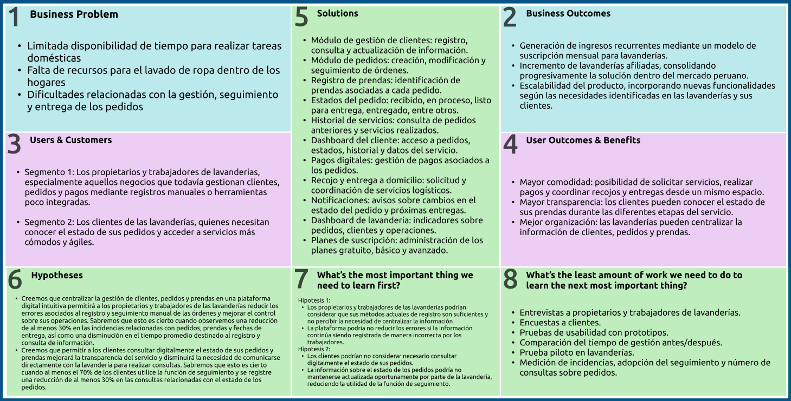

### 1.3. Segmentos objetivo

**1.3.1. Dueños de lavanderías independientes**

    Propietarios de pequeñas y medianas lavanderías que gestionan de manera directa las operaciones de sus establecimientos, incluyendo el registro de clientes, recepción de pedidos, control de prendas, actualización de estados, coordinación de entregas y seguimiento de los servicios realizados. Este segmento presenta una necesidad de mejorar la organización y centralización de sus procesos, especialmente cuando emplea métodos manuales o herramientas no integradas para administrar la información. WashTrack está orientada a facilitar la gestión operativa, reducir posibles errores y proporcionar un mayor control sobre los pedidos y servicios ofrecidos.

**1.3.2. Personas independientes que utilicen el servicio de lavanderías**

    Personas que recurren a servicios de lavandería para el cuidado y limpieza de sus prendas, principalmente aquellas que cuentan con una disponibilidad limitada de tiempo debido a sus actividades laborales, académicas, familiares o personales, así como aquellas que no disponen de una lavadora en sus hogares. Este segmento busca una alternativa que le permita gestionar sus servicios de manera práctica, conocer el estado de sus pedidos, realizar pagos digitales y acceder a opciones de recojo y entrega a domicilio. WashTrack busca brindarles mayor comodidad, reducir el tiempo y esfuerzo asociado a estas actividades y mejorar la transparencia durante todo el proceso del servicio.

---

## Capítulo II: Requirements Elicitation & Analysis

### 2.1. Competidores

#### 2.1.1. Análisis competitivo
#### 2.1.2. Estrategias y tácticas frente a competidores

### 2.2. Entrevistas

#### 2.2.1. Diseño de entrevistas
#### 2.2.2. Registro de entrevistas
#### 2.2.3. Análisis de entrevistas

### 2.3. Needfinding

#### 2.3.1. User Personas
#### 2.3.2. User Task Matrix
#### 2.3.3. User Journey Mapping
#### 2.3.4. Empathy Mapping

### 2.4. Big Picture EventStorming

### 2.5. Ubiquitous Language

---

## Capítulo III: Requirements Specification

### 3.1. User Stories

### 3.2. Impact Mapping

### 3.3. Product Backlog

---

## Capítulo IV: Product Design

### 4.1. Style Guidelines

WashTrack es una plataforma web enfocada en la gestión y seguimiento digital de servicios de lavandería, conectando a clientes con lavanderías para facilitar la programación, procesamiento y monitoreo de sus pedidos. Para brindar una experiencia moderna, clara e intuitiva, se ha optado por un diseño visual limpio, minimalista y funcional. Predominan colores como azul, celeste, blanco y tonos oscuros, que transmiten confianza, limpieza, tecnología y rapidez. El diseño prioriza la simplicidad, organización y accesibilidad, permitiendo que tanto los clientes como los encargados de las lavanderías puedan navegar y gestionar las órdenes de manera sencilla. Además, se emplean elementos visuales diferenciados para representar el estado de cada pedido, facilitando el seguimiento del proceso desde la recepción de las prendas hasta su entrega.

#### 4.1.1. General Style Guidelines

Las guías generales de estilo de WashTrack establecen los principios visuales y comunicacionales que orientan el diseño de la plataforma, buscando mantener una experiencia consistente, clara y fácil de utilizar. Las decisiones se basan en principios de diseño como consistencia, jerarquía visual, legibilidad, simplicidad y accesibilidad, aplicados a los diferentes componentes de la interfaz. Asimismo, se consideran aspectos de branding, tipografía, colores, espaciado y tono de comunicación, con el propósito de transmitir una identidad relacionada con la tecnología, limpieza, confianza y eficiencia que caracteriza al servicio de lavandería digital.

Para mantener una identidad visual coherente, WashTrack utiliza una combinación de <b>tonos azules, celestes, blancos y grises, acompañados de una tipografía diferenciada para títulos y contenido general.</b> La distribución de los elementos utiliza espacios y márgenes que permiten organizar la información sin sobrecargar la interfaz, mientras que botones, tarjetas, indicadores y formularios mantienen características visuales consistentes. En cuanto al lenguaje, la comunicación de WashTrack <b>adopta un tono serio, profesional, cercano y entusiasta</b>, evitando expresiones excesivamente formales o técnicas para facilitar la comprensión tanto de los clientes como de los encargados de las lavanderías.

A continuación, se detallan las <b>principales decisiones de estilo </b>consideradas para la construcción de la interfaz de WashTrack.

<ul>
  <li>
    <b>Branding:</b> 
    
El logotipo de WashTrack representa su enfoque en la digitalización, el monitoreo y la rapidez de los servicios de lavandería mediante un diseño moderno, claro y simbólico. En el centro, se muestra una lavadora estilizada acompañada de una pila de prendas dobladas de manera ordenada, reflejando el <b>cuidado textil y la gestión eficiente de los pedidos</b>. Al lado, se integra la silueta de una prenda en su interior de la lavadora, el cual <b>simboliza el seguimiento en tiempo real y la logística de recojo y entrega.</b> Asimismo, la línea de ruta discontinua refuerza visualmente la idea de conectividad, desplazamiento y seguimiento del servicio.

    
Todo este conjunto visual utiliza una paleta de colores basada en tonos <b >azules oscuros y celestes vibrantes, complementados con blanco y destellos brillantes</b>. Los tonos azules transmiten confianza, tecnología y seguridad, mientras que los celestes y blancos se relacionan con la limpieza, frescura y claridad, conceptos asociados directamente al servicio de lavandería. Los destellos aportan una sensación de dinamismo y rapidez, reforzando la propuesta de valor de WashTrack.

    
Finalmente, el nombre WashTrack se presenta mediante una <b>tipografía amigable y dinámica</b>, buscando facilitar su reconocimiento y transmitir cercanía e innovación. El eslogan <b>“TU ROPA, LISTA EN MENOS TIEMPO”</b> complementa la identidad de la marca al comunicar de manera directa su principal beneficio que es ofrecer un servicio eficiente, rápido y fácil de gestionar, logrando una identidad que permite asociar fácilmente a WashTrack con los conceptos de <b>lavandería, tecnología, seguimiento y rapidez.</b>

  </li>
</ul>

  

<ul>
  <li>
    <b>Typography (Tipografía):
    </b> 
    
WashTrack utiliza una jerarquía tipográfica clara y consistente para <b>garantizar una adecuada legibilidad</b> tanto en interfaces de escritorio como en dispositivos móviles. Se emplea <b>Poppins como tipografía principal</b> para los elementos generales de la interfaz, como menús, botones, etiquetas, párrafos y textos secundarios. Su diseño limpio y moderno <b>permite transmitir una identidad amigable, tecnológica y fácil de utilizar.</b>

    
Para los títulos principales, encabezados y elementos visuales destacados, se utiliza <b>Playfair Display como tipografía complementaria.</b> Su estilo elegante con serifas genera un contraste visual con la simplicidad de Poppins, permitiendo establecer una mayor jerarquía y otorgando personalidad a la identidad de WashTrack.

    
La combinación de <b>Poppins y Playfair Display permite equilibrar funcionalidad e identidad visual.</b> Poppins prioriza la claridad y facilidad de lectura, mientras que Playfair Display aporta elegancia y énfasis a los contenidos importantes. Esta jerarquía facilita que el usuario identifique rápidamente la información relevante sin sobrecargar visualmente la interfaz.

    <b>Escala y Métricas:</b>
    
Se establece una escala tipográfica basada en un tamaño de referencia de 16px, utilizando una escala de 1.25. El interlineado o line-height se establece en 1.2 para los títulos y elementos destacados, mientras que los textos de lectura pueden utilizar un interlineado mayor para mejorar la legibilidad y proporcionar un adecuado respiro visual.

    <b>Weights:</b>
<ul>
    <li>Delgado (Thin)</li>
    <li>Extra Fino (Extra Light)</li>
    <li>Fino (Light)</li>
    <li>Normal (Regular)</li>
    <li>Mediano (Medium)</li>
    <li>Semi Negrita (Semi Bold)</li>
    <li>Negrita (Bold)</li>
    <li>Extra Negrita (Extra Bold)</li>
    <li>Grueso (Black)</li>
  
</ul>
<b>Nomenclatura:</b>

    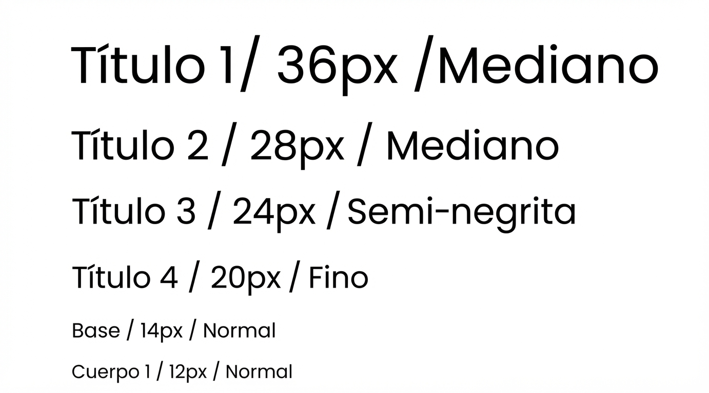

  </li>
</ul>

<ul>
  <li>
    <b>Colors o Paleta de colores:</b> 
    

      La paleta de colores de WashTrack está diseñada para transmitir limpieza,
      confianza, modernidad y eficiencia tecnológica. Los colores se organizan
      según su función dentro de la interfaz, manteniendo una identidad visual
      coherente y una experiencia agradable para el usuario.
    

     <ul>
      <li>
        <b>Color Primario:</b> Azul Oscuro / Marino
        (<code>#123B7A</code> / <code>#0B192C</code>): 
        Se utiliza en la barra de navegación superior, textos principales,
        encabezados y botones de llamada a la acción (CTA). Transmite
        confianza, solidez y profesionalismo.
      </li>
      <li>
        <b>Color Secundario:</b> Celeste Brillante / Azul Interactivo
        (<code>#087FEA</code> / <code>#22B8F0</code>): 
        Se emplea en elementos interactivos, enlaces activos, bordes de enfoque
        (<i>focus</i>) y gráficos estadísticos destacados. Aporta dinamismo,
        frescura y modernidad a la interfaz.
      </li>
      <li>
        <b>Fondos y Superficies:</b> Celeste Suave / Blanco
        (<code>#EAF8FF</code> / <code>#FFFFFF</code>): 
        Se aplican en tarjetas, contenedores, secciones principales
        (<i>hero sections</i>) y fondos generales. Estos colores aportan
        amplitud visual, limpieza y frescura, conceptos relacionados con el
        servicio de lavandería.
      </li>
      <li>
        <b>Colores de Soporte y Estados:</b>
        <ul>
          <li>
            <b>Verde Éxito (<code>#1A8A5F</code>):</b>
            Se utiliza para indicadores como "En línea", pedidos completados
            y métricas positivas.
          </li>
          <li>
            <b>Rojo Alerta (<code>#C2452F</code>):</b>
            Se utiliza para notificaciones críticas y situaciones que requieren
            atención inmediata.
          </li>
          <li>
            <b>Naranja Alerta (<code>#D97706</code>):</b>
            Se emplea para avisos de mantenimiento de las lavadoras y alertas
            IoT que requieren revisión por parte del administrador.
          </li>
        </ul>
      </li>
    </ul>
     

      En conjunto, esta paleta permite diferenciar visualmente las funciones y
      estados de la plataforma, manteniendo una identidad asociada con la
      <b>limpieza, tecnología, confianza y eficiencia</b>.
    

  </li>
</ul>

    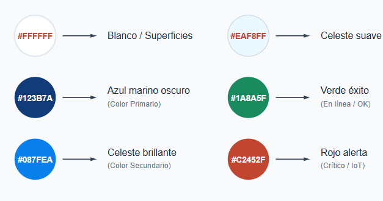

  
    

#### 4.1.2. Web Style Guidelines

La versión web de WashTrack ha sido diseñada bajo un enfoque Responsive-First y modular, buscando garantizar una experiencia consistente y accesible para administradores de lavanderías y usuarios finales, independientemente del dispositivo utilizado. Los estándares visuales y de interacción definidos para la interfaz son los siguientes:

<ul>
  <li>
    <b>Diseño Responsivo (Responsive Layout):
    </b> 
    
La interfaz utiliza una estructura flexible que permite adaptar la distribución y el tamaño de los componentes según el dispositivo. Se consideran diferentes puntos de quiebre que son los breakpoints para dispositivos móviles, tabletas y pantallas de escritorio, asegurando que los contenidos, elementos visuales y controles táctiles mantengan una correcta distribución y legibilidad.

  </li>
  <table align="center" style="border: none;">
  <tr>
    <td align="center" style="border: none;">
      
    </td>
    <td align="center" style="border: none;">
      
    </td>
  </tr>
</table>
<li>
    <b>Sistema de Navegación (Navbar & Menús):
    </b> 
    
La barra de navegación superior (Navbar) permite acceder de forma rápida a las principales funcionalidades de la plataforma, como Inicio, Monitoreo de Lavadoras, Reportes, Alertas IoT y Soporte. En dispositivos móviles, la navegación se adapta mediante un menú tipo hamburguesa, reduciendo la cantidad de elementos visibles y facilitando su interacción.

  </li>
  

    

 

    

  <li>
    <b>Sistema de Espaciado y Distribución:
    </b> 
    
Los contenidos se organizan mediante una <b>estructura modular basada en columnas, márgenes y espacios consistentes entre componentes.</b> Se mantiene una separación visual adecuada entre títulos, textos, botones, tarjetas y secciones para evitar la saturación de información y facilitar la lectura.

  </li>
  <li>
    <b>Componentes y Botones:
    </b> 
    
Los botones y elementos interactivos mantienen una apariencia consistente con la identidad visual de WashTrack. Los botones principales utilizan el color primario de la marca, mientras que los elementos secundarios emplean colores complementarios. Se consideran diferentes estados de interacción, como estado normal, hover, focus y disabled, proporcionando una respuesta visual clara ante las acciones del usuario.

  </li>
  <table align="center" style="border: none;">

  <tr>
    <td align="center" style="border: none;">
      
    </td>
    <td align="center" style="border: none;">
      
    </td>
  </tr>

  <tr>
    <td align="center" style="border: none;">
      
    </td>
    <td align="center" style="border: none;">
      
    </td>
  </tr>

  <tr>
    <td align="center" style="border: none;">
      
    </td>
    <td align="center" style="border: none;">
      
    </td>
  </tr>
</table>
<li>
    <b>Paneles Modulares y Visualización de Datos:
    </b> 
    
La información se presenta mediante tarjetas con bordes redondeados y fondos claros sobre superficies en tonos celestes suaves. Este sistema permite organizar métricas, estados de las máquinas, alertas y gráficos de manera independiente, facilitando la lectura y el monitoreo de la información.

  </li>
  

    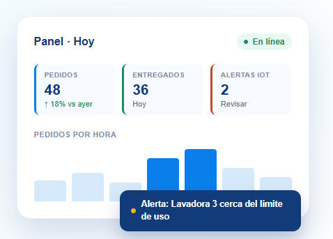

<li>
    <b>Estados, Alertas y Retroalimentación:
    </b> 
    
El sistema utiliza colores diferenciados para comunicar estados y acciones. El verde representa operaciones exitosas o máquinas en línea, mientras que el rojo y naranja se utilizan para alertas, errores o situaciones que requieren atención. De esta manera, la información crítica puede identificarse rápidamente.

  </li>
   

    

 <li>
    <b>Transiciones y Animaciones:
    </b> 
    
Las transiciones se utilizan de manera moderada para acompañar cambios de estado, apertura de modales, despliegue de menús y acciones interactivas. <b>Se emplean animaciones suaves para evitar cambios abruptos y mantener una experiencia fluida </b>sin distraer al usuario.

  </li>
 <li>
    <b>Consistencia Visual:
    </b> 
    
Los componentes mantienen patrones visuales consistentes en toda la plataforma, utilizando la misma paleta de colores, tipografías, bordes, botones, iconografía y estilos de interacción definidos previamente en el sistema de diseño. Esto permite que el usuario reconozca y comprenda los elementos de la interfaz con mayor facilidad.

  </li>
  

    

</ul>

Todas ellas se representan mediante las diferentes vistas de la interfaz web de WashTrack, incluyendo la versión de escritorio, adaptación para dispositivos móviles, sistema de navegación, tarjetas informativas, botones, estados y paneles de monitoreo.

### 4.2. Information Architecture

La arquitectura de la información de **WashTrack** busca ofrecer una experiencia fluida e intuitiva para los diferentes perfiles de usuarios de la plataforma, como clientes y administradores de lavanderías. La organización y el etiquetado de los contenidos se diseñaron para guiar al usuario de manera eficiente desde el acceso inicial y registro hasta el monitoreo de las lavadoras, la consulta del historial de ciclos de lavado y el acceso a las funcionalidades relacionadas con el sistema IoT.

La información se estructura mediante una jerarquía clara y una categorización modular, permitiendo que cada usuario encuentre rápidamente las funcionalidades correspondientes a su perfil. Asimismo, la navegación <b>sigue una secuencia lógica que facilita el acceso a las principales secciones del sistema</b>, tales como la barra de navegación superior, la sección de características, que presenta el seguimiento en tiempo real de las seis etapas del proceso de lavado, la sección orientada a los diferentes perfiles de usuario ("Para quién"), la presentación institucional ("Sobre nosotros") y el formulario de atención ubicado al final de la página. Esta organización <b>permite reducir la carga cognitiva y mejorar la experiencia de uso.</b>

#### 4.2.1. Organization Systems
#### 4.2.2. Labeling Systems
#### 4.2.3. SEO Tags and Meta Tags
#### 4.2.4. Searching Systems
#### 4.2.5. Navigation Systems

### 4.3. Landing Page UI Design

#### 4.3.1. Landing Page Wireframe
#### 4.3.2. Landing Page Mock-up

### 4.4. Web Applications UX/UI Design

#### 4.4.1. Web Applications Wireframes
La propuesta de wireframes para WashTrack fue desarrollada teniendo en cuenta los principios
de usabilidad, diseño inclusivo, claridad visual y jerarquía informativa, con el fin de brindar
una experiencia coherente, accesible y personalizada tanto para usuarios empresariales como
personas naturales.
La aplicación se estructura en seis secciones principales, accesibles desde una barra de
navegación que varía en función del perfil del usuario. Estas secciones son: Inicio,
Panel de Control, Operaciones, Monitoreo IoT, Clientes y Reportes.

---
**Dashboard**

El wireframe representa el Dashboard  de la aplicación web WashTrack,
diseñado bajo un esquema de maquetación de dos columnas principales: un menú de navegación
lateral izquierdo Sidebar y un panel de contenido central Main Area.

**Pedidos**

La vista de Pedidos está orientada a centralizar el flujo de trabajo operativo de la lavandería
en el rol de Encargada de turno. Presenta una tabla de datos con filtros de búsqueda y acciones
rápidas como "+ Nuevo pedido", permitiendo monitorear el estado de recepción, entregas estimadas, pagos y detalles de cada orden de manera eficiente.

**Clientes**

Esta pantalla está destinada a la administración del directorio de usuarios por parte de la Encargada
de turno. Dispone de una tabla detallada con filtro de búsqueda y la opción para registrar nuevos usuarios,
lo que agiliza la localización de información de contacto, identificadores y documentos de identidad.

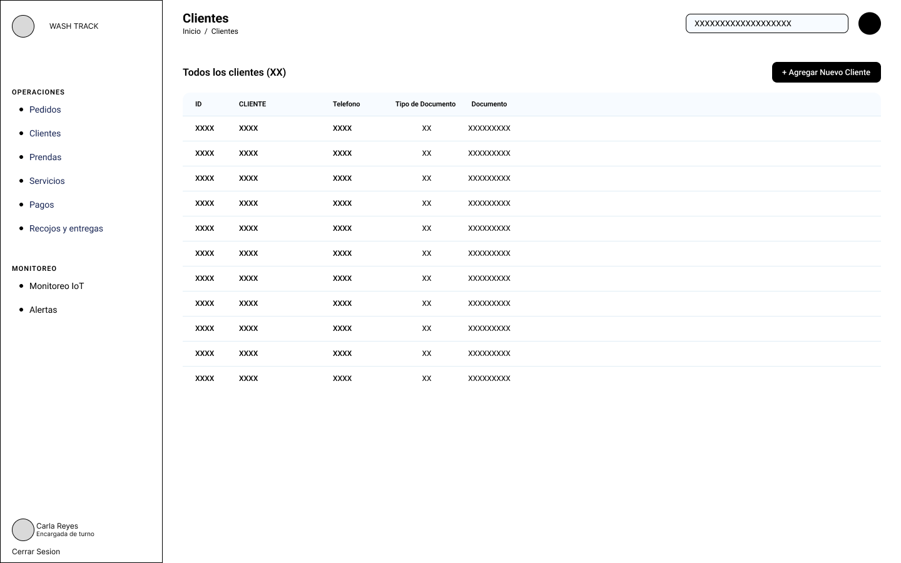

**Prendas**

La interfaz descrita permite estructurar el catálogo operativo de la lavandería para la Encargada de turno.
Muestra métricas clave sobre los tipos de prendas registrados y su valor promedio, acompañadas de un listado
organizado por categorías, precios y disponibilidad. La parte inferior añade una gráfica interactiva de tendencias
que ayuda a analizar las prendas más solicitadas a lo largo del tiempo.

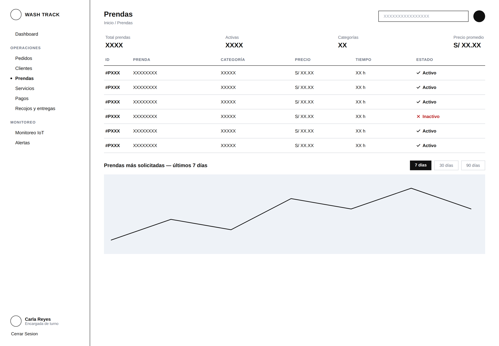

**Servicios**

Esta sección está destinada a la gestión del portafolio de prestaciones ofrecidas por la lavandería. Muestra en la
parte superior métricas sobre el total de servicios, la cantidad de activos, las categorías configuradas y el costo
promedio, seguidas por una tabla de datos detallada con tarifas, duraciones estimadas y estados operativos. En la
zona inferior incorpora un gráfico de tendencias para evaluar los servicios con mayor demanda según el intervalo de
tiempo seleccionado.

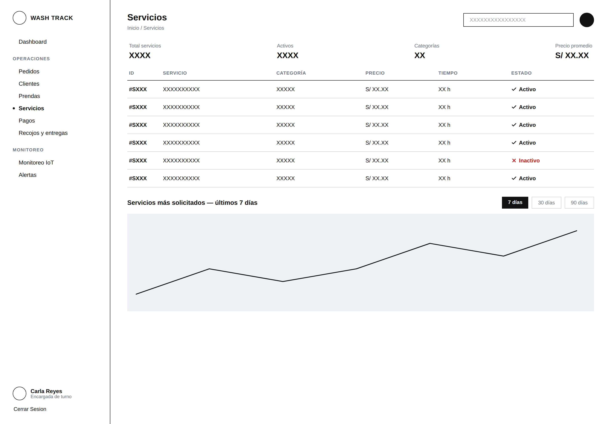

**Pagos**
El siguiente wireframe organiza el registro y control de cobros para la Encargada de turno. Incluye una barra de 
búsqueda dedicada en la parte superior y una tabla de datos detallada que muestra el identificador de cada pago, 
el pedido asociado, el cliente, el monto cobrado, el método de pago y el estado de la transacción, complementada 
con un gráfico de tendencia de los pagos registrados en las últimas 24 horas.

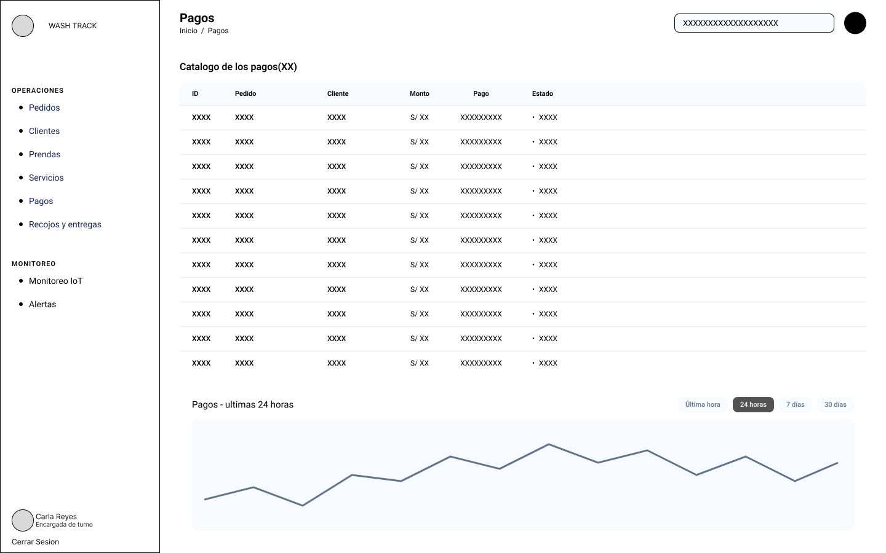

**Recojos y Entregas**

El siguiente wireframe organiza la logística de despacho y recolección de prendas para la Encargada de turno. Incluye
una barra de búsqueda dedicada, un botón de acción principal para programar nuevos recojos o entregas y una tabla de
datos detallada que registra identificadores, tipo de operación, cliente, dirección de destino, repartidor asignado, fecha, hora y estado del servicio

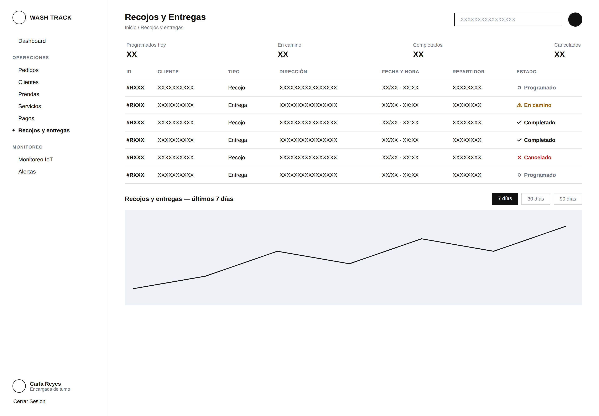

**Monitoreo IOT**

Esta vista permite a la Encargada de turno supervisar en tiempo real el estado técnico y operativo de toda la
maquinaria conectada. Mediante un panel de tarjetas individuales para cada lavadora, facilita el control de
parámetros en vivo como el ciclo actual, el tiempo restante de lavado y la última sincronización de datos de
los sensores.

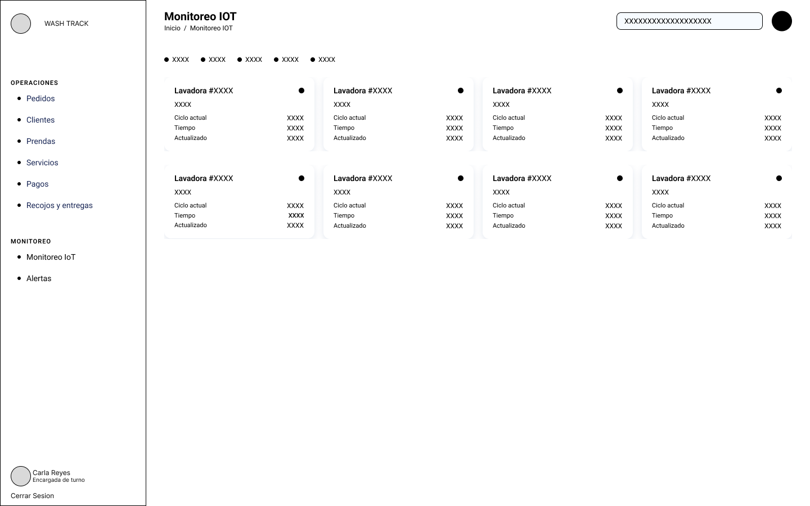

**Alertas**

El wireframe de esta sección está diseñado para centralizar las notificaciones de fallas técnicas en la interfaz
de la Encargada de turno. Mediante un esquema de tarjetas informativas clasificadas por nivel de criticidad, este
wireframe permite identificar con rapidez alertas de revisión alta y posibles fallas en la maquinaria, desplegando
el ciclo en curso, el tiempo restante y la sincronización en vivo para evitar interrupciones operativas.

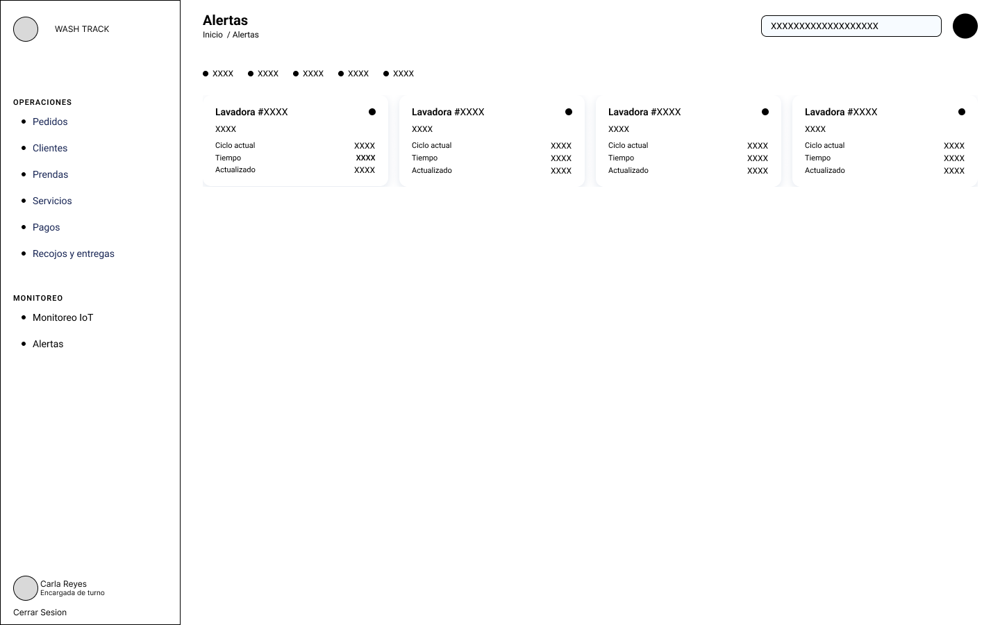

**Detalle de alerta por lavadora**

El wireframe de esta vista presenta el diagnóstico técnico individualizado de una máquina específica para la Encargada
de turno. Estructura la información mediante indicadores generales de estado, métricas de sensores en tiempo real como
humedad, corriente, consumo, vibración, velocidad y nivel de agua frente a sus rangos esperados, e incluye un gráfico
de comportamiento histórico para analizar anomalías a lo largo del tiempo.

#### 4.4.2. Web Applications Wireflow Diagrams

#### 4.4.3. Web Applications Mock-ups

**DashBoard**

El Dashboard permite a la encargada de turno conocer el estado de la lavandería rápidamente, sin navegar a otras secciones.

* **KPIs superiores:** muestran los indicadores principales de forma clara y uniforme para facilitar su comparación.
* **Máquinas y alertas:** se presentan juntas para relacionar rápidamente el estado de las máquinas con posibles incidencias.
* **Gráficos inferiores:** muestran tendencias y análisis, priorizando primero la información operativa inmediata.
* **Sidebar persistente:** mantiene una navegación constante y facilita el reconocimiento de las funciones del sistema.

**Pedidos**

Este módulo cubre el flujo principal del negocio: **consultar pedidos y registrar nuevos** de forma rápida y sencilla.

* **Tabla de pedidos:** las columnas siguen el orden lógico del proceso: cliente, fechas, prendas, servicio y finalmente estado y pago.
* **Estados por color:** permite identificar rápidamente la situación de cada pedido mediante atributos visuales.
* **Botón "+ Nuevo pedido":** mantiene una ubicación consistente y facilita el acceso a la acción principal.
* **Formulario modal:** permite crear pedidos sin perder el contexto de la lista.
* **Campos agrupados:** los datos relacionados se organizan en dos columnas para reducir el desplazamiento.
* **Cliente primero:** utiliza un buscador para facilitar su selección.
* **Valores predeterminados:** Estado y Pago vienen preestablecidos para reducir errores y tiempo de captura.
* **Botones:** "Guardar" destaca como acción principal y "Cancelar" como acción secundaria.

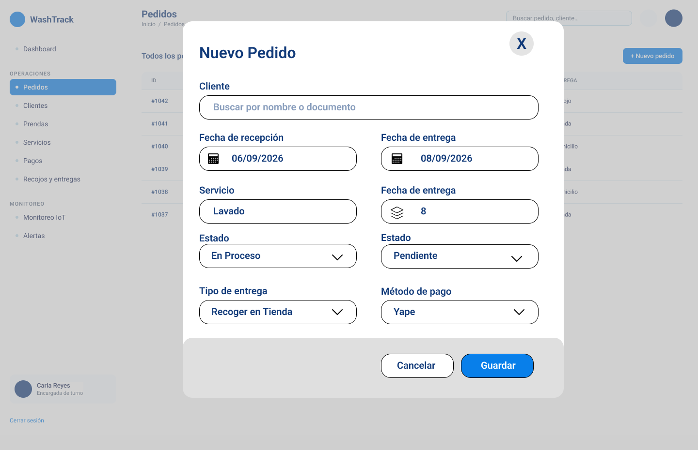

**Clientes**

Este módulo gestiona la información principal de los clientes, priorizando su identificación rápida y el registro sencillo**.

* **Tabla simplificada:** muestra únicamente ID, cliente, teléfono y documento, evitando información transaccional innecesaria.
* **Nombre como dato principal:** se ubica después del ID por ser el criterio más natural para identificar un cliente.
* **Orden consistente:** teléfono y documento mantienen la misma secuencia utilizada en el formulario.
* **Botón "+ Agregar Nuevo Cliente":** mantiene la posición estándar del sistema, facilitando su localización.
* **Formulario vertical:** al ser corto, los campos se presentan en una sola columna para facilitar la lectura.
* **Tipo de documento:** utiliza una lista desplegable para evitar datos incorrectos o inconsistentes.
* **Modal consistente:** conserva el mismo patrón visual del sistema, con "Guardar" como acción principal y "Cancelar" como secundaria.

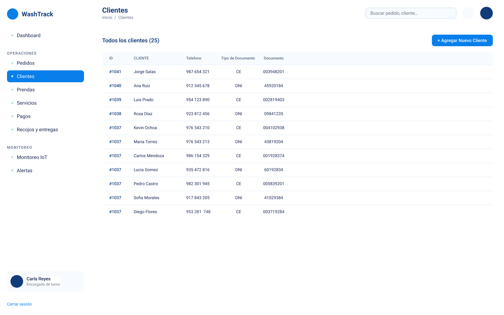

**Prendas**

Este módulo gestiona el catálogo de prendas y su demanda, facilitando tanto la consulta como el análisis.

* **Catálogo y análisis separados:** la tabla muestra primero la información actual y el gráfico inferior presenta las tendencias de demanda.
* **Categoría como agrupador:** permite identificar rápidamente las familias de prendas sin navegación adicional.
* **Precio y tiempo estimado:** se colocan juntos porque son datos relacionados para la atención al cliente y planificación.
* **Estado por color:** "Activo" en verde e "Inactivo" en gris permiten identificar rápidamente la disponibilidad.
* **Estado con botones:** al ser una opción binaria, "Activo/Inactivo" permite seleccionar directamente y visualizar la opción elegida.
* **Formulario en dos columnas:** el nombre ocupa todo el ancho y los demás atributos se agrupan para reducir el recorrido visual.
* **Filtros temporales:** permiten cambiar rápidamente el periodo del gráfico y muestran claramente cuál está seleccionado.

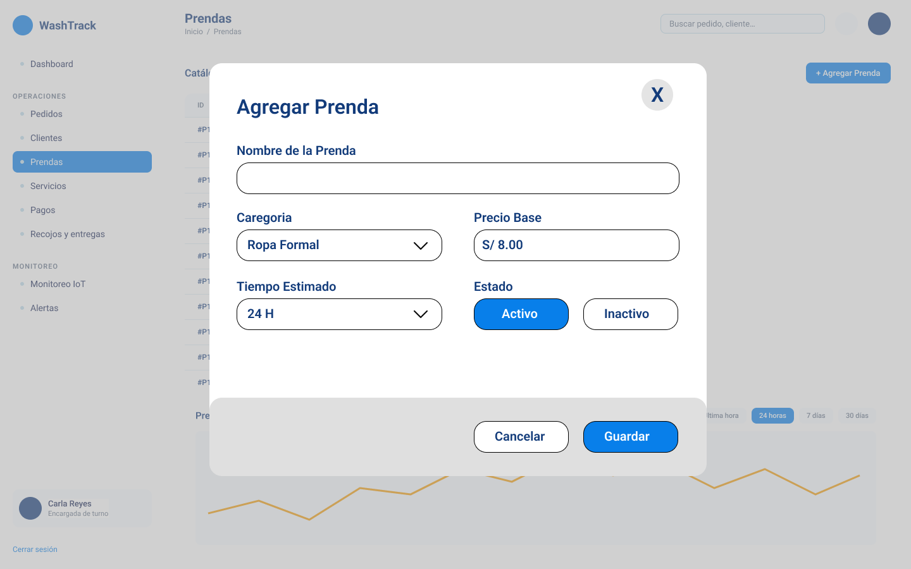

**Servicios**

Este módulo gestiona el **catálogo de servicios y su demanda**, manteniendo una estructura similar al módulo de Prendas para facilitar el uso.

* **Estructura consistente:** utiliza la misma distribución de Prendas: tabla arriba, gráfico de demanda abajo y modal de registro.
* **Categorías de servicios:** agrupan las operaciones según su naturaleza, como Lavado, Tintorería, Planchado y Acabado.
* **Precio y tiempo estimado:** se muestran juntos para facilitar la información al cliente y la planificación de entregas.
* **Gráfico de demanda:** permite identificar rápidamente el servicio más solicitado.
* **Modal de registro:** mantiene el mismo diseño de Prendas, reduciendo el aprendizaje y los errores de captura.
* **Estado mediante botones:** "Activo/Inactivo" permite seleccionar rápidamente la disponibilidad del servicio.

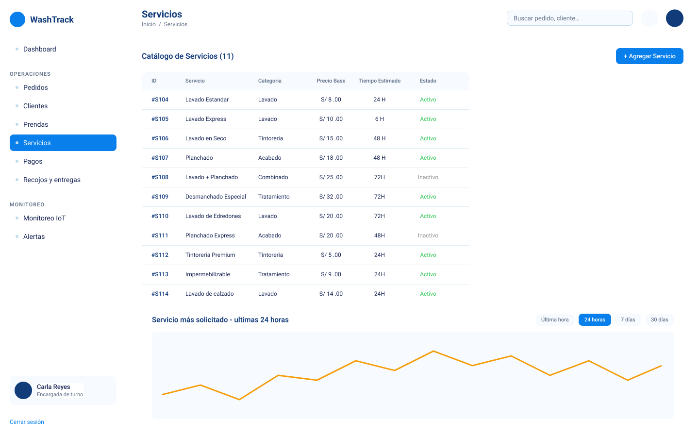

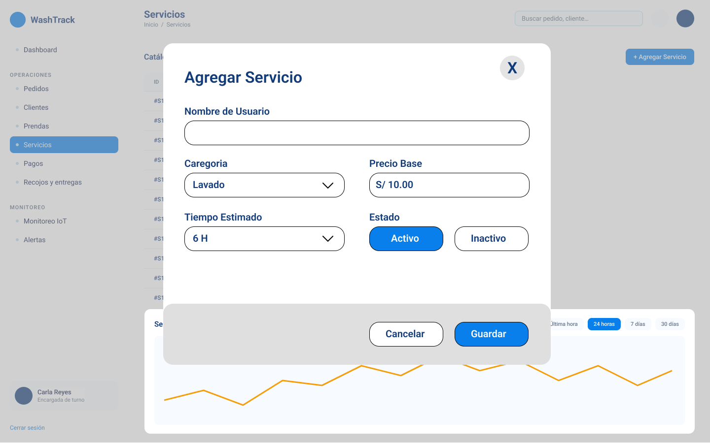

**Pagos**

Este módulo permite **consultar y controlar las transacciones realizadas**, adaptando la estructura de los catálogos a la gestión de cobros.

* **Pedido como referencia:** se muestra junto al ID para relacionar directamente cada pago con su pedido correspondiente.
* **Monto y método:** se colocan juntos para identificar rápidamente cuánto y cómo se realizó el pago.
* **Fecha:** se presenta al final y los registros se ordenan de más reciente a más antiguo para priorizar los cobros actuales.
* **Estado por color:** mantiene el mismo código visual de otros módulos, facilitando la identificación de registros activos e inactivos.
* **Estructura consistente:** conserva la arquitectura general del sistema, reduciendo la carga cognitiva del usuario.

**Recojos y Entregas**

Este módulo gestiona las **operaciones logísticas y el seguimiento de entregas**, combinando consulta, asignación y monitoreo.

* **Tipo y Estado diferenciados:** utilizan códigos de color independientes para evitar confusiones entre la operación y su situación.
* **Dirección visible:** se muestra completa, incluso en dos líneas, para evitar errores durante el recojo o entrega.
* **Repartidor visible:** permite identificar rápidamente quién está a cargo de cada operación.
* **Seguimiento mediante clic:** cada registro permite acceder a una pantalla dedicada de monitoreo.
* **Mapa como elemento principal:** ocupa la mayor parte del espacio para facilitar la visualización de la ubicación y recorrido.
* **Ruta diferenciada:** el tramo recorrido es sólido y el pendiente es punteado, permitiendo identificar rápidamente el avance.
* **Tiempo estimado junto al repartidor:** muestra de forma inmediata cuánto falta para llegar.
* **Stepper de estados:** muestra claramente el progreso: Confirmado, Recojido y En Camino.
* **Detalle de entrega:** presenta los datos del pedido como información de apoyo debajo del estado.

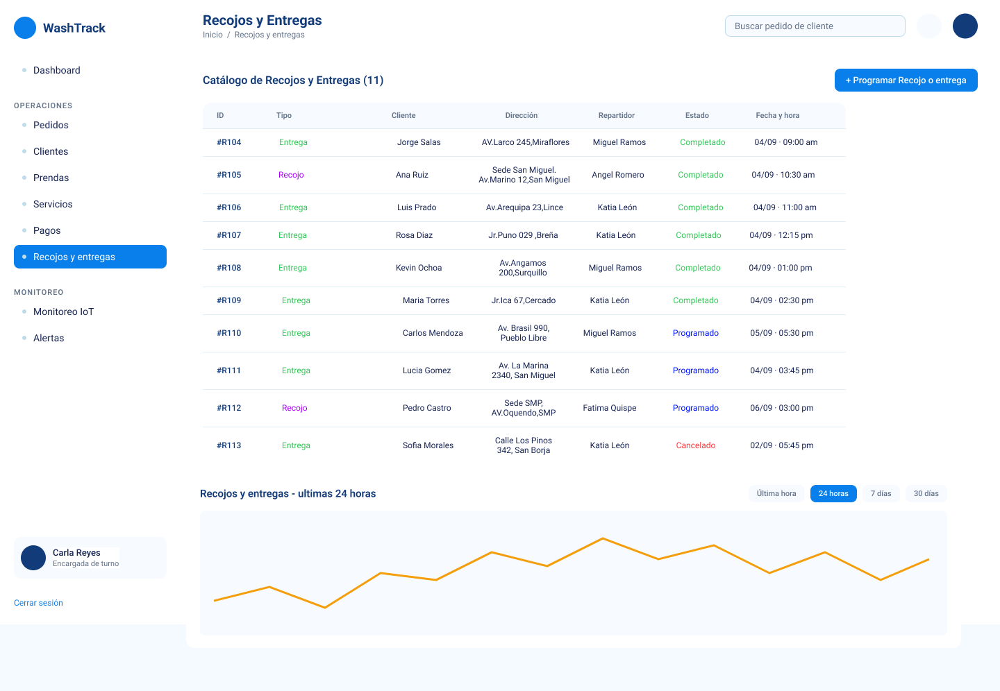

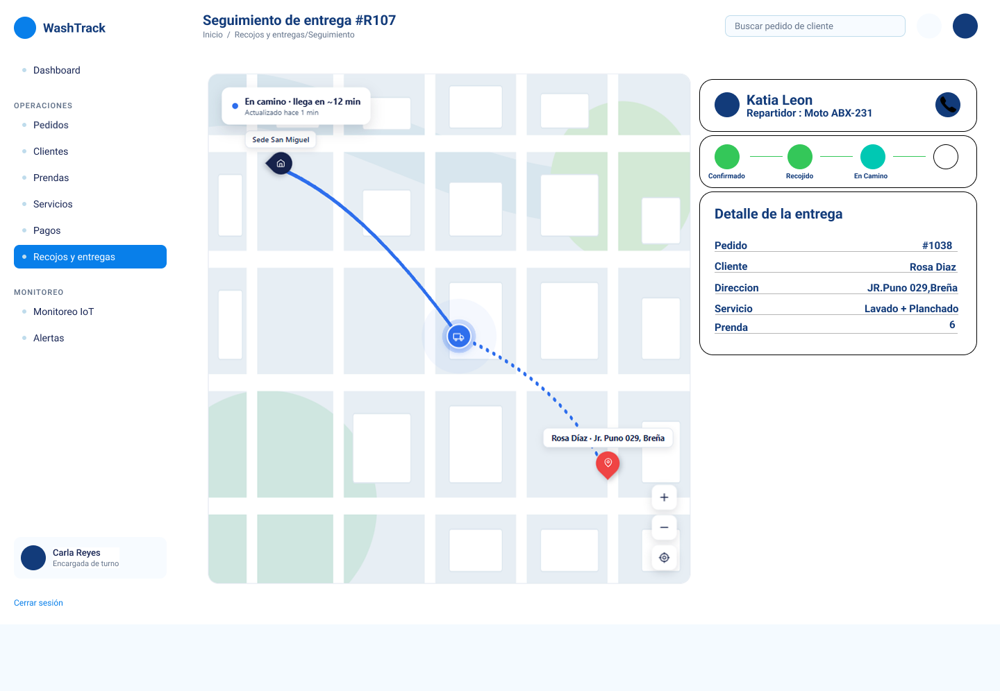

----
**Monitoreo IoT**

Este módulo permite **supervisar en tiempo real el estado físico de las lavadoras**, utilizando una interfaz orientada al monitoreo técnico.

* **Leyenda de estados:** explica los cinco estados y sus colores para facilitar su interpretación.
* **Tarjetas en cuadrícula:** cada lavadora se presenta como una unidad independiente, permitiendo detectar anomalías rápidamente.
* **Orden de información:** muestra primero Estado, Ciclo, Tiempo y Actualización, siguiendo la prioridad de monitoreo.
* **Timestamp relativo:** indica cuánto tiempo ha pasado desde la última actualización.
* **Detalle en pantalla completa:** permite consultar el estado y las métricas de una lavadora sin perder contexto.
* **Resumen superior:** mantiene la información principal de la tarjeta y añade el estado de conexión.
* **Métricas con rango y veredicto:** cada sensor muestra su valor, rango esperado y resultado, facilitando la interpretación.
* **Grid de seis métricas:** permite comparar varios indicadores simultáneamente.
* **Gráfico histórico:** muestra una métrica a la vez para analizar su comportamiento y detectar posibles anomalías.

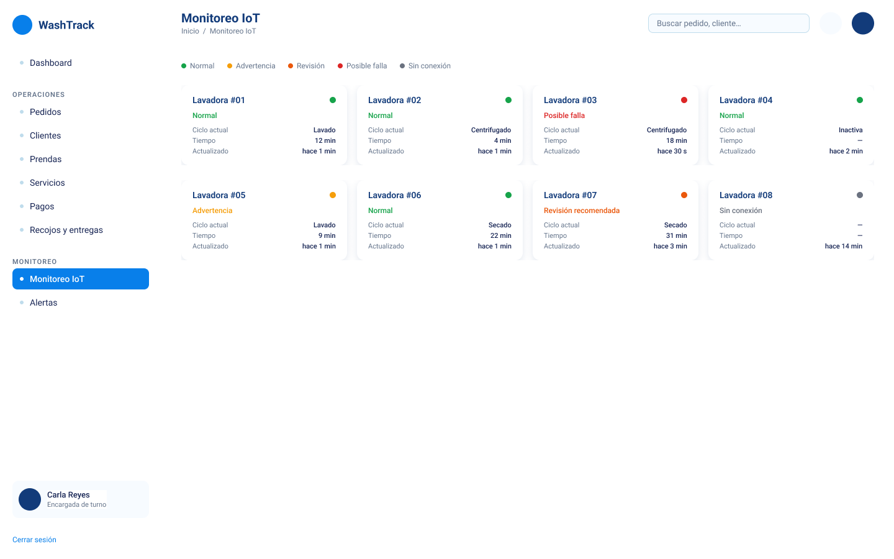

**Alertas**

Este módulo permite **concentrarse únicamente en las lavadoras que requieren atención**, funcionando como una vista filtrada de Monitoreo IoT.

* **Estados reducidos:** solo muestra "Revisión" y "Posible falla", enfocándose en situaciones que requieren acción.
* **Lista vertical:** presenta pocas alertas en orden, facilitando la identificación de las más urgentes.
* **Tarjetas consistentes:** mantiene el mismo diseño y detalle de Monitoreo IoT para evitar un nuevo aprendizaje.
* **Detalle reutilizado:** al seleccionar una alerta, se accede al mismo detalle de métricas de la lavadora.
* **Navegación agrupada:** Alertas y Monitoreo IoT están dentro de "Monitoreo", diferenciándolos de las funciones operativas.
* **Propósito claro:** permite pasar de la supervisión general a la atención específica de problemas.

#### 4.4.4. Web Applications User Flow Diagrams

### 4.5. Web Applications Prototyping

### 4.6. Domain-Driven Software Architecture

#### 4.6.1. Design-Level EventStorming
#### 4.6.2. Software Architecture Context Diagram
#### 4.6.3. Software Architecture Container Diagrams
#### 4.6.4. Software Architecture Components Diagrams

### 4.7. Software Object-Oriented Design

#### 4.7.1. Class Diagrams

### 4.8. Database Design

#### 4.8.1. Database Diagrams

---

## Capítulo V: Product Implementation, Validation & Deployment

### 5.1. Software Configuration Management

#### 5.1.1. Software Development Environment Configuration
#### 5.1.2. Source Code Management
#### 5.1.3. Source Code Style Guide & Conventions
#### 5.1.4. Software Deployment Configuration

### 5.2. Landing Page, Services & Applications Implementation

#### 5.2.1. Sprint 1

##### 5.2.1.1. Sprint Planning 1
##### 5.2.1.2. Aspect Leaders and Collaborators
##### 5.2.1.3. Sprint Backlog 1
##### 5.2.1.4. Development Evidence for Sprint Review
##### 5.2.1.5. Execution Evidence for Sprint Review
##### 5.2.1.6. Services Documentation Evidence for Sprint Review
##### 5.2.1.7. Software Deployment Evidence for Sprint Review
##### 5.2.1.8. Team Collaboration Insights during Sprint

### 5.3. Validation Interviews

#### 5.3.1. Diseño de Entrevistas
#### 5.3.2. Registro de Entrevistas
#### 5.3.3. Evaluaciones según heurísticas

### 5.4. Video About-the-Product

---

# Bibliografía

---

# Anexos

---
