

Universidad Peruana de Ciencias Aplicadas

Carrera de Ingeniería de Software
 

**1ASI030**

**Aplicaciones Web**

NRC
**16129**

#### Informe del Trabajo Final

Docente

**Sanchez Seña, Alberto Wilmer**
 

Equipo

**DevTech**

Proyecto

**WashTrack**

 

**Integrantes**

    <b>Código&nbsp;&nbsp;&nbsp;&nbsp;&nbsp;&nbsp;&nbsp;&nbsp;&nbsp;&nbsp;&nbsp;&nbsp;&nbsp;&nbsp;&nbsp;&nbsp;&nbsp;&nbsp;&nbsp;&nbsp;Apellidos y Nombres</b>

u20241D338&nbsp;&nbsp;&nbsp;&nbsp;&nbsp;&nbsp;&nbsp;&nbsp;&nbsp;&nbsp;Pérez Vásquez, Ariana Valeria 
u202416053&nbsp;&nbsp;&nbsp;&nbsp;&nbsp;&nbsp;&nbsp;&nbsp;&nbsp;&nbsp;Ramirez Gutierrez, Gabriel 
u202018427&nbsp;&nbsp;&nbsp;&nbsp;&nbsp;&nbsp;&nbsp;&nbsp;&nbsp;&nbsp;Ramos Fuentes Rivera, Adriana Nicole 
u202422642&nbsp;&nbsp;&nbsp;&nbsp;&nbsp;&nbsp;&nbsp;&nbsp;&nbsp;&nbsp;Sayago Vidal, Sebastián Leonardo 
u202216240&nbsp;&nbsp;&nbsp;&nbsp;&nbsp;&nbsp;&nbsp;&nbsp;&nbsp;&nbsp;Tufiño Argüelles, Luis Angel 

 

**Periodo 202620**
 

**Setiembre 2026**

 
 
 
 
 
 

---

# Registro de Versiones del Informe

| Versión | Fecha | Autor | Descripción de modificación |
|---|---|---|---|
| **AV1** | 28/08/2026 | Pérez Vásquez, Ariana Valeria  Ramirez Gutierrez, Gabriel  Ramos Fuentes Rivera, Adriana Nicole  Sayago Vidal, Sebastián Leonardo  Tufiño Argüelles, Luis Angel | **Capítulo I: Introducción** 1.1. Startup Profile 1.1.1. Descripción de la Startup 1.1.2. Perfiles de integrantes del equipo 1.2. Solution Profile 1.2.1. Antecedentes y problemática 1.2.2. Lean UX Process 1.2.2.1. Lean UX Problem Statements 1.2.2.2. Lean UX Assumptions 1.2.2.3. Lean UX Hypothesis Statements 1.2.2.4. Lean UX Canvas 1.3. Segmentos objetivo  **Capítulo II: Requirements Elicitation & Analysis** 2.1. Competidores 2.1.1. Análisis competitivo 2.1.2. Estrategias y tácticas frente a competidores 2.2. Entrevistas 2.2.1. Diseño de entrevistas 2.2.2. Registro de entrevistas 2.2.3. Análisis de entrevistas 2.3. Needfinding 2.3.1. User Personas 2.3.2. User Task Matrix 2.3.3. User Journey Mapping 2.3.4. Empathy Mapping 2.4. Big Picture EventStorming 2.5. Ubiquitous Language  **Capítulo III: Requirements Specification** 3.1. User Stories 3.2. Impact Mapping 3.3. Product Backlog  **Capítulo IV: Product Design** 4.1. Style Guidelines 4.1.1. General Style Guidelines 4.1.2. Web Style Guidelines 4.2. Information Architecture 4.2.1. Organization Systems 4.2.2. Labeling Systems 4.2.3. SEO Tags and Meta Tags 4.2.4. Searching Systems 4.2.5. Navigation Systems 4.3. Landing Page UI Design 4.3.1. Landing Page Wireframe 4.3.2. Landing Page Mock-up 4.4. Web Applications UX/UI Design 4.4.1. Web Applications Wireframes 4.4.2. Web Applications Wireflow Diagrams 4.4.2. Web Applications Mock-ups 4.4.3. Web Applications User Flow Diagrams 4.5. Web Applications Prototyping 4.6. Domain-Driven Software Architecture 4.6.1. Design-Level EventStorming 4.6.2. Software Architecture Context Diagram 4.6.3. Software Architecture Container Diagrams 4.6.4. Software Architecture Components Diagrams 4.7. Software Object-Oriented Design 4.7.1. Class Diagrams 4.8. Database Design 4.8.1. Database Diagrams  **Capítulo V: Product Implementation, Validation & Deployment** 5.1. Software Configuration Management 5.1.1. Software Development Environment Configuration 5.1.2. Source Code Management 5.1.3. Source Code Style Guide & Conventions 5.1.4. Software Deployment Configuration 5.2. Landing Page, Services & Applications Implementation 5.2.1. Sprint n 5.2.1.1. Sprint Planning n 5.2.1.2. Aspect Leaders and Collaborators 5.2.1.3. Sprint Backlog n 5.2.1.4. Development Evidence for Sprint Review 5.2.1.5. Execution Evidence for Sprint Review 5.2.1.6. Services Documentation Evidence for Sprint Review 5.2.1.7. Software Deployment Evidence for Sprint Review 5.2.1.8. Team Collaboration Insights during Sprint |

---

## Project Report Collaboration Insights

URL del repositorio (report): [https://github.com/1ASI0730-2620-16129-G2-DevTech/DevTechReport-16129-G2](https://github.com/1ASI0730-2620-16129-G2-DevTech/DevTechReport-16129-G2)

URL del repositorio (landing-page): [https://github.com/1ASI0730-2620-16129-G2-DevTech/DevTech-LandingPage-16129-G2](https://github.com/1ASI0730-2620-16129-G2-DevTech/DevTech-LandingPage-16129-G2)

 

**Primera entrega (AV1)**

  Durante la fase inicial del proyecto, correspondiente a la primera entrega, el equipo organizó sus actividades bajo un esquema de trabajo coordinado, distribuyendo la carga operativa en función de las especialidades de cada integrante.

  Las actividades se enfocaron en la construcción estratégica y los fundamentos del proyecto dentro del Capítulo I. El equipo trabajó en la definición detallada del perfil de la startup y la presentación formal de sus integrantes, para luego abordar el planteamiento de la solución aplicando la metodología Lean UX. Esto abarcó la formulación rigurosa de las declaraciones de problema, la identificación de suposiciones, la definición de hipótesis verificables y la elaboración sintética del Lean UX Canvas, culminando con la caracterización técnica de los segmentos de mercado objetivo.

  Posteriormente, en el Capítulo II se llevaron a cabo las dinámicas de elicitación y análisis de requerimientos. El equipo ejecutó un análisis competitivo exhaustivo, diseñó y aplicó guías de entrevista estructuradas a usuarios del segmento objetivo, y procesó los hallazgos mediante técnicas de Needfinding. Como resultado, se consolidaron los User Personas, las matrices de tareas, los User Journey Maps y los Empathy Maps. Adicionalmente, se facilitaron sesiones colaborativas de Big Picture EventStorming para mapear la complejidad del dominio de negocio y consensuar el Ubiquitous Language que rige la arquitectura del sistema.

  En el marco de la especificación de requerimientos del Capítulo III, se estructuraron las historias de usuario asociadas a mapas de impacto (Impact Mapping) y se organizó el Product Backlog priorizado. A la par, el Capítulo IV demandó un esfuerzo multidisciplinario significativo en diseño de producto y arquitectura de software. En esta etapa se establecieron las guías de estilo para aplicaciones web, la arquitectura de información detallada (sistemas de organización, etiquetado, búsqueda, navegación y metadatos SEO), así como el diseño de la interfaz y experiencia de usuario a nivel de Wireframes, Mockups, Wireflows, User Flows y prototipos interactivos. Asimismo, aplicando Domain-Driven Design (DDD), se ejecutó el Design-Level EventStorming y se construyeron los diagramas C4 (Context, Container y Component), acompañados de los diagramas de clases orientados a objetos y el modelado completo de la base de datos.

  Por último, el Capítulo V concentró la configuración del entorno de gestión del código fuente, donde se definieron las convenciones de desarrollo, los estándares de estilo de código, la estrategia de ramificación (GitFlow) y las pautas para el despliegue de las aplicaciones y servicios, asentando las bases técnicas para el ciclo de vida del desarrollo de software.

**Evidencias de colaboración y analíticos en GitHub**
 

**Primera entrega (AV1)**

  Para garantizar la coherencia metodológica con el Registro de Versiones del Informe y verificar el compromiso y la participación equitativa de todos los integrantes del equipo DevTech, se adjuntan los analíticos y registros de actividad extraídos directamente de las métricas internas del repositorio en GitHub.

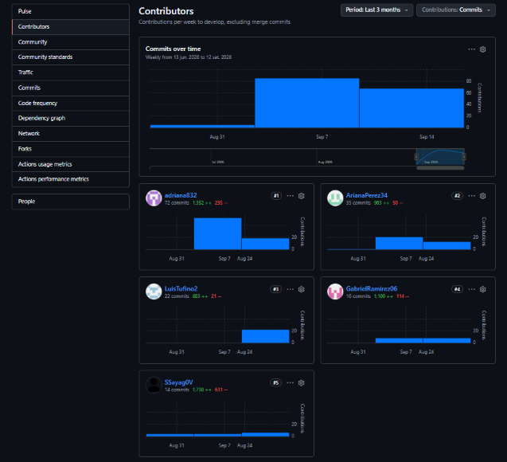
   <i>Contributors of DevTech (AV1)</i>

 

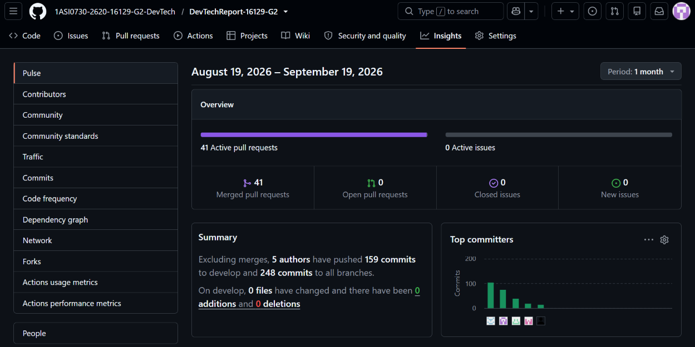
   <i>Pulse of DevTech (AV1)</i>

 

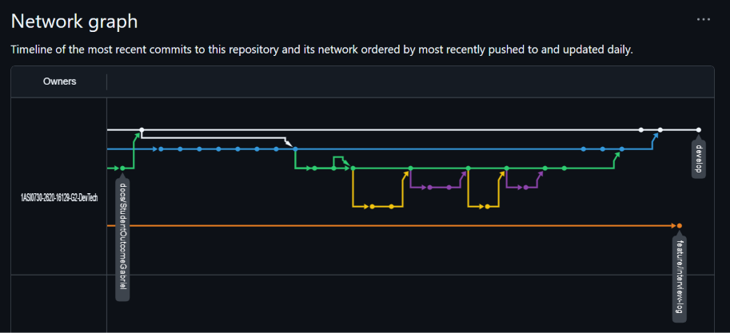
   <i>Network graph of DevTech (AV1)</i>

---

# Contenido

## Tabla de Contenidos

- [Registro de Versiones del Informe](#registro-de-versiones-del-informe)
  - [Project Report Collaboration Insights](#project-report-collaboration-insights)
- [Contenido](#contenido)
  - [Tabla de Contenidos](#tabla-de-contenidos)
- [Student Outcome](#student-outcome)
  - [Capítulo I: Introducción](#capítulo-i-introducción)
    - [1.1. Startup Profile](#11-startup-profile)
      - [1.1.1. Descripción de la Startup](#111-descripción-de-la-startup)
      - [1.1.2. Perfiles de integrantes del equipo](#112-perfiles-de-integrantes-del-equipo)
    - [1.2. Solution Profile](#12-solution-profile)
      - [1.2.1. Antecedentes y problemática](#121-antecedentes-y-problemática)
    - [1.3. Segmentos objetivo](#13-segmentos-objetivo)
  - [Capítulo II: Requirements Elicitation \& Analysis](#capítulo-ii-requirements-elicitation--analysis)
    - [2.1. Competidores](#21-competidores)
      - [2.1.1. Análisis competitivo](#211-análisis-competitivo)
      - [2.1.2. Estrategias y tácticas frente a competidores](#212-estrategias-y-tácticas-frente-a-competidores)
    - [2.2. Entrevistas](#22-entrevistas)
      - [2.2.1. Diseño de entrevistas](#221-diseño-de-entrevistas)
      - [2.2.2. Registro de entrevistas](#222-registro-de-entrevistas)
      - [2.2.3. Análisis de entrevistas](#223-análisis-de-entrevistas)
    - [2.3. Needfinding](#23-needfinding)
      - [2.3.1. User Personas](#231-user-personas)
      - [2.3.2. User Task Matrix](#232-user-task-matrix)
      - [2.3.3. User Journey Mapping](#233-user-journey-mapping)
      - [2.3.4. Empathy Mapping](#234-empathy-mapping)
    - [2.4. Big Picture Event Storming](#24-big-picture-event-storming)
    - [2.5. Ubiquitous Language](#25-ubiquitous-language)
  - [Capítulo III: Requirements Specification](#capítulo-iii-requirements-specification)
    - [3.1. User Stories](#31-user-stories)
    - [3.2. Impact Mapping](#32-impact-mapping)
    - [3.3. Product Backlog](#33-product-backlog)
      - [Definition of Done](#definition-of-done)
  - [Capítulo IV: Product Design](#capítulo-iv-product-design)
    - [4.1. Style Guidelines](#41-style-guidelines)
      - [4.1.1. General Style Guidelines](#411-general-style-guidelines)
      - [4.1.2. Web Style Guidelines](#412-web-style-guidelines)
    - [4.2. Information Architecture](#42-information-architecture)
      - [4.2.1. Organization Systems](#421-organization-systems)
      - [4.2.2. Labeling Systems](#422-labeling-systems)
      - [4.2.3. SEO Tags and Meta Tags](#423-seo-tags-and-meta-tags)
      - [Landing Page](#landing-page)
      - [Dashboard / Inicio](#dashboard--inicio)
      - [Características](#características)
      - [Seguimiento en Vivo](#seguimiento-en-vivo)
      - [Sobre Nosotros](#sobre-nosotros)
      - [Planes y Contacto](#planes-y-contacto)
      - [4.2.4. Searching Systems](#424-searching-systems)
      - [4.2.5. Navigation Systems](#425-navigation-systems)
      - [Landing Page o Sitio Web](#landing-page-o-sitio-web)
      - [App Web - Panel Hoy o Dashboard](#app-web---panel-hoy-o-dashboard)
      - [Sección: Pedidos](#sección-pedidos)
      - [Sección: Seguimiento en Vivo](#sección-seguimiento-en-vivo)
      - [Sección: Reportes](#sección-reportes)
      - [Sección: Configuración](#sección-configuración)
    - [4.3. Landing Page UI Design](#43-landing-page-ui-design)
      - [4.3.1. Landing Page Wireframe](#431-landing-page-wireframe)
      - [4.3.2. Landing Page Mock-up](#432-landing-page-mock-up)
    - [4.4. Web Applications UX/UI Design](#44-web-applications-uxui-design)
      - [4.4.1. Web Applications Wireframes](#441-web-applications-wireframes)
      - [4.4.2. Web Applications Wireflow Diagrams](#442-web-applications-wireflow-diagrams)
    - [Registrar un nuevo pedido](#registrar-un-nuevo-pedido)
    - [Consultar el estado de un pedido](#consultar-el-estado-de-un-pedido)
    - [Registrar un nuevo cliente](#registrar-un-nuevo-cliente)
    - [Registrar un pago asociado a un pedido](#registrar-un-pago-asociado-a-un-pedido)
    - [Monitorear el envío de ropa al domicilio del cliente](#monitorear-el-envío-de-ropa-al-domicilio-del-cliente)
    - [Revisar y atender una alerta de posible falla en una máquina](#revisar-y-atender-una-alerta-de-posible-falla-en-una-máquina)
    - [Solicitar un nuevo pedido de lavandería](#solicitar-un-nuevo-pedido-de-lavandería)
    - [Consultar el estado de su pedido sin llamar a la lavandería](#consultar-el-estado-de-su-pedido-sin-llamar-a-la-lavandería)
    - [Solicitar recojo o entrega a domicilio](#solicitar-recojo-o-entrega-a-domicilio)
    - [Pagar un pedido en línea](#pagar-un-pedido-en-línea)
    - [Consultar historial de pedidos anteriores](#consultar-historial-de-pedidos-anteriores)
      - [4.4.3. Web Applications Mock-ups](#443-web-applications-mock-ups)
      - [4.4.4. Web Applications User Flow Diagrams](#444-web-applications-user-flow-diagrams)
    - [Registrar un nuevo pedido](#registrar-un-nuevo-pedido-1)
    - [Consultar el estado de un pedido](#consultar-el-estado-de-un-pedido-1)
    - [Registrar un nuevo cliente](#registrar-un-nuevo-cliente-1)
    - [Registrar un pago asociado a un pedido](#registrar-un-pago-asociado-a-un-pedido-1)
    - [Monitorear el envío de ropa al domicilio del cliente](#monitorear-el-envío-de-ropa-al-domicilio-del-cliente-1)
    - [Revisar y atender una alerta de posible falla en una máquina](#revisar-y-atender-una-alerta-de-posible-falla-en-una-máquina-1)
    - [Solicitar un nuevo pedido de lavandería](#solicitar-un-nuevo-pedido-de-lavandería-1)
    - [Consultar el estado de su pedido sin llamar a la lavandería](#consultar-el-estado-de-su-pedido-sin-llamar-a-la-lavandería-1)
    - [4.5. Web Applications Prototyping](#45-web-applications-prototyping)
    - [4.6. Domain-Driven Software Architecture](#46-domain-driven-software-architecture)
      - [4.6.1. Design-Level EventStorming](#461-design-level-eventstorming)
    - [Commands principales](#commands-principales)
    - [Aggregates](#aggregates)
    - [EventStorming](#eventstorming)
      - [4.6.2. Software Architecture Context Diagram](#462-software-architecture-context-diagram)
    - [Actores](#actores)
    - [Sistemas externos](#sistemas-externos)
      - [4.6.3. Software Architecture Container Diagrams](#463-software-architecture-container-diagrams)
      - [4.6.4. Software Architecture Components Diagrams](#464-software-architecture-components-diagrams)
    - [4.6.4.1. RESTful API](#4641-restful-api)
    - [4.6.4.2. Web Application](#4642-web-application)
    - [4.6.4.3. Notification Worker](#4643-notification-worker)
    - [4.7. Software Object-Oriented Design](#47-software-object-oriented-design)
      - [4.7.1. Class Diagrams](#471-class-diagrams)
    - [4.7.1.1. Order Management](#4711-order-management)
    - [4.7.1.2. Subscription \& Payment](#4712-subscription--payment)
    - [4.7.1.3. Laundry Operations](#4713-laundry-operations)
    - [4.7.1.4. Tracking \& Notifications](#4714-tracking--notifications)
    - [4.8. Database Design](#48-database-design)
      - [4.8.1. Database Diagrams](#481-database-diagrams)
    - [Relación entre Bounded Contexts y tablas](#relación-entre-bounded-contexts-y-tablas)
  - [Capítulo V: Product Implementation, Validation \& Deployment](#capítulo-v-product-implementation-validation--deployment)
    - [5.1. Software Configuration Management](#51-software-configuration-management)
      - [5.1.1. Software Development Environment Configuration](#511-software-development-environment-configuration)
      - [5.1.2. Source Code Management](#512-source-code-management)
      - [GitFlow](#gitflow)
      - [Semantic Versioning](#semantic-versioning)
      - [Conventional Commits](#conventional-commits)
      - [5.1.3. Source Code Style Guide \& Conventions](#513-source-code-style-guide--conventions)
    - [HTML5](#html5)
    - [CSS3](#css3)
    - [JavaScript](#javascript)
    - [Convenciones de Nomenclatura](#convenciones-de-nomenclatura)
    - [Referencias Adoptadas](#referencias-adoptadas)
      - [5.1.4. Software Deployment Configuration](#514-software-deployment-configuration)
    - [Despliegue de la Landing Page](#despliegue-de-la-landing-page)
      - [1. Acceso al repositorio](#1-acceso-al-repositorio)
      - [2. Configuración de GitHub Pages](#2-configuración-de-github-pages)
      - [3. Generación de la publicación](#3-generación-de-la-publicación)
      - [4. Validación del despliegue](#4-validación-del-despliegue)
    - [Configuración de despliegue del Frontend Web Application](#configuración-de-despliegue-del-frontend-web-application)
    - [Configuración de despliegue de los Web Services](#configuración-de-despliegue-de-los-web-services)
    - [Flujo general de despliegue](#flujo-general-de-despliegue)
    - [5.2. Landing Page, Services \& Applications Implementation](#52-landing-page-services--applications-implementation)
      - [5.2.1. Sprint 1](#521-sprint-1)
        - [5.2.1.1. Sprint Planning 1](#5211-sprint-planning-1)
      - [Resumen del Sprint Planning Meeting](#resumen-del-sprint-planning-meeting)
      - [User Stories seleccionadas](#user-stories-seleccionadas)
        - [5.2.1.2. Aspect Leaders and Collaborators](#5212-aspect-leaders-and-collaborators)
        - [5.2.1.3. Sprint Backlog 1](#5213-sprint-backlog-1)
      - [Relación entre User Stories y tareas](#relación-entre-user-stories-y-tareas)
        - [5.2.1.4. Development Evidence for Sprint Review](#5214-development-evidence-for-sprint-review)
        - [5.2.1.5. Execution Evidence for Sprint Review](#5215-execution-evidence-for-sprint-review)
        - [5.2.1.6. Services Documentation Evidence for Sprint Review](#5216-services-documentation-evidence-for-sprint-review)
        - [5.2.1.7. Software Deployment Evidence for Sprint Review](#5217-software-deployment-evidence-for-sprint-review)
        - [5.2.1.8. Team Collaboration Insights during Sprint](#5218-team-collaboration-insights-during-sprint)
  - [Explicación del trabajo en equipo - Report](#explicación-del-trabajo-en-equipo---report)
  - [Evidencia de participación de todos los miembros](#evidencia-de-participación-de-todos-los-miembros)
  - [Capturas de GitHub](#capturas-de-github)
  - [Explicación del trabajo en equipo - Landing Page](#explicación-del-trabajo-en-equipo---landing-page)
  - [Evidencia de participación](#evidencia-de-participación)
  - [Capturas de GitHub](#capturas-de-github-1)
    - [5.3. Validation Interviews](#53-validation-interviews)
      - [5.3.1. Diseño de Entrevistas](#531-diseño-de-entrevistas)
      - [5.3.2. Registro de Entrevistas](#532-registro-de-entrevistas)
      - [5.3.3. Evaluaciones según heurísticas](#533-evaluaciones-según-heurísticas)
    - [5.4. Video About-the-Product](#54-video-about-the-product)
  - [Conclusiones](#conclusiones)
  - [Recomendaciones](#recomendaciones)
- [Bibliografía](#bibliografía)
- [Anexos](#anexos)

---

# Student Outcome
El curso contribuye al cumplimiento del Student Outcome ABET:
**ABET – EAC - Student Outcome 5**

<b>Criterio: La capacidad de funcionar efectivamente en un equipo cuyos miembros juntos proporcionan liderazgo, crean un entorno de colaboración e inclusivo, establecen objetivos, planifican tareas y cumplen objetivos.</b>

En el siguiente cuadro se describe las acciones realizadas y enunciados de conclusiones por parte del grupo, que permiten sustentar el haber alcanzado el logro del ABET – EAC - Student Outcome 5.

<table>
  <thead>
    <tr>
      <th>Criterio específico</th>
      <th>Acciones realizadas</th>
      <th>Conclusiones</th>
    </tr>
  </thead>
  <tbody>
    <tr>
      <td><strong>Trabaja en equipo para proporcionar liderazgo en forma conjunta</strong></td>
      <td>
        <b>Pérez Vásquez, Ariana Valeria</b> 
        <em><b>AV1</b></em> 
        Elaboré el Capítulo IV del proyecto WashTrack, desarrollando las Style Guidelines, donde se establecieron los lineamientos generales y web para mantener una interfaz consistente, clara, accesible y fácil de utilizar.
        Desarrollé la Information Architecture, la Landing Page UI, elaborando el wireframe y mock-up de la página principal de WashTrack, considerando la distribución de los elementos, jerarquía visual, navegación y presentación de la propuesta de valor del producto. 
        ... 
        <b>Ramirez Gutierrez, Gabriel</b> 
        <em><b>AV1</b></em> 
        Participé en la validación funcional de la Landing Page, asegurando que los elementos implementados respondieran a las User Stories US01, US02 y US03, especialmente en la presentación de la propuesta de valor y en la navegación hacia la experiencia del cliente y del proveedor. También colaboré en la revisión del contenido y del comportamiento esperado de la interfaz para mantener coherencia con los objetivos del producto. 
         
        <b>Ramos Fuentes Rivera, Adriana Nicole</b> 
        <em><b>AV1</b></em> 
        Participé en el desarrollo de los entregables relacionados con la definición de la startup y la solución, elaborando el Startup Profile, los perfiles de los integrantes del equipo y el Solution Profile. Asimismo, desarrollé el análisis de antecedentes y problemática mediante el Lean UX Process, incluyendo los Problem Statements, Assumptions, Hypothesis Statements y Lean UX Canvas. Complementé este trabajo con el análisis de competidores, entrevistas y técnicas de Needfinding, como User Personas, User Task Matrix, User Journey Mapping y Empathy Mapping. Finalmente, trabajé en la construcción del Big Picture EventStorming y el Ubiquitous Language, aportando estos resultados al desarrollo conjunto del proyecto y facilitando una visión compartida de la solución y de las necesidades de los usuarios. 
         
        <b>Sayago Vidal, Sebastián Leonardo</b> 
        <em><b>AV1</b></em> 
        Participé activamente en el desarrollo del proyecto WashTrack, asumiendo responsabilidades relacionadas con el diseño y documentación técnica del sistema.
        Desarrollé y estructuré los contenidos correspondientes a la arquitectura de software, EventStorming, diagramas C4, diagramas de componentes, diseño orientado a objetos y diseño de base de datos.
        ... 
        <b>Tufiño Argüelles, Luis Angel</b> 
        <em><b>AV1</b></em> 
        - Propuso y sustentó ante el equipo los criterios de usabilidad y arquitectura de información aplicados en el diseño de las pantallas de WashTrack (Dashboard, Pedidos, Clientes, Pagos), argumentando cada decisión con heurísticas de Nielsen y principios de Gestalt. 
        - Lideró la identificación de los User Goals a partir de los User Persona del proyecto, coordinando con el equipo la priorización de los flujos por segmento (Propietario de lavandería y Cliente).
        ...
      </td>
      <td>
        <b>AV1</b> 
        
En conclusión, logramos ejercer un liderazgo conjunto y transversal a lo largo de todas las fases del proyecto, desde la asignación estratégica de roles iniciales y la facilitación compartida del Lean UX Process, Needfinding y Big Picture EventStorming (Capítulos I y II), hasta la toma de decisiones técnicas para el Product Backlog, arquitectura DDD y diseño de bases de datos (Capítulos III y IV). Asimismo, asumimos de forma colaborativa la dirección de los Sprints y la asignación de líderes por aspectos en la fase de implementación (Capítulo V), demostrando una capacidad constante para orientar al grupo hacia el cumplimiento de cada hito técnico y estratégico del proyecto.

      </td>
    </tr>
    <tr>
      <td><strong>Crea un entorno colaborativo e inclusivo, establece metas, planifica tareas y cumple objetivos.</strong></td>
      <td>
        <b>Pérez Vásquez, Ariana Valeria</b> 
        <em><b>AV1</b></em> 
        Participé en la planificación y organización de las actividades del equipo, coordinando las tareas asignadas para el desarrollo del proyecto WashTrack y contribuyendo al cumplimiento de los objetivos establecidos para el avance.
        Desarrollé las secciones asignadas del Capítulo IV, relacionadas con Style Guidelines, Information Architecture y Landing Page UI Design, coordinando con los integrantes del equipo para mantener la coherencia del proyecto y cumplir con las actividades planificadas. 
        ... 
        <b>Ramirez Gutierrez, Gabriel</b> 
        <em><b>AV1</b></em> 
        Contribuí a la organización del trabajo del equipo al revisar la prioridad de las User Stories y validar que el Product Backlog y la implementación de la Landing Page estuvieran alineados con los objetivos del Sprint. Además, apoyé la coordinación técnica y la revisión funcional para asegurar que cada tarea cumpliera con los criterios de aceptación y se entregara dentro de los plazos establecidos. 
        <b>Ramos Fuentes Rivera, Adriana Nicole</b> 
        <em><b>AV1</b></em> 
        Desarrollé los diferentes componentes del proyecto siguiendo una estructura organizada, comenzando por la definición de la Startup Profile, la identificación de la problemática y los segmentos objetivo, y continuando con el levantamiento y análisis de requerimientos. Para ello, elaboré el análisis competitivo, el diseño, registro y análisis de entrevistas, y las herramientas de Needfinding, como User Personas, User Task Matrix, User Journey Mapping y Empathy Mapping. Además, desarrollé el Big Picture EventStorming y el Ubiquitous Language, permitiendo organizar y consolidar la información obtenida durante el análisis. Estas acciones contribuyeron al cumplimiento progresivo de los objetivos y entregables establecidos para el proyecto.
         
        <b>Sayago Vidal, Sebastián Leonardo</b> 
        <em><b>AV1</b></em> 
        Durante el desarrollo del avance colaboré con los integrantes del equipo mediante la coordinación y revisión de los aportes relacionados con el diseño del sistema, buscando que las diferentes partes del proyecto mantuvieran una estructura y enfoque coherentes.
        Cumplí con las actividades asignadas dentro del plazo establecido y apoyé en la integración de los distintos aportes del equipo para completar el entregable.
        ... 
        <b>Tufiño Argüelles, Luis Angel</b> 
        <em><b>AV1</b></em> 
        - Elaboró los Wireframes, Wireflow Diagrams y Mock-ups correspondientes a los principales módulos de WashTrack y de la App Cliente, organizando el avance por pantalla para cumplir con el alcance planteado para AV1. 
        - Incorporó la retroalimentación del equipo para ajustar los flujos propuestos (por ejemplo, separar el goal de asignar un repartidor del de monitorear un envío en curso), cumpliendo con los plazos acordados para esta entrega.
       
      </td>
      <td>
        <b>AV1</b> 
        
En conclusión, consolidamos un entorno de trabajo altamente colaborativo e inclusivo al integrar las opiniones e ideas de todos los integrantes durante las dinámicas de brainstorming, diseño UX/UI y definición de requisitos (Capítulos I al IV). Además, demostramos rigurosidad en el establecimiento de metas y planificación de tareas al gestionar de forma ordenada el Sprint Backlog, los entornos de desarrollo, la documentación de servicios y las revisiones de código y despliegue (Capítulo V), lo que nos permitió alcanzar con éxito los objetivos de software y entregar un producto funcional dentro de los plazos establecidos.

      </td>
    </tr>
  </tbody>
</table>

---

## Capítulo I: Introducción

### 1.1. Startup Profile

#### 1.1.1. Descripción de la Startup

    Somos DevTech, una startup tecnológica creada por estudiantes de la Universidad Peruana de Ciencias Aplicadas, enfocada en el desarrollo de soluciones digitales innovadoras para optimizar y transformar la gestión de negocios tradicionales mediante el uso de software. Nuestra startup busca facilitar la digitalización de procesos que actualmente se realizan de manera manual, permitiendo a los negocios mejorar su organización, reducir errores, optimizar sus tiempos de atención y ofrecer una mejor experiencia a sus clientes.

    Nuestro producto principal es WashTrack, una plataforma digital orientada a la gestión integral de lavanderías, esta solución permitirá a los negocios y sus clientes, registrar y administrar clientes, gestionar pedidos y prendas, realizar el seguimiento del estado de cada pedido y mantener un historial de las operaciones realizadas.

    La misión de DevTech es desarrollar soluciones tecnológicas accesibles, intuitivas y eficientes que permitan a los negocios tradicionales digitalizar sus procesos, optimizar su gestión y mejorar la experiencia de sus clientes.

    Nuestra visión es consolidarnos como una startup innovadora en el desarrollo de soluciones digitales para pequeñas y medianas empresas en Latinoamérica, contribuyendo a su transformación digital mediante plataformas que simplifiquen sus operaciones y generen valor tanto para los negocios como para sus clientes.

    Nuestros valores son:
    <ul>
        <li>Innovación: Desarrollar soluciones tecnológicas que respondan a las necesidades actuales de los negocios y sus clientes.</li>
        <li>Compromiso: Crear herramientas enfocadas en resolver problemas reales y generar valor para nuestros usuarios.</li>
        <li>Accesibilidad: Diseñar soluciones fáciles de utilizar y accesibles para pequeñas y medianas empresas.</li>
        <li>Transparencia: Facilitar información clara y actualizada sobre los procesos y pedidos de los clientes.</li>
    </ul>

#### 1.1.2. Perfiles de integrantes del equipo

<table>
  <tr>
    <td rowspan="4" align="center">
      
    </td>
    <td><b>Nombre:</b> Perez Vasquez Ariana Valeria</td>
  </tr>
  <tr>
    <td><b>Código:</b> U20241D338</td>
  </tr>
  <tr>
    <td>
      <b>Descripción:</b> 
      Tengo un fuerte interés en el <b>desarrollo de soluciones tecnológicas que permitan optimizar procesos y mejorar la experiencia de los usuarios</b>. Me considero una persona <b>responsable, organizada y comprometida </b>con las actividades que realizo. Además, me interesa el diseño de interfaces y la organización de la información, buscando que las soluciones desarrolladas sean claras, funcionales y fáciles de utilizar.
        
      Dentro del equipo, participo en el <b>desarrollo y diseño de la propuesta de WashTrack</b>, aportando principalmente en la elaboración de las Style Guidelines, la arquitectura de información y el diseño de la Landing Page. Mi objetivo es contribuir a que la plataforma presente una estructura visual coherente, una navegación sencilla y una experiencia adecuada tanto para los negocios de lavandería como para sus clientes. Asimismo, valoro el trabajo colaborativo y la comunicación con los demás integrantes para lograr una propuesta integrada y cumplir con los objetivos establecidos del proyecto.
    </td>
  </tr>
  <tr>
  </tr>

  <tr>
    <td rowspan="4" align="center">
      
    </td>
    <td><b>Nombre:</b> Gabriel Ramirez Gutierrez</td>
  </tr>
  <tr>
    <td><b>Código:</b> U202416053</td>
  </tr>
  <tr>
    <td>
      <b>Descripción:</b> 
            Mi nombre es <b>Gabriel Ramirez Gutierrez</b> y estudio Ingeniería de Software en la UPC. Me interesa transformar necesidades reales en soluciones tecnológicas prácticas y seguir fortaleciendo mis habilidades mediante nuevos retos de aprendizaje. Tengo experiencia trabajando con C++, C# y Python, así como con bases de datos relacionales y no relacionales, como SQL y MongoDB.
        
      Dentro del equipo cumplo con la funcion del diseño de funcionalidades de la aplicacion, ademas del desarrollo de esta, tomando en cuenta mis conocimientos en Domain Driven Design y diseño Web.
    </td>
  </tr>
<tr>

</tr>
  <tr>
    <td rowspan="4" align="center">
      
    </td>
    <td><b>Nombre:</b> Sebastián Leonardo Sayago Vidal</td>
  </tr>
  <tr>
    <td><b>Código:</b> U202422642</td>
  </tr>
  <tr>
    <td>
    

      <b>Descripción:</b> 
       Mi nombre es <b>Sebastián Leonardo Sayago Vidal</b>, estudio Ingeniería de Software en la UPC, estando presente en el 5to ciclo de la carrera.  Me considero una persona responsable al cumplir con mi trabajo asignado en el plazo respectivo. Busco que lo que tenga que hacer, se haga de la forma correcta y tenga una buena presentación y priorizar la calidad de mis resultados. 
        
      Dentro del equipo, participo principalmente en el desarrollo técnico y la documentación del proyecto, apoyando en el diseño de la arquitectura de software, el modelado del sistema y la elaboración de los diagramas correspondientes. También colaboro en la organización y revisión de la documentación técnica, procurando que las propuestas mantengan coherencia con los requerimientos y objetivos de WashTrack.
      

    </td>
  </tr>

  <tr>
  </tr>
  <tr>
    <td rowspan="4" align="center">
      
    </td>
    <td><b>Nombre:</b> Adriana Nicole Ramos Fuentes Rivera</td>
  </tr>
  <tr>
    <td><b>Código:</b> u202018427</td>
  </tr>
  <tr>
    <td>
      <b>Descripción:</b> 
      Soy <b>Adriana Nicole Ramos Fuentes Rivera</b>, estudio la carrera de Ingeniería de Software en la UPC, actualmente estoy en el 5to ciclo. Me gusta aprender nuevas tecnologias y conocimientos complementarios que me permitan desarrollar soluciones a problematicas dentro de un contexto real. Cuento con experiencia en lenguajes de programación como C++ y Python, además de conocimientos en base de datos relacional y no relacional como SQL y MongoDB.
        
      Dentro del equipo, me enfoco en el desarrollo de backend, aplicando principios de Domain Driven Design para mantener una lógica de negocio clara. Me considero una persona organizada y empática.
    </td>
  </tr>

  <tr>
  </tr>
  <tr>
    <td rowspan="4" align="center">
          </td>
    <td><b>Nombre:</b> Luis Angel Tufiño Argüelles </td>
  </tr>
  <tr>
    <td><b>Código:</b> U202216240 </td>
  </tr>
  <tr>
    <td>
      <b>Descripción:</b> 
      Soy <b/>Luis Angel Tufiño Argüelles<</b> estudiante de Ingeniería de Software en la Universidad Peruana de Ciencias Aplicadas. Me destaco por mi capacidad de análisis, enfoque en soluciones efectivas y apertura para escuchar y aplicar nuevas ideas en proyectos colaborativos. Poseo experiencia en diseño de interfaces de usuario y desarrollo web, con manejo de HTML y CSS, así como habilidades en programación con C++ y Python. Me interesa contribuir en proyectos innovadores, optimizando la experiencia del usuario y garantizando un desarrollo de software eficiente y de calidad.
        
      Dentro del equipo, me enfoco en el diseño de interfaces y la experiencia de usuario, cuidando que cada pantalla sea clara e intuitiva antes de llevarla a código. Me considero una persona analítica y receptiva a la retroalimentación del equipo.
    </td>
  </tr>

</table>

### 1.2. Solution Profile

    WashTrack es una plataforma digital desarrollada por la startup DevTech, orientada a optimizar la gestión de lavanderías y mejorar la experiencia de sus clientes mediante herramientas tecnológicas accesibles y eficientes. La plataforma busca centralizar en un solo sistema los principales procesos relacionados con la recepción, gestión y seguimiento de los pedidos de lavandería. 

    Para las lavanderías, WashTrack permite registrar y gestionar clientes, crear pedidos, registrar las prendas y servicios solicitados, actualizar el estado de cada pedido y consultar el historial de operaciones, reemplazando procesos manuales como el registro de información en cuadernos, hojas de cálculo o mensajes dispersos y facilitando el control de los pedidos, mientras que, para los clientes, ofrece un espacio digital donde pueden consultar sus pedidos, visualizar el estado de sus prendas, revisar el historial de servicios, realizar pagos digitales y solicitar servicios de recojo y entrega a domicilio, brindándoles mayor visibilidad, comodidad y facilidad para gestionar sus servicios de lavandería sin necesidad de comunicarse constantemente con el negocio.

    Además, como valor diferencial, WashTrack integra la gestión operativa de la lavandería con el seguimiento del pedido por parte del cliente, permitiendo mantener la información sincronizada durante las diferentes etapas del servicio. Esto busca mejorar la transparencia del proceso, reducir la incertidumbre del cliente y facilitar la organización de las lavanderías.

    WashTrack se plantea como una solución escalable, que puede incorporar progresivamente nuevas funcionalidades de acuerdo con las necesidades de las lavanderías y sus clientes, como pagos digitales, servicios de recojo y entrega a domicilio, promociones, programas de fidelización y herramientas avanzadas de análisis.

#### 1.2.1. Antecedentes y problemática

**1.2.1.1. What**

    Nuestra propuesta de solución, Wash Track, se propone resolver las siguientes 3 problemáticas recurrentes en la vida personal, específicamente, cuando se desempeña el trabajo doméstico:
    <ul>
        <li>Uno de los principales problemas a los que se enfrentan las personas independientes que consumen el servicio de lavandería es la limitada disponibilidad de tiempo para realizar tareas domésticas, ya que resulta difícil equilibrar la vida laboral con las responsabilidades domésticas y las actividades personales. Según la Encuesta Nacional de Uso del Tiempo (ENUT) correspondiente al año 2024 realizada por el INEI, la población peruana dedica una cantidad significativa de tiempo al trabajo doméstico no remunerado, donde en un día de semana, las mujeres destinan en promedio 3 horas y 35 minutos y los hombres 1 hora y 37 minutos a estas actividades, además, dentro ellas se encuentra la limpieza y cuidado de la ropa, que demanda en promedio 1 hora y 22 minutos diarios para las mujeres y 58 minutos para los hombres. Por consiguiente, destinar este tiempo diario a las actividades de limpieza y cuidado de la ropa, reduce el tiempo disponible para otras actividades personales, como el descanso, ejercicio, etc. por lo que resulta ideal contratar un servicio externo que realice estas actividades.</li> 
        <li>El segundo problema es la falta de recursos para el lavado de ropa dentro de los hogares. Según el informe técnico de Condiciones de Vida en el Perú con los resultados de la Encuesta Nacional de Hogares (ENAHO) correspondiente al primer trimestre del año 2026, indica que el 90,5% de los hogares tiene cocina a gas, 57,0% cuenta con refrigeradora/congeladora, 36,4% cuenta con computadora/laptop y 32,2% tiene lavadora de ropa. Asimismo, al comparar los resultados de los primeros trimestres de los años 2023, 2024 y 2025, se observa que la proporción de hogares que cuenta con una lavadora se ha mantenido relativamente estable, pasando de 33,2 % en 2023 a 34,2 % en 2024 y disminuyendo a 32,0 % en 2025, para posteriormente alcanzar el 32,2 % en 2026. Esto evidencia que una cantidad significativa de hogares peruanos no cuentan con una lavadora de ropa, en consecuencia, representa una gran limitación para realizar esta actividad de manera eficiente dentro del hogar.</li> 
        <li>Por último, las lavanderías y sus clientes pueden enfrentar dificultades relacionadas con la gestión, seguimiento y entrega de los pedidos, debido al uso de métodos tradicionales como cuadernos, mensajes de texto, recibos informales u otros registros que dificultan el acceso a la información de manera rápida, precisa y confiable. Esta falta de centralización puede generar errores durante las diferentes etapas del servicio. Asimismo, cuando no existe un sistema que permita actualizar y consultar el estado de los pedidos, los clientes deben comunicarse directamente con la lavandería para conocer el avance de sus prendas, generando una mayor carga de trabajo para el negocio y una experiencia menos eficiente para el usuario. Por lo tanto, es necesario contar con una plataforma digital que permita centralizar la información y los principales procesos de la lavandería, permitiendo que esta información sea consultada y actualizada de manera rápida, precisa y confiable.</li>
    </ul>

**1.2.1.2. Where**

    El problema se presenta principalmente en el sector de servicios de lavandería en el Perú, especialmente en lavanderías independientes, pequeñas y medianas que gestionan diariamente múltiples clientes y pedidos. Estas dificultades pueden presentarse tanto dentro del establecimiento físico, durante la recepción, clasificación, procesamiento y entrega de las prendas, como fuera de este, en la interacción entre la lavandería y sus clientes. Asimismo, desde la perspectiva del cliente, la necesidad se presenta en los hogares y en las actividades cotidianas de las personas que cuentan con poco tiempo para realizar tareas domésticas o que no disponen de una lavadora, por lo que requieren acceder a servicios de lavandería de manera más cómoda y eficiente. Por ello, la solución se orienta inicialmente al mercado peruano, conectando digitalmente a las lavanderías con sus clientes y facilitando tanto la gestión interna del negocio como el acceso y seguimiento de los servicios.

**1.2.1.3. When**

    Las problemáticas aparecen durante las diferentes etapas del servicio, por ejemplo, cuando se registra un pedido, durante el procesamiento de las prendas, al consultar su estado, al realizar el pago y al momento de coordinar la entrega. Estas dificultades pueden incrementarse conforme aumenta el número de clientes y pedidos que debe administrar una lavandería.

**1.2.1.4. Who**

    Las principales personas afectadas son, los propietarios y trabajadores de lavanderías, especialmente aquellos negocios que todavía gestionan clientes, pedidos y pagos mediante registros manuales o herramientas poco integradas, por otro lado, los clientes de las lavanderías, quienes necesitan conocer el estado de sus pedidos y acceder a servicios más cómodos y ágiles.

**1.2.1.5. Why**

    La problemática se presenta porque el lavado y cuidado de la ropa es una actividad doméstica recurrente que requiere tiempo y esfuerzo, lo que puede representar una dificultad para las personas que deben distribuir su tiempo entre responsabilidades laborales, académicas, familiares y personales, especialmente en los hogares que no cuentan con una lavadora y necesitan recurrir a servicios externos. Asimismo, las lavanderías deben gestionar diariamente información sobre clientes, pedidos, prendas, servicios, pagos y fechas de entrega, pero cuando estos procesos se realizan mediante cuadernos, mensajes, recibos u otras herramientas no integradas, aumenta la posibilidad de pérdida de información, confusiones y errores en la atención y entrega de los pedidos. En consecuencia, surge la necesidad de una solución que facilite tanto el acceso de los clientes al servicio como la organización de las lavanderías, mediante una plataforma digital que permita centralizar y gestionar los principales procesos del servicio de lavandería, haciendo que la información sea más accesible, ordenada y confiable para ambas partes.

**1.2.1.6. How**

    La problemática será abordada mediante el desarrollo de una plataforma digital que centralice y conecte los principales procesos de una lavandería con las necesidades de sus clientes. Por un lado, permitirá al personal de la lavandería registrar y administrar la información de los clientes, crear y gestionar pedidos, registrar las prendas y servicios solicitados, actualizar el estado de cada pedido y consultar el historial de operaciones desde un único sistema. Por otro lado, los clientes podrán acceder a la información de sus pedidos, consultar el estado de sus prendas, revisar su historial de servicios, realizar pagos digitales y solicitar servicios de recojo y entrega a domicilio. De esta manera, la plataforma permitirá mantener la información actualizada entre ambas partes, reducir la dependencia de registros manuales y canales de comunicación dispersos, disminuir posibles errores en la gestión y entrega de los pedidos, y facilitar el acceso a los servicios de lavandería sin que el cliente tenga que realizar todas las gestiones de manera presencial.

**1.2.1.6. How much**

    La solución adoptará un modelo de suscripción mensual dirigido principalmente a las lavanderías, permitiendo que los negocios seleccionen el plan que mejor se adapte a su tamaño, cantidad de pedidos y necesidades de gestión. Se plantean inicialmente tres alternativas, un plan gratuito, orientado a lavanderías que deseen comenzar a digitalizar sus operaciones y conocer la plataforma, un plan básico de S/ 49 mensuales, dirigido a pequeños negocios que requieren mayores capacidades de gestión y seguimiento, y un plan avanzado de S/ 99 mensuales, orientado a lavanderías con un mayor volumen de operaciones y que necesitan acceder a funcionalidades más completas. Además, el acceso de los clientes de las lavanderías no tendría un costo adicional, ya que su participación forma parte del servicio contratado por el negocio. Por lo tanto, esta estructura permitirá establecer una estrategia de monetización escalonada, facilitando la captación de nuevos usuarios mediante el plan gratuito y generando ingresos recurrentes a través de los planes de pago.

**1.2.2. Lean UX Process**

**1.2.2.1. Lean UX Problem Statements**

**Problem statement 1:**

    Nuestro producto fue diseñado para optimizar la gestión operativa de pequeñas y medianas lavanderías, brindándoles una herramienta digital que les permita centralizar la información de sus clientes, pedidos, prendas y servicios, con el propósito de reducir el tiempo destinado a tareas administrativas y disminuir errores durante la gestión de las órdenes.

    Hemos observado que las lavanderías pueden presentar dificultades para organizar y realizar el seguimiento de sus pedidos debido al uso de cuadernos, recibos, hojas de cálculo, mensajes de texto y otros medios no integrados, lo que dificulta mantener la información actualizada y acceder a ella de manera rápida y confiable.

    Esto puede generar confusiones en el registro de pedidos, pérdida de información, errores en las fechas de entrega, dificultades para identificar las prendas y entregas incorrectas, afectando tanto la eficiencia operativa del negocio como la satisfacción de sus clientes.

    Por tanto, nos preguntamos: ¿Cómo podríamos centralizar y simplificar la gestión de pedidos y prendas de las lavanderías para reducir los errores operativos y mejorar el control de sus servicios, medido a través de la reducción de incidencias y del tiempo destinado a la gestión de los pedidos?

**Problem statement 2:**

    Nuestro producto fue diseñado para facilitar el acceso a los servicios de lavandería a personas que disponen de poco tiempo para realizar tareas domésticas o que no cuentan con una lavadora en sus hogares, permitiéndoles gestionar sus servicios de manera más cómoda y reducir el tiempo y esfuerzo asociados al lavado de sus prendas.

    Hemos observado que las personas deben distribuir su tiempo entre actividades laborales, académicas, familiares y personales, mientras que el lavado y cuidado de la ropa continúa siendo una tarea doméstica recurrente. Asimismo, no todos los hogares cuentan con los recursos necesarios para realizar esta actividad de manera independiente, por lo que deben recurrir a lavanderías y trasladarse hasta estos establecimientos para solicitar y recoger sus servicios.

    Esto genera mayor inversión de tiempo y esfuerzo por parte de los clientes, además de dificultades para conocer el estado de sus prendas, coordinar el recojo y entrega de sus pedidos y realizar otras gestiones relacionadas con el servicio.

    Por tanto, nos preguntamos: ¿Cómo podríamos facilitar el acceso y la gestión de los servicios de lavandería para que los clientes reduzcan el tiempo y esfuerzo destinado a estas actividades, medido a través del uso de servicios digitales y de recojo y entrega a domicilio?

**Problem statement 3:**

    Nuestro producto fue diseñado para mejorar la comunicación y el seguimiento entre las lavanderías y sus clientes, proporcionando un espacio digital donde ambas partes puedan acceder a información actualizada sobre los pedidos durante las diferentes etapas del servicio.

    Hemos observado que los clientes pueden depender de llamadas, mensajes de texto o consultas presenciales para conocer el estado de sus prendas, mientras que las lavanderías deben responder individualmente a estas solicitudes y mantener actualizada la información mediante diferentes canales.

    Esto genera incertidumbre para los clientes, mayor carga de atención para las lavanderías y posibles inconsistencias en la información proporcionada, especialmente cuando existen múltiples pedidos en proceso y diferentes fechas de entrega.

    Por tanto, nos preguntamos: ¿Cómo podríamos mejorar la comunicación y el seguimiento de los pedidos entre las lavanderías y sus clientes para brindar información más oportuna y confiable, medido a través de la reducción de consultas sobre el estado de los pedidos y el incremento en la satisfacción de los usuarios?

**1.2.2.2. Lean UX Assumptions**

**1.2.2.2.1. ¿Quién es el usuario?**

    Los usuarios de la solución se dividen principalmente en dos grupos. El primero está conformado por los propietarios, administradores y trabajadores de pequeñas y medianas lavanderías, quienes necesitan gestionar clientes, pedidos, prendas, servicios, pagos y entregas de manera organizada. El segundo grupo corresponde a los clientes de las lavanderías, especialmente personas que cuentan con una disponibilidad limitada de tiempo para realizar tareas domésticas o que no disponen de una lavadora en sus hogares, y que buscan una alternativa más cómoda para solicitar, pagar y realizar el seguimiento de sus servicios de lavandería.

**1.2.2.2.2. ¿Dónde encaja nuestro producto en su trabajo o vida?**

    La solución se integra en el proceso cotidiano de gestión y prestación del servicio de lavandería. Para las lavanderías, funcionará como una herramienta central para registrar clientes y pedidos, administrar las prendas, actualizar el estado de las órdenes y consultar el historial de operaciones, reduciendo la dependencia de cuadernos, recibos, hojas de cálculo y mensajes dispersos. Para los clientes, se integrará en las actividades relacionadas con la solicitud y seguimiento del servicio, permitiéndoles consultar sus pedidos, conocer el estado de sus prendas, realizar pagos digitales y coordinar servicios de recojo y entrega a domicilio sin necesidad de realizar todas las gestiones presencialmente.

**1.2.2.2.3. ¿Qué problemas tiene nuestro producto y cómo se pueden resolver?**

    <ul>
        <li>Resistencia a la adopción de herramientas digitales: Algunas lavanderías pueden estar acostumbradas a gestionar sus operaciones mediante métodos tradicionales y presentar dificultades para adaptarse a un nuevo sistema.  Solución: Desarrollar una interfaz sencilla e intuitiva, acompañada de un proceso de incorporación que permita al personal aprender las funciones principales rápidamente.</li> 
        <li>Limitaciones económicas de las pequeñas lavanderías: Algunos negocios pueden considerar que implementar una nueva herramienta representa un gasto adicional.  Solución: Establecer un modelo de suscripción escalonado, con un plan gratuito y planes de pago con funcionalidades adicionales, permitiendo que cada negocio seleccione la alternativa de acuerdo con sus necesidades.</li> 
        <li>Información desactualizada o incorrecta: Si los estados de los pedidos no se actualizan oportunamente, los clientes podrían recibir información incorrecta sobre sus prendas.  Solución: Permitir que el personal actualice el estado de cada pedido desde la plataforma y que dicha información se refleje para el cliente.</li> 
        <li>Dependencia de la conectividad: Algunas operaciones podrían verse afectadas ante problemas de conexión a internet.  Solución: Evaluar mecanismos de almacenamiento temporal y sincronización de información para garantizar la continuidad de las operaciones esenciales.</li>
    </ul>

**1.2.2.2.4. ¿Cuándo y cómo es usado nuestro producto?**

    WashTrack será utilizada durante las diferentes etapas del servicio de lavandería, donde el personal podrá utilizarla al recibir un pedido para registrar los datos del cliente, las prendas y los servicios solicitados, durante el procesamiento para actualizar el estado de la orden, y al finalizar para verificar la información y gestionar su entrega. Por otro lado, los clientes podrán utilizarla cuando necesiten solicitar un servicio, consultar el estado de sus prendas, revisar pedidos anteriores, realizar un pago o coordinar el recojo y la entrega. En resumen, se espera que la plataforma tenga un uso recurrente, tanto durante la operación diaria de la lavandería como durante las interacciones del cliente con el servicio.

**1.2.2.2.5. ¿Qué características son importantes?**

    <ul>
        <li>Gestión de clientes y pedidos: Registro y consulta de información de clientes y órdenes.</li>
        <li>Gestión de prendas y servicios: Registro de las prendas recibidas y de los servicios solicitados.</li>
        <li>Seguimiento de pedidos: Actualización y visualización del estado de las prendas durante el proceso</li>
        <li>Historial de operaciones: Consulta de pedidos y servicios realizados anteriormente.</li>
        <li>Pagos digitales: Posibilidad de realizar y gestionar pagos desde la plataforma.</li>
        <li>Recojo y entrega a domicilio: Solicitud y coordinación de servicios de recojo y devolución.</li>
        <li>Notificaciones: Comunicación al cliente sobre cambios relevantes en el estado de su pedido.</li>
        <li>Dashboard para lavanderías: Visualización de indicadores básicos sobre pedidos, clientes y operaciones.</li>
    </ul>

**1.2.2.2.6. ¿Cómo debe verse nuestro producto y cómo debe comportarse?**

    En primer lugar, la plataforma debe presentar una interfaz limpia, sencilla e intuitiva, priorizando la facilidad de uso tanto para el personal de las lavanderías como para los clientes. En segundo lugar, las principales acciones, como registrar un pedido, consultar el estado de una prenda o realizar un pago, deben poder ejecutarse con pocos pasos y con información claramente organizada. También, el sistema debe proporcionar retroalimentación inmediata cuando se registre o actualice una operación y mantener sincronizada la información entre la lavandería y el cliente. Por último, debe transmitir una sensación de confianza y orden, especialmente en procesos sensibles como el registro de prendas, pagos y entrega de pedidos.

**1.2.2.2.7. Business Outcomes**

    <ul>
        <li>Generación de ingresos recurrentes mediante un modelo de suscripción mensual para lavanderías.</li>
        <li>Adopción progresiva de la plataforma, utilizando el plan gratuito como mecanismo de entrada y los planes premium como fuente de monetización.</li>
        <li>Incremento de lavanderías afiliadas, consolidando progresivamente la solución dentro del mercado peruano.</li>
        <li>Fidelización de lavanderías y clientes mediante una experiencia de servicio más organizada y conveniente.</li>
        <li>Reducción de incidencias operativas relacionadas con errores de registro, pérdida de información y entrega incorrecta de pedidos.</li>
        <li>Escalabilidad del producto, incorporando nuevas funcionalidades según las necesidades identificadas en las lavanderías y sus clientes.</li>
    </ul>

**1.2.2.2.8. User Outcomes**

    <ul>
        <li>Ahorro de tiempo: Los clientes pueden gestionar sus servicios sin tener que realizar todas las consultas o coordinaciones presencialmente.</li>
        <li>Mayor comodidad: Posibilidad de solicitar servicios, realizar pagos y coordinar recojos y entregas desde un mismo espacio.</li>
        <li>Mayor transparencia: Los clientes pueden conocer el estado de sus prendas durante las diferentes etapas del servicio.</li>
        <li>Mejor organización: Las lavanderías pueden centralizar la información de clientes, pedidos y prendas.</li>
        <li>Reducción de errores: Disminución de confusiones relacionadas con pedidos, fechas, prendas y entregas.</li>
        <li>Mayor control operativo: Los responsables de la lavandería pueden consultar el historial y estado de sus operaciones de manera más rápida.</li>
    </ul>

**1.2.2.2.9. Features**

    <ul>
        <li>Módulo de gestión de clientes: Registro, consulta y actualización de información.</li>
        <li>Módulo de pedidos: Creación, modificación y seguimiento de órdenes.</li>
        <li>Registro de prendas: Identificación de prendas asociadas a cada pedido.</li>
        <li>Estados del pedido: Recibido, en proceso, listo para entrega, entregado, entre otros.</li>
        <li>Historial de servicios: Consulta de pedidos anteriores y servicios realizados.</li>
        <li>Dashboard del cliente: Acceso a pedidos, estados, historial y datos del servicio.</li>
        <li>Pagos digitales: Gestión de pagos asociados a los pedidos.</li>
        <li>Recojo y entrega a domicilio: Solicitud y coordinación de servicios logísticos.</li>
        <li>Notificaciones: Avisos sobre cambios en el estado del pedido y próximas entregas.</li>
        <li>Dashboard de lavandería: Indicadores sobre pedidos, clientes y operaciones.</li>
        <li>Planes de suscripción: Administración de los planes gratuito, básico y avanzado.</li>
    </ul>

**1.2.2.3. Lean UX Hypothesis Statements**

**Hypothesis Statement 1**

    Creemos que centralizar la gestión de clientes, pedidos y prendas en una plataforma digital intuitiva permitirá a los propietarios y trabajadores de las lavanderías reducir los errores asociados al registro y seguimiento manual de las órdenes y mejorar el control sobre sus operaciones. Sabremos que esto es cierto cuando observemos una reducción de al menos 30% en las incidencias relacionadas con pedidos, prendas y fechas de entrega, así como una disminución en el tiempo promedio destinado al registro y consulta de información.

**Hypothesis Statement 2**

    Creemos que permitir a los clientes consultar digitalmente el estado de sus pedidos y prendas mejorará la transparencia del servicio y disminuirá la necesidad de comunicarse directamente con la lavandería para realizar consultas. Sabremos que esto es cierto cuando al menos el 70% de los clientes utilice la función de seguimiento y se registre una reducción de al menos 30% en las consultas relacionadas con el estado de los pedidos.

**Hypothesis Statement 3**

    Creemos que incorporar pagos digitales y servicios de recojo y entrega a domicilio permitirá a los clientes gestionar sus servicios de lavandería de manera más cómoda y reducir el tiempo y esfuerzo asociado a estas actividades. Sabremos que esto es cierto cuando al menos el 60% de los usuarios activos utilice alguna de estas funcionalidades y los clientes reporten una mejora de al menos 30% en su percepción de comodidad y facilidad de uso.

**Hypothesis Statement 4**

    Creemos que ofrecer un modelo de suscripción escalonado, compuesto por un plan gratuito y planes de pago con funcionalidades adicionales, facilitará la adopción de la plataforma por parte de pequeñas y medianas lavanderías, permitiéndoles probar la solución antes de asumir un costo mensual. Sabremos que esto es cierto cuando al menos el 40% de las lavanderías que comiencen utilizando el plan gratuito permanezcan activas después del periodo inicial de prueba y un porcentaje de ellas migre posteriormente hacia alguno de los planes de pago.

**1.2.2.4. Lean UX Canvas**

  

### 1.3. Segmentos objetivo

**1.3.1. Dueños de lavanderías independientes**

    Propietarios de pequeñas y medianas lavanderías que gestionan de manera directa las operaciones de sus establecimientos, incluyendo el registro de clientes, recepción de pedidos, control de prendas, actualización de estados, coordinación de entregas y seguimiento de los servicios realizados. Este segmento presenta una necesidad de mejorar la organización y centralización de sus procesos, especialmente cuando emplea métodos manuales o herramientas no integradas para administrar la información. WashTrack está orientada a facilitar la gestión operativa, reducir posibles errores y proporcionar un mayor control sobre los pedidos y servicios ofrecidos.

**1.3.2. Personas independientes que utilicen el servicio de lavanderías**

    Personas que recurren a servicios de lavandería para el cuidado y limpieza de sus prendas, principalmente aquellas que cuentan con una disponibilidad limitada de tiempo debido a sus actividades laborales, académicas, familiares o personales, así como aquellas que no disponen de una lavadora en sus hogares. Este segmento busca una alternativa que le permita gestionar sus servicios de manera práctica, conocer el estado de sus pedidos, realizar pagos digitales y acceder a opciones de recojo y entrega a domicilio. WashTrack busca brindarles mayor comodidad, reducir el tiempo y esfuerzo asociado a estas actividades y mejorar la transparencia durante todo el proceso del servicio.

---

## Capítulo II: Requirements Elicitation & Analysis

### 2.1. Competidores

  En esta sección se realiza la identificación y descripción de los principales competidores directos de Easy Wash, considerando aquellas soluciones digitales orientadas a la gestión y administración de lavanderías.

 - **Clean Cloud**

  CleanCloud es una plataforma integral de gestión dirigida a lavanderías, tintorerías y otros negocios relacionados con el cuidado de prendas. Su propuesta centraliza diferentes procesos operativos y comerciales en un mismo sistema, incluyendo punto de venta, gestión de pedidos, seguimiento de prendas, pagos, recojo y entrega a domicilio, notificaciones, reportes, marketing y administración de múltiples establecimientos. También incorpora herramientas como códigos de barras para el seguimiento de prendas y funcionalidades para gestionar los procesos de lavado y doblado.

- **Tunki Wash**

  Tunki Wash es un sistema web desarrollado específicamente para la gestión de lavanderías y tintorerías en Perú, orientado principalmente a optimizar la administración y control de las operaciones del negocio. Entre sus principales funcionalidades se encuentran el registro de ventas de servicios, órdenes de compra, facturación electrónica, gestión de caja, reportes e indicadores de gestión, promociones, programas de fidelización mediante puntos, convenios con empresas e instituciones y administración de múltiples sucursales y usuarios. Además, funciona en la nube y puede utilizarse desde diferentes dispositivos con conexión a internet.

- **Laundry Soft**

  LaundrySoft es un software peruano especializado en la administración y control de lavanderías, con una propuesta orientada a facilitar la gestión de las operaciones del negocio. Sus principales funcionalidades incluyen gestión de pedidos y clientes, control de inventario, facturación electrónica, reportes de ventas, ingresos y entregas, monitoreo de las operaciones en tiempo real y acceso multiplataforma. Asimismo, ofrece una solución adaptable a las necesidades de cada lavandería, junto con soporte, capacitación y actualizaciones periódicas.

#### 2.1.1. Análisis competitivo

<table>
  <tr>
    <th colspan="7" valign="top"><b>Competitive Analysis Landscape</b></th>
  </tr>
  <tr>
    <td colspan="2" rowspan="2">¿Por qué llevar a cabo este análisis?</td>
    <td colspan="5">Escriba en el recuadro la pregunta que busca responder o el objetivo de este análisis.</td>
  </tr>
  <tr>
    <td colspan="5">El análisis competitivo es fundamental para entender el entorno en el que DebtGo opera, identificar las fortalezas y debilidades de los competidores, y descubrir oportunidades y amenazas en el mercado. Este análisis ayuda a posicionar mejor nuestra startup en relación con los competidores y a definir estrategias que maximicen nuestra ventaja competitiva.</td>
  </tr>
  <tr>
    <td colspan="3">Nombre y Logo</td>
    <td colspan="1" valign="top" style="font-weight: bold;">
        Wash Track
         
        

                </img>
        

    <td colspan="1" valign="top" style="font-weight: bold;">
    Clean Cloud
    

                </img>
        

    </td>
    <td colspan="1" valign="top" style="font-weight: bold;">
      Tunki Wash
      

      </td>
    <td colspan="1" valign="top" style="font-weight: bold;" >
      Laundry Soft
      

                </img>
            

    </td>
  </tr>
  <tr>
    <td colspan="1" rowspan="2">
Perfil
</td>
    <td colspan="2">Overview</td>
    <td colspan="1" valign="top">Plataforma digital orientada a la gestión de lavanderías y a mejorar la experiencia de sus clientes mediante la gestión de pedidos, prendas, estados, pagos y servicios de recojo y entrega.</td>
    <td colspan="1" valign="top">Plataforma integral para lavanderías y tintorerías que centraliza operaciones, punto de venta, seguimiento de prendas, pagos, marketing, reportes y recojo y entrega.</td>
    <td colspan="1" valign="top">Sistema web especializado en la gestión de lavanderías, orientado al control de ventas, compras, facturación, caja, promociones, convenios y reportes.</td>
    <td colspan="1" valign="top">Software peruano para la administración y control de lavanderías, que permite gestionar pedidos, clientes, inventario, facturación y reportes del negocio.</td>
  </tr>
  <tr>
    <td colspan="2">Ventaja competitiva ¿Qué valor ofrece a los clientes?</td>
    <td colspan="1" valign="top">Integra la gestión de la lavandería con la experiencia digital del cliente, facilitando el seguimiento de pedidos, pagos y servicios de recojo y entrega.</td>
    <td colspan="1" valign="top">Solución integral y altamente escalable que reúne operaciones, pagos, seguimiento, marketing, reportes, aplicaciones y gestión multitienda. </td>
    <td colspan="1" valign="top">Sistema especializado y personalizable para administrar las operaciones comerciales y administrativas de una lavandería. </td>
    <td colspan="1" valign="top">Solución orientada al control y administración del negocio, con facturación electrónica, gestión de pedidos, clientes e inventario. </td>
  </tr>
  <tr>
    <td colspan="1" rowspan="2">
Perfil de Marketing
</td>
    <td colspan="2">Mercado objetivo</td>
    <td colspan="1" valign="top">Lavanderías independientes y pequeñas/medianas, junto con sus clientes que requieren servicios de lavandería.</td>
    <td colspan="1" valign="top">Lavanderías, tintorerías, lavanderías autoservicio y negocios relacionados, desde establecimientos independientes hasta operaciones multi-tienda. </td>
    <td colspan="1" valign="top">Lavanderías y tintorerías que buscan digitalizar y controlar sus procesos administrativos y comerciales.</td>
    <td colspan="1" valign="top">Lavanderías peruanas que buscan mejorar la administración, control y seguimiento de sus operaciones. </td>
  </tr>
  <tr>
    <td colspan="2">Estrategias de marketing</td>
    <td colspan="1" valign="top">Modelo freemium, prueba de la plataforma, presencia digital y captación de lavanderías mediante una propuesta de valor centrada en la digitalización y experiencia del cliente.</td>
    <td colspan="1" valign="top">Prueba gratuita, demostraciones, marketing automatizado, campañas por email/SMS, herramientas SEO, programas de referidos y fidelización.</td>
    <td colspan="1" valign="top">Solicitud de cotización y prueba gratuita, demostración del sistema y comunicación de sus beneficios de gestión.</td>
    <td colspan="1" valign="top">Solicitud de demo, presentación de planes, contenido informativo y comunicación de beneficios relacionados con la digitalización de lavanderías.</td>
  </tr>
  <tr>
    <td colspan="1" rowspan="3">
Perfil de Producto
</td>
    <td colspan="2">Productos & Servicios</td>
    <td colspan="1" valign="top">Gestión de clientes, pedidos, prendas, estados e historial, seguimiento para clientes, pagos digitales, recojo y entrega a domicilio. </td>
    <td colspan="1" valign="top">POS, gestión de pedidos y prendas, seguimiento mediante códigos de barras, pagos, recogida y entrega, aplicaciones, marketing, reportes, inventario, multitienda y otras herramientas avanzadas. </td>
    <td colspan="1" valign="top">Gestión de ventas de servicios, compras, facturación electrónica, caja, indicadores, promociones, convenios y múltiples sucursales/usuarios. </td>
    <td colspan="1" valign="top">Gestión de pedidos, clientes e inventario, facturación electrónica, reportes de ventas, ingresos y entregas, software multiplataforma y soporte. </td>
  </tr>
  <tr>
    <td colspan="2">Precios & Costos</td>
    <td colspan="1" valign="top">Cuenta con un plan gratuito, un plan Básico de S/49 al mes y un plan Premium de S/99 al mes.</td>
    <td colspan="1" valign="top">Ofrece 4 planes de pago mensuales, el plan Lite a &#36;43, el plan Pro a &#36;60, el plan Grow a &#36;95 y el plan Grow+ a &#36;325.</td>
    <td colspan="1" valign="top">Brindan un precio mediante cotización, pero ofrecen prueba gratuita del sistema.</td>
    <td colspan="1" valign="top">Ofrecen un plan mensual de S/89 y un plan anual de S/945</td>
  </tr>
  <tr>
    <td colspan="2">Canales de distribución (Web y/o Móvil)</td>
    <td colspan="1" valign="top">Web y móvil.</td>
    <td colspan="1" valign="top">Web y móvil.</td>
    <td colspan="1" valign="top">Web.</td>
    <td colspan="1" valign="top">Web.</td>
  </tr>
  <tr>
    <td colspan="1" rowspan="5">
Análisis SWOT
</td>
    <td colspan="6">Realice esto para su startup y sus competidores. Sus fortalezas deberían apoyar sus oportunidades y contribuir a lo que ustedes definen como su posible ventaja competitiva.</td>
  </tr>
  <tr>
    <td colspan="2">Fortalezas</td>
    <td colspan="1" valign="top">Integración entre gestión de lavandería y experiencia del cliente, seguimiento de pedidos, pagos digitales, posibilidad de recojo y entrega, modelo escalonado de precios.</td>
    <td colspan="1" valign="top">Amplia variedad de funcionalidades, seguimiento de prendas, pagos, recogida y entrega, aplicaciones, marketing, reportes, escalabilidad y gestión multitienda.</td>
    <td colspan="1" valign="top">Especialización en lavanderías, plataforma web, personalización, facturación electrónica, gestión de caja, reportes, promociones y convenios. </td>
    <td colspan="1" valign="top">Experiencia en el sector, especialización en lavanderías, gestión de pedidos, clientes e inventario, facturación electrónica, reportes y soporte.</td>
  </tr>
  <tr>
    <td colspan="2">Debilidades</td>
    <td colspan="1" valign="top">Producto en etapa inicial, menor reconocimiento de marca, menor cantidad de funcionalidades avanzadas frente a plataformas consolidadas, necesidad de validar disposición de pago y adopción.</td>
    <td colspan="1" valign="top">Amplia cantidad de funcionalidades puede generar mayor complejidad para negocios pequeños, solución orientada a un mercado internacional y no exclusivamente al contexto peruano.</td>
    <td colspan="1" valign="top">Menor énfasis visible en la experiencia digital del cliente final y seguimiento del pedido frente a Easy Wash y CleanCloud, precio mediante cotización.</td>
    <td colspan="1" valign="top">Menor énfasis en funcionalidades orientadas directamente al cliente final, menor amplitud funcional frente a CleanCloud.</td>
  </tr>
  <tr>
    <td colspan="2">Oportunidades</td>
    <td colspan="1" valign="top">Digitalización de pequeñas lavanderías, crecimiento de servicios bajo demanda, mayor uso de pagos digitales, necesidad de mejorar la comunicación entre lavanderías y clientes.</td>
    <td colspan="1" valign="top">Expansión hacia nuevos mercados, crecimiento de servicios de recogida y entrega, incorporación de nuevas tecnologías e integraciones.</td>
    <td colspan="1" valign="top">Digitalización de lavanderías peruanas, expansión de funcionalidades, incorporación de herramientas orientadas directamente al cliente.</td>
    <td colspan="1" valign="top">Continuar digitalizando lavanderías peruanas, incorporar funcionalidades móviles y servicios orientados al cliente.</td>
  </tr>
  <tr>
    <td colspan="2">Amenazas</td>
    <td colspan="1" valign="top">Competidores con mayor trayectoria y funcionalidades, resistencia de algunas lavanderías a adoptar tecnología, aparición de nuevas plataformas especializadas.</td>
    <td colspan="1" valign="top">Competidores locales especializados, soluciones de menor costo, necesidades específicas de adaptación a mercados nacionales.</td>
    <td colspan="1" valign="top">Competidores con mayor variedad de funcionalidades, nuevas plataformas SaaS, cambios en las necesidades tecnológicas de las lavanderías.</td>
    <td colspan="1" valign="top">Competidores SaaS más modernos, soluciones con modelos freemium, nuevas plataformas con mayor enfoque en experiencia del cliente.</td>
  </tr>
</table>

#### 2.1.2. Estrategias y tácticas frente a competidores

  A partir del análisis competitivo realizado, se plantean las estrategias y tácticas preliminares que serán implementadas por Easy Wash para responder a las fortalezas y debilidades identificadas en sus principales competidores, así como para aprovechar las oportunidades y afrontar las amenazas presentes en el mercado.

**Estrategia 1: Competir mediante accesibilidad y facilidad de adopción**

  Objetivo: Reducir la barrera de entrada para pequeñas y medianas lavanderías que todavía utilizan procesos manuales.

**Tácticas:**

<ul>
  <li>Mantener un plan gratuito con funcionalidades básicas.</li>
  <li>Ofrecer planes de pago escalonados según las necesidades del negocio.</li>
  <li>Diseñar un proceso de registro y configuración sencillo.</li>
  <li>Proporcionar tutoriales y material de capacitación.</li>
  <li>Ofrecer acompañamiento durante la implementación inicial.</li>
  <li>Evitar que la lavandería necesite conocimientos técnicos especializados para utilizar la plataforma.</li>
</ul>

  Frente a soluciones con una gran cantidad de funcionalidades, Easy Wash puede posicionarse inicialmente como una alternativa fácil de comprender y utilizar, especialmente para negocios que recién comienzan su proceso de digitalización.

 

**Estrategia 2: Estrategia de fidelización y construcción de relaciones a largo plazo**

  Objetivo: Reducir la posibilidad de que las lavanderías y sus clientes abandonen Easy Wash frente a otras alternativas.

**Tácticas:**

<ul>
  <li>Brindar soporte técnico y atención rápida a las lavanderías.</li>
  <li>Recoger periódicamente opiniones y sugerencias de los usuarios.</li>
  <li>Implementar programas de fidelización para los clientes finales.</li>
  <li>Ofrecer beneficios por permanencia o renovación de la suscripción.</li>
  <li>Enviar notificaciones y promociones personalizadas.</li>
  <li>Facilitar la comunicación entre lavandería y cliente.</li>
  <li>Crear un sistema de recomendaciones que incentive a los clientes a invitar a otros usuarios.</li>
</ul>

  La fidelización es particularmente relevante porque los competidores ya incorporan herramientas de marketing y retención. CleanCloud, por ejemplo, ofrece puntos de fidelidad, códigos de referidos, promociones y campañas automatizadas.

### 2.2. Entrevistas

#### 2.2.1. Diseño de entrevistas

**1. Preguntas generales**

- ¿Cuál es su nombre?
- ¿Cuál es su edad?
- ¿En qué distrito reside actualmente?
 

**2. Primer Segmento: Propietarios de lavanderías independientes**
- ¿Podrías contarnos brevemente cómo funciona el servicio de la lavandería desde que un cliente llega hasta que recibe sus prendas?
- ¿Qué actividades realizas personalmente dentro del proceso de atención de los clientes?
- ¿Qué tipos de servicios ofrecen actualmente?
- ¿Cómo registran actualmente la información de los clientes y sus pedidos? ¿Qué herramientas utilizan para organizar esta información?(cuadernos, hojas de cálculo, WhatsApp, sistemas propios, etc.)
- Cuando un cliente deja sus prendas, ¿qué información registran y cómo lo hacen?
- ¿Alguna vez se ha perdido, confundido o registrado incorrectamente información de un pedido? ¿Qué ocurrió?
- ¿Qué sucede cuando un cliente modifica su pedido después de haberlo registrado?
- ¿Alguna vez una prenda o pedido se ha retrasado? ¿Cómo se solucionó?
- ¿Qué ocurre cuando tienen varios pedidos con fechas de entrega cercanas?
- ¿Cómo priorizan los pedidos que deben ser procesados o entregados?
- ¿Cómo se comunica actualmente la lavandería con sus clientes durante el proceso?
- ¿Con qué frecuencia los clientes se comunican para preguntar por el estado de sus prendas?
- ¿Ofrecen actualmente recojo o entrega a domicilio? Si no, ¿por qué?
- En caso de realizar entregas a domicilio, ¿cómo coordinan actualmente las direcciones, horarios y pedidos?
- ¿Qué actividad te quita más tiempo durante la gestión diaria de la lavandería?
- ¿Qué tipo de error te genera mayores inconvenientes o costos?

 

**3. Segundo Segmento: Personas independientes que utilicen el servicio de lavanderías**

- ¿Con qué frecuencia utilizas servicios de lavandería?
- ¿Qué tipo de prendas o servicios sueles llevar a una lavandería?
- ¿Qué factores son importantes para ti al momento de elegir una lavandería?
- Cuéntame cómo es normalmente tu proceso desde que decides llevar ropa a una lavandería hasta que la dejas en el establecimiento. 
- ¿Cómo sabes qué prendas dejaste y qué servicio solicitaste? 
- ¿Alguna vez has tenido algún problema al registrar o entregar tus prendas? ¿Qué ocurrió?
- Después de dejar tus prendas, ¿cómo sabes en qué estado se encuentra tu pedido?
- ¿Sueles comunicarte con la lavandería para preguntar si tus prendas ya están listas?
- ¿Con qué frecuencia realizas este tipo de consultas?
- ¿Has tenido algún problema porque tu pedido no estuvo listo en la fecha acordada? ¿Qué sucedió?
- ¿Qué información te gustaría poder consultar sobre un pedido mientras está siendo procesado?
- ¿Cómo recoges normalmente tus prendas cuando el pedido está listo?
- ¿Cuánto tiempo aproximadamente te toma realizar el traslado para recogerlas?
- ¿Has utilizado anteriormente servicios de recojo o entrega a domicilio de lavanderías?
- Si has utilizado este servicio, ¿qué problemas has experimentado?
- ¿Qué parte del proceso te resulta más incómoda o te toma más tiempo? 
- ¿Qué tendría que mejorar una lavandería para que estuvieras más satisfecho con su servicio? 

#### 2.2.2. Registro de entrevistas

**Primer Segmento: Propietarios de lavanderías independientes**

<u>Entrevista 1:</u>

Entrevistador: Luis Angel Tufiño Argüelles

Datos del entrevistado :

- **Nombre:** Leonardo
- **Apellidos:** Cumba
- **Edad:** 21 años
- **Distrito:** Pueblo Libre
- **Timing:** 00:00:10 - 00:07:57

  Leonardo Cumba, residente de Pueblo Libre, es trabajador por turnos en una lavandería independiente, donde participa en la recepción, registro y seguimiento de los pedidos, además de coordinar el proceso de lavado y entrega de las prendas. Actualmente, la información se registra principalmente de forma manual mediante un cuaderno y se utiliza Excel para el control de ingresos, mientras que la comunicación con los clientes se realiza por WhatsApp. Entre las principales dificultades se encuentran las confusiones en la cantidad de prendas, pérdida o mezcla de pedidos y retrasos en las fechas de entrega. Asimismo, la coordinación de recojos y entregas a domicilio se realiza de manera manual, lo que dificulta organizar horarios y direcciones.

 

 
<u>Entrevista 2:</u>

Entrevistador: Adriana Nicole Ramos Fuentes Rivera

Datos del entrevistado:

- **Nombre:** Elizabeth
- **Apellidos:** Flores
- **Edad:** 38 años
- **Distrito:** Comas
- **Timing:** 00:07:58 - 00:13:43

**Resumen descriptivo:**

  Elizabeth, es propietaria de una lavandería independiente, ella se encarga de gestionar los pedidos y el proceso de lavado dentro de su lavandería. Actualmente, realiza todo el registro de manera manual mediante boletas, donde indica el código del pedido, las prendas, cantidades y la hora estimada de recojo. Sin embargo, entre las principales dificultades se encuentran las confusiones o pérdidas ocasionales de prendas y algunos retrasos ocasionados por problemas durante el proceso de secado. Debido a la inseguridad ciudadana, no mantiene comunicación con los clientes fuera del local, por lo que cualquier inconveniente se resuelve presencialmente. Considera que los tiempos y precios de sus servicios son adecuados y, por el momento, no ofrece servicio de recojo o entrega a domicilio.

 

<u>Entrevista 3:</u>
Entrevistador: Sebastián Leonardo Sayago Vidal

Datos del entrevistado:

- **Nombre:** Augusto
- **Apellidos:** Suarez
- **Edad:** 60 años
- **Distrito:** Callao
- **Timing:** 00:13:44 - 00:20:46

 El Sr. Augusto, propietario de una lavandería ubicada en el Callao, participa directamente en las actividades relacionadas con la atención de los clientes y la gestión de los pedidos. En relación con la gestión de los pedidos,  indicó que utiliza principalmente registros manuales para organizar la información, complementándolos con herramientas de comunicación como WhatsApp para mantener contacto con los clientes. Entre los datos que registra se encuentran información del cliente, características o cantidad de prendas, servicio solicitado, precio y fecha de entrega. Respecto a las dificultades del proceso, señaló que pueden producirse errores al registrar información, como cantidades incorrectas, indicaciones que no fueron anotadas adecuadamente o confusiones entre pedidos. Estas situaciones requieren revisar nuevamente los registros y, cuando es necesario, comunicarse con el cliente para confirmar la información. También identificó el registro y seguimiento de los pedidos como una de las actividades que puede consumir mayor tiempo durante la gestión diaria. Asimismo, señaló que los errores relacionados con la información de los pedidos, la confusión de prendas y los retrasos pueden generar inconvenientes para el negocio y reclamos por parte de los clientes.

 

---

**Segundo Segmento: Personas independientes que utilicen el servicio de lavanderías**

<u>Entrevista 1:</u>

Entrevistador: Adriana Nicole Ramos Fuentes Rivera

Datos del entrevistado:

- **Nombre:** Andrea
- **Apellidos:** Arias
- **Edad:** 28 años
- **Distrito:** Comas
- **Timing:** 00:20:52 - 00:30:12

**Resumen descriptivo:**

  Andrea, es una persona independiente que consume el servicio de lavandería ocasionalmente. Además, en su opinión, los factores más importantes al elegir una lavandería son que el precio sea acorde al servicio brindado, la distancia entre su casa y el local, y el tiempo de todo el proceso. Tambien mencionó que, si bien está satisfecha con el registro y cumplimiento de los pedidos, identifica como principal dificultad el transporte de las prendas hacia la lavandería. Asimismo, considera importante contar con información en tiempo real sobre el estado de su pedido y recibir una notificación cuando esté listo para recogerlo. Finalmente, señala que le gustaría recibir promociones o beneficios por ser una cliente recurrente.

 

<u>Entrevista 2:</u>

Entrevistador: Ramirez Gutierrez Gabriel

Datos del entrevistado:

- **Nombre:** Santiago
- **Apellidos:** Vargas
- **Edad:** 19
- **Distrito:** San Miguel  
- **Timing:** 00:00:10 - 00:08:07

Santiago Vargas, de 19 años y residente de San Miguel, frecuenta muy seguido el uso de los servicios de lavanderia, aproximadamente cada 2 semanas. En la entrevista el nos comenta que una de sus principales complicaciones viene siendo el tener que comenzar a confiar en alguna lavanderia, puesto que espera que respeten los tiempos de entrega, o que se le notifique cualquier incidencia, ademas de que debe estar seguro que toda la ropa que se le envie sea la correcta.

Tambien piensa que debe ser importante el seguimiento del pedido, para saber que todo proceso se esta llevando correctamente sin problema alguno, y que sucede uno, deba ser debidamente informado por el personal de la lavanderia.

Finalmente comenta que en algunas ocasiones le gustaria intentar algun servicio de recojo a domicilio por parte de las lavanderias, puesto que el paquete de ropa suele ser bastante en ciertas ocasiones.

 

<u>Entrevista 3:</u>

Entrevistador: Perez Vasquez Ariana Valeria

Datos del entrevistado:

- **Nombre:** Renzo
- **Apellidos:** Mongrut
- **Edad:** 20 años
- **Distrito:** Jesus María
- **Timing:** 00:43:02 - 00:53:07

Renzo Mongrut, de 20 años y residente en Jesús María, es un cliente frecuente de lavanderías, ya que utiliza este servicio aproximadamente dos a tres veces por semana. Durante la entrevista, mencionó que una de sus principales dificultades es la desconfianza hacia algunas lavanderías, debido a experiencias en las que sus prendas no fueron entregadas correctamente. Asimismo, señaló haber tenido problemas relacionados con el cuidado de su ropa, como prendas desgastadas y botones dañados o rotos durante el proceso.

Por otro lado, considera importante conocer con precisión qué prendas lleva a la lavandería y poder realizar un seguimiento de ellas durante todo el proceso, desde la recepción hasta la entrega. Debido a que estudia y trabaja, dispone de poco tiempo, por lo que el traslado desde su domicilio hacia la lavandería y, especialmente, el recojo de sus prendas representan una dificultad. En este sentido, manifestó interés en contar con un servicio de lavandería que incluya delivery, de manera que pueda ahorrar tiempo y evitar desplazamientos innecesarios.

Finalmente, Renzo considera que contar con un sistema que permita registrar las prendas entregadas, realizar un seguimiento de su estado y recibir información sobre el avance del servicio podría brindarle mayor confianza y seguridad. Además, un servicio de recojo y entrega a domicilio se ajustaría mejor a su rutina de estudio y trabajo.

  
   <i>Evidencia de entrevista (ambos segmentos)</i>

***Enlace del video:*** [Ver grabación aquí](https://upcedupe-my.sharepoint.com/:v:/g/personal/u202018427_upc_edu_pe/IQBteAOvFWmaTb9BO9km69zHARlBa-PbkxSnjg9gsWnRY-I?e=qibbPs&nav=eyJyZWZlcnJhbEluZm8iOnsicmVmZXJyYWxBcHAiOiJTdHJlYW1XZWJBcHAiLCJyZWZlcnJhbFZpZXciOiJTaGFyZURpYWxvZy1MaW5rIiwicmVmZXJyYWxBcHBQbGF0Zm9ybSI6IldlYiIsInJlZmVycmFsTW9kZSI6InZpZXcifX0%3D)

#### 2.2.3. Análisis de entrevistas
**Primer segmento: Propietarios de lavanderias independientes**
<ul>
  <li>El 100% de los propietarios entrevistados registra información relacionada con los clientes y sus pedidos, incluyendo datos de contacto, prendas, cantidades, servicio solicitado y tiempo estimado de entrega.</li> 
  <li>El 66,7% de los propietarios entrevistados utiliza WhatsApp y llamadas telefónicas para comunicarse con sus clientes, principalmente para informar que un pedido está listo, atender consultas o comunicar inconvenientes relacionados con la entrega.</li> 
  <li>El 66,7% de los propietarios entrevistados prioriza los pedidos considerando principalmente la fecha prevista de entrega, aunque también puede tomar en cuenta características especiales del pedido o compromisos de recojo y entrega.</li> 
  <li>El 33,3% de los propietarios entrevistados ofrece el servicio de entrega a domicilio de manera no sistematizada, coordinando las direcciones y horarios directamente con los clientes mediante WhatsApp.</li> 
  <li>El 66,7% de los propietarios entrevistados considera que el registro de los pedidos representa una actividad que consume una cantidad considerable de tiempo, especialmente cuando aumenta el número de clientes y es necesario revisar diferentes registros.</li> 
  <li>El 66,7% de los propietarios entrevistados evidencia dificultades para realizar un seguimiento eficiente de los pedidos cuando existe una alta demanda, debido a que deben consultar registros manuales y organizar los pedidos de acuerdo con sus fechas de entrega.</li> 
  <li>El 100% de los propietarios entrevistados ha experimentado situaciones relacionadas con la confusión, pérdida o incorrecta asignación de prendas, aunque la frecuencia de estos problemas varía entre los establecimientos.</li> 
</ul>

**Segundo segmento: Personas independientes que utilicen el servicio de lavanderías**
<ul>
  <li>El 100% de los entrevistados manifestó interés en conocer el estado de su pedido durante el proceso de lavado. </li> 
  <li>El 100% de los entrevistados considera relevante conocer con precisión cuándo estará listo su pedido, evidenciándose una necesidad de mayor certeza respecto al tiempo de entrega. </li> 
  <li>El 100% de los entrevistados evidencia la necesidad de contar con seguridad y confianza en la gestión de sus prendas, ya sea mediante el registro adecuado, la identificación de las prendas o la garantía de que estas serán entregadas correctamente.</li> 
  <li>El 66,7% de los entrevistados considera que el traslado de las prendas hacia la lavandería puede resultar incómodo o tedioso, especialmente cuando se trata de prendas voluminosas o pesadas.</li> 
  <li>El 66,7% de los entrevistados considera el precio como un factor relevante al elegir una lavandería, aunque su importancia puede variar de acuerdo con el tipo de prendas y servicio requerido.</li> 
  <li>El 100% de los entrevistados realiza un registro de las prendas y del servicio solicitado al momento de dejarlas en la lavandería.</li> 
  <li>El 100% de los entrevistados evidencia una necesidad de mejorar la comunicación con la lavandería, aunque el nivel de interacción esperado varía según el cliente y su nivel de confianza en el establecimiento.</li> 
</ul>

### 2.3. Needfinding

#### 2.3.1. User Personas

  En esta sección se elaboran los User Personas a partir del análisis de entrevistas a propietarios de lavanderías independientes y personas independientes que utilicen el servicio de lavanderías. Por consecuencia, cada perfil representa las necesidades, comportamientos y dificultades de cada segmento objetivo, lo cual nos permite comprender con mayor profundidad a los usuarios, identificar oportunidades de mejora y orientar el diseño de la solución hacia sus necesidades reales, priorizando funcionalidades y características que generen valor para cada tipo de usuario.

**Primer segmento: Propietarios de lavanderias independientes**

  
   <i>User Persona: Pedro Fernández</i>

**Segundo segmento: Personas independientes que utilicen el servicio de lavanderías**

  
   <i>User Persona: Valeria Torres</i>

#### 2.3.2. User Task Matrix

  En esta sección se presenta el User Task Matrix, elaborado a partir de los dos segmentos objetivo identificados, que nos permite identificar las principales tareas que cada segmento realiza para alcanzar sus objetivos y clasificarlas según su frecuencia e importancia, sin considerar las funcionalidades de una solución tecnológica específica.

| Tarea | Pedro Fernández - Frecuencia | Pedro Fernández - Importancia | Valeria Torres - Frecuencia | Valeria Torres - Importancia |
|---|---|---|---|---|
| Identificar la necesidad de lavar sus prendas | — | — | Alta | Alta |
| Buscar y elegir una lavandería | — | — | Media | Alta |
| Solicitar un servicio de lavandería | — | — | Alta | Alta |
| Entregar las prendas e indicar el servicio requerido | Alta | Alta | Alta | Alta |
| Registrar y gestionar un pedido | Alta | Alta | — | — |
| Identificar y contabilizar las prendas | Alta | Alta | — | — |
| Supervisar el procesamiento de las prendas | Alta | Alta | — | — |
| Consultar o verificar el estado del pedido | Alta | Alta | Alta | Alta |
| Comunicarse con la otra parte sobre el pedido | Alta | Alta | Media | Alta |
| Coordinar la fecha de entrega | Alta | Alta | Alta | Alta |
| Preparar/verificar el pedido para la entrega | Alta | Alta | — | — |
| Coordinar el recojo o entrega de las prendas | Alta | Alta | Alta | Alta |
| Realizar o recibir el pago del servicio | Alta | Alta | Alta | Alta |
| Verificar que las prendas estén completas y correctas | Alta | Alta | Alta | Alta |
| Recoger o entregar las prendas | Alta | Alta | Alta | Alta |
| Resolver inconvenientes relacionados con el pedido | Media | Alta | Baja | Alta |
| Consultar servicios realizados anteriormente | Media | Media | Media | Media |

#### 2.3.3. User Journey Mapping

  En esta sección se presenta el User Journey Mapping de los principales segmentos objetivo de Wash Track, con el propósito de representar el recorrido que realizan Pedro Fernández, como dueño de una lavandería, y Valeria Torres, como persona que consume el servicio de lavandería, identificando sus acciones, puntos de contacto, pensamientos, emociones, dificultades y oportunidades de mejora a lo largo del servicio.

**Primer segmento: Propietarios de lavanderías independientes**

  
   <i>User Journey Mapping de Pedro Fernández</i>

 

**Segundo segmento: Personas independientes que utilicen el servicio de lavanderías**

  
   <i>User Journey Mapping de Valeria Torres</i>

#### 2.3.4. Empathy Mapping

  En esta sección se presenta el Empathy Map de los principales User Persona de Easy Wash, con el propósito de comprender mejor sus necesidades, comportamientos, pensamientos, emociones, dificultades y expectativas durante el uso de los servicios de lavandería. Esta herramienta permite organizar la información obtenida de la investigación de usuarios y generar una visión más clara de su experiencia, facilitando la identificación de oportunidades de mejora para la solución.

**Primer segmento: Propietarios de lavanderías independientes**

  
   <i>Empathy Map de Pedro Fernández</i>

 

**Segundo segmento: Personas independientes que utilicen el servicio de lavanderías**

  
   <i>Empathy Map de Valeria Torres</i>

### 2.4. Big Picture Event Storming
**Step 1: Generating Domain Events**

    Primero, nos encargamos de identificar los eventos del dominio, los cuales representan hechos importantes que han ocurrido dentro del dominio de negocio. Su objetivo principal es capturar el mayor volumen posible de eventos utilizando el lenguaje del dominio, sin preocuparse aún por el orden cronológico.

  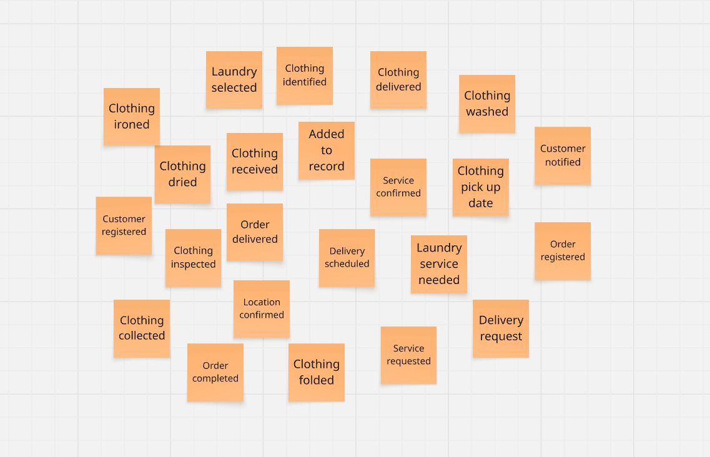

 

**Step 2: Sorting Domain Events (chronologically)**

    Después, los eventos del dominio se ordenan cronológicamente según el momento en que ocurrieron. Esto permite mantener la secuencia correcta de las acciones dentro del sistema y garantizar que los eventos sean procesados respetando el orden en el que sucedieron.

  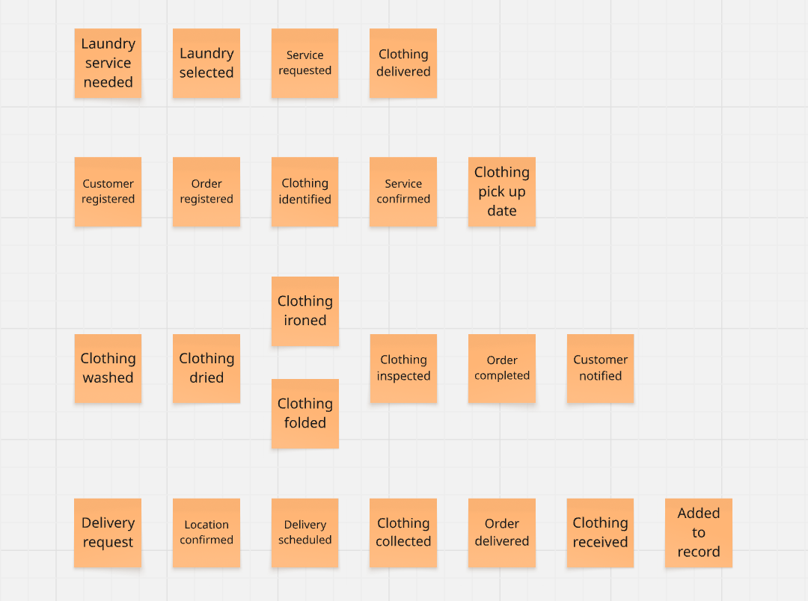

 

**Step 3: Adding Actors and External systems**

    Finalmente, se identifican los actores y sistemas externos que interactúan con el dominio. Esto permite entender quién inicia o participa en las acciones y qué sistemas externos influyen en el flujo del proceso, proporcionando una visión más completa del contexto del sistema.

  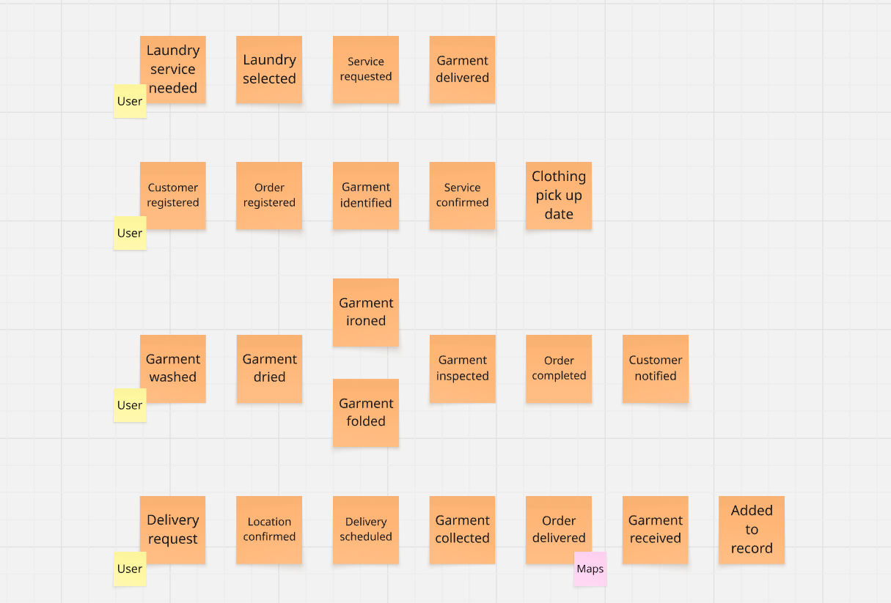

### 2.5. Ubiquitous Language

    El ubiquitous language es un lenguaje común y compartido entre los expertos del negocio y el equipo de desarrollo, su objetivo es asegurar que todos utilicen los mismos términos y conceptos para describir el dominio, evitando malentendidos y facilitando una comunicación clara y consistente durante el diseño y desarrollo del sistema. A continuación, se detallará el Ubiquitous Language, incluyendo los principales términos y conceptos que seran utilizados durante el desarrollo del proyecto.

 

- **Customer:** Persona que solicita y utiliza los servicios de una lavandería.
- **Order:** Conjunto de prendas pertenecientes a un cliente que son entregadas a la lavandería para recibir uno o más servicios.
- **Garment:** Prenda individual que forma parte de un pedido.
- **Service Type:** Tipo específico de servicio solicitado, como lavado, secado, planchado o doblado.
- **Price:** Importe que el cliente debe pagar por los servicios solicitados.
- **Order Record:** Registro que contiene la información asociada a un pedido, como cliente, prendas, servicios, precio y fechas.
- **Order Registration:** Proceso mediante el cual se crea y registra un nuevo pedido con la información proporcionada por el cliente.
- **Garment Identification:** Proceso de identificar y registrar las prendas que forman parte de un pedido.
- **Order Status:** Estado actual en el que se encuentra un pedido durante el proceso de lavandería.
- **Order Tracking:** Seguimiento que permite conocer el estado y avance de un pedido durante su procesamiento.
- **Status Update:** Actualización realizada para reflejar un cambio en el estado del pedido.
- **Delivery Date:** Fecha acordada para que el pedido esté disponible o sea entregado al cliente.
- **Special Instructions:** Indicaciones adicionales proporcionadas por el cliente sobre el cuidado o tratamiento de sus prendas.
- **Washing:** Proceso mediante el cual las prendas son limpiadas de acuerdo con el servicio solicitado.
- **Drying:** Proceso mediante el cual se elimina la humedad de las prendas después del lavado.
- **Ironing:** Proceso mediante el cual se eliminan las arrugas de las prendas utilizando calor y presión.
- **Folding:** Proceso de doblar y organizar las prendas después de su procesamiento.
- **Garment Inspection:** Revisión de las prendas para comprobar que hayan sido procesadas correctamente.
- **Order Verification:** Revisión final para comprobar que el pedido esté completo y coincida con la información registrada.
- **Order Completed:** Evento que indica que los servicios solicitados para el pedido han sido finalizados.
- **Order Ready:** Evento que indica que el pedido está listo para ser recogido o entregado.
- **Pickup:** Proceso mediante el cual las prendas son recogidas en la lavandería o en la ubicación acordada.
- **Delivery:** Proceso mediante el cual las prendas procesadas son entregadas al cliente.
- **Notification:** Comunicación enviada al cliente para informarle sobre un evento o cambio relacionado con su pedido.

---

## Capítulo III: Requirements Specification

### 3.1. User Stories

<table style="border-collapse: collapse; width: 100%;">
  <thead>
    <tr>
      <th style="border: 1px solid black; padding: 8px; text-align: left;">Epic / Story ID</th>
      <th style="border: 1px solid black; padding: 8px; text-align: left;">Título</th>
      <th style="border: 1px solid black; padding: 8px; text-align: left;">Descripción</th>
      <th style="border: 1px solid black; padding: 8px; text-align: left;">Criterios de Aceptación</th>
      <th style="border: 1px solid black; padding: 8px; text-align: left;">Relacionado con (Epic ID)</th>
    </tr>
  </thead>
  <tbody>
    <tr>
      <td style="border: 1px solid black; padding: 8px;">US-001</td>
      <td style="border: 1px solid black; padding: 8px;">Recibir notificaciones del estado del pedido</td>
      <td style="border: 1px solid black; padding: 8px;">Como cliente, quiero recibir notificaciones sobre los cambios de estado de mis prendas, para conocer el avance de mi pedido sin tener que comunicarme con la lavandería.</td>
      <td style="border: 1px solid black; padding: 8px;">
        <b>Escenario: Notificación automática por cambio de estado</b> 
        <b>Dado</b> que el cliente tiene las notificaciones activadas en la aplicación 
        <b>Cuando</b> el pedido cambie a estado de recepción, lavado, secado, planchado o finalización 
        <b>Entonces</b> el sistema envía una notificación identificando el pedido y la fecha 
        <b>Y</b> el cliente puede visualizar el nuevo estado en el historial.  
        <b>Escenario: Configuración de notificaciones</b> 
        <b>Dado</b> que el cliente se encuentra en la configuración de su perfil 
        <b>Cuando</b> selecciona desactivar o activar las notificaciones 
        <b>Entonces</b> el sistema guarda su preferencia.
      </td>
      <td style="border: 1px solid black; padding: 8px;">EP-001: Seguimiento de pedidos</td>
    </tr>
  </tbody>
  <tbody>
    <tr>
      <td style="border: 1px solid black; padding: 8px;">US-002</td>
      <td style="border: 1px solid black; padding: 8px;">Consultar la hora estimada de finalización</td>
      <td style="border: 1px solid black; padding: 8px;">Como cliente, quiero consultar la hora estimada en la que estarán listas mis prendas, para organizar mi tiempo y decidir cuándo recogerlas o solicitar su entrega.</td>
      <td style="border: 1px solid black; padding: 8px;">
        <b>Escenario: Visualización de fecha y hora estimadas</b> 
        <b>Dado</b> que el cliente tiene un pedido en proceso 
        <b>Cuando</b> ingresa a los detalles de su pedido 
        <b>Entonces</b> el sistema muestra la fecha y hora estimadas de finalización.  
        <b>Escenario: Actualización por retraso</b> 
        <b>Dado</b> que un pedido sufre un retraso 
        <b>Cuando</b> se actualiza la hora estimada de finalización 
        <b>Entonces</b> el sistema muestra la nueva hora junto con el motivo 
        <b>Y</b> se notifica al cliente cuando las prendas están listas.
      </td>
      <td style="border: 1px solid black; padding: 8px;">EP-001: Seguimiento de pedidos</td>
    </tr>
  </tbody>
  <tbody>
    <tr>
      <td style="border: 1px solid black; padding: 8px;">US-003</td>
      <td style="border: 1px solid black; padding: 8px;">Solicitar recojo de prendas a domicilio</td>
      <td style="border: 1px solid black; padding: 8px;">Como cliente, quiero solicitar el recojo de mis prendas desde mi domicilio, para enviar mi ropa a la lavandería sin trasladarme al establecimiento.</td>
      <td style="border: 1px solid black; padding: 8px;">
        <b>Escenario: Solicitud exitosa de recojo a domicilio</b> 
        <b>Dado</b> que el cliente desea enviar prendas a la lavandería 
        <b>Cuando</b> registra/selecciona una dirección y elige una fecha y rango horario 
        <b>Entonces</b> el sistema muestra el costo del servicio 
        <b>Y</b> al confirmar, el cliente recibe la confirmación y el estado del recojo.
      </td>
      <td style="border: 1px solid black; padding: 8px;">EP-002: Logística a domicilio</td>
    </tr>
  </tbody>
  <tbody>
    <tr>
      <td style="border: 1px solid black; padding: 8px;">US-004</td>
      <td style="border: 1px solid black; padding: 8px;">Solicitar entrega de prendas a domicilio</td>
      <td style="border: 1px solid black; padding: 8px;">Como cliente, quiero solicitar la entrega de mis prendas a domicilio cuando estén listas, para recibirlas sin tener que ir a la lavandería.</td>
      <td style="border: 1px solid black; padding: 8px;">
        <b>Escenario: Programación de entrega a domicilio</b> 
        <b>Dado</b> que el pedido se encuentra en estado "Listo" 
        <b>Cuando</b> el cliente selecciona entrega a domicilio, dirección y rango horario 
        <b>Entonces</b> el sistema muestra el costo total antes de confirmar 
        <b>Y</b> tras confirmar, se envían notificaciones de asignación, salida y entrega 
        <b>Y</b> la entrega se marca completada solo tras la confirmación final.
      </td>
      <td style="border: 1px solid black; padding: 8px;">EP-002: Logística a domicilio</td>
    </tr>
  </tbody>
  <tbody>
    <tr>
      <td style="border: 1px solid black; padding: 8px;">US-005</td>
      <td style="border: 1px solid black; padding: 8px;">Registrar clientes</td>
      <td style="border: 1px solid black; padding: 8px;">Como encargado de lavandería, quiero registrar los datos de mis clientes para mantener organizada su información.</td>
      <td style="border: 1px solid black; padding: 8px;">
        <b>Escenario: Registro de un nuevo cliente</b> 
        <b>Dado</b> que el encargado está en el módulo de clientes 
        <b>Cuando</b> ingresa el nombre, teléfono y correo electrónico cumpliendo las validaciones 
        <b>Entonces</b> el sistema guarda el perfil del cliente 
        <b>Y</b> permite editar y consultar la información posteriormente.
      </td>
      <td style="border: 1px solid black; padding: 8px;">EP-003: Gestión de clientes</td>
    </tr>
  </tbody>
  <tbody>
    <tr>
      <td style="border: 1px solid black; padding: 8px;">US-006</td>
      <td style="border: 1px solid black; padding: 8px;">Crear pedidos</td>
      <td style="border: 1px solid black; padding: 8px;">Como encargado de lavandería, quiero crear un pedido asociado a un cliente para controlar el servicio solicitado.</td>
      <td style="border: 1px solid black; padding: 8px;">
        <b>Escenario: Creación exitosa de un pedido</b> 
        <b>Dado</b> que el encargado tiene un cliente registrado y sus prendas 
        <b>Cuando</b> ingresa los servicios, las prendas, el precio y la fecha estimada 
        <b>Entonces</b> el sistema genera un código único asociado al cliente 
        <b>Y</b> muestra una confirmación de creación.
      </td>
      <td style="border: 1px solid black; padding: 8px;">EP-004: Gestión de pedidos</td>
    </tr>
  </tbody>
  <tbody>
    <tr>
      <td style="border: 1px solid black; padding: 8px;">US-007</td>
      <td style="border: 1px solid black; padding: 8px;">Registrar prendas</td>
      <td style="border: 1px solid black; padding: 8px;">Como encargado, quiero registrar las prendas incluidas en un pedido para evitar pérdidas o confusiones.</td>
      <td style="border: 1px solid black; padding: 8px;">
        <b>Escenario: Detalle de prendas por pedido</b> 
        <b>Dado</b> que el encargado está creando o editando un pedido 
        <b>Cuando</b> registra el tipo, cantidad, características y observaciones de cada prenda 
        <b>Entonces</b> cada prenda queda asociada de forma segura a ese pedido 
        <b>Y</b> el encargado puede consultar el detalle individual.
      </td>
      <td style="border: 1px solid black; padding: 8px;">EP-004: Gestión de pedidos</td>
    </tr>
  </tbody>
  <tbody>
    <tr>
      <td style="border: 1px solid black; padding: 8px;">US-008</td>
      <td style="border: 1px solid black; padding: 8px;">Actualizar estado del pedido</td>
      <td style="border: 1px solid black; padding: 8px;">Como trabajador de lavandería, quiero actualizar el estado de un pedido para que el cliente conozca su progreso.</td>
      <td style="border: 1px solid black; padding: 8px;">
        <b>Escenario: Actualización manual de estado</b> 
        <b>Dado</b> que el trabajador ha procesado un pedido 
        <b>Cuando</b> selecciona un nuevo estado (ej. lavado, secado, listo) 
        <b>Entonces</b> el sistema guarda la fecha, hora y el usuario que realizó el cambio 
        <b>Y</b> envía una notificación al cliente.
      </td>
      <td style="border: 1px solid black; padding: 8px;">EP-001: Seguimiento de pedidos</td>
    </tr>
  </tbody>
  <tbody>
    <tr>
      <td style="border: 1px solid black; padding: 8px;">US-009</td>
      <td style="border: 1px solid black; padding: 8px;">Consultar historial de pedidos</td>
      <td style="border: 1px solid black; padding: 8px;">Como cliente, quiero consultar mis pedidos anteriores para revisar los servicios realizados y sus detalles.</td>
      <td style="border: 1px solid black; padding: 8px;">
        <b>Escenario: Consulta del listado histórico</b> 
        <b>Dado</b> que el cliente ha completado pedidos en el pasado 
        <b>Cuando</b> accede a la sección de historial 
        <b>Entonces</b> el sistema muestra los pedidos ordenados por fecha 
        <b>Y</b> permite buscar y visualizar prendas, servicios, precio y estado.
      </td>
      <td style="border: 1px solid black; padding: 8px;">EP-005: Historial de operaciones</td>
    </tr>
  </tbody>
  <tbody>
    <tr>
      <td style="border: 1px solid black; padding: 8px;">US-010</td>
      <td style="border: 1px solid black; padding: 8px;">Buscar y filtrar pedidos</td>
      <td style="border: 1px solid black; padding: 8px;">Como encargado, quiero buscar y filtrar pedidos para encontrar rápidamente una orden.</td>
      <td style="border: 1px solid black; padding: 8px;">
        <b>Escenario: Búsqueda ágil de pedidos</b> 
        <b>Dado</b> que el encargado necesita localizar una orden 
        <b>Cuando</b> ingresa un código, cliente, teléfono o aplica filtros de estado/fecha 
        <b>Entonces</b> el sistema muestra los resultados correspondientes en pantalla.
      </td>
      <td style="border: 1px solid black; padding: 8px;">EP-004: Gestión de pedidos</td>
    </tr>
  </tbody>
  <tbody>
    <tr>
      <td style="border: 1px solid black; padding: 8px;">US-011</td>
      <td style="border: 1px solid black; padding: 8px;">Registrar pagos</td>
      <td style="border: 1px solid black; padding: 8px;">Como encargado, quiero registrar el pago de un pedido para mantener actualizado el estado financiero de la orden.</td>
      <td style="border: 1px solid black; padding: 8px;">
        <b>Escenario: Actualización de estado financiero local</b> 
        <b>Dado</b> que el cliente realiza un abono en el local 
        <b>Cuando</b> el encargado registra el monto, método y fecha 
        <b>Entonces</b> el pago queda asociado al pedido 
        <b>Y</b> el pedido cambia a estado "Pendiente", "Parcial" o "Pagado".
      </td>
      <td style="border: 1px solid black; padding: 8px;">EP-006: Gestión de pagos</td>
    </tr>
  </tbody>
  <tbody>
    <tr>
      <td style="border: 1px solid black; padding: 8px;">US-012</td>
      <td style="border: 1px solid black; padding: 8px;">Realizar pagos digitales</td>
      <td style="border: 1px solid black; padding: 8px;">Como cliente, quiero pagar mi pedido desde la plataforma para completar el servicio de forma rápida y segura.</td>
      <td style="border: 1px solid black; padding: 8px;">
        <b>Escenario: Procesamiento de pago digital</b> 
        <b>Dado</b> que el cliente revisa un pedido con saldo pendiente 
        <b>Cuando</b> selecciona un medio de pago y la pasarela confirma la operación 
        <b>Entonces</b> el estado del pago se actualiza automáticamente en el sistema.
      </td>
      <td style="border: 1px solid black; padding: 8px;">EP-006: Gestión de pagos</td>
    </tr>
  </tbody>
  <tbody>
    <tr>
      <td style="border: 1px solid black; padding: 8px;">US-013</td>
      <td style="border: 1px solid black; padding: 8px;">Gestionar incidencias</td>
      <td style="border: 1px solid black; padding: 8px;">Como encargado, quiero registrar incidencias relacionadas con prendas o pedidos para comunicar una solución al cliente.</td>
      <td style="border: 1px solid black; padding: 8px;">
        <b>Escenario: Registro de incidencia</b> 
        <b>Dado</b> que ocurre un problema con un pedido 
        <b>Cuando</b> el encargado registra el tipo, descripción y evidencia 
        <b>Entonces</b> el cliente recibe una notificación 
        <b>Y</b> la incidencia puede marcarse como abierta, en revisión o resuelta.
      </td>
      <td style="border: 1px solid black; padding: 8px;">EP-007: Atención de incidencias</td>
    </tr>
  </tbody>
  <tbody>
    <tr>
      <td style="border: 1px solid black; padding: 8px;">US-014</td>
      <td style="border: 1px solid black; padding: 8px;">Visualizar dashboard operativo</td>
      <td style="border: 1px solid black; padding: 8px;">Como propietario de lavandería, quiero consultar indicadores del negocio para conocer el estado de mis operaciones.</td>
      <td style="border: 1px solid black; padding: 8px;">
        <b>Escenario: Visualización de métricas</b> 
        <b>Dado</b> que el propietario accede al dashboard 
        <b>Cuando</b> el panel carga los datos del periodo seleccionado 
        <b>Entonces</b> se muestran los pedidos por estado, ingresos y nuevos clientes.
      </td>
      <td style="border: 1px solid black; padding: 8px;">EP-008: Reportes y dashboard</td>
    </tr>
  </tbody>
  <tbody>
    <tr>
      <td style="border: 1px solid black; padding: 8px;">US-015</td>
      <td style="border: 1px solid black; padding: 8px;">Administrar servicios y precios</td>
      <td style="border: 1px solid black; padding: 8px;">Como propietario, quiero configurar los servicios y precios de mi lavandería para mantener actualizada la oferta.</td>
      <td style="border: 1px solid black; padding: 8px;">
        <b>Escenario: Modificación del catálogo</b> 
        <b>Dado</b> que el propietario se encuentra en la configuración 
        <b>Cuando</b> crea, edita o desactiva servicios indicando su precio y tiempo 
        <b>Entonces</b> los cambios se guardan y reflejan solo en los nuevos pedidos.
      </td>
      <td style="border: 1px solid black; padding: 8px;">EP-009: Configuración de la lavandería</td>
    </tr>
  </tbody>
  <tbody>
    <tr>
      <td style="border: 1px solid black; padding: 8px;">US-016</td>
      <td style="border: 1px solid black; padding: 8px;">Gestionar usuarios y roles</td>
      <td style="border: 1px solid black; padding: 8px;">Como propietario, quiero administrar los accesos del personal para controlar qué acciones puede realizar cada usuario.</td>
      <td style="border: 1px solid black; padding: 8px;">
        <b>Escenario: Asignación de roles</b> 
        <b>Dado</b> que el propietario necesita dar acceso a un trabajador 
        <b>Cuando</b> crea el usuario y le asigna un rol específico 
        <b>Entonces</b> el sistema restringe las funciones según los permisos asignados.
      </td>
      <td style="border: 1px solid black; padding: 8px;">EP-010: Administración de usuarios</td>
    </tr>
  </tbody>
  <tbody>
    <tr>
      <td style="border: 1px solid black; padding: 8px;">US-017</td>
      <td style="border: 1px solid black; padding: 8px;">Confirmar entrega del pedido</td>
      <td style="border: 1px solid black; padding: 8px;">Como encargado, quiero registrar la entrega de un pedido para cerrar correctamente el proceso.</td>
      <td style="border: 1px solid black; padding: 8px;">
        <b>Escenario: Cierre de proceso por entrega</b> 
        <b>Dado</b> que el pedido ha llegado al cliente 
        <b>Cuando</b> se solicita y obtiene la confirmación de recepción 
        <b>Entonces</b> se registra la fecha, hora y responsable 
        <b>Y</b> el pedido cambia a estado "Entregado" en el historial.
      </td>
      <td style="border: 1px solid black; padding: 8px;">EP-002: Logística a domicilio</td>
    </tr>
  </tbody>
  <tbody>
    <tr>
      <td style="border: 1px solid black; padding: 8px;">US-018</td>
      <td style="border: 1px solid black; padding: 8px;">Calificar el servicio</td>
      <td style="border: 1px solid black; padding: 8px;">Como cliente, quiero calificar el servicio recibido para expresar mi nivel de satisfacción y ayudar a la lavandería a mejorar.</td>
      <td style="border: 1px solid black; padding: 8px;">
        <b>Escenario: Envío de calificación</b> 
        <b>Dado</b> que un pedido ha sido entregado 
        <b>Cuando</b> el cliente califica de 1 a 5 y añade un comentario opcional 
        <b>Entonces</b> la evaluación queda asociada al pedido para los reportes.
      </td>
      <td style="border: 1px solid black; padding: 8px;">EP-011: Satisfacción del cliente</td>
    </tr>
  </tbody>
  <tbody>
    <tr>
      <td style="border: 1px solid black; padding: 8px;">US-019</td>
      <td style="border: 1px solid black; padding: 8px;">Gestionar suscripción</td>
      <td style="border: 1px solid black; padding: 8px;">Como propietario, quiero seleccionar un plan de suscripción para utilizar las funcionalidades disponibles según las necesidades de mi lavandería.</td>
      <td style="border: 1px solid black; padding: 8px;">
        <b>Escenario: Cambio de plan de suscripción</b> 
        <b>Dado</b> que el propietario ingresa al módulo de suscripciones 
        <b>Cuando</b> visualiza los planes y selecciona uno nuevo 
        <b>Entonces</b> el sistema actualiza el estado y habilita/restringe funcionalidades.
      </td>
      <td style="border: 1px solid black; padding: 8px;">EP-012: Suscripciones</td>
    </tr>
  </tbody>
  <tbody>
    <tr>
      <td style="border: 1px solid black; padding: 8px;">US-020</td>
      <td style="border: 1px solid black; padding: 8px;">Exportar reportes</td>
      <td style="border: 1px solid black; padding: 8px;">Como propietario, quiero exportar reportes de pedidos y pagos para analizarlos o conservarlos como respaldo.</td>
      <td style="border: 1px solid black; padding: 8px;">
        <b>Escenario: Exportación de documentos</b> 
        <b>Dado</b> que el propietario requiere respaldar información 
        <b>Cuando</b> filtra por periodo y selecciona exportar 
        <b>Entonces</b> el sistema genera un PDF o Excel con los detalles y totales.
      </td>
      <td style="border: 1px solid black; padding: 8px;">EP-008: Reportes y dashboard</td>
    </tr>
  </tbody>
  <tbody>
    <tr>
      <td style="border: 1px solid black; padding: 8px;">US-021</td>
      <td style="border: 1px solid black; padding: 8px;">Priorizar pedidos por fecha de entrega</td>
      <td style="border: 1px solid black; padding: 8px;">Como propietario de lavandería, quiero ordenar los pedidos según su fecha prevista de entrega para atender primero los pedidos más próximos a vencer.</td>
      <td style="border: 1px solid black; padding: 8px;">
        <b>Escenario: Ordenamiento y alertas visuales</b> 
        <b>Dado</b> que existen múltiples pedidos en proceso 
        <b>Cuando</b> el propietario visualiza la lista 
        <b>Entonces</b> el sistema los ordena por fecha prevista 
        <b>Y</b> resalta visualmente los atrasados y muestra observaciones clave.
      </td>
      <td style="border: 1px solid black; padding: 8px;">EP-004: Gestión de pedidos</td>
    </tr>
  </tbody>
  <tbody>
    <tr>
      <td style="border: 1px solid black; padding: 8px;">US-022</td>
      <td style="border: 1px solid black; padding: 8px;">Visualizar pedidos pendientes y próximos a entregar</td>
      <td style="border: 1px solid black; padding: 8px;">Como trabajador de lavandería, quiero visualizar los pedidos pendientes y próximos a entregar en una sola pantalla para organizar el trabajo durante los periodos de alta demanda.</td>
      <td style="border: 1px solid black; padding: 8px;">
        <b>Escenario: Panel centralizado</b> 
        <b>Dado</b> que el trabajador ingresa al panel de control 
        <b>Cuando</b> visualiza los pedidos en curso 
        <b>Entonces</b> puede filtrarlos por estado y fecha 
        <b>Y</b> el sistema diferencia los atrasados de los que están en plazo.
      </td>
      <td style="border: 1px solid black; padding: 8px;">EP-001: Seguimiento de pedidos</td>
    </tr>
  </tbody>
  <tbody>
    <tr>
      <td style="border: 1px solid black; padding: 8px;">US-023</td>
      <td style="border: 1px solid black; padding: 8px;">Registrar instrucciones especiales del pedido</td>
      <td style="border: 1px solid black; padding: 8px;">Como encargado de lavandería, quiero registrar instrucciones especiales y compromisos de recojo o entrega para asegurar que el pedido sea atendido según lo acordado con el cliente.</td>
      <td style="border: 1px solid black; padding: 8px;">
        <b>Escenario: Registro de observaciones</b> 
        <b>Dado</b> que un pedido tiene requerimientos específicos 
        <b>Cuando</b> el encargado las registra en el sistema 
        <b>Entonces</b> se muestran visiblemente durante la gestión y entrega 
        <b>Y</b> se conservan en el historial.
      </td>
      <td style="border: 1px solid black; padding: 8px;">EP-004: Gestión de pedidos</td>
    </tr>
  </tbody>
  <tbody>
    <tr>
      <td style="border: 1px solid black; padding: 8px;">US-024</td>
      <td style="border: 1px solid black; padding: 8px;">Registrar comunicaciones con el cliente</td>
      <td style="border: 1px solid black; padding: 8px;">Como encargado de lavandería, quiero registrar las comunicaciones realizadas mediante WhatsApp o llamadas telefónicas para mantener un historial de avisos, consultas e inconvenientes del pedido.</td>
      <td style="border: 1px solid black; padding: 8px;">
        <b>Escenario: Historial de interacciones</b> 
        <b>Dado</b> que el encargado contacta al cliente 
        <b>Cuando</b> registra el canal, motivo y resumen 
        <b>Entonces</b> se guarda la fecha y hora exacta 
        <b>Y</b> queda enlazado al cliente y pedido.
      </td>
      <td style="border: 1px solid black; padding: 8px;">EP-007: Atención de incidencias</td>
    </tr>
  </tbody>
  <tbody>
    <tr>
      <td style="border: 1px solid black; padding: 8px;">US-025</td>
      <td style="border: 1px solid black; padding: 8px;">Coordinar entregas a domicilio</td>
      <td style="border: 1px solid black; padding: 8px;">Como propietario de lavandería, quiero consultar las direcciones y horarios acordados para organizar las entregas a domicilio de manera ordenada.</td>
      <td style="border: 1px solid black; padding: 8px;">
        <b>Escenario: Gestión de logística</b> 
        <b>Dado</b> que existen entregas a domicilio programadas 
        <b>Cuando</b> el propietario consulta el panel 
        <b>Entonces</b> puede ver direcciones y horarios 
        <b>Y</b> marcar la entrega como programada, realizada o no realizada.
      </td>
      <td style="border: 1px solid black; padding: 8px;">EP-002: Logística a domicilio</td>
    </tr>
  </tbody>
  <tbody>
    <tr>
      <td style="border: 1px solid black; padding: 8px;">US-026</td>
      <td style="border: 1px solid black; padding: 8px;">Identificar las prendas mediante un código</td>
      <td style="border: 1px solid black; padding: 8px;">Como trabajador de lavandería, quiero identificar cada pedido mediante un código o etiqueta para evitar la pérdida, confusión o asignación incorrecta de prendas.</td>
      <td style="border: 1px solid black; padding: 8px;">
        <b>Escenario: Trazabilidad por código</b> 
        <b>Dado</b> que un pedido ha sido creado 
        <b>Cuando</b> el trabajador consulta el detalle o prepara prendas 
        <b>Entonces</b> visualiza el código único para procesarlas correctamente.
      </td>
      <td style="border: 1px solid black; padding: 8px;">EP-004: Gestión de pedidos</td>
    </tr>
  </tbody>
  <tbody>
    <tr>
      <td style="border: 1px solid black; padding: 8px;">US-027</td>
      <td style="border: 1px solid black; padding: 8px;">Validar las prendas antes de entregar el pedido</td>
      <td style="border: 1px solid black; padding: 8px;">Como trabajador de lavandería, quiero revisar el detalle de las prendas antes de entregar un pedido para confirmar que corresponde al cliente correcto.</td>
      <td style="border: 1px solid black; padding: 8px;">
        <b>Escenario: Validación y registro de discrepancias</b> 
        <b>Dado</b> que el trabajador está por entregar un pedido 
        <b>Cuando</b> verifica las prendas y cantidades en el sistema 
        <b>Entonces</b> puede confirmar la entrega exitosa 
        <b>O</b> registrar una incidencia antes de cerrarla si existe una diferencia.
      </td>
      <td style="border: 1px solid black; padding: 8px;">EP-007: Atención de incidencias</td>
    </tr>
  </tbody>
<!--
  <thead>
    <tr>
      <th style="border: 1px solid black; padding: 8px; text-align: left;">Epic / Story ID</th>
      <th style="border: 1px solid black; padding: 8px; text-align: left;">Título</th>
      <th style="border: 1px solid black; padding: 8px; text-align: left;">Descripción</th>
      <th style="border: 1px solid black; padding: 8px; text-align: left;">Criterios de Aceptación</th>
      <th style="border: 1px solid black; padding: 8px; text-align: left;">Relacionado con (Epic ID)</th>
    </tr>
  </thead>
  <tbody>
    <tr>
      <td style="border: 1px solid black; padding: 8px;">US-001</td>
      <td style="border: 1px solid black; padding: 8px;">Recibir notificaciones del estado del pedido</td>
      <td style="border: 1px solid black; padding: 8px;">Como cliente, quiero recibir notificaciones sobre los cambios de estado de mis prendas, para conocer el avance de mi pedido sin tener que comunicarme con la lavandería.</td>
      <td style="border: 1px solid black; padding: 8px;">1. El sistema notifica la recepción, lavado, secado, planchado y finalización del pedido. 2. La notificación identifica el pedido y la fecha de actualización. 3. El cliente puede consultar el historial de estados desde la aplicación. 4. El cliente puede activar o desactivar las notificaciones.</td>
      <td style="border: 1px solid black; padding: 8px;">EP-001: Seguimiento de pedidos</td>
    </tr>
  </tbody>
  <tbody>
    <tr>
      <td style="border: 1px solid black; padding: 8px;">US-002</td>
      <td style="border: 1px solid black; padding: 8px;">Consultar la hora estimada de finalización</td>
      <td style="border: 1px solid black; padding: 8px;">Como cliente, quiero consultar la hora estimada en la que estarán listas mis prendas, para organizar mi tiempo y decidir cuándo recogerlas o solicitar su entrega.</td>
      <td style="border: 1px solid black; padding: 8px;">1. El sistema muestra una fecha y hora estimadas de finalización. 2. La estimación se actualiza si ocurre un retraso o cambio en el servicio. 3. El cliente recibe una notificación cuando las prendas están listas. 4. Si existe un retraso, se muestra la nueva hora estimada y el motivo registrado.</td>
      <td style="border: 1px solid black; padding: 8px;">EP-001: Seguimiento de pedidos</td>
    </tr>
  </tbody>
  <tbody>
    <tr>
      <td style="border: 1px solid black; padding: 8px;">US-003</td>
      <td style="border: 1px solid black; padding: 8px;">Solicitar recojo de prendas a domicilio</td>
      <td style="border: 1px solid black; padding: 8px;">Como cliente, quiero solicitar el recojo de mis prendas desde mi domicilio, para enviar mi ropa a la lavandería sin trasladarme al establecimiento.</td>
      <td style="border: 1px solid black; padding: 8px;">1. El cliente puede registrar o seleccionar una dirección de recojo. 2. El cliente puede elegir una fecha y un rango horario disponible. 3. El sistema muestra el costo del servicio antes de confirmar. 4. El cliente recibe la confirmación y el estado del recojo.</td>
      <td style="border: 1px solid black; padding: 8px;">EP-002: Logística a domicilio</td>
    </tr>
  </tbody>
  <tbody>
    <tr>
      <td style="border: 1px solid black; padding: 8px;">US-004</td>
      <td style="border: 1px solid black; padding: 8px;">Solicitar entrega de prendas a domicilio</td>
      <td style="border: 1px solid black; padding: 8px;">Como cliente, quiero solicitar la entrega de mis prendas a domicilio cuando estén listas, para recibirlas sin tener que ir a la lavandería.</td>
      <td style="border: 1px solid black; padding: 8px;">1. La opción de entrega está disponible cuando el pedido se encuentra listo. 2. El cliente puede seleccionar una dirección y un rango horario de entrega. 3. El sistema muestra el costo total antes de confirmar. 4. El cliente recibe notificaciones sobre la asignación, salida y entrega del pedido. 5. La entrega se marca como completada únicamente después de la confirmación del cliente o repartidor.</td>
      <td style="border: 1px solid black; padding: 8px;">EP-002: Logística a domicilio</td>
    </tr>
  </tbody>
  <tbody>
    <tr>
      <td style="border: 1px solid black; padding: 8px;">US-005</td>
      <td style="border: 1px solid black; padding: 8px;">Registrar clientes</td>
      <td style="border: 1px solid black; padding: 8px;">Como encargado de lavandería, quiero registrar los datos de mis clientes para mantener organizada su información.</td>
      <td style="border: 1px solid black; padding: 8px;">1. El sistema permite registrar nombre, teléfono y correo. 2. Se validan los campos obligatorios. 3. El encargado puede editar y consultar la información registrada.</td>
      <td style="border: 1px solid black; padding: 8px;">EP-003: Gestión de clientes</td>
    </tr>
  </tbody>
  <tbody>
    <tr>
      <td style="border: 1px solid black; padding: 8px;">US-006</td>
      <td style="border: 1px solid black; padding: 8px;">Crear pedidos</td>
      <td style="border: 1px solid black; padding: 8px;">Como encargado de lavandería, quiero crear un pedido asociado a un cliente para controlar el servicio solicitado.</td>
      <td style="border: 1px solid black; padding: 8px;">1. Se registra el cliente, los servicios, las prendas, el precio y la fecha estimada. 2. El sistema genera un código único para el pedido. 3. El sistema muestra una confirmación de creación.</td>
      <td style="border: 1px solid black; padding: 8px;">EP-004: Gestión de pedidos</td>
    </tr>
  </tbody>
  <tbody>
    <tr>
      <td style="border: 1px solid black; padding: 8px;">US-007</td>
      <td style="border: 1px solid black; padding: 8px;">Registrar prendas</td>
      <td style="border: 1px solid black; padding: 8px;">Como encargado, quiero registrar las prendas incluidas en un pedido para evitar pérdidas o confusiones.</td>
      <td style="border: 1px solid black; padding: 8px;">1. Se registra el tipo, cantidad, características y observaciones de cada prenda. 2. Cada prenda queda asociada a un pedido. 3. El encargado puede consultar el detalle de las prendas.</td>
      <td style="border: 1px solid black; padding: 8px;">EP-004: Gestión de pedidos</td>
    </tr>
  </tbody>
  <tbody>
    <tr>
      <td style="border: 1px solid black; padding: 8px;">US-008</td>
      <td style="border: 1px solid black; padding: 8px;">Actualizar estado del pedido</td>
      <td style="border: 1px solid black; padding: 8px;">Como trabajador de lavandería, quiero actualizar el estado de un pedido para que el cliente conozca su progreso.</td>
      <td style="border: 1px solid black; padding: 8px;">1. El sistema permite seleccionar estados como recibido, en lavado, secado, planchado, listo y entregado. 2. Se guarda la fecha, hora y usuario del cambio. 3. El cliente recibe una notificación del cambio.</td>
      <td style="border: 1px solid black; padding: 8px;">EP-001: Seguimiento de pedidos</td>
    </tr>
  </tbody>
  <tbody>
    <tr>
      <td style="border: 1px solid black; padding: 8px;">US-009</td>
      <td style="border: 1px solid black; padding: 8px;">Consultar historial de pedidos</td>
      <td style="border: 1px solid black; padding: 8px;">Como cliente, quiero consultar mis pedidos anteriores para revisar los servicios realizados y sus detalles.</td>
      <td style="border: 1px solid black; padding: 8px;">1. El sistema muestra los pedidos ordenados por fecha. 2. El cliente puede consultar prendas, servicios, precio y estado final. 3. El cliente puede buscar un pedido específico.</td>
      <td style="border: 1px solid black; padding: 8px;">EP-005: Historial de operaciones</td>
    </tr>
  </tbody>
  <tbody>
    <tr>
      <td style="border: 1px solid black; padding: 8px;">US-010</td>
      <td style="border: 1px solid black; padding: 8px;">Buscar y filtrar pedidos</td>
      <td style="border: 1px solid black; padding: 8px;">Como encargado, quiero buscar y filtrar pedidos para encontrar rápidamente una orden.</td>
      <td style="border: 1px solid black; padding: 8px;">1. Se puede buscar por código, cliente o teléfono. 2. Se puede filtrar por estado y fecha. 3. El sistema muestra los resultados correspondientes.</td>
      <td style="border: 1px solid black; padding: 8px;">EP-004: Gestión de pedidos</td>
    </tr>
  </tbody>
  <tbody>
    <tr>
      <td style="border: 1px solid black; padding: 8px;">US-011</td>
      <td style="border: 1px solid black; padding: 8px;">Registrar pagos</td>
      <td style="border: 1px solid black; padding: 8px;">Como encargado, quiero registrar el pago de un pedido para mantener actualizado el estado financiero de la orden.</td>
      <td style="border: 1px solid black; padding: 8px;">1. Se registra el monto, método y fecha de pago. 2. El pedido muestra el estado pendiente, parcial o pagado. 3. El pago queda asociado al pedido correspondiente.</td>
      <td style="border: 1px solid black; padding: 8px;">EP-006: Gestión de pagos</td>
    </tr>
  </tbody>
  <tbody>
    <tr>
      <td style="border: 1px solid black; padding: 8px;">US-012</td>
      <td style="border: 1px solid black; padding: 8px;">Realizar pagos digitales</td>
      <td style="border: 1px solid black; padding: 8px;">Como cliente, quiero pagar mi pedido desde la plataforma para completar el servicio de forma rápida y segura.</td>
      <td style="border: 1px solid black; padding: 8px;">1. El sistema muestra el monto total. 2. El cliente puede seleccionar un medio de pago. 3. Se confirma o rechaza la operación. 4. El estado del pago se actualiza automáticamente.</td>
      <td style="border: 1px solid black; padding: 8px;">EP-006: Gestión de pagos</td>
    </tr>
  </tbody>
  <tbody>
    <tr>
      <td style="border: 1px solid black; padding: 8px;">US-013</td>
      <td style="border: 1px solid black; padding: 8px;">Gestionar incidencias</td>
      <td style="border: 1px solid black; padding: 8px;">Como encargado, quiero registrar incidencias relacionadas con prendas o pedidos para comunicar una solución al cliente.</td>
      <td style="border: 1px solid black; padding: 8px;">1. Se registra el tipo, descripción y evidencia de la incidencia. 2. El cliente recibe una notificación. 3. La incidencia puede marcarse como abierta, en revisión o resuelta.</td>
      <td style="border: 1px solid black; padding: 8px;">EP-007: Atención de incidencias</td>
    </tr>
  </tbody>
  <tbody>
    <tr>
      <td style="border: 1px solid black; padding: 8px;">US-014</td>
      <td style="border: 1px solid black; padding: 8px;">Visualizar dashboard operativo</td>
      <td style="border: 1px solid black; padding: 8px;">Como propietario de lavandería, quiero consultar indicadores del negocio para conocer el estado de mis operaciones.</td>
      <td style="border: 1px solid black; padding: 8px;">1. Se muestran pedidos pendientes, en proceso, listos y entregados. 2. Se muestran ingresos y clientes registrados. 3. Los indicadores pueden filtrarse por periodo.</td>
      <td style="border: 1px solid black; padding: 8px;">EP-008: Reportes y dashboard</td>
    </tr>
  </tbody>
  <tbody>
    <tr>
      <td style="border: 1px solid black; padding: 8px;">US-015</td>
      <td style="border: 1px solid black; padding: 8px;">Administrar servicios y precios</td>
      <td style="border: 1px solid black; padding: 8px;">Como propietario, quiero configurar los servicios y precios de mi lavandería para mantener actualizada la oferta.</td>
      <td style="border: 1px solid black; padding: 8px;">1. Se pueden crear, editar, activar y desactivar servicios. 2. Cada servicio tiene un precio y tiempo estimado. 3. Los cambios se reflejan en los nuevos pedidos.</td>
      <td style="border: 1px solid black; padding: 8px;">EP-009: Configuración de la lavandería</td>
    </tr>
  </tbody>
  <tbody>
    <tr>
      <td style="border: 1px solid black; padding: 8px;">US-016</td>
      <td style="border: 1px solid black; padding: 8px;">Gestionar usuarios y roles</td>
      <td style="border: 1px solid black; padding: 8px;">Como propietario, quiero administrar los accesos del personal para controlar qué acciones puede realizar cada usuario.</td>
      <td style="border: 1px solid black; padding: 8px;">1. El propietario puede crear y desactivar usuarios. 2. Puede asignar roles de propietario, administrador o trabajador. 3. El sistema restringe las funciones según los permisos asignados.</td>
      <td style="border: 1px solid black; padding: 8px;">EP-010: Administración de usuarios</td>
    </tr>
  </tbody>
  <tbody>
    <tr>
      <td style="border: 1px solid black; padding: 8px;">US-017</td>
      <td style="border: 1px solid black; padding: 8px;">Confirmar entrega del pedido</td>
      <td style="border: 1px solid black; padding: 8px;">Como encargado, quiero registrar la entrega de un pedido para cerrar correctamente el proceso.</td>
      <td style="border: 1px solid black; padding: 8px;">1. Se registra la fecha, hora y responsable de la entrega. 2. Se solicita confirmación del cliente o encargado. 3. El pedido cambia al estado entregado y permanece en el historial.</td>
      <td style="border: 1px solid black; padding: 8px;">EP-002: Logística a domicilio</td>
    </tr>
  </tbody>
  <tbody>
    <tr>
      <td style="border: 1px solid black; padding: 8px;">US-018</td>
      <td style="border: 1px solid black; padding: 8px;">Calificar el servicio</td>
      <td style="border: 1px solid black; padding: 8px;">Como cliente, quiero calificar el servicio recibido para expresar mi nivel de satisfacción y ayudar a la lavandería a mejorar.</td>
      <td style="border: 1px solid black; padding: 8px;">1. El cliente puede calificar de 1 a 5. 2. Puede agregar un comentario opcional. 3. La evaluación queda asociada al pedido y aparece en los reportes.</td>
      <td style="border: 1px solid black; padding: 8px;">EP-011: Satisfacción del cliente</td>
    </tr>
  </tbody>
  <tbody>
    <tr>
      <td style="border: 1px solid black; padding: 8px;">US-019</td>
      <td style="border: 1px solid black; padding: 8px;">Gestionar suscripción</td>
      <td style="border: 1px solid black; padding: 8px;">Como propietario, quiero seleccionar un plan de suscripción para utilizar las funcionalidades disponibles según las necesidades de mi lavandería.</td>
      <td style="border: 1px solid black; padding: 8px;">1. Se muestran los planes, precios, límites y beneficios. 2. El propietario puede cambiar de plan. 3. El sistema informa el estado de la suscripción.</td>
      <td style="border: 1px solid black; padding: 8px;">EP-012: Suscripciones</td>
    </tr>
  </tbody>
  <tbody>
    <tr>
      <td style="border: 1px solid black; padding: 8px;">US-020</td>
      <td style="border: 1px solid black; padding: 8px;">Exportar reportes</td>
      <td style="border: 1px solid black; padding: 8px;">Como propietario, quiero exportar reportes de pedidos y pagos para analizarlos o conservarlos como respaldo.</td>
      <td style="border: 1px solid black; padding: 8px;">1. Se puede filtrar la información por periodo. 2. El sistema permite exportar el reporte en PDF o Excel. 3. El reporte incluye totales y detalle de las operaciones.</td>
      <td style="border: 1px solid black; padding: 8px;">EP-008: Reportes y dashboard</td>
    </tr>
  </tbody>
  <tbody>
    <tr>
      <td style="border: 1px solid black; padding: 8px;">US-021</td>
      <td style="border: 1px solid black; padding: 8px;">Priorizar pedidos por fecha de entrega</td>
      <td style="border: 1px solid black; padding: 8px;">Como propietario de lavandería, quiero ordenar los pedidos según su fecha prevista de entrega para atender primero los pedidos más próximos a vencer.</td>
      <td style="border: 1px solid black; padding: 8px;">1. El sistema ordena los pedidos por fecha prevista de entrega. 2. Los pedidos próximos a vencer o atrasados se identifican visualmente. 3. El propietario puede considerar observaciones sobre características especiales del pedido o compromisos de recojo y entrega.</td>
      <td style="border: 1px solid black; padding: 8px;">EP-004: Gestión de pedidos</td>
    </tr>
  </tbody>
  <tbody>
    <tr>
      <td style="border: 1px solid black; padding: 8px;">US-022</td>
      <td style="border: 1px solid black; padding: 8px;">Visualizar pedidos pendientes y próximos a entregar</td>
      <td style="border: 1px solid black; padding: 8px;">Como trabajador de lavandería, quiero visualizar los pedidos pendientes y próximos a entregar en una sola pantalla para organizar el trabajo durante los periodos de alta demanda.</td>
      <td style="border: 1px solid black; padding: 8px;">1. El sistema muestra los pedidos pendientes en una vista centralizada. 2. Se pueden filtrar los pedidos por estado y fecha de entrega. 3. Los pedidos atrasados se diferencian de los pedidos dentro del plazo.</td>
      <td style="border: 1px solid black; padding: 8px;">EP-001: Seguimiento de pedidos</td>
    </tr>
  </tbody>
  <tbody>
    <tr>
      <td style="border: 1px solid black; padding: 8px;">US-023</td>
      <td style="border: 1px solid black; padding: 8px;">Registrar instrucciones especiales del pedido</td>
      <td style="border: 1px solid black; padding: 8px;">Como encargado de lavandería, quiero registrar instrucciones especiales y compromisos de recojo o entrega para asegurar que el pedido sea atendido según lo acordado con el cliente.</td>
      <td style="border: 1px solid black; padding: 8px;">1. El encargado puede registrar observaciones del pedido. 2. Las observaciones se muestran durante la gestión y entrega del pedido. 3. El sistema conserva las instrucciones en el historial del pedido.</td>
      <td style="border: 1px solid black; padding: 8px;">EP-004: Gestión de pedidos</td>
    </tr>
  </tbody>
  <tbody>
    <tr>
      <td style="border: 1px solid black; padding: 8px;">US-024</td>
      <td style="border: 1px solid black; padding: 8px;">Registrar comunicaciones con el cliente</td>
      <td style="border: 1px solid black; padding: 8px;">Como encargado de lavandería, quiero registrar las comunicaciones realizadas mediante WhatsApp o llamadas telefónicas para mantener un historial de avisos, consultas e inconvenientes del pedido.</td>
      <td style="border: 1px solid black; padding: 8px;">1. Se puede registrar el canal de comunicación utilizado. 2. Se puede indicar el motivo y el resumen de la comunicación. 3. El registro queda asociado al cliente y al pedido correspondiente. 4. Se guarda la fecha y hora de la comunicación.</td>
      <td style="border: 1px solid black; padding: 8px;">EP-007: Atención de incidencias</td>
    </tr>
  </tbody>
  <tbody>
    <tr>
      <td style="border: 1px solid black; padding: 8px;">US-025</td>
      <td style="border: 1px solid black; padding: 8px;">Coordinar entregas a domicilio</td>
      <td style="border: 1px solid black; padding: 8px;">Como propietario de lavandería, quiero consultar las direcciones y horarios acordados para organizar las entregas a domicilio de manera ordenada.</td>
      <td style="border: 1px solid black; padding: 8px;">1. El sistema muestra las entregas pendientes de coordinación. 2. Se puede consultar la dirección y el horario acordado con el cliente. 3. La entrega puede marcarse como programada, realizada o no realizada. 4. El pedido conserva el historial de coordinación.</td>
      <td style="border: 1px solid black; padding: 8px;">EP-002: Logística a domicilio</td>
    </tr>
  </tbody>
  <tbody>
    <tr>
      <td style="border: 1px solid black; padding: 8px;">US-026</td>
      <td style="border: 1px solid black; padding: 8px;">Identificar las prendas mediante un código</td>
      <td style="border: 1px solid black; padding: 8px;">Como trabajador de lavandería, quiero identificar cada pedido mediante un código o etiqueta para evitar la pérdida, confusión o asignación incorrecta de prendas.</td>
      <td style="border: 1px solid black; padding: 8px;">1. Cada pedido tiene un código único visible en su detalle. 2. El código puede asociarse a las prendas del pedido. 3. El trabajador puede consultar el código antes de procesar o entregar las prendas.</td>
      <td style="border: 1px solid black; padding: 8px;">EP-004: Gestión de pedidos</td>
    </tr>
  </tbody>
  <tbody>
    <tr>
      <td style="border: 1px solid black; padding: 8px;">US-027</td>
      <td style="border: 1px solid black; padding: 8px;">Validar las prendas antes de entregar el pedido</td>
      <td style="border: 1px solid black; padding: 8px;">Como trabajador de lavandería, quiero revisar el detalle de las prendas antes de entregar un pedido para confirmar que corresponde al cliente correcto.</td>
      <td style="border: 1px solid black; padding: 8px;">1. El sistema muestra las prendas y cantidades registradas. 2. El trabajador puede confirmar la validación del pedido. 3. La entrega queda registrada con fecha, hora y responsable. 4. Si existe una diferencia, el trabajador puede registrar una incidencia antes de cerrar la entrega.</td>
      <td style="border: 1px solid black; padding: 8px;">EP-007: Atención de incidencias</td>
    </tr>
  </tbody>
  </tbody>
-->
  <tbody>
    <tr>
      <td style="border: 1px solid black; padding: 8px;">US-028</td>
      <td style="border: 1px solid black; padding: 8px;">Panel de Control en Vivo</td>
      <td style="border: 1px solid black; padding: 8px;">Como dueño de lavandería, quiero ver un panel central con métricas en tiempo real (pedidos hoy, entregados, alertas IoT) para tener control total de mi operación sin pausas.</td>
      <td style="border: 1px solid black; padding: 8px;"><b>Escenario: Visualización del panel en vivo</b> <b>Dado</b> que el dueño de la lavandería accede al panel principal <b>Cuando</b> consulta la operación del día <b>Entonces</b> el sistema muestra contadores actualizados de pedidos y entregas <b>Y</b> presenta una comparación porcentual con el periodo anterior.  <b>Escenario: Alerta de uso de equipos</b> <b>Dado</b> que una lavadora se encuentra cerca de su límite de uso <b>Cuando</b> el sensor IoT reporta el umbral configurado <b>Entonces</b> el panel muestra una alerta visual con el nombre del equipo <b>Y</b> la información se actualiza sin recargar la página.</td>
      <td style="border: 1px solid black; padding: 8px;">EP-008: Reportes y dashboard</td>
    </tr>
  </tbody>
  <tbody>
    <tr>
      <td style="border: 1px solid black; padding: 8px;">US-029</td>
      <td style="border: 1px solid black; padding: 8px;">Consultar el seguimiento del pedido en seis etapas</td>
      <td style="border: 1px solid black; padding: 8px;">Como cliente final, quiero ver el estado exacto de mi ropa en seis etapas claras para conocer el avance sin llamar a la lavandería.</td>
      <td style="border: 1px solid black; padding: 8px;"><b>Escenario: Consulta del seguimiento por pedido</b> <b>Dado</b> que el cliente cuenta con un número de pedido, por ejemplo #WT-001 <b>Cuando</b> ingresa el código en el módulo de seguimiento <b>Entonces</b> el sistema muestra Recepción, Clasificación, Lavado, Secado/Planchado, Empaquetado y Listo <b>Y</b> cada etapa indica si está Completada o Pendiente.  <b>Escenario: Seguimiento desde celular</b> <b>Dado</b> que el cliente consulta su pedido desde un dispositivo móvil <b>Cuando</b> la lavandería actualiza una etapa <b>Entonces</b> el estado se refleja automáticamente sin recargar la página <b>Y</b> la información permanece visible y legible.</td>
      <td style="border: 1px solid black; padding: 8px;">EP-001: Seguimiento de pedidos</td>
    </tr>
  </tbody>
  <tbody>
    <tr>
      <td style="border: 1px solid black; padding: 8px;">US-030</td>
      <td style="border: 1px solid black; padding: 8px;">Recibir notificaciones automáticas por etapa</td>
      <td style="border: 1px solid black; padding: 8px;">Como cliente final, quiero recibir notificaciones automáticas cuando cambie el estado de mi pedido para evitar llamadas de consulta.</td>
      <td style="border: 1px solid black; padding: 8px;"><b>Escenario: Notificación automática por cambio de etapa</b> <b>Dado</b> que un pedido tiene un cliente asociado <b>Cuando</b> la lavandería actualiza su etapa <b>Entonces</b> el sistema envía una notificación automática identificando el pedido y su nuevo avance <b>Y</b> el cliente puede consultarla claramente desde la plataforma sin realizar una llamada.</td>
      <td style="border: 1px solid black; padding: 8px;">EP-001: Seguimiento de pedidos</td>
    </tr>
  </tbody>
  <tbody>
    <tr>
      <td style="border: 1px solid black; padding: 8px;">US-031</td>
      <td style="border: 1px solid black; padding: 8px;">Recibir alertas IoT predictivas</td>
      <td style="border: 1px solid black; padding: 8px;">Como dueño de lavandería, quiero recibir alertas sobre el uso de mis equipos para anticipar fallas y planificar su reemplazo.</td>
      <td style="border: 1px solid black; padding: 8px;"><b>Escenario: Equipo cercano al límite de uso</b> <b>Dado</b> que un sensor IoT monitorea una lavadora en operación <b>Cuando</b> el uso alcanza el umbral cercano al límite configurado <b>Entonces</b> el panel genera una alerta visible con el nombre del equipo.  <b>Escenario: Fin de vida útil del equipo</b> <b>Dado</b> que el uso acumulado de una lavadora alcanza su límite <b>Cuando</b> el sensor reporta el fin de su vida útil <b>Entonces</b> el sistema genera una alerta de reemplazo <b>Y</b> el propietario puede consultar el uso y estado del equipo.</td>
      <td style="border: 1px solid black; padding: 8px;">EP-013: Monitoreo de equipos IoT</td>
    </tr>
  </tbody>
  <tbody>
    <tr>
      <td style="border: 1px solid black; padding: 8px;">US-032</td>
      <td style="border: 1px solid black; padding: 8px;">Enviar formulario de captura de leads</td>
      <td style="border: 1px solid black; padding: 8px;">Como nuevo usuario, quiero completar un formulario con mis datos y necesidades para recibir información sobre planes y servicios adecuados para mi negocio.</td>
      <td style="border: 1px solid black; padding: 8px;"><b>Escenario: Envío válido del formulario</b> <b>Dado</b> que el usuario accede a Contacto o Planes <b>Cuando</b> completa Nombres, Correo, Tipo de Usuario, Servicio y Mensaje, seleccionando Cliente o Dueño de lavandería <b>Entonces</b> el sistema confirma el envío de la solicitud.  <b>Escenario: Validación de campos obligatorios</b> <b>Dado</b> que falta uno o más campos del formulario <b>Cuando</b> el usuario intenta enviarlo <b>Entonces</b> el sistema muestra el mensaje "Complete todos los campos" <b>Y</b> no envía la solicitud.</td>
      <td style="border: 1px solid black; padding: 8px;">EP-014: Captura de leads</td>
    </tr>
  </tbody>
  <tbody>
    <tr>
      <td style="border: 1px solid black; padding: 8px;">US-033</td>
      <td style="border: 1px solid black; padding: 8px;">Gestionar integralmente los pedidos</td>
      <td style="border: 1px solid black; padding: 8px;">Como dueño de lavandería, quiero digitalizar la recepción de pedidos, prendas y notas de cuidado para evitar errores y pérdida de prendas.</td>
      <td style="border: 1px solid black; padding: 8px;"><b>Escenario: Registro integral de una orden</b> <b>Dado</b> que el dueño recibe una solicitud de servicio <b>Cuando</b> registra las prendas, cantidades y notas de cuidado especial <b>Entonces</b> el sistema asocia la información al pedido <b>Y</b> permite organizarlo en Recepción, Clasificación, Lavado, Secado/Planchado, Empaquetado y Listo.  <b>Escenario: Consulta centralizada</b> <b>Dado</b> que el pedido tiene información registrada <b>Cuando</b> el dueño consulta su detalle <b>Entonces</b> visualiza el historial y las observaciones sin depender de cuadernos o papeles sueltos.</td>
      <td style="border: 1px solid black; padding: 8px;">EP-004: Gestión de pedidos</td>
    </tr>
  </tbody>
  <tbody>
    <tr>
      <td style="border: 1px solid black; padding: 8px;">US-034</td>
      <td style="border: 1px solid black; padding: 8px;">Coordinar logística y pagos digitales</td>
      <td style="border: 1px solid black; padding: 8px;">Como cliente final, quiero coordinar el recojo o envío de mi pedido y realizar pagos digitales para gestionar el servicio sin complicaciones.</td>
      <td style="border: 1px solid black; padding: 8px;"><b>Escenario: Solicitud con modalidad y pago digital</b> <b>Dado</b> que el cliente crea una solicitud <b>Cuando</b> selecciona Recojo o Envío a domicilio, registra los datos logísticos y realiza el pago digital <b>Entonces</b> el sistema confirma el resultado del pago y lo asocia al pedido <b>Y</b> el dueño puede gestionar el estado logístico desde el panel central.</td>
      <td style="border: 1px solid black; padding: 8px;">EP-002: Logística a domicilio / EP-006: Gestión de pagos</td>
    </tr>
  </tbody>
  <tbody>
    <tr>
      <td style="border: 1px solid black; padding: 8px;">US-035</td>
      <td style="border: 1px solid black; padding: 8px;">Consultar el avance del pedido en tiempo real</td>
      <td style="border: 1px solid black; padding: 8px;">Como cliente, quiero consultar el avance de mi pedido durante el proceso de lavado para saber qué se ha realizado y qué falta completar.</td>
      <td style="border: 1px solid black; padding: 8px;"><b>Escenario: Consulta del avance del pedido</b> <b>Dado</b> que el cliente tiene un pedido en proceso <b>Cuando</b> ingresa a la plataforma <b>Entonces</b> visualiza la etapa completada, la etapa en curso y las etapas pendientes <b>Y</b> el estado se actualiza automáticamente sin necesidad de llamar a la lavandería.</td>
      <td style="border: 1px solid black; padding: 8px;">EP-001: Seguimiento de pedidos</td>
    </tr>
  </tbody>
  <tbody>
    <tr>
      <td style="border: 1px solid black; padding: 8px;">US-036</td>
      <td style="border: 1px solid black; padding: 8px;">Conocer la fecha comprometida de entrega</td>
      <td style="border: 1px solid black; padding: 8px;">Como cliente, quiero conocer con precisión cuándo estará listo mi pedido para organizar mi tiempo y tener certeza sobre la entrega.</td>
      <td style="border: 1px solid black; padding: 8px;"><b>Escenario: Visualización de fecha comprometida</b> <b>Dado</b> que el cliente tiene un pedido registrado <b>Cuando</b> consulta el resumen o detalle del pedido <b>Entonces</b> el sistema muestra la fecha y hora estimadas de disponibilidad.  <b>Escenario: Actualización por retraso</b> <b>Dado</b> que el pedido presenta un retraso <b>Cuando</b> la lavandería actualiza la fecha estimada <b>Entonces</b> el sistema comunica la nueva fecha y el motivo <b>Y</b> notifica al cliente cuando el pedido está listo.</td>
      <td style="border: 1px solid black; padding: 8px;">EP-001: Seguimiento de pedidos</td>
    </tr>
  </tbody>
  <tbody>
    <tr>
      <td style="border: 1px solid black; padding: 8px;">US-037</td>
      <td style="border: 1px solid black; padding: 8px;">Garantizar la trazabilidad de las prendas</td>
      <td style="border: 1px solid black; padding: 8px;">Como cliente, quiero que mis prendas estén identificadas y registradas correctamente para tener seguridad y confianza durante todo el servicio.</td>
      <td style="border: 1px solid black; padding: 8px;"><b>Escenario: Trazabilidad de las prendas</b> <b>Dado</b> que se recibe un pedido <b>Cuando</b> el personal registra las prendas, cantidades y características <b>Entonces</b> el sistema asigna un código único y conserva la información durante el proceso <b>Y</b> permite verificarla antes de cada etapa y de la entrega.  <b>Escenario: Diferencia en las prendas</b> <b>Dado</b> que existe una diferencia durante la verificación <b>Cuando</b> el personal la registra <b>Entonces</b> el sistema crea una incidencia visible en el historial del pedido.</td>
      <td style="border: 1px solid black; padding: 8px;">EP-004: Gestión de pedidos / EP-007: Atención de incidencias</td>
    </tr>
  </tbody>
  <tbody>
    <tr>
      <td style="border: 1px solid black; padding: 8px;">US-038</td>
      <td style="border: 1px solid black; padding: 8px;">Solicitar recojo para prendas voluminosas</td>
      <td style="border: 1px solid black; padding: 8px;">Como cliente, quiero solicitar el recojo de prendas voluminosas o pesadas para evitar traslados incómodos hacia la lavandería.</td>
      <td style="border: 1px solid black; padding: 8px;"><b>Escenario: Recojo de prendas voluminosas</b> <b>Dado</b> que el cliente necesita trasladar prendas voluminosas o pesadas <b>Cuando</b> selecciona el recojo a domicilio e indica el tipo o volumen de prendas <b>Entonces</b> el sistema muestra disponibilidad, costo y rango horario <b>Y</b> confirma la solicitud y permite consultar su estado.</td>
      <td style="border: 1px solid black; padding: 8px;">EP-002: Logística a domicilio</td>
    </tr>
  </tbody>
  <tbody>
    <tr>
      <td style="border: 1px solid black; padding: 8px;">US-039</td>
      <td style="border: 1px solid black; padding: 8px;">Consultar precios antes de confirmar el servicio</td>
      <td style="border: 1px solid black; padding: 8px;">Como cliente, quiero conocer el precio del servicio según mis prendas y modalidad para comparar alternativas y tomar una decisión informada.</td>
      <td style="border: 1px solid black; padding: 8px;"><b>Escenario: Consulta del precio del servicio</b> <b>Dado</b> que el cliente selecciona prendas, servicio y modalidad <b>Cuando</b> revisa el resumen de la solicitud <b>Entonces</b> el sistema muestra el precio estimado y separa el costo logístico cuando corresponda <b>Y</b> permite revisar el total antes de confirmar o pagar.  <b>Escenario: Cambio del precio final</b> <b>Dado</b> que el precio cambia después de recibir las prendas <b>Cuando</b> la lavandería registra el nuevo monto <b>Entonces</b> el sistema solicita la confirmación del cliente y conserva el motivo del cambio.</td>
      <td style="border: 1px solid black; padding: 8px;">EP-006: Gestión de pagos</td>
    </tr>
  </tbody>
  <tbody>
    <tr>
      <td style="border: 1px solid black; padding: 8px;">US-040</td>
      <td style="border: 1px solid black; padding: 8px;">Registrar prendas y servicio solicitado</td>
      <td style="border: 1px solid black; padding: 8px;">Como encargado de lavandería, quiero registrar las prendas y el servicio solicitado al recibirlas para conservar un detalle completo de la orden.</td>
      <td style="border: 1px solid black; padding: 8px;"><b>Escenario: Registro de prendas y servicio</b> <b>Dado</b> que el encargado recibe las prendas del cliente <b>Cuando</b> registra el tipo, cantidad, servicio solicitado y observaciones de cuidado <b>Entonces</b> el sistema guarda el detalle asociado al pedido <b>Y</b> el cliente y el encargado pueden consultarlo antes de iniciar el procesamiento.</td>
      <td style="border: 1px solid black; padding: 8px;">EP-004: Gestión de pedidos</td>
    </tr>
  </tbody>
  <tbody>
    <tr>
      <td style="border: 1px solid black; padding: 8px;">US-041</td>
      <td style="border: 1px solid black; padding: 8px;">Mantener una comunicación clara con el cliente</td>
      <td style="border: 1px solid black; padding: 8px;">Como cliente, quiero recibir comunicaciones claras y oportunas sobre mi pedido para confiar en el servicio y reducir consultas repetitivas.</td>
      <td style="border: 1px solid black; padding: 8px;"><b>Escenario: Comunicación automática del pedido</b> <b>Dado</b> que ocurre la recepción, un cambio relevante, un retraso o la disponibilidad del pedido <b>Cuando</b> el sistema registra el evento <b>Entonces</b> comunica al cliente un mensaje breve, claro e identificado con su pedido <b>Y</b> conserva la comunicación en el historial.  <b>Escenario: Comunicación manual</b> <b>Dado</b> que el encargado necesita informar una situación al cliente <b>Cuando</b> registra la comunicación desde el pedido <b>Entonces</b> el sistema la asocia al historial correspondiente.</td>
      <td style="border: 1px solid black; padding: 8px;">EP-001: Seguimiento de pedidos / EP-007: Atención de incidencias</td>
    </tr>
  </tbody>
</table>

### 3.2. Impact Mapping

  

### 3.3. Product Backlog

El Product Backlog de WashTrack contiene las historias de usuario identificadas durante el levantamiento de requisitos. El orden se define por el valor para el negocio y el impacto en la experiencia del cliente. Las historias relacionadas con el sitio web estático se consideran desde el primer sprint. Los puntos de historia utilizan una escala de Fibonacci: 1, 2, 3, 5 y 8.

| # Orden | User Story Id | Título | Descripción | Story Points (1 / 2 / 3 / 5 / 8) |
|---:|---|---|---|---:|
| 1 | US-032 | Enviar formulario de captura de leads | Como nuevo usuario, quiero completar un formulario con mis datos y necesidades para recibir información sobre planes y servicios adecuados para mi negocio. | 3 |
| 2 | US-005 | Registrar clientes | Como encargado de lavandería, quiero registrar los datos de mis clientes para mantener organizada su información. | 3 |
| 3 | US-006 | Crear pedidos | Como encargado de lavandería, quiero crear un pedido asociado a un cliente para controlar el servicio solicitado. | 5 |
| 4 | US-007 | Registrar prendas | Como encargado, quiero registrar las prendas incluidas en un pedido para evitar pérdidas o confusiones. | 5 |
| 5 | US-040 | Registrar prendas y servicio solicitado | Como encargado de lavandería, quiero registrar las prendas y el servicio solicitado al recibirlas para conservar un detalle completo de la orden. | 3 |
| 6 | US-026 | Identificar las prendas mediante un código | Como trabajador de lavandería, quiero identificar cada pedido mediante un código o etiqueta para evitar la pérdida, confusión o asignación incorrecta de prendas. | 3 |
| 7 | US-037 | Garantizar la trazabilidad de las prendas | Como cliente, quiero que mis prendas estén identificadas y registradas correctamente para tener seguridad y confianza durante todo el servicio. | 5 |
| 8 | US-023 | Registrar instrucciones especiales del pedido | Como encargado de lavandería, quiero registrar instrucciones especiales y compromisos de recojo o entrega para asegurar que el pedido sea atendido según lo acordado con el cliente. | 3 |
| 9 | US-015 | Administrar servicios y precios | Como propietario, quiero configurar los servicios y precios de mi lavandería para mantener actualizada la oferta. | 5 |
| 10 | US-016 | Gestionar usuarios y roles | Como propietario, quiero administrar los accesos del personal para controlar qué acciones puede realizar cada usuario. | 5 |
| 11 | US-033 | Gestionar integralmente los pedidos | Como dueño de lavandería, quiero digitalizar la recepción de pedidos, prendas y notas de cuidado para evitar errores y pérdida de prendas. | 8 |
| 12 | US-008 | Actualizar estado del pedido | Como trabajador de lavandería, quiero actualizar el estado de un pedido para que el cliente conozca su progreso. | 3 |
| 13 | US-029 | Consultar el seguimiento del pedido en seis etapas | Como cliente final, quiero ver el estado exacto de mi ropa en seis etapas claras para conocer el avance sin llamar a la lavandería. | 5 |
| 14 | US-035 | Consultar el avance del pedido en tiempo real | Como cliente, quiero consultar el avance de mi pedido durante el proceso de lavado para saber qué se ha realizado y qué falta completar. | 5 |
| 15 | US-036 | Conocer la fecha comprometida de entrega | Como cliente, quiero conocer con precisión cuándo estará listo mi pedido para organizar mi tiempo y tener certeza sobre la entrega. | 3 |
| 16 | US-002 | Consultar la hora estimada de finalización | Como cliente, quiero consultar la hora estimada en la que estarán listas mis prendas para organizar mi tiempo y decidir cuándo recogerlas o solicitar su entrega. | 3 |
| 17 | US-022 | Visualizar pedidos pendientes y próximos a entregar | Como trabajador de lavandería, quiero visualizar los pedidos pendientes y próximos a entregar en una sola pantalla para organizar el trabajo durante los periodos de alta demanda. | 5 |
| 18 | US-021 | Priorizar pedidos por fecha de entrega | Como propietario de lavandería, quiero ordenar los pedidos según su fecha prevista de entrega para atender primero los pedidos más próximos a vencer. | 3 |
| 19 | US-030 | Recibir notificaciones automáticas por etapa | Como cliente final, quiero recibir notificaciones automáticas cuando cambie el estado de mi pedido para evitar llamadas de consulta. | 5 |
| 20 | US-001 | Recibir notificaciones del estado del pedido | Como cliente, quiero recibir notificaciones sobre los cambios de estado de mis prendas para conocer el avance de mi pedido sin comunicarme con la lavandería. | 5 |
| 21 | US-041 | Mantener una comunicación clara con el cliente | Como cliente, quiero recibir comunicaciones claras y oportunas sobre mi pedido para confiar en el servicio y reducir consultas repetitivas. | 5 |
| 22 | US-027 | Validar las prendas antes de entregar el pedido | Como trabajador de lavandería, quiero revisar el detalle de las prendas antes de entregar un pedido para confirmar que corresponde al cliente correcto. | 3 |
| 23 | US-017 | Confirmar entrega del pedido | Como encargado, quiero registrar la entrega de un pedido para cerrar correctamente el proceso. | 3 |
| 24 | US-010 | Buscar y filtrar pedidos | Como encargado, quiero buscar y filtrar pedidos para encontrar rápidamente una orden. | 5 |
| 25 | US-011 | Registrar pagos | Como encargado, quiero registrar el pago de un pedido para mantener actualizado el estado financiero de la orden. | 3 |
| 26 | US-039 | Consultar precios antes de confirmar el servicio | Como cliente, quiero conocer el precio del servicio según mis prendas y modalidad para comparar alternativas y tomar una decisión informada. | 5 |
| 27 | US-012 | Realizar pagos digitales | Como cliente, quiero pagar mi pedido desde la plataforma para completar el servicio de forma rápida y segura. | 8 |
| 28 | US-014 | Visualizar dashboard operativo | Como propietario de lavandería, quiero consultar indicadores del negocio para conocer el estado de mis operaciones. | 5 |
| 29 | US-020 | Exportar reportes | Como propietario, quiero exportar reportes de pedidos y pagos para analizarlos o conservarlos como respaldo. | 5 |
| 30 | US-009 | Consultar historial de pedidos | Como cliente, quiero consultar mis pedidos anteriores para revisar los servicios realizados y sus detalles. | 3 |
| 31 | US-013 | Gestionar incidencias | Como encargado, quiero registrar incidencias relacionadas con prendas o pedidos para comunicar una solución al cliente. | 5 |
| 32 | US-024 | Registrar comunicaciones con el cliente | Como encargado de lavandería, quiero registrar las comunicaciones realizadas para mantener un historial de avisos, consultas e inconvenientes del pedido. | 3 |
| 33 | US-018 | Calificar el servicio | Como cliente, quiero calificar el servicio recibido para expresar mi satisfacción y ayudar a la lavandería a mejorar. | 3 |
| 34 | US-019 | Gestionar suscripción | Como propietario, quiero seleccionar un plan de suscripción para utilizar las funcionalidades disponibles según las necesidades de mi lavandería. | 5 |
| 35 | US-003 | Solicitar recojo de prendas a domicilio | Como cliente, quiero solicitar el recojo de mis prendas desde mi domicilio para enviar mi ropa a la lavandería sin trasladarme al establecimiento. | 8 |
| 36 | US-004 | Solicitar entrega de prendas a domicilio | Como cliente, quiero solicitar la entrega de mis prendas a domicilio cuando estén listas para recibirlas sin ir a la lavandería. | 8 |
| 37 | US-025 | Coordinar entregas a domicilio | Como propietario de lavandería, quiero consultar las direcciones y horarios acordados para organizar las entregas a domicilio. | 5 |
| 38 | US-034 | Coordinar logística y pagos digitales | Como cliente final, quiero coordinar el recojo o envío de mi pedido y realizar pagos digitales para gestionar el servicio sin complicaciones. | 8 |
| 39 | US-038 | Solicitar recojo para prendas voluminosas | Como cliente, quiero solicitar el recojo de prendas voluminosas o pesadas para evitar traslados incómodos hacia la lavandería. | 5 |
| 40 | US-031 | Recibir alertas IoT predictivas | Como dueño de lavandería, quiero recibir alertas sobre el uso de mis equipos para anticipar fallas y planificar su reemplazo. | 8 |
| 41 | US-028 | Panel de Control en Vivo | Como dueño de lavandería, quiero ver un panel central con métricas en tiempo real para tener control total de mi operación. | 8 |

#### Definition of Done

Una historia se considera terminada cuando cumple sus criterios de aceptación, cuenta con validaciones de datos y manejo de errores, tiene pruebas funcionales, se integra con el flujo correspondiente, se verifica en escritorio y dispositivo móvil y queda documentada para el equipo.

---

## Capítulo IV: Product Design

### 4.1. Style Guidelines

WashTrack es una plataforma web enfocada en la gestión y seguimiento digital de servicios de lavandería, conectando a clientes con lavanderías para facilitar la programación, procesamiento y monitoreo de sus pedidos. Para brindar una experiencia moderna, clara e intuitiva, se ha optado por un diseño visual limpio, minimalista y funcional. Predominan colores como azul, celeste, blanco y tonos oscuros, que transmiten confianza, limpieza, tecnología y rapidez. El diseño prioriza la simplicidad, organización y accesibilidad, permitiendo que tanto los clientes como los encargados de las lavanderías puedan navegar y gestionar las órdenes de manera sencilla. Además, se emplean elementos visuales diferenciados para representar el estado de cada pedido, facilitando el seguimiento del proceso desde la recepción de las prendas hasta su entrega.

#### 4.1.1. General Style Guidelines

Las guías generales de estilo de WashTrack establecen los principios visuales y comunicacionales que orientan el diseño de la plataforma, buscando mantener una experiencia consistente, clara y fácil de utilizar. Las decisiones se basan en principios de diseño como consistencia, jerarquía visual, legibilidad, simplicidad y accesibilidad, aplicados a los diferentes componentes de la interfaz. Asimismo, se consideran aspectos de branding, tipografía, colores, espaciado y tono de comunicación, con el propósito de transmitir una identidad relacionada con la tecnología, limpieza, confianza y eficiencia que caracteriza al servicio de lavandería digital.

Para mantener una identidad visual coherente, WashTrack utiliza una combinación de <b>tonos azules, celestes, blancos y grises, acompañados de una tipografía diferenciada para títulos y contenido general.</b> La distribución de los elementos utiliza espacios y márgenes que permiten organizar la información sin sobrecargar la interfaz, mientras que botones, tarjetas, indicadores y formularios mantienen características visuales consistentes. En cuanto al lenguaje, la comunicación de WashTrack <b>adopta un tono serio, profesional, cercano y entusiasta</b>, evitando expresiones excesivamente formales o técnicas para facilitar la comprensión tanto de los clientes como de los encargados de las lavanderías.

A continuación, se detallan las <b>principales decisiones de estilo </b>consideradas para la construcción de la interfaz de WashTrack.

<ul>
  <li>
    <b>Branding:</b> 
    
El logotipo de WashTrack representa su enfoque en la digitalización, el monitoreo y la rapidez de los servicios de lavandería mediante un diseño moderno, claro y simbólico. En el centro, se muestra una lavadora estilizada acompañada de una pila de prendas dobladas de manera ordenada, reflejando el <b>cuidado textil y la gestión eficiente de los pedidos</b>. Al lado, se integra la silueta de una prenda en su interior de la lavadora, el cual <b>simboliza el seguimiento en tiempo real y la logística de recojo y entrega.</b> Asimismo, la línea de ruta discontinua refuerza visualmente la idea de conectividad, desplazamiento y seguimiento del servicio.

    
Todo este conjunto visual utiliza una paleta de colores basada en tonos <b >azules oscuros y celestes vibrantes, complementados con blanco y destellos brillantes</b>. Los tonos azules transmiten confianza, tecnología y seguridad, mientras que los celestes y blancos se relacionan con la limpieza, frescura y claridad, conceptos asociados directamente al servicio de lavandería. Los destellos aportan una sensación de dinamismo y rapidez, reforzando la propuesta de valor de WashTrack.

    
Finalmente, el nombre WashTrack se presenta mediante una <b>tipografía amigable y dinámica</b>, buscando facilitar su reconocimiento y transmitir cercanía e innovación. El eslogan <b>“TU ROPA, LISTA EN MENOS TIEMPO”</b> complementa la identidad de la marca al comunicar de manera directa su principal beneficio que es ofrecer un servicio eficiente, rápido y fácil de gestionar, logrando una identidad que permite asociar fácilmente a WashTrack con los conceptos de <b>lavandería, tecnología, seguimiento y rapidez.</b>

  </li>
</ul>

  

<ul>
  <li>
    <b>Typography (Tipografía):
    </b> 
    
WashTrack utiliza una jerarquía tipográfica clara y consistente para <b>garantizar una adecuada legibilidad</b> tanto en interfaces de escritorio como en dispositivos móviles. Se emplea <b>Poppins como tipografía principal</b> para los elementos generales de la interfaz, como menús, botones, etiquetas, párrafos y textos secundarios. Su diseño limpio y moderno <b>permite transmitir una identidad amigable, tecnológica y fácil de utilizar.</b>

    
Para los títulos principales, encabezados y elementos visuales destacados, se utiliza <b>Playfair Display como tipografía complementaria.</b> Su estilo elegante con serifas genera un contraste visual con la simplicidad de Poppins, permitiendo establecer una mayor jerarquía y otorgando personalidad a la identidad de WashTrack.

    
La combinación de <b>Poppins y Playfair Display permite equilibrar funcionalidad e identidad visual.</b> Poppins prioriza la claridad y facilidad de lectura, mientras que Playfair Display aporta elegancia y énfasis a los contenidos importantes. Esta jerarquía facilita que el usuario identifique rápidamente la información relevante sin sobrecargar visualmente la interfaz.

    <b>Escala y Métricas:</b>
    
Se establece una escala tipográfica basada en un tamaño de referencia de 16px, utilizando una escala de 1.25. El interlineado o line-height se establece en 1.2 para los títulos y elementos destacados, mientras que los textos de lectura pueden utilizar un interlineado mayor para mejorar la legibilidad y proporcionar un adecuado respiro visual.

    <b>Weights:</b>
<ul>
    <li>Delgado (Thin)</li>
    <li>Extra Fino (Extra Light)</li>
    <li>Fino (Light)</li>
    <li>Normal (Regular)</li>
    <li>Mediano (Medium)</li>
    <li>Semi Negrita (Semi Bold)</li>
    <li>Negrita (Bold)</li>
    <li>Extra Negrita (Extra Bold)</li>
    <li>Grueso (Black)</li>
  
</ul>
<b>Nomenclatura:</b>

    

  </li>
</ul>

<ul>
  <li>
    <b>Colors o Paleta de colores:</b> 
    

      La paleta de colores de WashTrack está diseñada para transmitir limpieza,
      confianza, modernidad y eficiencia tecnológica. Los colores se organizan
      según su función dentro de la interfaz, manteniendo una identidad visual
      coherente y una experiencia agradable para el usuario.
    

     <ul>
      <li>
        <b>Color Primario:</b> Azul Oscuro / Marino
        (<code>#123B7A</code> / <code>#0B192C</code>): 
        Se utiliza en la barra de navegación superior, textos principales,
        encabezados y botones de llamada a la acción (CTA). Transmite
        confianza, solidez y profesionalismo.
      </li>
      <li>
        <b>Color Secundario:</b> Celeste Brillante / Azul Interactivo
        (<code>#087FEA</code> / <code>#22B8F0</code>): 
        Se emplea en elementos interactivos, enlaces activos, bordes de enfoque
        (<i>focus</i>) y gráficos estadísticos destacados. Aporta dinamismo,
        frescura y modernidad a la interfaz.
      </li>
      <li>
        <b>Fondos y Superficies:</b> Celeste Suave / Blanco
        (<code>#EAF8FF</code> / <code>#FFFFFF</code>): 
        Se aplican en tarjetas, contenedores, secciones principales
        (<i>hero sections</i>) y fondos generales. Estos colores aportan
        amplitud visual, limpieza y frescura, conceptos relacionados con el
        servicio de lavandería.
      </li>
      <li>
        <b>Colores de Soporte y Estados:</b>
        <ul>
          <li>
            <b>Verde Éxito (<code>#1A8A5F</code>):</b>
            Se utiliza para indicadores como "En línea", pedidos completados
            y métricas positivas.
          </li>
          <li>
            <b>Rojo Alerta (<code>#C2452F</code>):</b>
            Se utiliza para notificaciones críticas y situaciones que requieren
            atención inmediata.
          </li>
          <li>
            <b>Naranja Alerta (<code>#D97706</code>):</b>
            Se emplea para avisos de mantenimiento de las lavadoras y alertas
            IoT que requieren revisión por parte del administrador.
          </li>
        </ul>
      </li>
    </ul>
     

      En conjunto, esta paleta permite diferenciar visualmente las funciones y
      estados de la plataforma, manteniendo una identidad asociada con la
      <b>limpieza, tecnología, confianza y eficiencia</b>.
    

  </li>
</ul>

    

  
    

#### 4.1.2. Web Style Guidelines

La versión web de WashTrack ha sido diseñada bajo un enfoque Responsive-First y modular, buscando garantizar una experiencia consistente y accesible para administradores de lavanderías y usuarios finales, independientemente del dispositivo utilizado. Los estándares visuales y de interacción definidos para la interfaz son los siguientes:

<ul>
  <li>
    <b>Diseño Responsivo (Responsive Layout):
    </b> 
    
La interfaz utiliza una estructura flexible que permite adaptar la distribución y el tamaño de los componentes según el dispositivo. Se consideran diferentes puntos de quiebre que son los breakpoints para dispositivos móviles, tabletas y pantallas de escritorio, asegurando que los contenidos, elementos visuales y controles táctiles mantengan una correcta distribución y legibilidad.

  </li>
  <table align="center" style="border: none;">
  <tr>
    <td align="center" style="border: none;">
      
    </td>
    <td align="center" style="border: none;">
      
    </td>
  </tr>
</table>
<li>
    <b>Sistema de Navegación (Navbar & Menús):
    </b> 
    
La barra de navegación superior (Navbar) permite acceder de forma rápida a las principales funcionalidades de la plataforma, como Inicio, Monitoreo de Lavadoras, Reportes, Alertas IoT y Soporte. En dispositivos móviles, la navegación se adapta mediante un menú tipo hamburguesa, reduciendo la cantidad de elementos visibles y facilitando su interacción.

  </li>
  

    

 

    

  <li>
    <b>Sistema de Espaciado y Distribución:
    </b> 
    
Los contenidos se organizan mediante una <b>estructura modular basada en columnas, márgenes y espacios consistentes entre componentes.</b> Se mantiene una separación visual adecuada entre títulos, textos, botones, tarjetas y secciones para evitar la saturación de información y facilitar la lectura.

  </li>
  <li>
    <b>Componentes y Botones:
    </b> 
    
Los botones y elementos interactivos mantienen una apariencia consistente con la identidad visual de WashTrack. Los botones principales utilizan el color primario de la marca, mientras que los elementos secundarios emplean colores complementarios. Se consideran diferentes estados de interacción, como estado normal, hover, focus y disabled, proporcionando una respuesta visual clara ante las acciones del usuario.

  </li>
  <table align="center" style="border: none;">

  <tr>
    <td align="center" style="border: none;">
      
    </td>
    <td align="center" style="border: none;">
      
    </td>
  </tr>

  <tr>
    <td align="center" style="border: none;">
      
    </td>
    <td align="center" style="border: none;">
      
    </td>
  </tr>

  <tr>
    <td align="center" style="border: none;">
      
    </td>
    <td align="center" style="border: none;">
      
    </td>
  </tr>
</table>
<li>
    <b>Paneles Modulares y Visualización de Datos:
    </b> 
    
La información se presenta mediante tarjetas con bordes redondeados y fondos claros sobre superficies en tonos celestes suaves. Este sistema permite organizar métricas, estados de las máquinas, alertas y gráficos de manera independiente, facilitando la lectura y el monitoreo de la información.

  </li>
  

    

<li>
    <b>Estados, Alertas y Retroalimentación:
    </b> 
    
El sistema utiliza colores diferenciados para comunicar estados y acciones. El verde representa operaciones exitosas o máquinas en línea, mientras que el rojo y naranja se utilizan para alertas, errores o situaciones que requieren atención. De esta manera, la información crítica puede identificarse rápidamente.

  </li>
   

    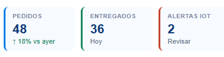

 <li>
    <b>Transiciones y Animaciones:
    </b> 
    
Las transiciones se utilizan de manera moderada para acompañar cambios de estado, apertura de modales, despliegue de menús y acciones interactivas. <b>Se emplean animaciones suaves para evitar cambios abruptos y mantener una experiencia fluida </b>sin distraer al usuario.

  </li>
 <li>
    <b>Consistencia Visual:
    </b> 
    
Los componentes mantienen patrones visuales consistentes en toda la plataforma, utilizando la misma paleta de colores, tipografías, bordes, botones, iconografía y estilos de interacción definidos previamente en el sistema de diseño. Esto permite que el usuario reconozca y comprenda los elementos de la interfaz con mayor facilidad.

  </li>
  

    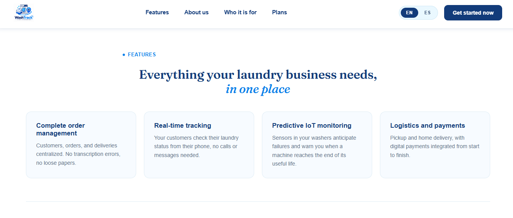

</ul>

Todas ellas se representan mediante las diferentes vistas de la interfaz web de WashTrack, incluyendo la versión de escritorio, adaptación para dispositivos móviles, sistema de navegación, tarjetas informativas, botones, estados y paneles de monitoreo.

### 4.2. Information Architecture

La arquitectura de la información de **WashTrack** busca ofrecer una experiencia fluida e intuitiva para los diferentes perfiles de usuarios de la plataforma, como clientes y administradores de lavanderías. La organización y el etiquetado de los contenidos se diseñaron para guiar al usuario de manera eficiente desde el acceso inicial y registro hasta el monitoreo de las lavadoras, la consulta del historial de ciclos de lavado y el acceso a las funcionalidades relacionadas con el sistema IoT.

La información se estructura mediante una jerarquía clara y una categorización modular, permitiendo que cada usuario encuentre rápidamente las funcionalidades correspondientes a su perfil. Asimismo, la navegación <b>sigue una secuencia lógica que facilita el acceso a las principales secciones del sistema</b>, tales como la barra de navegación superior, la sección de características, que presenta el seguimiento en tiempo real de las seis etapas del proceso de lavado, la sección orientada a los diferentes perfiles de usuario ("Para quién"), la presentación institucional ("Sobre nosotros") y el formulario de atención ubicado al final de la página. Esta organización <b>permite reducir la carga cognitiva y mejorar la experiencia de uso.</b>

#### 4.2.1. Organization Systems

- <b>Organización jerárquica (Visual Hierarchy):</b> 
  Se aplica principalmente en la página principal y en la presentación de los contenidos informativos. La información se organiza de acuerdo con diferentes niveles de importancia, utilizando títulos, subtítulos, tamaños de texto, colores, espacios y botones para dirigir la atención del usuario hacia los elementos principales. Por ejemplo, en la página de inicio se prioriza la propuesta de valor de WashTrack y posteriormente se presentan sus características y demás contenidos.

- <b>Organización secuencial (Step-by-Step):</b> 
  Se utiliza en la representación del proceso de seguimiento del servicio de lavado. Las seis etapas del proceso se presentan siguiendo un orden determinado, permitiendo que el usuario comprenda progresivamente el estado de su ropa y conozca en qué etapa se encuentra. Este sistema resulta especialmente útil para representar procesos que requieren una secuencia lógica.

- <b>Organización matricial:</b> 
  Se utiliza para relacionar las funcionalidades de WashTrack con los diferentes perfiles de usuarios. La información puede organizarse considerando tanto el tipo de usuario como las necesidades o funcionalidades disponibles para cada perfil, facilitando la identificación de los servicios que corresponden a cada audiencia.

- <b>Categorización por tópicos:</b> 
  Se utiliza para agrupar la información de acuerdo con su temática. De esta manera, los contenidos se distribuyen en secciones como características de la plataforma, seguimiento del proceso, información sobre WashTrack y atención al usuario, evitando mezclar contenidos de diferente naturaleza.

- <b>Categorización según audiencia:</b> 
  Se aplica principalmente en la sección <b>“Para quién”</b>, donde la información se presenta de acuerdo con los diferentes perfiles a los que está dirigida la solución. Esta organización permite que cada grupo de usuarios identifique rápidamente los beneficios y funcionalidades relevantes para sus necesidades.

- <b>Categorización cronológica:</b> 
  Se aplica principalmente al seguimiento del proceso de lavado y al historial de ciclos. La información relacionada con las etapas del servicio se presenta siguiendo un orden temporal, permitiendo comprender la evolución del proceso desde su inicio hasta su finalización.

#### 4.2.2. Labeling Systems

Los sistemas de etiquetado en WashTrack han sido diseñados bajo <b>principios de simplicidad, concisión y claridad para representar los conjuntos de información y sus asociaciones</b> sin generar confusión en los visitantes y usuarios. Las etiquetas emplean el mínimo número de palabras posibles, utilizando una terminología intuitiva y estandarizada que facilita la navegación tanto en la versión pública como en el panel operativo del sistema.

<b>*Landing Page*</b>
| **Etiqueta** | **Descripción** |
|---|---|
| **Inicio** | Presenta la propuesta de valor principal de WashTrack mediante una interfaz visual y llamadas a la acción directas. |
| **Características** | Agrupa de forma modular las funcionalidades clave del servicio, como pedidos, seguimiento, IoT y pagos. |
| **Sobre nosotros** | Muestra la identidad corporativa de DevTech, su misión y sus valores orientados a la transformación digital. |
| **Para quién** | Segmenta los beneficios y soluciones dirigidas tanto a dueños de lavanderías como a clientes finales. |
| **Planes** | Detalla las opciones de servicio e integración tecnológica disponibles para los negocios. |
| **Comenzar ahora** | Botón de llamada a la acción (CTA) principal para el registro o acceso directo al formulario de atención. |

<b>*App Web*</b>

| **Etiqueta** | **Descripción** |
|---|---|
| **Panel Hoy / Dashboard** | Presenta una vista general del estado operativo actual, métricas clave y alertas de lavadoras en tiempo real. |
| **Monitoreo IoT** | Permite visualizar el estado, rendimiento y alertas predictivas de las lavadoras conectadas. |
| **Pedidos** | Permite gestionar órdenes, clientes, estados de entrega y filtrar información según las etapas del proceso de lavado. |
| **Seguimiento en Vivo** | Muestra de manera secuencial las seis etapas del proceso de lavado para facilitar el control del usuario. |
| **Reportes** | Presenta el historial de operaciones, métricas de rendimiento y estadísticas de la lavandería. |
| **Configuración** | Permite gestionar los ajustes de cuenta, preferencias del usuario y parámetros operativos del sistema. |
| **Cerrar Sesión** | Permite salir de forma segura de la plataforma para proteger los datos del negocio y del usuario. |

#### 4.2.3. SEO Tags and Meta Tags

Para mejorar la visibilidad de WashTrack en los motores de búsqueda y atraer a los usuarios adecuados, se han definido los siguientes SEO Tags y Meta Tags para las principales páginas de la experiencia, considerando tanto el sitio web estático que es la Landing Page como la Web Application. Para cada página se especifican los valores correspondientes a Title, Meta Description, Keywords y Author.

#### Landing Page

- <b>Title:</b> WashTrack - Gestión Inteligente y Monitoreo IoT para Lavanderías
- <b>Meta Description:</b> WashTrack conecta pedidos, sensores IoT y pagos en una sola plataforma. Digitaliza tu lavandería tradicional con alertas automáticas, seguimiento en vivo y control total de la operación.
- <b>Keywords:</b> lavandería digital, gestión de lavanderías, monitoreo IoT, seguimiento en tiempo real, software para lavanderías, recojo a domicilio, WashTrack.
- <b>Author:</b> DevTech Team

#### Dashboard / Inicio

- <b>Title:</b> Dashboard de WashTrack - Resumen de Operaciones y Estado de Lavadoras
- <b>Meta Description:</b> Accede al resumen general de tu actividad de lavado, estado operativo de las máquinas y métricas clave de tu negocio en tiempo real.
- <b>Keywords:</b> dashboard de lavandería, panel hoy, estado de lavadoras, control operativo, WashTrack app.
- <b>Author:</b> DevTech Team

#### Características

- <b>Title:</b> Características de WashTrack - Todo lo que tu Lavandería Necesita
- <b>Meta Description:</b> Explora las soluciones de WashTrack: gestión integral de pedidos, seguimiento en vivo de prendas, monitoreo IoT predictivo y logística de pagos digitales.
- <b>Keywords:</b> características de WashTrack, gestión de pedidos, seguimiento en vivo, monitoreo IoT, logística y pagos.
- <b>Author:</b> DevTech Team

#### Seguimiento en Vivo

- <b>Title:</b> Seguimiento en Vivo de Pedidos en WashTrack - Estado Exacto de tus Prendas
- <b>Meta Description:</b> Conoce el estado exacto de tu ropa sin necesidad de llamar. Visualiza las etapas desde la recepción y clasificación hasta el lavado, secado y entrega.
- <b>Keywords:</b> seguimiento en vivo, estado de pedidos, lavado de ropa, etapas de lavado, notificaciones automáticas.
- <b>Author:</b> DevTech Team

#### Sobre Nosotros

- <b>Title:</b> Sobre Nosotros - Conoce al Equipo de DevTech detrás de WashTrack
- <b>Meta Description:</b> Somos DevTech, estudiantes de la UPC construyendo tecnología para negocios tradicionales en Latinoamérica. Descubre nuestra misión, visión y valores.
- <b>Keywords:</b> DevTech, sobre nosotros, equipo UPC, tecnología para negocios tradicionales, transformación digital.
- <b>Author:</b> DevTech Team

#### Planes y Contacto

- <b>Title:</b> Planes y Precios de WashTrack - Digitaliza tu Negocio de Lavandería
- <b>Meta Description:</b> Elige el plan ideal para digitalizar tu lavandería o solicita más información completando nuestro formulario de atención para dueños de negocios y clientes.
- <b>Keywords:</b> planes de WashTrack, precios, digitalizar lavandería, contacto, formulario de atención.
- <b>Author:</b> DevTech Team

#### 4.2.4. Searching Systems

El sistema de búsqueda diseñado para <b>WashTrack</b> tiene como objetivo <b>facilitar a los usuarios y administradores la localización eficiente de información</b> relacionada con la gestión de pedidos, el estado de las prendas, las alertas de las lavadoras inteligentes y los reportes operativos. Para ello, <b>se emplean campos de búsqueda y filtros</b> que permiten reducir la cantidad de información mostrada y encontrar rápidamente los datos relevantes según el perfil del usuario y la actividad que desea consultar o gestionar.

| <b>Nombre del Filtro</b> | <b>Descripción</b> |
|---|---|
| <b>Buscar pedidos por código</b> | Permite ingresar el código de un pedido para localizar rápidamente la información correspondiente y consultar su estado actual. |
| <b>Filtrar pedidos por estado</b> | Permite organizar y visualizar los pedidos según su estado dentro del proceso de servicio, facilitando la identificación del progreso de cada pedido. |
| <b>Filtrar pedidos por fecha</b> | Permite consultar pedidos correspondientes a un periodo determinado, facilitando la búsqueda de información específica dentro del historial del servicio. |
| <b>Filtrar pedidos por prioridad</b> | Permite identificar los pedidos asociados al <b>plan VIP</b>, los cuales cuentan con prioridad en la atención y procesamiento del servicio. |
| <b>Consultar seguimiento del pedido</b> | Permite acceder a la información relacionada con el progreso del pedido y visualizar las diferentes etapas del proceso de lavado de manera ordenada. |

#### 4.2.5. Navigation Systems

El sistema de navegación de WashTrack ha sido diseñado para <b>guiar de manera intuitiva y fluida a los usuarios, tanto clientes finales como dueños de lavanderías</b>, a través de la Landing Page y la aplicación web. Para ello, se combinan diferentes técnicas de navegación y recorridos que permiten al usuario <b>encontrar la información necesaria, interactuar con las funcionalidades y alcanzar sus objetivos</b> con el menor esfuerzo posible.

#### Landing Page o Sitio Web 

- <b>Estructura y Recorrido:</b> 
  La navegación se plantea mediante un recorrido vertical de una sola página, complementado por una barra de navegación superior. El usuario comienza visualizando la propuesta de valor principal y continúa hacia las características del servicio, el funcionamiento del proceso, los beneficios según su perfil en la sección <b>“Para quién”</b>, los planes disponibles y finalmente el formulario de atención.

- <b>Acción del Usuario:</b> 
  El visitante puede desplazarse libremente por las diferentes secciones y utilizar los botones de llamada a la acción (<i>Call to Action</i>), como <b>“Comenzar ahora”</b>, para acceder al registro o formulario de atención según su interés.

#### App Web - Panel Hoy o Dashboard 

- <b>Estructura y Recorrido:</b> 
  El Dashboard funciona como punto principal de acceso después del inicio de sesión. La información se organiza mediante accesos directos y tarjetas visuales que permiten acceder rápidamente a las diferentes funcionalidades de la aplicación.

- <b>Acción del Usuario:</b> 
  El usuario consulta un resumen de su actividad y puede dirigirse hacia las secciones de pedidos, seguimiento, reportes u otras funcionalidades disponibles. En el caso del <b>plan VIP</b>, se contempla la identificación visual de los pedidos que requieren atención prioritaria.

#### Sección: Pedidos

- <b>Estructura y Recorrido:</b> 
  Presenta la información de los pedidos de manera organizada, permitiendo utilizar opciones de búsqueda y filtrado para localizar órdenes según diferentes criterios, como código, estado, fecha o prioridad.

- <b>Acción del Usuario:</b> 
  El usuario selecciona un pedido para consultar su información y verificar el estado en el que se encuentra. Asimismo, los pedidos asociados al <b>plan VIP</b> pueden identificarse mediante un indicador de prioridad.

#### Sección: Seguimiento en Vivo

- <b>Estructura y Recorrido:</b> 
  La navegación se organiza mediante un flujo visual secuencial (<i>step-by-step</i>) que representa las seis etapas del proceso: <b>Recepción, Clasificación, Lavado, Secado/Planchado, Empaquetado y Listo</b>.

- <b>Acción del Usuario:</b> 
  El cliente consulta el progreso de su pedido y reconoce visualmente la etapa actual en la que se encuentra su ropa. Para los usuarios con plan VIP, se contempla la identificación de la prioridad del servicio dentro del seguimiento.

#### Sección: Reportes

- <b>Estructura y Recorrido:</b> 
  La sección organiza la información histórica mediante filtros temporales, como día, mes o año, permitiendo acceder de manera ordenada a los registros y estadísticas disponibles.

- <b>Acción del Usuario:</b> 
  El administrador puede consultar información histórica para analizar el funcionamiento de la lavandería, mientras que el cliente puede acceder a información relacionada con sus servicios realizados, de acuerdo con las funcionalidades definidas para cada perfil.

#### Sección: Configuración

- <b>Estructura y Recorrido:</b> 
  La sección permite organizar las opciones relacionadas con la cuenta, los datos del perfil, las preferencias y la gestión del plan contratado.

- <b>Acción del Usuario:</b> 
  El usuario puede consultar o modificar la información disponible de su cuenta y gestionar las opciones relacionadas con su suscripción. Finalmente, puede utilizar la opción <b>“Cerrar Sesión”</b> para salir de manera segura de la plataforma.

### 4.3. Landing Page UI Design

El diseño de la interfaz de usuario (UI) de la Landing Page de <b>WashTrack</b> busca presentar de forma clara y atractiva la propuesta de valor de la plataforma. La interfaz organiza visualmente sus principales funcionalidades, beneficios y características, destacando la gestión de pedidos, el seguimiento en tiempo real, el monitoreo IoT y la automatización de procesos. Esta estructura sirve como base para la elaboración del wireframe y posteriormente del mock-up de la Landing Page.

#### 4.3.1. Landing Page Wireframe

A continuación, se presentan los wireframes correspondientes a la interfaz de la Landing Page de <b>WashTrack</b>. Estos bocetos de baja fidelidad estructuran la disposición visual de los elementos clave, permitiendo validar la jerarquía de la información, la distribución de los componentes y la experiencia de navegación inicial del usuario antes de proceder con el diseño de alta fidelidad.

  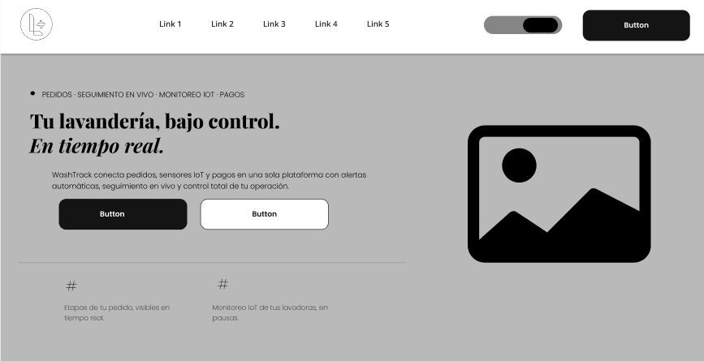
  
<b>Figura 1:</b> Sección principal con propuesta de valor, accesos rápidos y vista previa de la plataforma.

  

  
  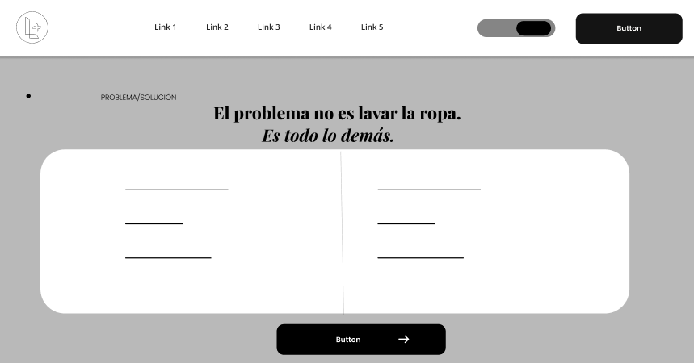
  
<b>Figura 2:</b> Sección de identificación del problema y solución principal para los negocios de lavandería.

  

  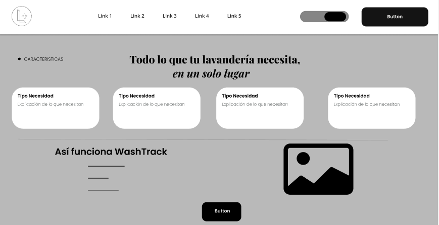
  
<b>Figura 3:</b> Sección de características clave y descripción del funcionamiento general de WashTrack.

  

  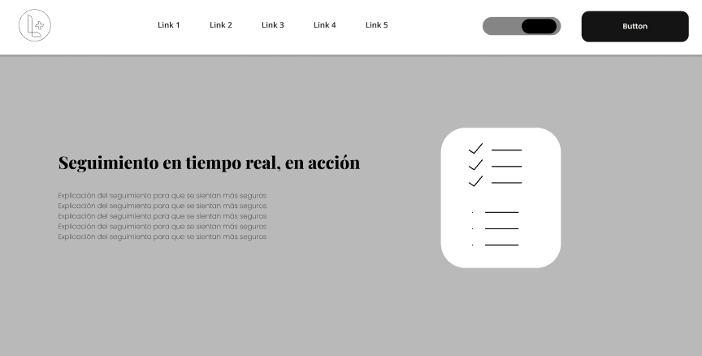
  
<b>Figura 4:</b> Módulo detallado de seguimiento en tiempo real y listas de control de operaciones.

  

  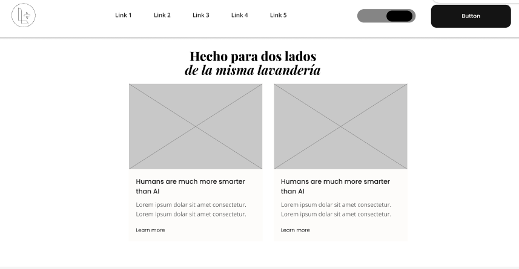
  
<b>Figura 5:</b> Sección orientada a los dos lados de la misma lavandería.

  

  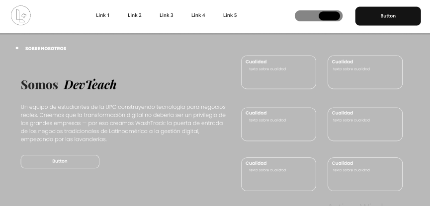
  
<b>Figura 6:</b> Sección "Sobre Nosotros" que presenta al equipo desarrollador y las cualidades de la plataforma.

  

  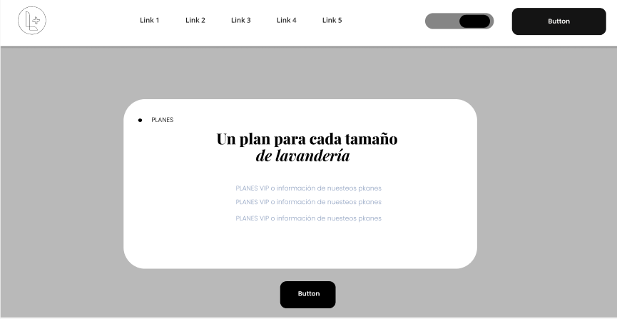
  
<b>Figura 7:</b> Sección de planes y precios adaptados a cada tamaño de lavandería.

  

  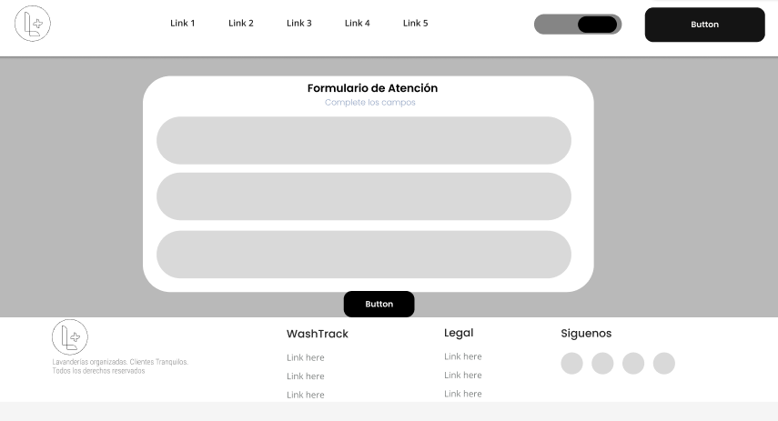
  
<b>Figura 8:</b> Formulario de atención, pie de página (footer) y enlaces legales de la plataforma.

#### 4.3.2. Landing Page Mock-up

A continuación, se presentan los mock-ups correspondientes al diseño de alta fidelidad de la Landing Page de <b>WashTrack</b>. Estas interfaces visuales incorporan la paleta de colores definitiva, la tipografía, los elementos gráficos y los componentes interactivos estilizados, reflejando el aspecto visual final y la experiencia de usuario (UI/UX) implementada en el desarrollo del proyecto.

  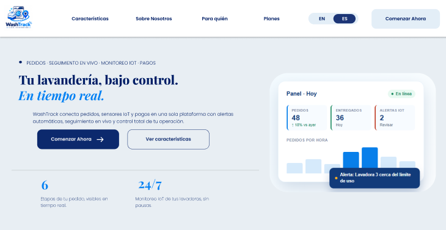
  
<b>Figura 9:</b> Vista de la sección principal con propuesta de valor, accesos rápidos, botones de llamada a la acción y un panel interactivo flotante con métricas en tiempo real.

  

  
  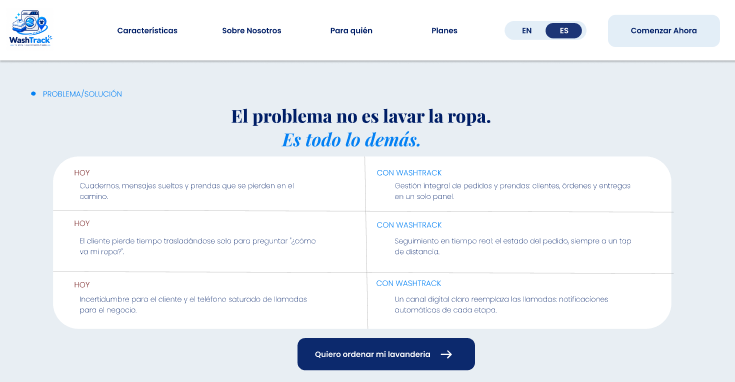
  
<b>Figura 10:</b> Sección de problema y solución que contrasta la gestión tradicional basada en cuadernos con la automatización digital de la plataforma.

  

  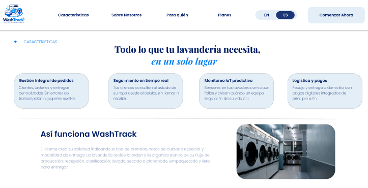
  
<b>Figura 11:</b> Sección de características clave y descripción del flujo operativo general de la plataforma respaldado por imágenes reales de instalaciones.

  

  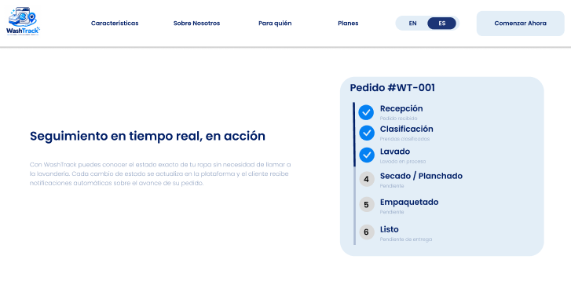
  
<b>Figura 12:</b> Módulo detallado de seguimiento en tiempo real que detalla las diferentes etapas del estado de los pedidos de los clientes.

  

  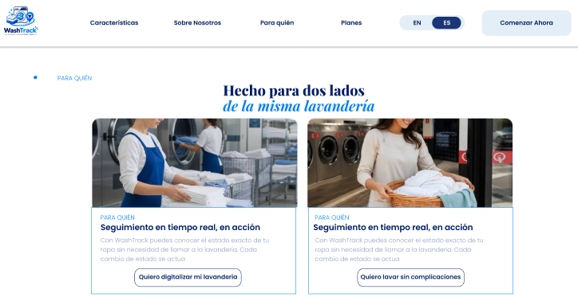
  
<b>Figura 13:</b> Sección dual orientada tanto a los administradores de lavanderías como a los usuarios finales que buscan simplificar el lavado de sus prendas.

  

  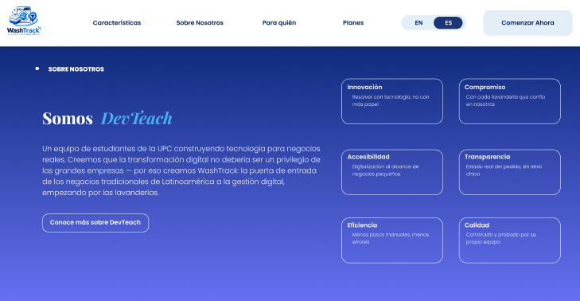
  
<b>Figura 14:</b> Sección Sobre Nosotros que presenta al equipo desarrollador junto con los pilares fundamentales y valores de la plataforma.

  

  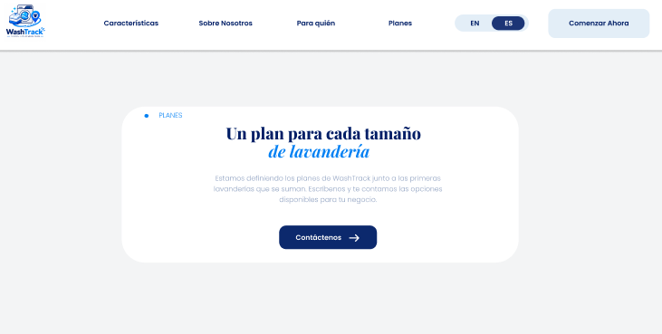
  
<b>Figura 15:</b> Sección de planes y precios adaptados para cada tamaño de negocio con un acceso directo para establecer contacto.

  

  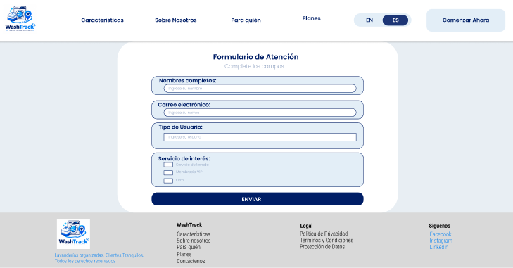
  
<b>Figura 16:</b> Formulario de atención interactivo seguido del pie de página oficial que incluye la identidad de la marca y enlaces legales.

### 4.4. Web Applications UX/UI Design

#### 4.4.1. Web Applications Wireframes
La propuesta de wireframes para WashTrack fue desarrollada teniendo en cuenta los principios
de usabilidad, diseño inclusivo, claridad visual y jerarquía informativa, con el fin de brindar
una experiencia coherente, accesible y personalizada tanto para usuarios empresariales como
personas naturales.
La aplicación se estructura en seis secciones principales, accesibles desde una barra de
navegación que varía en función del perfil del usuario. Estas secciones son: Inicio,
Panel de Control, Operaciones, Monitoreo IoT, Clientes y Reportes.

---
**Dashboard**

El wireframe representa el Dashboard  de la aplicación web WashTrack,
diseñado bajo un esquema de maquetación de dos columnas principales: un menú de navegación
lateral izquierdo Sidebar y un panel de contenido central Main Area.

**Pedidos**

La vista de Pedidos está orientada a centralizar el flujo de trabajo operativo de la lavandería
en el rol de Encargada de turno. Presenta una tabla de datos con filtros de búsqueda y acciones
rápidas como "+ Nuevo pedido", permitiendo monitorear el estado de recepción, entregas estimadas, pagos y detalles de cada orden de manera eficiente.

**Clientes**

Esta pantalla está destinada a la administración del directorio de usuarios por parte de la Encargada
de turno. Dispone de una tabla detallada con filtro de búsqueda y la opción para registrar nuevos usuarios,
lo que agiliza la localización de información de contacto, identificadores y documentos de identidad.

**Prendas**

La interfaz descrita permite estructurar el catálogo operativo de la lavandería para la Encargada de turno.
Muestra métricas clave sobre los tipos de prendas registrados y su valor promedio, acompañadas de un listado
organizado por categorías, precios y disponibilidad. La parte inferior añade una gráfica interactiva de tendencias
que ayuda a analizar las prendas más solicitadas a lo largo del tiempo.

**Servicios**

Esta sección está destinada a la gestión del portafolio de prestaciones ofrecidas por la lavandería. Muestra en la
parte superior métricas sobre el total de servicios, la cantidad de activos, las categorías configuradas y el costo
promedio, seguidas por una tabla de datos detallada con tarifas, duraciones estimadas y estados operativos. En la
zona inferior incorpora un gráfico de tendencias para evaluar los servicios con mayor demanda según el intervalo de
tiempo seleccionado.

**Pagos**
El siguiente wireframe organiza el registro y control de cobros para la Encargada de turno. Incluye una barra de
búsqueda dedicada en la parte superior y una tabla de datos detallada que muestra el identificador de cada pago,
el pedido asociado, el cliente, el monto cobrado, el método de pago y el estado de la transacción, complementada
con un gráfico de tendencia de los pagos registrados en las últimas 24 horas.

**Recojos y Entregas**

El siguiente wireframe organiza la logística de despacho y recolección de prendas para la Encargada de turno. Incluye
una barra de búsqueda dedicada, un botón de acción principal para programar nuevos recojos o entregas y una tabla de
datos detallada que registra identificadores, tipo de operación, cliente, dirección de destino, repartidor asignado, fecha, hora y estado del servicio

**Monitoreo IOT**

Esta vista permite a la Encargada de turno supervisar en tiempo real el estado técnico y operativo de toda la
maquinaria conectada. Mediante un panel de tarjetas individuales para cada lavadora, facilita el control de
parámetros en vivo como el ciclo actual, el tiempo restante de lavado y la última sincronización de datos de
los sensores.

**Alertas**

El wireframe de esta sección está diseñado para centralizar las notificaciones de fallas técnicas en la interfaz
de la Encargada de turno. Mediante un esquema de tarjetas informativas clasificadas por nivel de criticidad, este
wireframe permite identificar con rapidez alertas de revisión alta y posibles fallas en la maquinaria, desplegando
el ciclo en curso, el tiempo restante y la sincronización en vivo para evitar interrupciones operativas.

**Detalle de alerta por lavadora**

El wireframe de esta vista presenta el diagnóstico técnico individualizado de una máquina específica para la Encargada
de turno. Estructura la información mediante indicadores generales de estado, métricas de sensores en tiempo real como
humedad, corriente, consumo, vibración, velocidad y nivel de agua frente a sus rangos esperados, e incluye un gráfico
de comportamiento histórico para analizar anomalías a lo largo del tiempo.

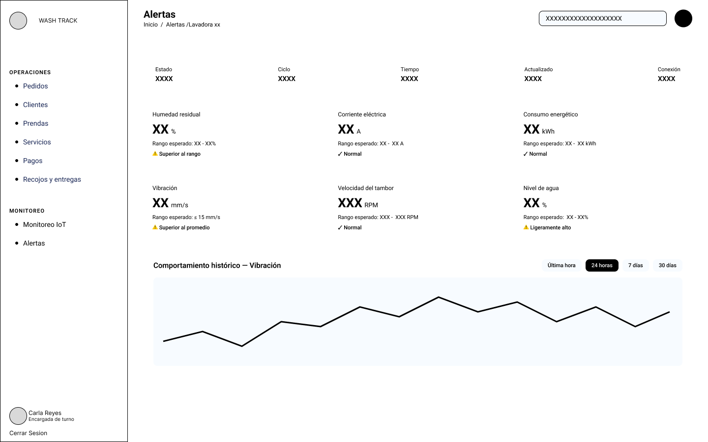

#### 4.4.2. Web Applications Wireflow Diagrams

Esta sección presenta los wireflows de WashTrack, diseñada para propietarios de lavanderías independientes, y de la app
cliente, enfocada en sus usuarios finales. Ambos diagramas parten de los wireframes de baja fidelidad para detallar las
interacciones necesarias que permiten cumplir objetivos específicos. Asimismo, elaborados en FigJam, ilustran de forma
visual tanto el flujo principal como las rutas alternativas ante posibles errores.

---
### Registrar un nuevo pedido

User Goal: Registrar un nuevo pedido en el sistema, desde que el encargado de turno recibe la solicitud del cliente hasta
que el pedido queda guardado y visible en la Lista de Pedidos.

**User Persona:** Pedro Fernández, Propietario de Lavandería.

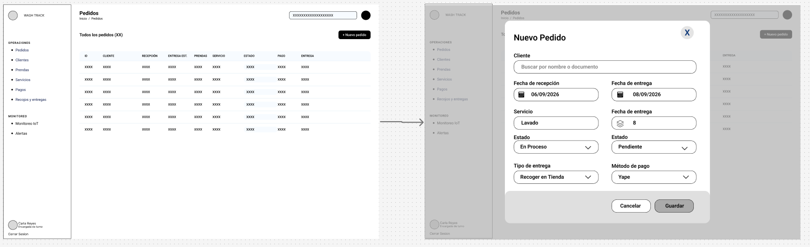g](assets/img/Chapter4/RegistrarNuevoPedido.png)(Imagen)

**Explicación del flujo:**

*Happy path:* El usuario ingresa al Dashboard, navega a Pedidos, hace clic en "+ Nuevo pedido", el sistema despliega el
formulario sobre la lista atenuada, el usuario busca y selecciona un cliente, completa o confirma los campos restantes
(fechas, servicio, cantidad de prendas, estado, pago, tipo de entrega, método de pago) y guarda. El sistema valida los datos,
cierra el formulario y muestra el pedido al inicio de la tabla.

*Unhappy paths:*

- Cliente no encontrado en la búsqueda: el sistema muestra "Sin resultados" y el flujo no avanza hasta seleccionar un cliente válido.

- Error de validación al guardar: el formulario permanece abierto y se muestra el mensaje de error debajo del campo correspondiente, sin perder los datos ya ingresados.

- Cancelación: el usuario cierra el formulario en cualquier momento sin que se guarde ningún cambio.

---
### Consultar el estado de un pedido

**User Goal:** Ubicar rápidamente uno o varios pedidos según su estado actual, sin tener que revisar la tabla completa fila por fila.

**User Persona:** Pedro Fernández, Propietario de Lavandería.

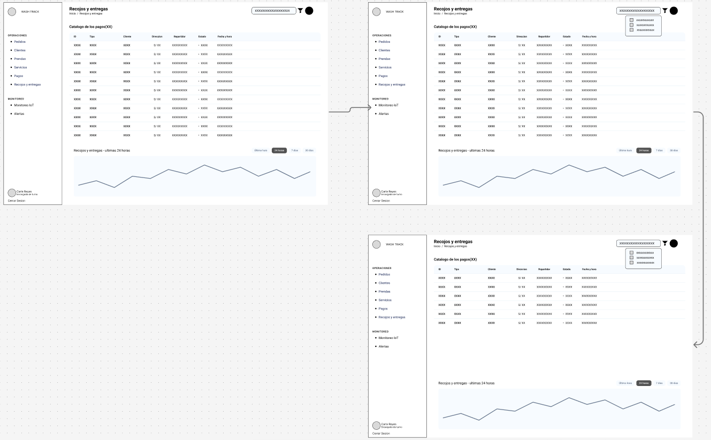png](assets/img/Chapter4/ConsultarEstadoPedido.png)

**Explicación del flujo:**

*Happy path:*  
El usuario ingresa a la Lista de Pedidos, hace clic en el filtro "Estado", el sistema despliega un
panel con los estados disponibles , el usuario selecciona uno o varios estados y hace clic en "Aplicar". El sistema actualiza la tabla mostrando únicamente los pedidos que cumplen el filtro seleccionado.

*Unhappy paths:*

- Ningún pedido coincide con los estados seleccionados: el sistema muestra un mensaje de "Sin resultados" en la tabla.

- El usuario cierra el panel sin seleccionar el estado: el filtro anterior se mantiene sin cambios.

---
### Registrar un nuevo cliente

**User Goal:** Registrar los datos de un cliente nuevo en la base de datos maestra, para que quede disponible al momento de crear pedidos.

**User Persona:** Pedro Fernández, Propietario de Lavandería.

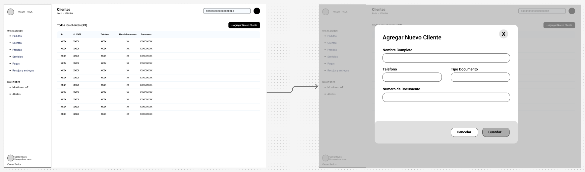.png](assets/img/Chapter4/RegistrarNuevoCliente.png)

**Explicación del flujo:**

*Happy path:* el usuario ingresa a Clientes, hace clic en "+ Agregar Nuevo Cliente", el sistema despliega el formulario (Nombre Completo, Teléfono, Tipo de Documento, Número de Documento) sobre la lista atenuada, el usuario completa los campos y guarda. El sistema valida los datos, cierra el formulario y muestra el nuevo cliente en la tabla.

*Unhappy paths:*

- Documento duplicado: el sistema muestra un mensaje de error indicando que el número de documento ya está registrado, sin cerrar el formulario.

- Campo obligatorio vacío: se muestra el mensaje de error debajo del campo correspondiente y el formulario permanece abierto con los demás datos ya ingresados.

- Cancelación: el usuario cierra el formulario sin guardar ningún cambio.
---
### Registrar un pago asociado a un pedido

**User Goal:** Registrar el cobro correspondiente a un pedido, dejando constancia del monto y el método de pago utilizado.

**User Persona:** Pedro Fernández, Propietario de Lavandería.

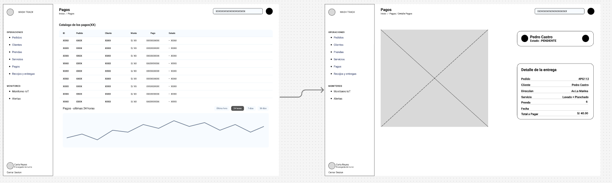

**Explicación del flujo:**

*Happy path:* el usuario ingresa a Pagos, ubica el pedido correspondiente (o accede desde el detalle del pedido en Pedidos), registra el monto cobrado y selecciona el método de pago (Yape, Tarjeta, Efectivo), y guarda. El sistema actualiza el estado de pago del pedido y lo refleja en la tabla de Pagos.

*Unhappy paths:*

- Monto inválido (negativo o distinto al total del pedido): el sistema muestra un mensaje de error y no permite guardar hasta corregirlo.

- Pedido ya pagado: el sistema advierte que el pedido ya cuenta con un pago registrado y solicita confirmación antes de continuar.

- Cancelación: el usuario cierra el formulario sin registrar el pago.

---

### Monitorear el envío de ropa al domicilio del cliente

**User Goal:** Monitorear en tiempo real el envío de la ropa ya lista, desde que sale de la lavandería hasta que llega al domicilio del cliente, para conocer en todo momento en qué etapa se encuentra el envío y cuánto falta para su entrega.

**User Persona:** Pedro Fernández, Propietario de Lavandería (Segmento 1).

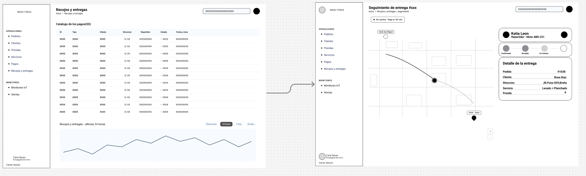

**Explicación del flujo:**

*Happy path:* el usuario ingresa a Recojos y Entregas, ubica en la tabla un registro de tipo "Entrega" con un repartidor ya asignado, y hace clic sobre esa fila. El sistema navega a la pantalla de Seguimiento de Entrega, donde se muestra el mapa con la ruta trazada desde la lavandería hasta el domicilio del cliente (tramo sólido recorrido / tramo punteado pendiente), la etiqueta flotante con el tiempo estimado de llegada, el stepper de progreso (Confirmado – Recojido – En Camino) y el detalle de respaldo del envío (Cliente, Dirección de entrega, Servicio, Prendas). El usuario permanece en la pantalla observando cómo el stepper y la posición del repartidor se actualizan automáticamente hasta que el envío se marca como Entregado.

*Unhappy paths:*

- Pérdida de conexión con el repartidor: el mapa y el stepper dejan de actualizarse en tiempo real y se muestra un indicador de "Sin conexión" hasta que se restablece la señal.

- Retraso frente al tiempo estimado inicial: la etiqueta flotante actualiza el tiempo de llegada (por ejemplo, de "~12 min" a un valor mayor), sin que el usuario tenga que salir de la pantalla para notar el cambio.

- Cliente no se encuentra en el domicilio al momento de la entrega: el repartidor reporta la incidencia, el registro cambia a un estado que refleje la entrega no concluida, y el usuario debe coordinar un nuevo intento de envío.

---

### Revisar y atender una alerta de posible falla en una máquina

**User Goal:** Identificar qué lavadoras requieren atención inmediata y revisar el detalle técnico antes de tomar una acción correctiva.

**User Persona:** Pedro Fernández, Propietario de Lavandería.

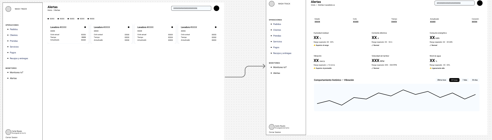

**Explicación del flujo:**

*Happy path:* el usuario ingresa a Alertas desde el grupo "Monitoreo" del sidebar, revisa la lista de lavadoras en estado "Revisión" o "Posible falla", hace clic en la tarjeta correspondiente, y el sistema navega al Detalle de Lavadora, donde se muestran las métricas (valor, rango esperado, veredicto) y el gráfico histórico de la métrica en alerta.

*Unhappy paths:*
- No hay alertas activas: la pantalla de Alertas muestra un estado vacío indicando que no hay lavadoras que requieran atención.
- La lavadora pierde conexión mientras se revisa el detalle: el sistema actualiza el estado a "Sin conexión" y deja de refrescar las métricas en tiempo real.
- El usuario regresa a la lista sin realizar ninguna acción: el sistema conserva el estado de la lavadora sin cambios.

---
### Solicitar un nuevo pedido de lavandería

**User Goal:** Solicitar un servicio de lavandería de forma digital, sin necesidad de llamar o escribir directamente a la lavandería.

**User Persona:** Valeria Torres, Cliente de Lavandería.

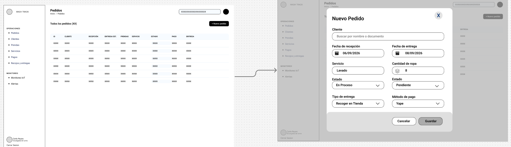

**Explicación del flujo:**

*Happy path:* la usuaria ingresa a la aplicación web, selecciona "Nuevo pedido", elige el servicio deseado y la cantidad de prendas, selecciona la fecha y el tipo de entrega, y confirma la solicitud. El sistema muestra una confirmación y agrega el pedido a su historial con estado inicial "En proceso".

*Unhappy paths:*

- Servicio no disponible en la zona de la usuaria: el sistema muestra un mensaje indicando que el servicio no cubre esa ubicación.

- Error de validación en el formulario: se muestra el mensaje de error debajo del campo correspondiente sin perder los datos ya ingresados.

- Cancelación de la solicitud: la usuaria cierra el formulario antes de confirmar y no se genera ningún pedido.

--- 

### Consultar el estado de su pedido sin llamar a la lavandería

**User Goal:** Conocer en qué etapa se encuentra su pedido en cualquier momento, sin necesidad de comunicarse directamente con la lavandería.

**User Persona:** Valeria Torres, Cliente de Lavandería.

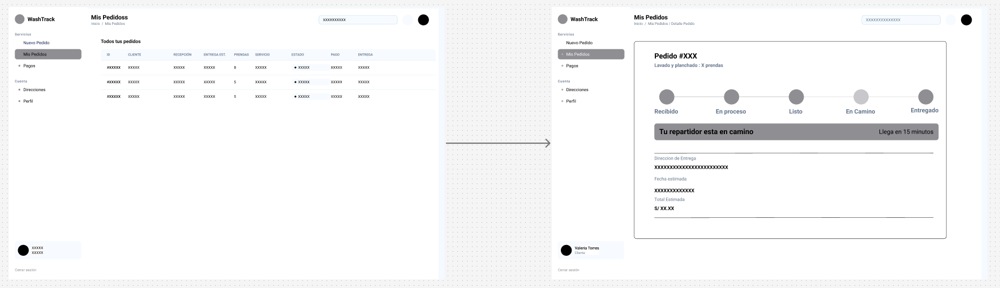

**Explicación del flujo:**

*Happy path:* la usuaria ingresa a la sección "Mis pedidos", selecciona el pedido activo, y el sistema muestra el estado actual (por ejemplo, "En proceso", "Listo para entrega") junto con la fecha estimada de entrega.

*Unhappy paths:*
- El pedido aún no ha sido registrado por la lavandería: el sistema muestra un estado "Pendiente de confirmación".

- Error de conexión al cargar el estado: se muestra un mensaje de error con opción de reintentar la carga.

- El pedido fue cancelado por la lavandería: el sistema muestra el estado "Cancelado" junto con el motivo, si está disponible.

---

### Solicitar recojo o entrega a domicilio

**User Goal:** Coordinar que sus prendas sean recogidas o entregadas en su domicilio, sin necesidad de trasladarse hasta el local.

**User Persona:** Valeria Torres, Cliente de Lavandería.

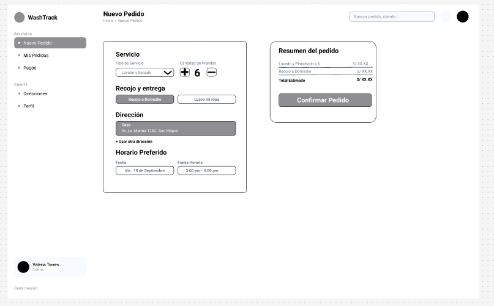

**Explicación del flujo:**

*Happy path:* la usuaria, dentro del flujo de creación de un pedido, selecciona la opción "Recojo a domicilio", confirma o elige una dirección guardada (o ingresa una nueva), selecciona una franja horaria disponible, y continúa con el resto del pedido. El sistema asocia el servicio de recojo/entrega al pedido y lo refleja en el resumen antes de confirmar.

*Unhappy paths:*

- No hay franjas horarias disponibles para la fecha elegida: el sistema muestra las siguientes fechas disponibles.

- Dirección fuera de cobertura: el sistema informa que la dirección ingresada no está dentro del área de servicio.

- Cancelación de la solicitud de recojo/entrega: la usuaria cambia a la opción "Llevo yo mi ropa" antes de confirmar, y el pedido continúa sin el servicio a domicilio asociado.

---

### Pagar un pedido en línea

**User Goal:** Realizar el pago de un pedido de forma digital, sin depender de efectivo al momento de la entrega.

**User Persona:** Valeria Torres, Cliente de Lavandería.

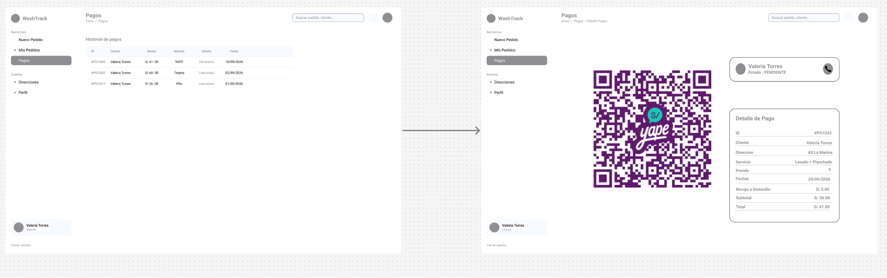

**Explicación del flujo:**

*Happy path:* la usuaria ingresa al detalle de su pedido o a la sección Pagos, selecciona "Pagar ahora", el sistema muestra el resumen del pedido junto al monto total y el método de pago disponible, la usuaria completa la transacción y el sistema actualiza el estado de pago a "Completado", mostrando una confirmación.

*Unhappy paths:*

- Pago rechazado por el proveedor de pagos: el sistema muestra un mensaje de error y permite reintentar con el mismo u otro método.

- Sesión expirada durante el proceso de pago: el sistema solicita reautenticación antes de completar la transacción.

- Cancelación del pago: la usuaria abandona el proceso y el pedido permanece con estado de pago "Pendiente".

---

### Consultar historial de pedidos anteriores

**User Goal:** Revisar los pedidos realizados anteriormente, para consultar detalles de servicios ya utilizados.

**User Persona:** Valeria Torres, Cliente de Lavandería.

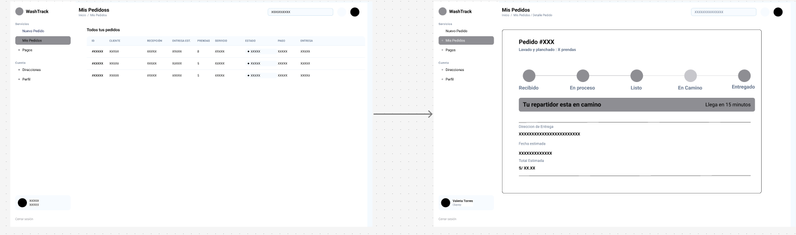

**Explicación del flujo:**

*Happy path:* la usuaria ingresa a "Mis pedidos" y cambia a la pestaña "Historial", el sistema muestra la lista de pedidos anteriores ordenados por fecha descendente, y al seleccionar uno, se muestra el detalle completo (servicio, prendas, monto pagado, fecha de entrega).

*Unhappy paths:*

- No existen pedidos anteriores: el sistema muestra un estado vacío indicando que aún no se han registrado pedidos.

- Error al cargar el historial: se muestra un mensaje de error con opción de reintentar.

- Búsqueda sin resultados dentro del historial: el sistema muestra "Sin resultados" al aplicar una búsqueda por número de pedido que no coincide con ningún registro.

---

#### 4.4.3. Web Applications Mock-ups

**DashBoard**

El Dashboard permite a la encargada de turno conocer el estado de la lavandería rápidamente, sin navegar a otras secciones.

* **KPIs superiores:** muestran los indicadores principales de forma clara y uniforme para facilitar su comparación.
* **Máquinas y alertas:** se presentan juntas para relacionar rápidamente el estado de las máquinas con posibles incidencias.
* **Gráficos inferiores:** muestran tendencias y análisis, priorizando primero la información operativa inmediata.
* **Sidebar persistente:** mantiene una navegación constante y facilita el reconocimiento de las funciones del sistema.

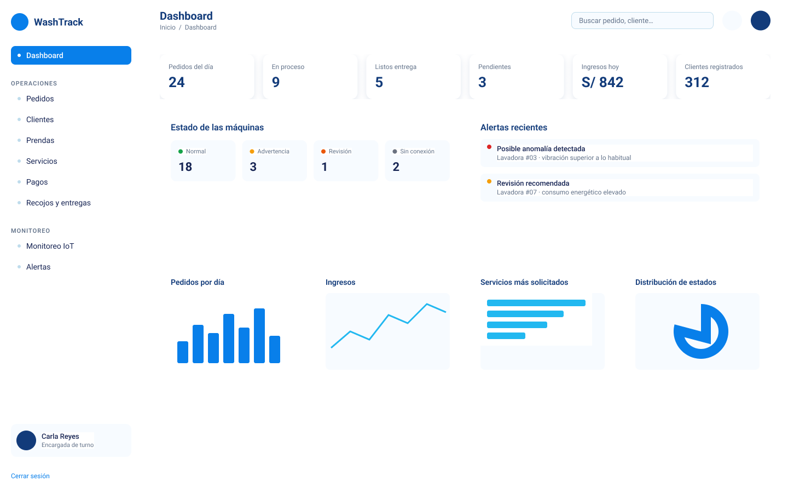

**Pedidos**

Este módulo cubre el flujo principal del negocio: **consultar pedidos y registrar nuevos** de forma rápida y sencilla.

* **Tabla de pedidos:** las columnas siguen el orden lógico del proceso: cliente, fechas, prendas, servicio y finalmente estado y pago.
* **Estados por color:** permite identificar rápidamente la situación de cada pedido mediante atributos visuales.
* **Botón "+ Nuevo pedido":** mantiene una ubicación consistente y facilita el acceso a la acción principal.
* **Formulario modal:** permite crear pedidos sin perder el contexto de la lista.
* **Campos agrupados:** los datos relacionados se organizan en dos columnas para reducir el desplazamiento.
* **Cliente primero:** utiliza un buscador para facilitar su selección.
* **Valores predeterminados:** Estado y Pago vienen preestablecidos para reducir errores y tiempo de captura.
* **Botones:** "Guardar" destaca como acción principal y "Cancelar" como acción secundaria.

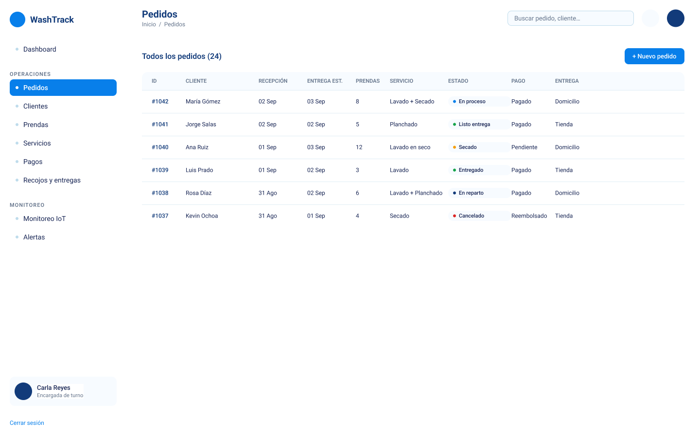

**Clientes**

Este módulo gestiona la información principal de los clientes, priorizando su identificación rápida y el registro sencillo**.

* **Tabla simplificada:** muestra únicamente ID, cliente, teléfono y documento, evitando información transaccional innecesaria.
* **Nombre como dato principal:** se ubica después del ID por ser el criterio más natural para identificar un cliente.
* **Orden consistente:** teléfono y documento mantienen la misma secuencia utilizada en el formulario.
* **Botón "+ Agregar Nuevo Cliente":** mantiene la posición estándar del sistema, facilitando su localización.
* **Formulario vertical:** al ser corto, los campos se presentan en una sola columna para facilitar la lectura.
* **Tipo de documento:** utiliza una lista desplegable para evitar datos incorrectos o inconsistentes.
* **Modal consistente:** conserva el mismo patrón visual del sistema, con "Guardar" como acción principal y "Cancelar" como secundaria.

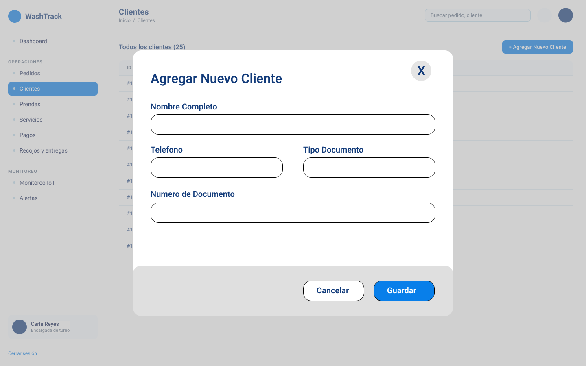

**Prendas**

Este módulo gestiona el catálogo de prendas y su demanda, facilitando tanto la consulta como el análisis.

* **Catálogo y análisis separados:** la tabla muestra primero la información actual y el gráfico inferior presenta las tendencias de demanda.
* **Categoría como agrupador:** permite identificar rápidamente las familias de prendas sin navegación adicional.
* **Precio y tiempo estimado:** se colocan juntos porque son datos relacionados para la atención al cliente y planificación.
* **Estado por color:** "Activo" en verde e "Inactivo" en gris permiten identificar rápidamente la disponibilidad.
* **Estado con botones:** al ser una opción binaria, "Activo/Inactivo" permite seleccionar directamente y visualizar la opción elegida.
* **Formulario en dos columnas:** el nombre ocupa todo el ancho y los demás atributos se agrupan para reducir el recorrido visual.
* **Filtros temporales:** permiten cambiar rápidamente el periodo del gráfico y muestran claramente cuál está seleccionado.

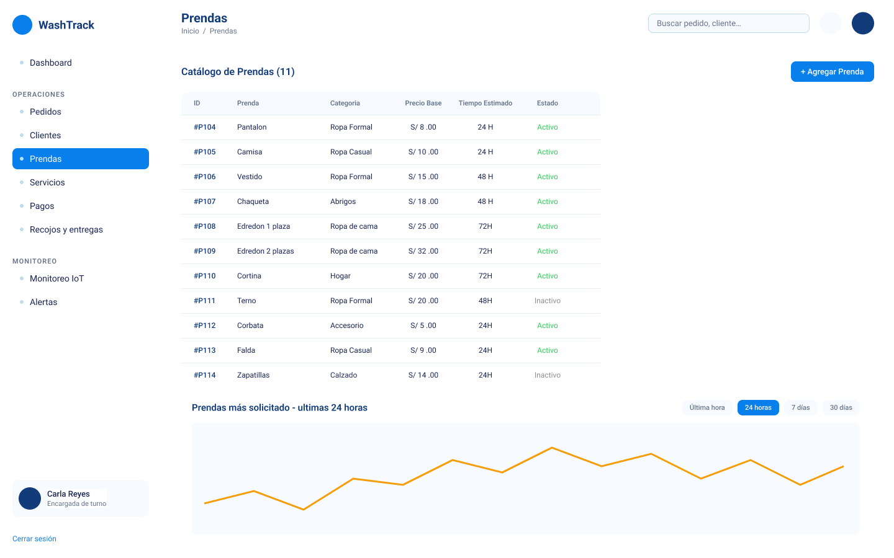

**Servicios**

Este módulo gestiona el **catálogo de servicios y su demanda**, manteniendo una estructura similar al módulo de Prendas para facilitar el uso.

* **Estructura consistente:** utiliza la misma distribución de Prendas: tabla arriba, gráfico de demanda abajo y modal de registro.
* **Categorías de servicios:** agrupan las operaciones según su naturaleza, como Lavado, Tintorería, Planchado y Acabado.
* **Precio y tiempo estimado:** se muestran juntos para facilitar la información al cliente y la planificación de entregas.
* **Gráfico de demanda:** permite identificar rápidamente el servicio más solicitado.
* **Modal de registro:** mantiene el mismo diseño de Prendas, reduciendo el aprendizaje y los errores de captura.
* **Estado mediante botones:** "Activo/Inactivo" permite seleccionar rápidamente la disponibilidad del servicio.

**Pagos**

Este módulo permite **consultar y controlar las transacciones realizadas**, adaptando la estructura de los catálogos a la gestión de cobros.

* **Pedido como referencia:** se muestra junto al ID para relacionar directamente cada pago con su pedido correspondiente.
* **Monto y método:** se colocan juntos para identificar rápidamente cuánto y cómo se realizó el pago.
* **Fecha:** se presenta al final y los registros se ordenan de más reciente a más antiguo para priorizar los cobros actuales.
* **Estado por color:** mantiene el mismo código visual de otros módulos, facilitando la identificación de registros activos e inactivos.
* **Estructura consistente:** conserva la arquitectura general del sistema, reduciendo la carga cognitiva del usuario.

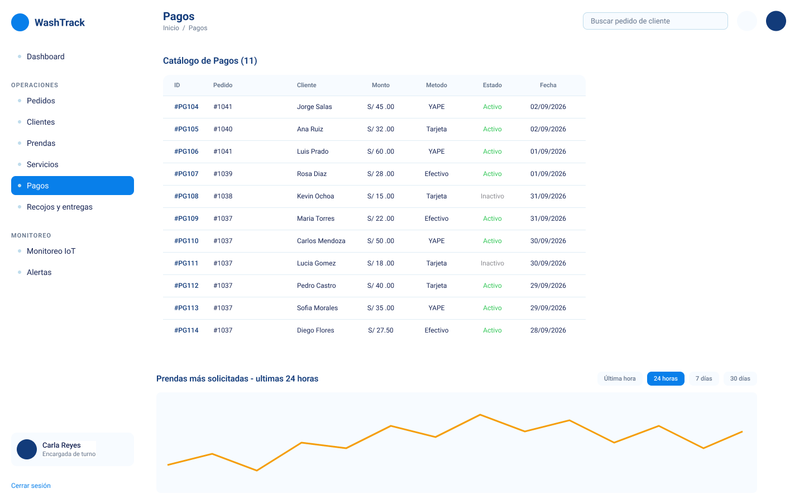

**Recojos y Entregas**

Este módulo gestiona las **operaciones logísticas y el seguimiento de entregas**, combinando consulta, asignación y monitoreo.

* **Tipo y Estado diferenciados:** utilizan códigos de color independientes para evitar confusiones entre la operación y su situación.
* **Dirección visible:** se muestra completa, incluso en dos líneas, para evitar errores durante el recojo o entrega.
* **Repartidor visible:** permite identificar rápidamente quién está a cargo de cada operación.
* **Seguimiento mediante clic:** cada registro permite acceder a una pantalla dedicada de monitoreo.
* **Mapa como elemento principal:** ocupa la mayor parte del espacio para facilitar la visualización de la ubicación y recorrido.
* **Ruta diferenciada:** el tramo recorrido es sólido y el pendiente es punteado, permitiendo identificar rápidamente el avance.
* **Tiempo estimado junto al repartidor:** muestra de forma inmediata cuánto falta para llegar.
* **Stepper de estados:** muestra claramente el progreso: Confirmado, Recojido y En Camino.
* **Detalle de entrega:** presenta los datos del pedido como información de apoyo debajo del estado.

----
**Monitoreo IoT**

Este módulo permite **supervisar en tiempo real el estado físico de las lavadoras**, utilizando una interfaz orientada al monitoreo técnico.

* **Leyenda de estados:** explica los cinco estados y sus colores para facilitar su interpretación.
* **Tarjetas en cuadrícula:** cada lavadora se presenta como una unidad independiente, permitiendo detectar anomalías rápidamente.
* **Orden de información:** muestra primero Estado, Ciclo, Tiempo y Actualización, siguiendo la prioridad de monitoreo.
* **Timestamp relativo:** indica cuánto tiempo ha pasado desde la última actualización.
* **Detalle en pantalla completa:** permite consultar el estado y las métricas de una lavadora sin perder contexto.
* **Resumen superior:** mantiene la información principal de la tarjeta y añade el estado de conexión.
* **Métricas con rango y veredicto:** cada sensor muestra su valor, rango esperado y resultado, facilitando la interpretación.
* **Grid de seis métricas:** permite comparar varios indicadores simultáneamente.
* **Gráfico histórico:** muestra una métrica a la vez para analizar su comportamiento y detectar posibles anomalías.

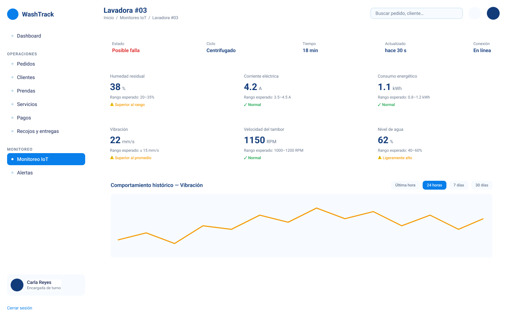

**Alertas**

Este módulo permite **concentrarse únicamente en las lavadoras que requieren atención**, funcionando como una vista filtrada de Monitoreo IoT.

* **Estados reducidos:** solo muestra "Revisión" y "Posible falla", enfocándose en situaciones que requieren acción.
* **Lista vertical:** presenta pocas alertas en orden, facilitando la identificación de las más urgentes.
* **Tarjetas consistentes:** mantiene el mismo diseño y detalle de Monitoreo IoT para evitar un nuevo aprendizaje.
* **Detalle reutilizado:** al seleccionar una alerta, se accede al mismo detalle de métricas de la lavadora.
* **Navegación agrupada:** Alertas y Monitoreo IoT están dentro de "Monitoreo", diferenciándolos de las funciones operativas.
* **Propósito claro:** permite pasar de la supervisión general a la atención específica de problemas.

#### 4.4.4. Web Applications User Flow Diagrams

Esta sección presenta los User Flows de WashTrack, diseñada para propietarios de lavanderías independientes, y de la app cliente,
enfocada en sus usuarios finales. Ambos diagramas son la evolución directa de los Wireflows presentados en la sección anterior,
conservando exactamente la misma secuencia de pantallas y decisiones definida en los wireframes de baja fidelidad; lo único que
cambia es que aquí cada pantalla se representa con su Mock-up de alta fidelidad, aplicando el Design System establecido para los
productos digitales, en lugar del esquema en escala de grises. Asimismo, elaborados en FigJam, ilustran de forma visual tanto el
camino feliz (happy path) como las rutas alternativas (unhappy paths) ante posibles condiciones o errores.

---
### Registrar un nuevo pedido

**User Goal:** Registrar un nuevo pedido en el sistema, desde que el encargado de turno recibe la solicitud del cliente hasta que el pedido queda guardado y visible en la Lista de Pedidos.

**User Persona:** Pedro Fernández, Propietario de Lavandería.

**Consistencia con el Wireflow:** Este diagrama conserva exactamente la misma secuencia de pantallas y decisiones (Dashboard → Lista de Pedidos → Modal Nuevo Pedido → confirmación) definida en el Wireflow de la sección 4.4.2.

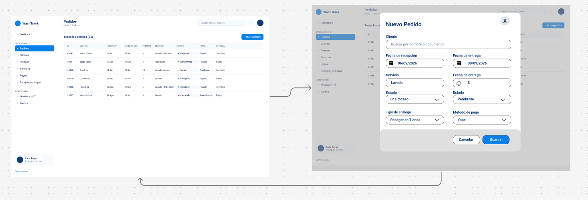

**Explicación del flujo:**

*Happy path:* el usuario ingresa al Dashboard, navega a Pedidos, hace clic en "+ Nuevo pedido", el sistema despliega el formulario sobre la lista atenuada, el usuario busca y selecciona un cliente, completa o confirma los campos restantes (fechas, servicio, cantidad de prendas, estado, pago, tipo de entrega, método de pago) y guarda. El sistema valida los datos, cierra el formulario y muestra el pedido al inicio de la tabla.

*Unhappy paths:*

- Cliente no encontrado en la búsqueda: el sistema muestra "Sin resultados" y el flujo no avanza hasta seleccionar un cliente válido.
- Error de validación al guardar: el formulario permanece abierto y se muestra el mensaje de error debajo del campo correspondiente, sin perder los datos ya ingresados.
- Cancelación: el usuario cierra el formulario en cualquier momento sin que se guarde ningún cambio.

---
### Consultar el estado de un pedido

**User Goal:** Ubicar rápidamente uno o varios pedidos según su estado actual, sin tener que revisar la tabla completa fila por fila.

**User Persona:** Pedro Fernández, Propietario de Lavandería.

**Consistencia con el Wireflow:** Este diagrama conserva exactamente la misma secuencia (Lista de Pedidos → Panel de filtro "Estado" → tabla actualizada) definida en el Wireflow de la sección 4.4.2.

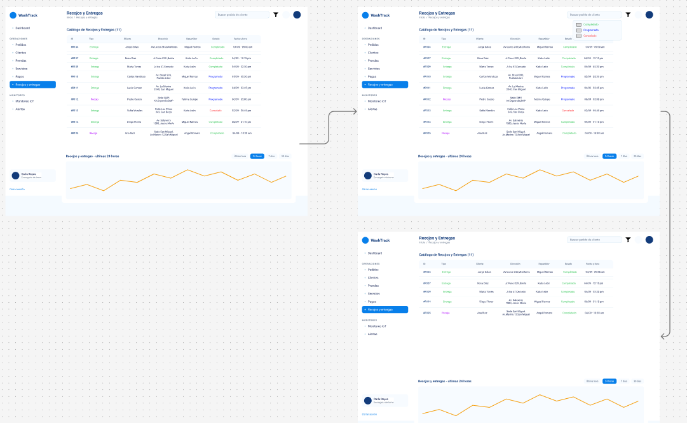

**Explicación del flujo:**

*Happy path:* el usuario ingresa a la Lista de Pedidos, hace clic en el filtro "Estado", el sistema despliega un panel con los estados disponibles, el usuario selecciona uno o varios estados y hace clic en "Aplicar". El sistema actualiza la tabla mostrando únicamente los pedidos que cumplen el filtro seleccionado.

*Unhappy paths:*

- Ningún pedido coincide con los estados seleccionados: el sistema muestra un mensaje de "Sin resultados" en la tabla.
- El usuario cierra el panel sin seleccionar el estado: el filtro anterior se mantiene sin cambios.

---
### Registrar un nuevo cliente

**User Goal:** Registrar los datos de un cliente nuevo en la base de datos maestra, para que quede disponible al momento de crear pedidos.

**User Persona:** Pedro Fernández, Propietario de Lavandería.

**Consistencia con el Wireflow:** Este diagrama conserva exactamente la misma secuencia (Clientes → Modal Agregar Nuevo Cliente → confirmación) definida en el Wireflow de la sección 4.4.2.

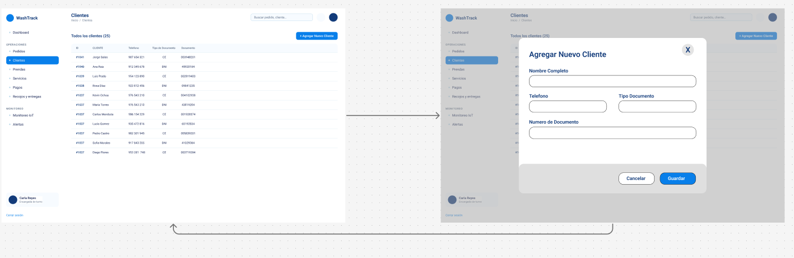

**Explicación del flujo:**

*Happy path:* el usuario ingresa a Clientes, hace clic en "+ Agregar Nuevo Cliente", el sistema despliega el formulario (Nombre Completo, Teléfono, Tipo de Documento, Número de Documento) sobre la lista atenuada, el usuario completa los campos y guarda. El sistema valida los datos, cierra el formulario y muestra el nuevo cliente en la tabla.

*Unhappy paths:*

- Documento duplicado: el sistema muestra un mensaje de error indicando que el número de documento ya está registrado, sin cerrar el formulario.
- Campo obligatorio vacío: se muestra el mensaje de error debajo del campo correspondiente y el formulario permanece abierto con los demás datos ya ingresados.
- Cancelación: el usuario cierra el formulario sin guardar ningún cambio.

---
### Registrar un pago asociado a un pedido

**User Goal:** Registrar el cobro correspondiente a un pedido, dejando constancia del monto y el método de pago utilizado.

**User Persona:** Pedro Fernández, Propietario de Lavandería.

**Consistencia con el Wireflow:** Este diagrama conserva exactamente la misma secuencia (Pagos → registro de monto y método → actualización de tabla) definida en el Wireflow de la sección 4.4.2.

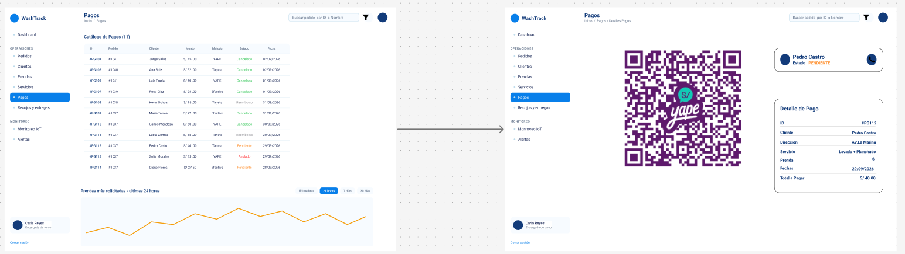

**Explicación del flujo:**

*Happy path:* el usuario ingresa a Pagos, ubica el pedido correspondiente (o accede desde el detalle del pedido en Pedidos), registra el monto cobrado y selecciona el método de pago (Yape, Tarjeta, Efectivo), y guarda. El sistema actualiza el estado de pago del pedido y lo refleja en la tabla de Pagos.

*Unhappy paths:*

- Monto inválido (negativo o distinto al total del pedido): el sistema muestra un mensaje de error y no permite guardar hasta corregirlo.
- Pedido ya pagado: el sistema advierte que el pedido ya cuenta con un pago registrado y solicita confirmación antes de continuar.
- Cancelación: el usuario cierra el formulario sin registrar el pago.
---

### Monitorear el envío de ropa al domicilio del cliente

**User Goal:** Monitorear en tiempo real el envío de la ropa ya lista, desde que sale de la lavandería hasta que llega al domicilio del cliente, para conocer en todo momento en qué etapa se encuentra el envío y cuánto falta para su entrega.

**User Persona:** Pedro Fernández, Propietario de Lavandería (Segmento 1).

**Consistencia con el Wireflow:** Este diagrama conserva exactamente la misma secuencia (Recojos y Entregas → Seguimiento de Entrega) definida en el Wireflow de la sección 4.4.2.

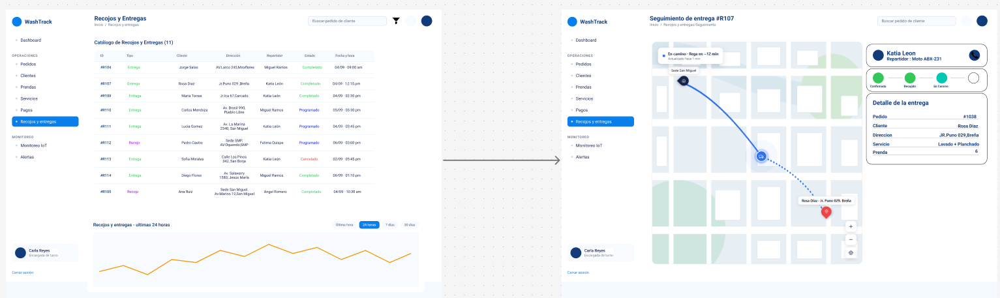

**Explicación del flujo:**

*Happy path:* el usuario ingresa a Recojos y Entregas, ubica en la tabla un registro de tipo "Entrega" con un repartidor ya asignado, y hace clic sobre esa fila. El sistema navega a la pantalla de Seguimiento de Entrega, donde se muestra el mapa con la ruta trazada desde la lavandería hasta el domicilio del cliente (tramo sólido recorrido / tramo punteado pendiente), la etiqueta flotante con el tiempo estimado de llegada, el stepper de progreso (Confirmado – Recojido – En Camino) y el detalle de respaldo del envío (Cliente, Dirección de entrega, Servicio, Prendas). El usuario permanece en la pantalla observando cómo el stepper y la posición del repartidor se actualizan automáticamente hasta que el envío se marca como Entregado.

*Unhappy paths:*

- Pérdida de conexión con el repartidor: el mapa y el stepper dejan de actualizarse en tiempo real y se muestra un indicador de "Sin conexión" hasta que se restablece la señal.
- Retraso frente al tiempo estimado inicial: la etiqueta flotante actualiza el tiempo de llegada (por ejemplo, de "~12 min" a un valor mayor), sin que el usuario tenga que salir de la pantalla para notar el cambio.
- Cliente no se encuentra en el domicilio al momento de la entrega: el repartidor reporta la incidencia, el registro cambia a un estado que refleje la entrega no concluida, y el usuario debe coordinar un nuevo intento de envío.

---
### Revisar y atender una alerta de posible falla en una máquina

**User Goal:** Identificar qué lavadoras requieren atención inmediata y revisar el detalle técnico antes de tomar una acción correctiva.

**User Persona:** Pedro Fernández, Propietario de Lavandería.

**Consistencia con el Wireflow:** Este diagrama conserva exactamente la misma secuencia (Alertas → Detalle de Lavadora) definida en el Wireflow de la sección 4.4.2.

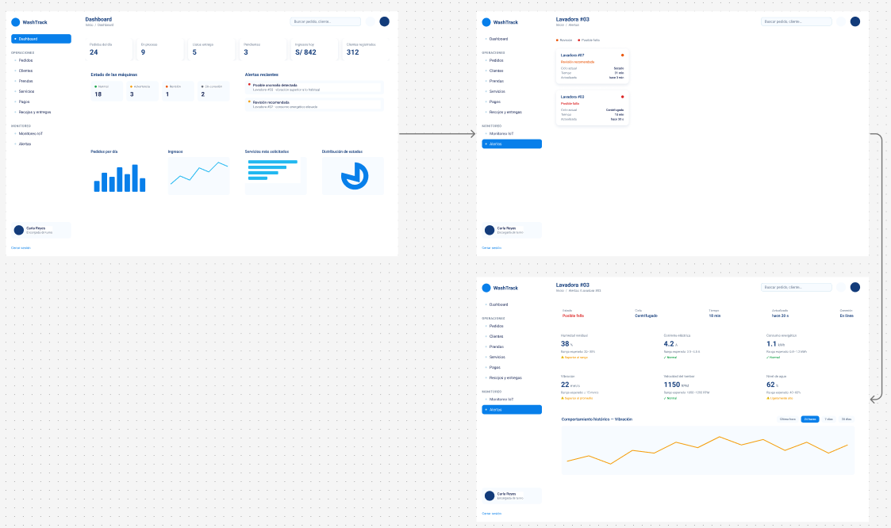

**Explicación del flujo:**

*Happy path:* el usuario ingresa a Alertas desde el grupo "Monitoreo" del sidebar, revisa la lista de lavadoras en estado "Revisión" o "Posible falla", hace clic en la tarjeta correspondiente, y el sistema navega al Detalle de Lavadora, donde se muestran las métricas (valor, rango esperado, veredicto) y el gráfico histórico de la métrica en alerta.

*Unhappy paths:*

- La lavadora pierde conexión mientras se revisa el detalle: el sistema actualiza el estado a "Sin conexión" y deja de refrescar las métricas en tiempo real.

- El usuario regresa a la lista sin realizar ninguna acción: el sistema conserva el estado de la lavadora sin cambios.

---

### Solicitar un nuevo pedido de lavandería

**User Goal:** Solicitar un servicio de lavandería de forma digital, sin necesidad de llamar o escribir directamente a la lavandería.

**User Persona:** Valeria Torres, Cliente de Lavandería.

**Consistencia con el Wireflow:** Este diagrama conserva exactamente la misma secuencia (Nuevo pedido → selección de servicio y prendas → confirmación) definida en el Wireflow de la sección 4.4.2.

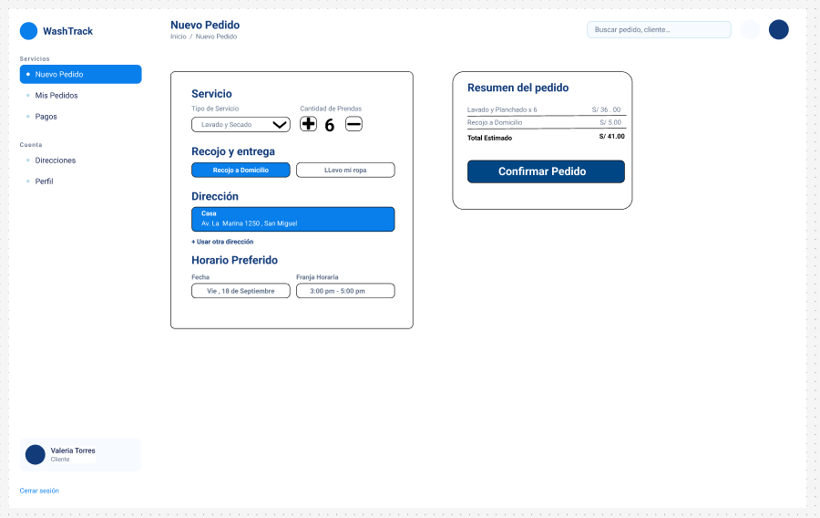

**Explicación del flujo:**

*Happy path:* la usuaria ingresa a la aplicación web, selecciona "Nuevo pedido", elige el servicio deseado y la cantidad de prendas, selecciona la fecha y el tipo de entrega, y confirma la solicitud. El sistema muestra una confirmación y agrega el pedido a su historial con estado inicial "En proceso".

*Unhappy paths:*

- Servicio no disponible en la zona de la usuaria: el sistema muestra un mensaje indicando que el servicio no cubre esa ubicación.
- Error de validación en el formulario: se muestra el mensaje de error debajo del campo correspondiente sin perder los datos ya ingresados.
- Cancelación de la solicitud: la usuaria cierra el formulario antes de confirmar y no se genera ningún pedido.

---

### Consultar el estado de su pedido sin llamar a la lavandería

**User Goal:** Conocer en qué etapa se encuentra su pedido en cualquier momento, sin necesidad de comunicarse directamente con la lavandería.

**User Persona:** Valeria Torres, Cliente de Lavandería.

**Consistencia con el Wireflow:** Este diagrama conserva exactamente la misma secuencia (Mis pedidos → detalle de estado) definida en el Wireflow de la sección 4.4.2.

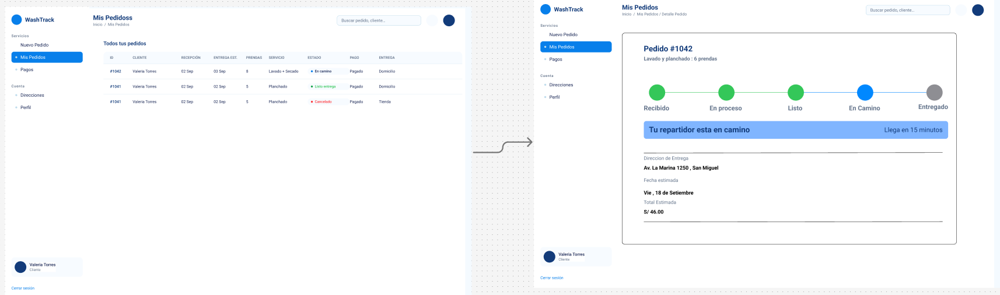

**Explicación del flujo:**

*Happy path:* la usuaria ingresa a la sección "Mis pedidos", selecciona el pedido activo, y el sistema muestra el estado actual (por ejemplo, "En proceso", "Listo para entrega") junto con la fecha estimada de entrega.

*Unhappy paths:*

- El pedido aún no ha sido registrado por la lavandería: el sistema muestra un estado "Pendiente de confirmación".
- Error de conexión al cargar el estado: se muestra un mensaje de error con opción de reintentar la carga.
- El pedido fue cancelado por la lavandería: el sistema muestra el estado "Cancelado" junto con el motivo, si está disponible.
---

### 4.5. Web Applications Prototyping

Las decisiones de interacción aplicadas en los prototipos de WashTrack y de la App Cliente parten directamente de la Arquitectura de Información previamente definida: una jerarquía clara y una categorización modular por perfil de usuario, orientada a que cada actor, sea administrador o cliente, encuentre sin esfuerzo las funcionalidades correspondientes a su rol. Sobre esa base, se aplicaron tres criterios de interacción consistentes en ambas aplicaciones:

* **Navegación persistente por roles:** Cada aplicación mantiene una barra lateral fija y agrupada por propósito (en WashTrack: Operaciones y Monitoreo; en la App Cliente: Servicios y Cuenta), de modo que la estructura de navegación refuerza visualmente la categorización modular ya establecida en la Arquitectura de Información, permitiendo que el usuario reconozca la ubicación de cada funcionalidad sin necesidad de aprenderla de nuevo en cada sección.
* **Superposición modal para datos administrables y navegación completa para procesos en curso:** Las acciones de alta y edición de registros estáticos, tales como pedidos, clientes o el catálogo, se resuelven mediante modales sobre la vista atenuada, mientras que el seguimiento de procesos en tiempo real, como el envío de un pedido o el monitoreo de una lavadora, se resuelve mediante una pantalla dedicada. Esta distinción reduce la carga cognitiva al comunicar de forma consistente cuándo el usuario está gestionando un dato y cuándo está observando un estado vivo del sistema.
* **Progreso visible mediante steppers y paneles de filtro contextuales:** Los flujos secuenciales, como el seguimiento de una entrega o el estado de un pedido del cliente, utilizan un stepper que hace explícita la etapa actual dentro de la secuencia lógica de acceso a la información. Por su parte, las consultas de alto volumen en la lista de pedidos utilizan paneles de filtro anclados al control que los origina, evitando que el usuario pierda el contexto de la pantalla en la que se encuentra.

Los prototipos fueron construidos en Figma, incluyendo simulación de interacción y navegación para Desktop Web Browser y Mobile Web Browser, siguiendo los caminos de flujo óptimo y de excepciones definidos en los User Flow Diagrams.

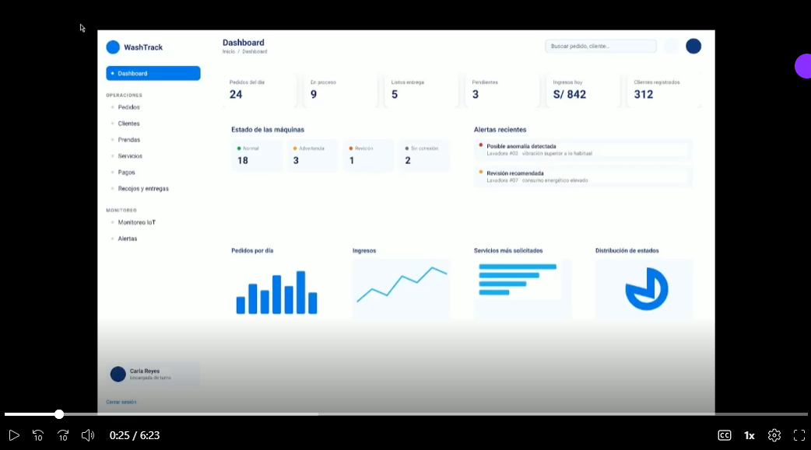

**Video de prototipo  :** [upc-pre-202620-1asi0730-16129-Devtech-prototypenavigation.mp4](https://upcedupe-my.sharepoint.com/:v:/g/personal/u202216240_upc_edu_pe/IQCabeS1dMD4Rb0pFmHeYViRAXjFhmCsulOYm4D1f0Kj584?e=SoYR59&nav=eyJyZWZlcnJhbEluZm8iOnsicmVmZXJyYWxBcHAiOiJTdHJlYW1XZWJBcHAiLCJyZWZlcnJhbFZpZXciOiJTaGFyZURpYWxvZy1MaW5rIiwicmVmZXJyYWxBcHBQbGF0Zm9ybSI6IldlYiIsInJlZmVycmFsTW9kZSI6InZpZXcifX0%3D)

### 4.6. Domain-Driven Software Architecture
La arquitectura de WashTrack se organiza utilizando conceptos de **Domain-Driven Design (DDD)** para separar las principales responsabilidades del dominio. Los Bounded Contexts permiten delimitar las reglas y responsabilidades de cada área funcional.

| Bounded Context | Responsabilidad |
|---|---|
| Identity & Access | Gestionar identidad, autenticación y autorización. |
| Order Management | Gestionar solicitudes y órdenes de servicio. |
| Laundry Operations | Gestionar el procesamiento interno de las órdenes. |
| Subscription & Payment | Gestionar membresías, créditos, beneficios y pagos. |
| Tracking & Notifications | Gestionar seguimiento y notificaciones. |
| Customer & Business Management | Gestionar clientes, lavanderías e información operativa. |

#### 4.6.1. Design-Level EventStorming
El Design-Level EventStorming identifica los principales **Commands, Aggregates, Domain Events y Policies** necesarios para representar el comportamiento del dominio.

### Commands principales

| Command | Aggregate | Domain Event |
|---|---|---|
| Create Order | Order | OrderCreated |
| Register Special Care | Order | SpecialCareRegistered |
| Select Delivery Method | Order | DeliveryMethodSelected |
| Validate Subscription | Subscription | SubscriptionValidated |
| Apply Benefit | Subscription | BenefitApplied |
| Process Payment | Payment | PaymentProcessed |
| Receive Order | LaundryOrder | OrderReceived |
| Classify Order | LaundryOrder | OrderClassified |
| Assign Washing Cycle | LaundryOrder | WashingCycleAssigned |
| Assign Resource | LaundryOrder | ResourceAssigned |
| Advance Stage | LaundryOrder | ProcessingStageAdvanced |
| Prioritize VIP Order | LaundryOrder | VIPPriorityAssigned |
| Register Status Update | Tracking | OrderStatusUpdated |
| Send Notification | Notification | NotificationSent |
| Detect Delivery Risk | LaundryOrder | VIPDeliveryRiskDetected |

### Aggregates

- **Order:** mantiene la información de una solicitud.
- **Subscription:** controla membresía, vigencia y créditos.
- **Payment:** representa una transacción.
- **LaundryOrder:** representa el procesamiento operativo de una orden.
- **Tracking:** mantiene el historial de estados.
- **Notification:** representa una comunicación generada por el sistema.

### EventStorming

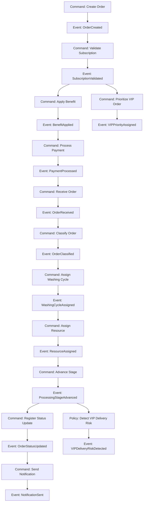
```mermaid
flowchart TB
    C1["Command: Create Order"] --> E1["Event: OrderCreated"]
    E1 --> C2["Command: Validate Subscription"]
    C2 --> E2["Event: SubscriptionValidated"]
    E2 --> C3["Command: Apply Benefit"]
    C3 --> E3["Event: BenefitApplied"]
    E3 --> C4["Command: Process Payment"]
    C4 --> E4["Event: PaymentProcessed"]

    E4 --> C5["Command: Receive Order"]
    C5 --> E5["Event: OrderReceived"]
    E5 --> C6["Command: Classify Order"]
    C6 --> E6["Event: OrderClassified"]
    E6 --> C7["Command: Assign Washing Cycle"]
    C7 --> E7["Event: WashingCycleAssigned"]
    E7 --> C8["Command: Assign Resource"]
    C8 --> E8["Event: ResourceAssigned"]
    E8 --> C9["Command: Advance Stage"]
    C9 --> E9["Event: ProcessingStageAdvanced"]

    E9 --> C10["Command: Register Status Update"]
    C10 --> E10["Event: OrderStatusUpdated"]
    E10 --> C11["Command: Send Notification"]
    C11 --> E11["Event: NotificationSent"]

    E2 --> C12["Command: Prioritize VIP Order"]
    C12 --> E12["Event: VIPPriorityAssigned"]
    E9 --> C13["Policy: Detect VIP Delivery Risk"]
    C13 --> E13["Event: VIPDeliveryRiskDetected"]
```

#### 4.6.2. Software Architecture Context Diagram
El Context Diagram representa a WashTrack como el sistema central y muestra sus principales actores y sistemas externos.

### Actores

- **Customer:** solicita servicios, gestiona membresías, realiza pagos y consulta el seguimiento.
- **Laundry Provider:** administra órdenes, recursos, clientes y operación.

### Sistemas externos

- **Payment Gateway:** procesa pagos.
- **Email Service:** envía notificaciones.

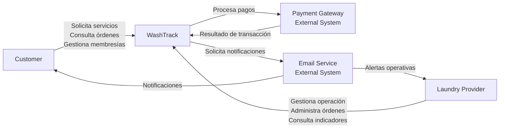
```mermaid
flowchart LR
    Customer["Customer"]
    Provider["Laundry Provider"]

    WashTrack["WashTrack"]

    Payment["Payment Gateway<br/>External System"]
    Email["Email Service<br/>External System"]

    Customer -->|"Solicita servicios<br/>Consulta órdenes<br/>Gestiona membresías"| WashTrack
    Provider -->|"Gestiona operación<br/>Administra órdenes<br/>Consulta indicadores"| WashTrack

    WashTrack -->|"Procesa pagos"| Payment
    Payment -->|"Resultado de transacción"| WashTrack

    WashTrack -->|"Solicita notificaciones"| Email
    Email -->|"Notificaciones"| Customer
    Email -->|"Alertas operativas"| Provider
```

#### 4.6.3. Software Architecture Container Diagrams
El Container Diagram representa las principales unidades de software que conforman la solución.

| Container | Tecnología propuesta | Responsabilidad |
|---|---|---|
| Landing Page | HTML, CSS, JavaScript | Presentar la propuesta de valor. |
| Web Application | Vue.js | Interfaces para Customer y Laundry Provider. |
| RESTful API | C# / ASP.NET Core | Servicios y lógica de negocio. |
| Database | PostgreSQL | Persistencia de información. |
| Notification Worker | C# / .NET Worker Service | Procesar eventos y generar notificaciones. |
| Payment Gateway | Servicio externo | Procesar pagos. |
| Email Service | Servicio externo | Enviar correos. |

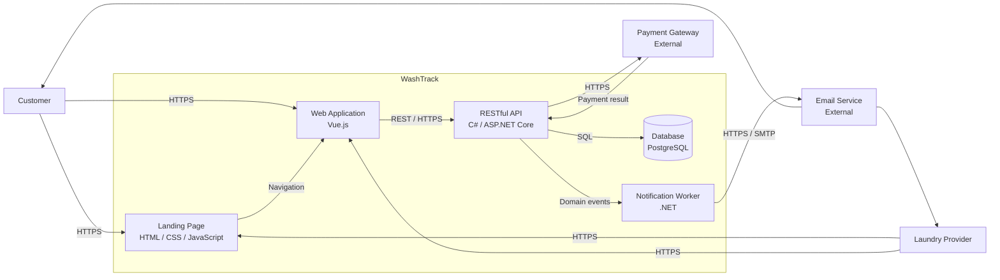
```mermaid
flowchart LR
    Customer["Customer"]
    Provider["Laundry Provider"]

    subgraph WashTrack["WashTrack"]
        Landing["Landing Page<br/>HTML / CSS / JavaScript"]
        WebApp["Web Application<br/>Vue.js"]
        API["RESTful API<br/>C# / ASP.NET Core"]
        DB[("Database<br/>PostgreSQL")]
        Worker["Notification Worker<br/>.NET"]
    end

    Payment["Payment Gateway<br/>External"]
    Email["Email Service<br/>External"]

    Customer -->|"HTTPS"| Landing
    Provider -->|"HTTPS"| Landing
    Customer -->|"HTTPS"| WebApp
    Provider -->|"HTTPS"| WebApp

    Landing -->|"Navigation"| WebApp
    WebApp -->|"REST / HTTPS"| API
    API -->|"SQL"| DB
    API -->|"HTTPS"| Payment
    Payment -->|"Payment result"| API
    API -->|"Domain events"| Worker
    Worker -->|"HTTPS / SMTP"| Email
    Email --> Customer
    Email --> Provider
```

#### 4.6.4. Software Architecture Components Diagrams
### 4.6.4.1. RESTful API

La API se divide en capas para separar la exposición HTTP, los casos de uso, las reglas de dominio y las integraciones.

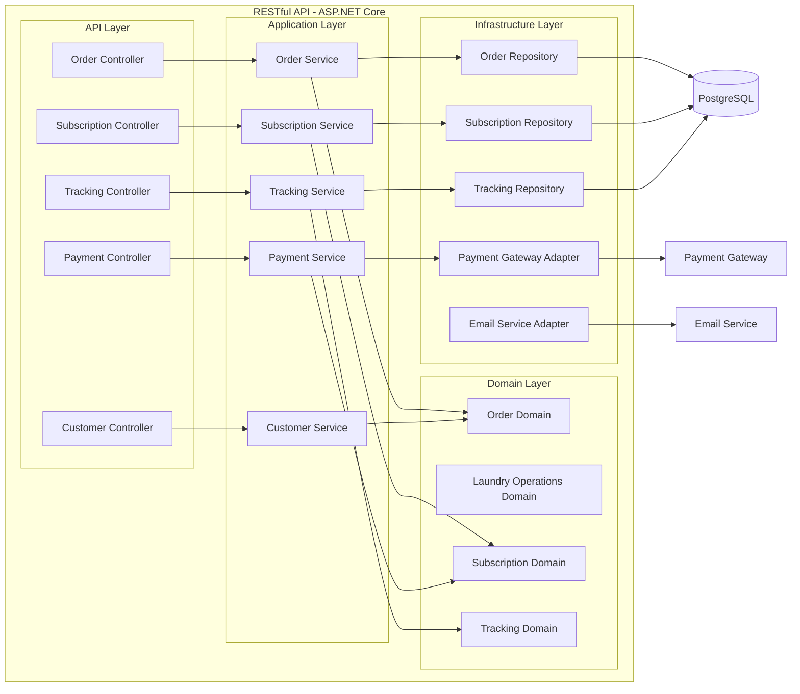
```mermaid
flowchart LR
    subgraph API["RESTful API - ASP.NET Core"]
        subgraph Presentation["API Layer"]
            OC["Order Controller"]
            SC["Subscription Controller"]
            TC["Tracking Controller"]
            PC["Payment Controller"]
            CC["Customer Controller"]
        end

        subgraph Application["Application Layer"]
            OS["Order Service"]
            SS["Subscription Service"]
            TS["Tracking Service"]
            PS["Payment Service"]
            CS["Customer Service"]
        end

        subgraph Domain["Domain Layer"]
            OD["Order Domain"]
            LD["Laundry Operations Domain"]
            SD["Subscription Domain"]
            TD["Tracking Domain"]
        end

        subgraph Infrastructure["Infrastructure Layer"]
            OR["Order Repository"]
            SR["Subscription Repository"]
            TR["Tracking Repository"]
            PA["Payment Gateway Adapter"]
            EA["Email Service Adapter"]
        end
    end

    DB[("PostgreSQL")]
    Payment["Payment Gateway"]
    Email["Email Service"]

    OC --> OS
    SC --> SS
    TC --> TS
    PC --> PS
    CC --> CS

    OS --> OD
    SS --> SD
    TS --> TD
    PS --> SD
    CS --> OD

    OS --> OR
    SS --> SR
    TS --> TR
    PS --> PA

    OR --> DB
    SR --> DB
    TR --> DB
    PA --> Payment
    EA --> Email
```

### 4.6.4.2. Web Application

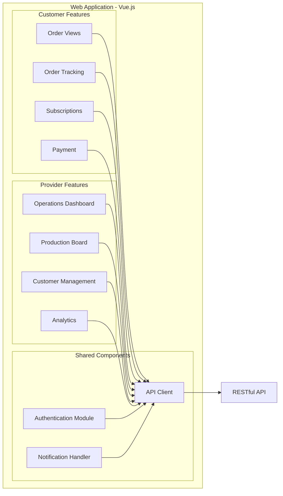
```mermaid
flowchart LR
    subgraph Web["Web Application - Vue.js"]
        subgraph CustomerFeatures["Customer Features"]
            Orders["Order Views"]
            Tracking["Order Tracking"]
            Subs["Subscriptions"]
            Pay["Payment"]
        end

        subgraph ProviderFeatures["Provider Features"]
            Dashboard["Operations Dashboard"]
            Board["Production Board"]
            Customers["Customer Management"]
            Analytics["Analytics"]
        end

        subgraph Shared["Shared Components"]
            Auth["Authentication Module"]
            Client["API Client"]
            Notify["Notification Handler"]
        end
    end

    API["RESTful API"]

    Orders --> Client
    Tracking --> Client
    Subs --> Client
    Pay --> Client
    Dashboard --> Client
    Board --> Client
    Customers --> Client
    Analytics --> Client
    Auth --> Client
    Notify --> Client
    Client --> API
```

### 4.6.4.3. Notification Worker

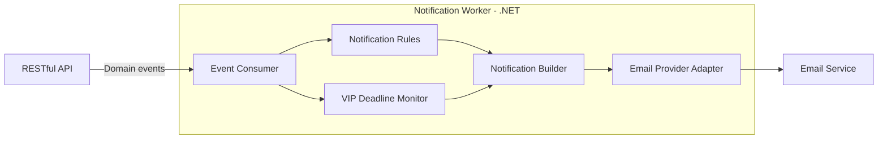
```mermaid
flowchart LR
    API["RESTful API"]

    subgraph Worker["Notification Worker - .NET"]
        Consumer["Event Consumer"]
        Rules["Notification Rules"]
        Monitor["VIP Deadline Monitor"]
        Builder["Notification Builder"]
        Adapter["Email Provider Adapter"]
    end

    Email["Email Service"]

    API -->|"Domain events"| Consumer
    Consumer --> Rules
    Consumer --> Monitor
    Rules --> Builder
    Monitor --> Builder
    Builder --> Adapter
    Adapter --> Email
```

### 4.7. Software Object-Oriented Design
El diseño orientado a objetos representa los principales elementos del dominio mediante clases, atributos, operaciones, enumeraciones e interfaces.

#### 4.7.1. Class Diagrams
### 4.7.1.1. Order Management

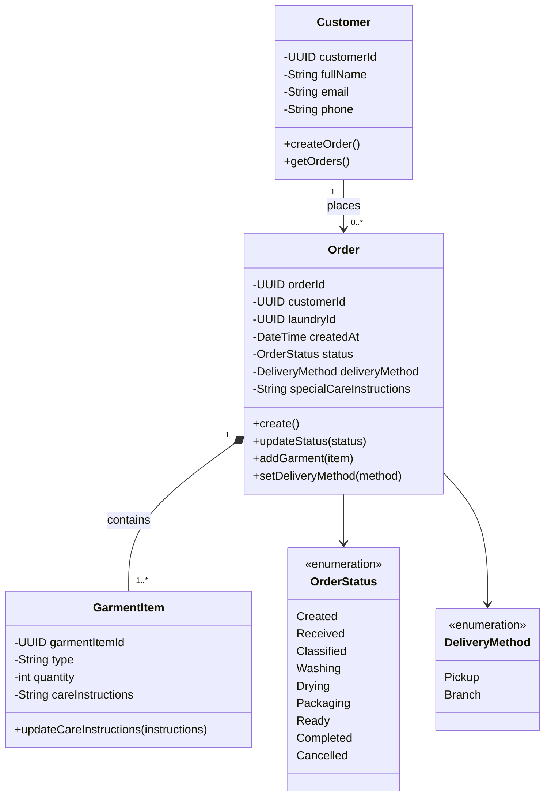
```mermaid
classDiagram
    class Customer {
        -UUID customerId
        -String fullName
        -String email
        -String phone
        +createOrder()
        +getOrders()
    }

    class Order {
        -UUID orderId
        -UUID customerId
        -UUID laundryId
        -DateTime createdAt
        -OrderStatus status
        -DeliveryMethod deliveryMethod
        -String specialCareInstructions
        +create()
        +updateStatus(status)
        +addGarment(item)
        +setDeliveryMethod(method)
    }

    class GarmentItem {
        -UUID garmentItemId
        -String type
        -int quantity
        -String careInstructions
        +updateCareInstructions(instructions)
    }

    class OrderStatus {
        <<enumeration>>
        Created
        Received
        Classified
        Washing
        Drying
        Packaging
        Ready
        Completed
        Cancelled
    }

    class DeliveryMethod {
        <<enumeration>>
        Pickup
        Branch
    }

    Customer "1" --> "0..*" Order : places
    Order "1" *-- "1..*" GarmentItem : contains
    Order --> OrderStatus
    Order --> DeliveryMethod
```

### 4.7.1.2. Subscription & Payment

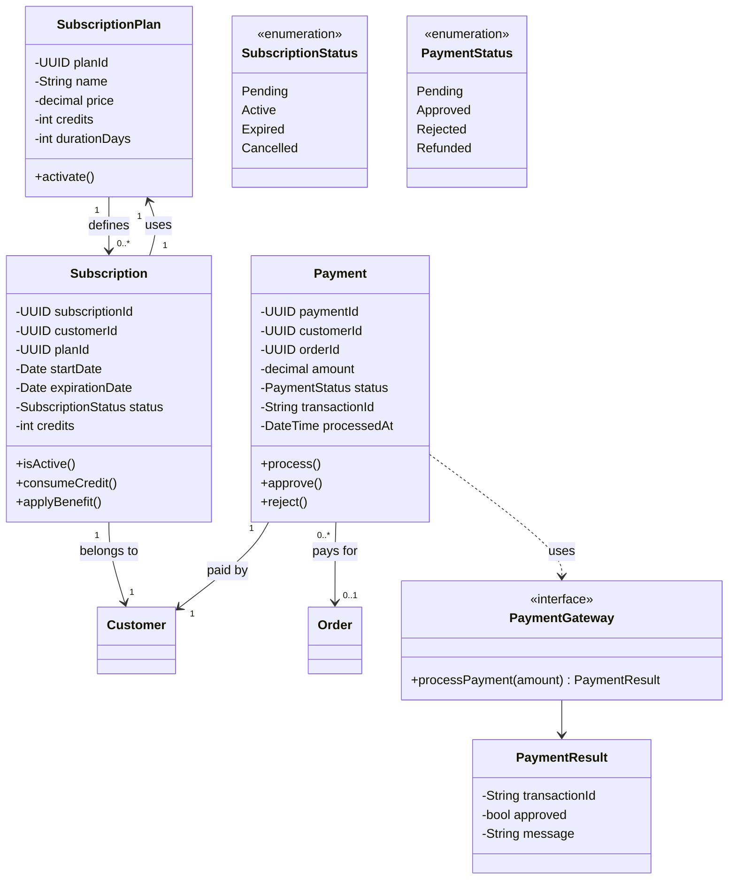
```mermaid
classDiagram
    class SubscriptionPlan {
        -UUID planId
        -String name
        -decimal price
        -int credits
        -int durationDays
        +activate()
    }

    class Subscription {
        -UUID subscriptionId
        -UUID customerId
        -UUID planId
        -Date startDate
        -Date expirationDate
        -SubscriptionStatus status
        -int credits
        +isActive()
        +consumeCredit()
        +applyBenefit()
    }

    class Payment {
        -UUID paymentId
        -UUID customerId
        -UUID orderId
        -decimal amount
        -PaymentStatus status
        -String transactionId
        -DateTime processedAt
        +process()
        +approve()
        +reject()
    }

    class PaymentGateway {
        <<interface>>
        +processPayment(amount) PaymentResult
    }

    class PaymentResult {
        -String transactionId
        -bool approved
        -String message
    }

    class SubscriptionStatus {
        <<enumeration>>
        Pending
        Active
        Expired
        Cancelled
    }

    class PaymentStatus {
        <<enumeration>>
        Pending
        Approved
        Rejected
        Refunded
    }

    SubscriptionPlan "1" --> "0..*" Subscription : defines
    Subscription "1" --> "1" SubscriptionPlan : uses
    Subscription "1" --> "1" Customer : belongs to
    Payment "1" --> "1" Customer : paid by
    Payment "0..*" --> "0..1" Order : pays for
    Payment ..> PaymentGateway : uses
    PaymentGateway --> PaymentResult
```

### 4.7.1.3. Laundry Operations

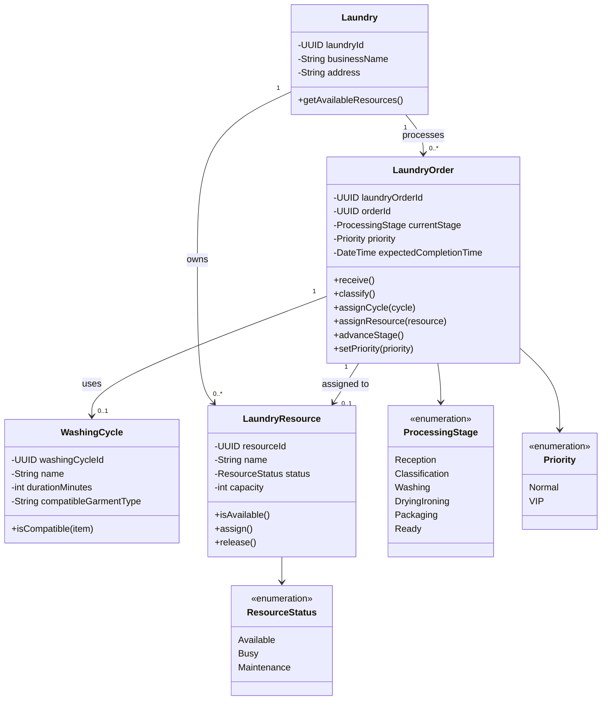
```mermaid
classDiagram
    class Laundry {
        -UUID laundryId
        -String businessName
        -String address
        +getAvailableResources()
    }

    class LaundryOrder {
        -UUID laundryOrderId
        -UUID orderId
        -ProcessingStage currentStage
        -Priority priority
        -DateTime expectedCompletionTime
        +receive()
        +classify()
        +assignCycle(cycle)
        +assignResource(resource)
        +advanceStage()
        +setPriority(priority)
    }

    class WashingCycle {
        -UUID washingCycleId
        -String name
        -int durationMinutes
        -String compatibleGarmentType
        +isCompatible(item)
    }

    class LaundryResource {
        -UUID resourceId
        -String name
        -ResourceStatus status
        -int capacity
        +isAvailable()
        +assign()
        +release()
    }

    class ProcessingStage {
        <<enumeration>>
        Reception
        Classification
        Washing
        DryingIroning
        Packaging
        Ready
    }

    class ResourceStatus {
        <<enumeration>>
        Available
        Busy
        Maintenance
    }

    class Priority {
        <<enumeration>>
        Normal
        VIP
    }

    Laundry "1" --> "0..*" LaundryOrder : processes
    Laundry "1" --> "0..*" LaundryResource : owns
    LaundryOrder "1" --> "0..1" WashingCycle : uses
    LaundryOrder "1" --> "0..1" LaundryResource : assigned to
    LaundryOrder --> ProcessingStage
    LaundryOrder --> Priority
    LaundryResource --> ResourceStatus
```

### 4.7.1.4. Tracking & Notifications

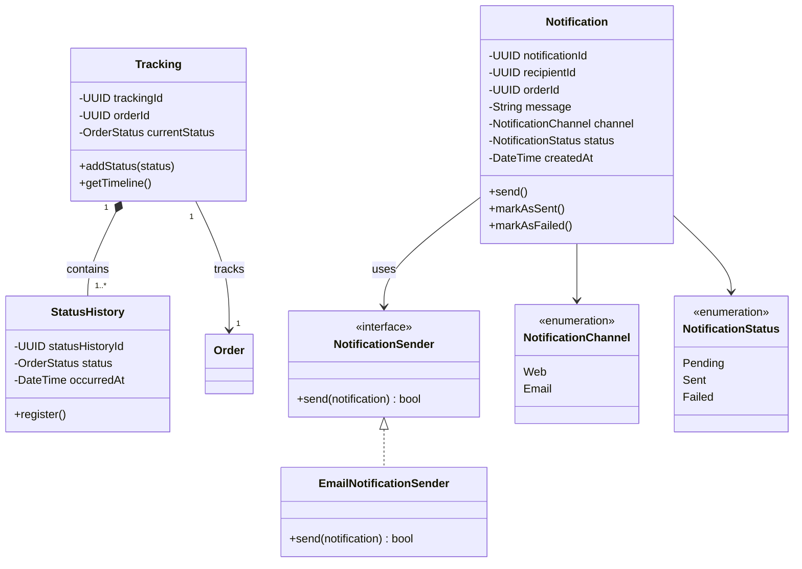
```mermaid
classDiagram
    class Tracking {
        -UUID trackingId
        -UUID orderId
        -OrderStatus currentStatus
        +addStatus(status)
        +getTimeline()
    }

    class StatusHistory {
        -UUID statusHistoryId
        -OrderStatus status
        -DateTime occurredAt
        +register()
    }

    class Notification {
        -UUID notificationId
        -UUID recipientId
        -UUID orderId
        -String message
        -NotificationChannel channel
        -NotificationStatus status
        -DateTime createdAt
        +send()
        +markAsSent()
        +markAsFailed()
    }

    class NotificationSender {
        <<interface>>
        +send(notification) bool
    }

    class EmailNotificationSender {
        +send(notification) bool
    }

    class NotificationChannel {
        <<enumeration>>
        Web
        Email
    }

    class NotificationStatus {
        <<enumeration>>
        Pending
        Sent
        Failed
    }

    Tracking "1" *-- "1..*" StatusHistory : contains
    Tracking "1" --> "1" Order : tracks
    Notification --> NotificationSender : uses
    NotificationSender <|.. EmailNotificationSender
    Notification --> NotificationChannel
    Notification --> NotificationStatus
```

### 4.8. Database Design
WashTrack requiere persistir información de clientes, lavanderías, órdenes, prendas, procesos operativos, membresías, pagos, seguimiento y notificaciones.

Se propone una base de datos relacional para organizar las relaciones entre las entidades principales.

#### 4.8.1. Database Diagrams
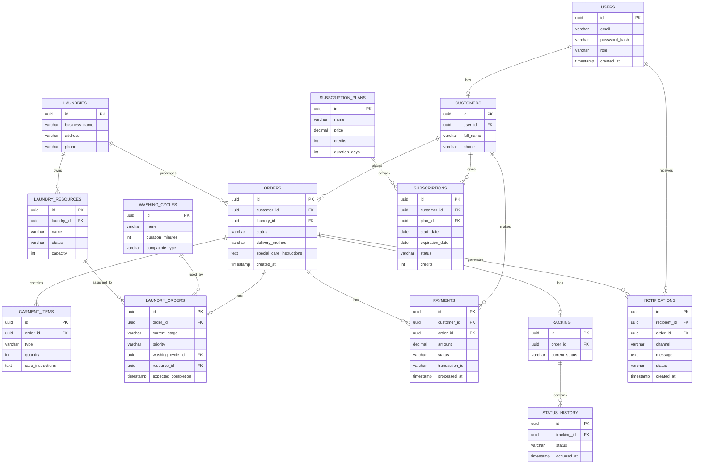
```mermaid
erDiagram
    USERS {
        uuid id PK
        varchar email
        varchar password_hash
        varchar role
        timestamp created_at
    }

    CUSTOMERS {
        uuid id PK
        uuid user_id FK
        varchar full_name
        varchar phone
    }

    LAUNDRIES {
        uuid id PK
        varchar business_name
        varchar address
        varchar phone
    }

    ORDERS {
        uuid id PK
        uuid customer_id FK
        uuid laundry_id FK
        varchar status
        varchar delivery_method
        text special_care_instructions
        timestamp created_at
    }

    GARMENT_ITEMS {
        uuid id PK
        uuid order_id FK
        varchar type
        int quantity
        text care_instructions
    }

    LAUNDRY_ORDERS {
        uuid id PK
        uuid order_id FK
        varchar current_stage
        varchar priority
        uuid washing_cycle_id FK
        uuid resource_id FK
        timestamp expected_completion
    }

    WASHING_CYCLES {
        uuid id PK
        varchar name
        int duration_minutes
        varchar compatible_type
    }

    LAUNDRY_RESOURCES {
        uuid id PK
        uuid laundry_id FK
        varchar name
        varchar status
        int capacity
    }

    SUBSCRIPTION_PLANS {
        uuid id PK
        varchar name
        decimal price
        int credits
        int duration_days
    }

    SUBSCRIPTIONS {
        uuid id PK
        uuid customer_id FK
        uuid plan_id FK
        date start_date
        date expiration_date
        varchar status
        int credits
    }

    PAYMENTS {
        uuid id PK
        uuid customer_id FK
        uuid order_id FK
        decimal amount
        varchar status
        varchar transaction_id
        timestamp processed_at
    }

    TRACKING {
        uuid id PK
        uuid order_id FK
        varchar current_status
    }

    STATUS_HISTORY {
        uuid id PK
        uuid tracking_id FK
        varchar status
        timestamp occurred_at
    }

    NOTIFICATIONS {
        uuid id PK
        uuid recipient_id FK
        uuid order_id FK
        varchar channel
        text message
        varchar status
        timestamp created_at
    }

    USERS ||--o| CUSTOMERS : has
    CUSTOMERS ||--o{ ORDERS : places
    LAUNDRIES ||--o{ ORDERS : processes
    ORDERS ||--|{ GARMENT_ITEMS : contains
    ORDERS ||--o| LAUNDRY_ORDERS : has
    WASHING_CYCLES ||--o{ LAUNDRY_ORDERS : used_by
    LAUNDRIES ||--o{ LAUNDRY_RESOURCES : owns
    LAUNDRY_RESOURCES ||--o{ LAUNDRY_ORDERS : assigned_to
    CUSTOMERS ||--o{ SUBSCRIPTIONS : owns
    SUBSCRIPTION_PLANS ||--o{ SUBSCRIPTIONS : defines
    CUSTOMERS ||--o{ PAYMENTS : makes
    ORDERS ||--o{ PAYMENTS : has
    ORDERS ||--o| TRACKING : has
    TRACKING ||--o{ STATUS_HISTORY : contains
    USERS ||--o{ NOTIFICATIONS : receives
    ORDERS ||--o{ NOTIFICATIONS : generates
```

### Relación entre Bounded Contexts y tablas

| Bounded Context | Tablas principales |
|---|---|
| Identity & Access | `users` |
| Customer & Business Management | `customers`, `laundries` |
| Order Management | `orders`, `garment_items` |
| Laundry Operations | `laundry_orders`, `washing_cycles`, `laundry_resources` |
| Subscription & Payment | `subscription_plans`, `subscriptions`, `payments` |
| Tracking & Notifications | `tracking`, `status_history`, `notifications` |

## Capítulo V: Product Implementation, Validation & Deployment

### 5.1. Software Configuration Management
#### 5.1.1. Software Development Environment Configuration

El equipo DevTech utilizará las siguientes herramientas para colaborar durante las actividades de gestión del proyecto, levantamiento de requerimientos, diseño UX/UI, desarrollo, despliegue y documentación de WashTrack. Se priorizan productos con acceso web o instaladores oficiales y una configuración reproducible para todos los integrantes.

| Actividad | Producto | Propósito de uso en el proyecto | Ruta de referencia o descarga |
| :--- | :--- | :--- | :--- |
| Project Management | GitHub Projects | Organizar el Product Backlog, asignar tareas, visualizar el flujo de trabajo y dar seguimiento al avance de los Sprints. | [GitHub Projects](https://docs.github.com/en/issues/planning-and-tracking-with-projects/learning-about-projects/about-projects) |
| Requirements Management | GitHub Issues | Registrar User Stories, tareas, errores y criterios de aceptación vinculados con el código fuente. | [GitHub Issues](https://docs.github.com/en/issues/tracking-your-work-with-issues/about-issues) |
| Source Code Management | Git y GitHub | Controlar versiones, administrar ramas, revisar cambios mediante Pull Requests y mantener el historial de cada producto. | [Git](https://git-scm.com/downloads) · [GitHub](https://github.com/) |
| Product UX/UI Design | Figma | Elaborar wireframes, mockups y prototipos colaborativos de la Landing Page y las aplicaciones web. | [Figma](https://www.figma.com/) |
| Software Development | WebStorm | Desarrollar la Landing Page y el Frontend Web Application, editar HTML5, CSS3, JavaScript y Vue, ejecutar tareas y revisar cambios. | [WebStorm](https://www.jetbrains.com/webstorm/download/) |
| Software Development | JetBrains Rider | Desarrollar y ejecutar los Web Services con C#, ASP.NET Core y Entity Framework Core, utilizando sus herramientas de edición, depuración y gestión de proyectos .NET. | [JetBrains Rider](https://www.jetbrains.com/rider/download/) |
| Software Development | Node.js y npm | Instalar dependencias y ejecutar los scripts de desarrollo y construcción del Frontend Web Application basado en Vue. | [Node.js](https://nodejs.org/en/download) |
| API Documentation and Testing | Swagger / OpenAPI | Consultar, documentar y validar los endpoints de los Web Services durante el desarrollo y la aceptación. | [OpenAPI Specification](https://swagger.io/specification/) |
| Software Deployment | GitHub Pages | Publicar la versión estable de la Landing Page desde la rama `main`. | [GitHub Pages](https://pages.github.com/) |
| Software Documentation | Markdown en GitHub | Mantener el informe, las decisiones técnicas, las instrucciones de ejecución y las evidencias junto al código. | [Guía de Markdown de GitHub](https://docs.github.com/en/get-started/writing-on-github) |

La configuración base para los integrantes será Git, WebStorm para la Landing Page y el Frontend Web Application, y JetBrains Rider para los Web Services desarrollados con C# y .NET. Las versiones de Node.js y .NET deberán corresponder con las declaradas en los archivos de configuración de cada repositorio. Las credenciales, cadenas de conexión y demás secretos no se almacenarán en el repositorio; se administrarán mediante variables de entorno o la configuración segura del servicio de despliegue.

#### 5.1.2. Source Code Management

GitHub será la plataforma oficial para el control de versiones, revisión de código y colaboración. Cada producto tendrá un repositorio independiente para mantener una responsabilidad clara, facilitar el despliegue y evitar que los cambios de un producto afecten directamente a los demás.

| Producto | Repositorio GitHub | Contenido principal |
| :--- | :--- | :--- |
| Landing Page | [DevTech-LandingPage-16129-G2](https://github.com/1ASI0730-2620-16129-G2-DevTech/DevTech-LandingPage-16129-G2) | Código HTML5, CSS3, JavaScript, imágenes y configuración de publicación en GitHub Pages. |

#### GitFlow

El equipo aplicará GitFlow para separar el desarrollo de las versiones publicadas. La rama `main` contendrá únicamente versiones estables y desplegables. La rama `develop` integrará los cambios terminados antes de preparar una versión. Cada cambio funcional o técnico se realizará en una rama independiente y se incorporará mediante Pull Request, revisión del código y validación de las pruebas.

| Rama | Propósito | Convención |
| :--- | :--- | :--- |
| `main` | Código estable listo para publicación. | Rama permanente protegida. |
| `develop` | Integración de funcionalidades terminadas para la siguiente versión. | Rama permanente. |
| `feature/*` | Desarrollo aislado de una funcionalidad, requisito o mejora. | `feature/<id-o-nombre-descriptivo>`; por ejemplo, `feature/US-014-order-tracking`. |
| `release/*` | Preparación, documentación y corrección final de una versión candidata. | `release/<MAJOR>.<MINOR>.<PATCH>`; por ejemplo, `release/1.0.0`. |
| `hotfix/*` | Corrección urgente de un defecto detectado en producción. | `hotfix/<MAJOR>.<MINOR>.<PATCH>`; por ejemplo, `hotfix/1.0.1`. |

El flujo para una funcionalidad será `feature/*` → `develop`. Cuando el incremento cumpla los criterios de aceptación, se creará una rama `release/*` desde `develop`; después de validar la versión, se fusionará en `main` y también en `develop` para conservar las correcciones. Un `hotfix/*` se creará desde `main`, se fusionará en `main` y luego en `develop`. Las ramas integradas se eliminarán después de completar el Pull Request, salvo las ramas permanentes.

#### Semantic Versioning

Las versiones publicadas seguirán Semantic Versioning 2.0.0 con el formato `MAJOR.MINOR.PATCH`:

* **MAJOR:** cambios incompatibles con la versión anterior.
* **MINOR:** funcionalidad nueva compatible con la versión anterior.
* **PATCH:** correcciones compatibles de errores o cambios menores.

La primera versión estable se identificará como `v1.0.0`. Las etiquetas de versión se crearán en `main` después de aceptar el Pull Request de `release/*`. Las versiones preliminares podrán utilizar identificadores como `v1.1.0-rc.1` cuando se requiera validar una versión candidata.

#### Conventional Commits

Los mensajes de commit seguirán Conventional Commits para que el historial sea uniforme y facilite la generación de changelogs. Se utilizará el formato `tipo(alcance): descripción breve`.

| Tipo | Uso | Ejemplo |
| :--- | :--- | :--- |
| `feat` | Nueva funcionalidad. | `feat(tracking): add order status timeline` |
| `fix` | Corrección de un defecto. | `fix(auth): validate expired token` |
| `docs` | Cambios únicamente documentales. | `docs(report): add source code management` |
| `style` | Formato o estilo sin cambio de comportamiento. | `style(landing): align navigation spacing` |
| `refactor` | Reestructuración sin cambiar el comportamiento. | `refactor(orders): extract order mapper` |
| `test` | Creación o modificación de pruebas. | `test(orders): add integration scenarios` |
| `chore` | Mantenimiento, configuración o dependencias. | `chore(api): update dotnet dependencies` |

La descripción se redactará en modo imperativo, en minúsculas y sin punto final. Cuando un cambio rompa compatibilidad, se añadirá `!` después del alcance o un pie `BREAKING CHANGE` en el cuerpo del commit; por ejemplo, `feat(api)!: replace order status endpoint`.
#### 5.1.3. Source Code Style Guide & Conventions

Para el desarrollo de la Landing Page de <b>WashTrack</b>, se establecieron convenciones de estilo y nomenclatura con el objetivo de <b>mantener un código ordenado, legible, consistente y fácil de mantener.</b> Estas convenciones se aplican principalmente a HTML5, CSS3 y JavaScript, tecnologías utilizadas en la implementación de la Landing Page.

Como criterio general, se establece que los nombres utilizados en el código fuente deben escribirse en inglés, especialmente para clases, funciones y variables, manteniendo una nomenclatura consistente entre los diferentes archivos del proyecto. Asimismo, se busca utilizar nombres descriptivos que permitan identificar fácilmente la función de cada elemento.

---

### HTML5

Para la estructura de la Landing Page se utiliza HTML5, empleando etiquetas semánticas y una organización jerárquica del contenido. Las principales convenciones aplicadas son:

* **Nombres descriptivos:** Las clases e identificadores deben representar claramente la función o contenido del elemento. Por ejemplo, se utilizan nombres como `menu-toggle`, `nav-collapse`, `tracking-demo` y `footer-container`.
* **Indentación:** El código se organiza mediante una indentación consistente para facilitar la lectura de la estructura HTML.
* **Etiquetas semánticas:** Se emplean elementos como `<nav>`, `<section>`, `<header>` y `<footer>` para organizar semánticamente las diferentes partes de la Landing Page.
* **Atributos descriptivos:** Se utilizan atributos como `id`, `class`, `alt`, `aria-label` y `aria-expanded` para mejorar la identificación de elementos, accesibilidad y comportamiento de la interfaz. Por ejemplo, el botón del menú utiliza `aria-label="Abrir menú"` y `aria-expanded="false"`.
* **Comentarios:** Se incorporan comentarios para identificar secciones o funcionalidades específicas del código, como el botón hamburguesa y las secciones relacionadas con el formulario.
* **Estructura organizada:** El contenido se divide en secciones independientes, como Inicio, Problema/Solución, Características, Para quién, Sobre nosotros, Planes, Contacto y Footer.
---

### CSS3

CSS3 se utiliza para definir la presentación visual, distribución y adaptación responsive de la Landing Page. El proyecto contempla archivos independientes para organizar los estilos generales, el menú, el footer y el formulario. Las convenciones utilizadas son:

* **Nombres descriptivos:** Las clases CSS utilizan nombres que permiten identificar su propósito, por ejemplo `btn-primario`, `btn-secundario`, `caracteristica-card`, `quien-card` y `footer-links`.
* **Nomenclatura consistente:** Se mantiene un patrón uniforme para los nombres de clases, utilizando palabras relacionadas con la función del componente.
* **Clases reutilizables:** Se utilizan clases para aplicar estilos a diferentes elementos y evitar repetir reglas innecesariamente.
* **Organización por componentes:** Los estilos se distribuyen de acuerdo con las partes de la Landing Page, facilitando su mantenimiento.
* **Diseño responsive:** Los estilos están orientados a permitir que la interfaz se adapte a diferentes tamaños de pantalla (celulares, tablets y computadoras).

---
### JavaScript

JavaScript se utiliza para incorporar interactividad a la Landing Page. Entre sus funciones se encuentran el control del menú de navegación y el cambio entre los idiomas español e inglés. Las principales convenciones aplicadas son:

* **camelCase:** Se utiliza esta convención para variables y funciones, como `navCollapse`, `isOpen`, `translatableElements`, `originalTexts`, `applyAttrTranslations` y `setLanguage`.
* **Nombres descriptivos:** Las variables y funciones representan la acción o elemento que controlan. Por ejemplo, `setLanguage()` identifica claramente la función encargada de establecer el idioma.
* **Funciones con responsabilidades específicas:** Las funcionalidades se separan en funciones como `normalize()`, `applyAttrTranslations()` y `setLanguage()`, facilitando la organización del código.
* **Uso de constantes:** Se utiliza `const` para referencias que no necesitan ser reasignadas, como `btn`, `navCollapse`, `translations` y `translatableAttrs`.
* **Comentarios:** Se utilizan comentarios para separar y explicar bloques funcionales del código, como el selector de idioma EN/ES.
* **Manipulación del DOM:** Se emplean métodos como `querySelector()`, `querySelectorAll()`, `classList.toggle()`, `setAttribute()` y eventos `addEventListener()` para controlar dinámicamente la interfaz.

---
### Convenciones de Nomenclatura

Para mantener uniformidad en el código de la Landing Page, se consideran las siguientes convenciones:

| Elemento | Convención | Ejemplo |
| :--- | :--- | :--- |
| **Variables JavaScript** | camelCase | `navCollapse` |
| **Funciones JavaScript** | camelCase | `setLanguage()` |
| **Clases CSS** | Nombres descriptivos con guiones | `menu-toggle` |
| **Clases CSS (Componentes)** | Componentes identificables | `caracteristica-card` |
| **Identificadores HTML** | Nombre descriptivo | `contactForm` |
| **Constantes JavaScript** | camelCase | `translatableAttrs` |
| **Comentarios** | Descriptivos y relacionados | `// Selector de idioma EN/ES` |

En general, las convenciones buscan que cada nombre permita comprender su propósito sin necesidad de revisar todo el código. Por ejemplo, `tracking-demo` permite identificar que corresponde a la demostración del seguimiento de pedidos, mientras que `menu-toggle` identifica el botón utilizado para controlar el menú de navegación.

---
### Referencias Adoptadas

Para establecer estas convenciones se consideran como referencia las <b>buenas prácticas de desarrollo y las guías de estilo</b> correspondientes a HTML, CSS y JavaScript, priorizando criterios de legibilidad, consistencia, accesibilidad, mantenibilidad y nomenclatura uniforme. 

Estas convenciones serán utilizadas como base para mantener un estándar común durante la <b>implementación y evolución de los diferentes componentes de WashTrack</b>.

#### 5.1.4. Software Deployment Configuration

En esta sección se describe la configuración y el procedimiento utilizado para realizar el despliegue de los productos digitales de WashTrack, considerando como punto de partida los repositorios administrados mediante GitHub. El proceso de despliegue permite publicar las versiones desarrolladas y mantener una relación entre el código fuente almacenado en el repositorio y la versión disponible para los usuarios.

Para el control de versiones y la organización del código se utiliza GitHub, siguiendo el flujo de trabajo definido por el equipo. La estrategia contempla el desarrollo mediante ramas `feature/*`, su integración en la rama `develop` y posteriormente la incorporación de las versiones estables en `main`.

De acuerdo con la arquitectura planteada para WashTrack, el despliegue considera los siguientes productos digitales:

* **Landing Page:** desarrollada con HTML5, CSS3 y JavaScript.
* **Frontend Web Applications:** desarrollada utilizando Vue Framework, HTML5, CSS3 y JavaScript.
* **Web Services:** desarrollados mediante ASP.NET Core, Entity Framework Core y C# bajo el estilo arquitectónico RESTful API.

En el presente avance se evidencia el despliegue de la primera versión de la Landing Page, mientras que el despliegue del Frontend Web Application y de los Web Services será realizado conforme avance la implementación de estos productos.

---

### Despliegue de la Landing Page

La Landing Page de WashTrack se encuentra almacenada en el repositorio de GitHub correspondiente al proyecto.

#### 1. Acceso al repositorio
Se ingresa al repositorio de GitHub donde se encuentra almacenado el código fuente de la Landing Page. Antes del despliegue se verifica que los archivos necesarios del sitio se encuentren correctamente almacenados en el repositorio, incluyendo el archivo `index.html`, las hojas de estilos, los archivos JavaScript y los recursos gráficos.

  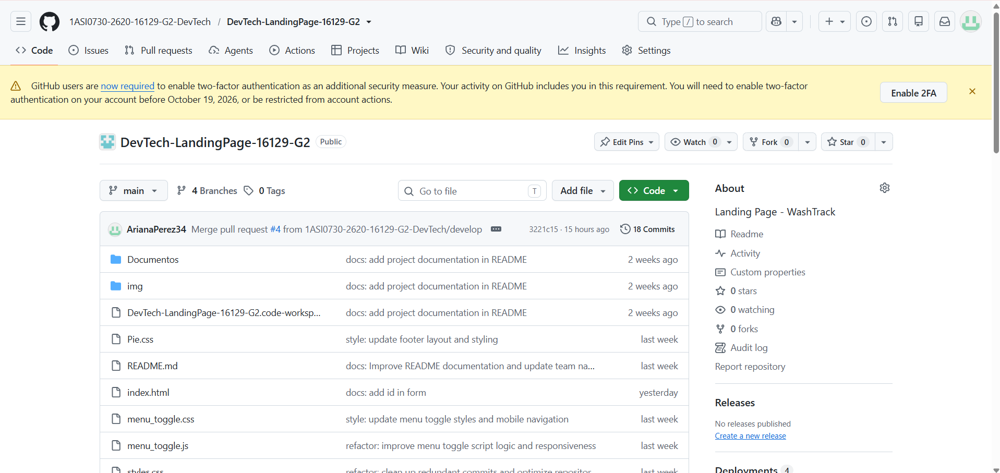

#### 2. Configuración de GitHub Pages
Dentro del repositorio se accede a la ruta: **Settings → Pages**. En esta sección se configura la fuente desde la cual GitHub Pages obtendrá los archivos que serán publicados.
En la configuración de GitHub Pages se selecciona la rama que contiene la versión que se desea publicar. Para una versión estable de la Landing Page se utiliza la rama `main` como fuente de publicación. Posteriormente, se guarda la configuración mediante la opción correspondiente.

  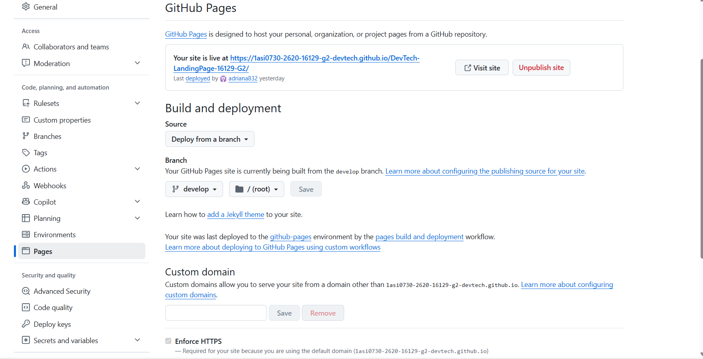

#### 3. Generación de la publicación
Procesa el contenido del repositorio y genera una dirección pública para acceder a la Landing Page de WashTrack. Cada actualización realizada sobre la rama configurada puede generar una nueva versión publicada del sitio.

  

#### 4. Validación del despliegue
Finalmente, se accede al enlace generado por GitHub Pages para comprobar que la Landing Page se encuentre disponible y que sus principales componentes funcionen correctamente. Se verifica la visualización de las secciones, navegación, estilos, imágenes, menú responsive y funcionalidad implementada mediante JavaScript.

  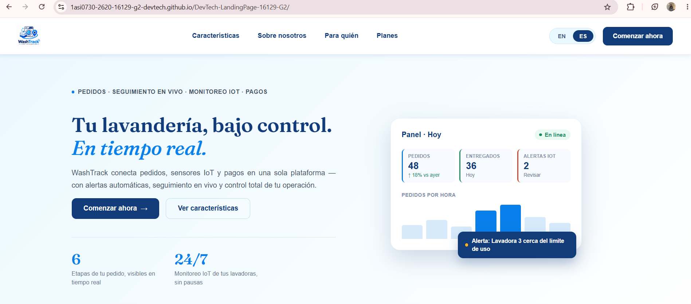

---

### Configuración de despliegue del Frontend Web Application

El Frontend Web Application de WashTrack será desplegado a partir de su repositorio correspondiente una vez finalizada su primera versión funcional. El proceso partirá del código fuente almacenado en GitHub y considerará la construcción de la aplicación mediante Vue Framework.

El flujo general será:
1. Obtener la versión estable del código desde el repositorio.
2. Instalar las dependencias definidas para el proyecto.
3. Ejecutar el proceso de construcción (*build*) de la aplicación.
4. Generar los archivos necesarios para producción.
5. Publicar los archivos generados en el servicio de alojamiento seleccionado.
6. Verificar el funcionamiento de las rutas, componentes, estilos y comunicación con los Web Services.
7. Validar la aplicación desde el navegador en diferentes tamaños de pantalla.

El despliegue de este producto será documentado con evidencias cuando se encuentre implementada su primera versión, de acuerdo con el avance correspondiente del proyecto.

---

### Configuración de despliegue de los Web Services

Los Web Services de WashTrack serán desarrollados utilizando ASP.NET Core, Entity Framework Core y C#, siguiendo el estilo arquitectónico RESTful API. Su despliegue partirá del repositorio de código fuente y requerirá configurar el entorno de ejecución, las dependencias de la aplicación y la conexión con el sistema de base de datos.

El flujo general de despliegue será:
1. Obtener desde GitHub la versión estable del Web Service.
2. Configurar las dependencias necesarias del proyecto ASP.NET Core.
3. Configurar las variables y parámetros correspondientes al entorno de producción.
4. Configurar la conexión con la base de datos.
5. Compilar y publicar la aplicación.
6. Ejecutar el servicio en el entorno de despliegue seleccionado.
7. Verificar los endpoints disponibles mediante la documentación OpenAPI/Swagger.
8. Comprobar la comunicación entre el Web Service y el Frontend Web Application.

Al igual que el Frontend Web Application, esta configuración será complementada con las evidencias de despliegue correspondientes cuando el producto alcance la etapa de implementación requerida.

---

### Flujo general de despliegue

El proceso de despliegue de WashTrack parte del código fuente administrado mediante GitHub y sigue el flujo definido por el equipo:

$$\text{Feature Branch} \longrightarrow \text{develop} \longrightarrow \text{main} \longrightarrow \text{Deployment}$$

Las ramas de desarrollo permiten realizar cambios de manera aislada. Después de validar los cambios, estos se integran en `develop`. Cuando una versión se encuentra preparada para publicación, se incorpora a `main`, desde donde se realiza el despliegue de la versión estable del producto correspondiente. De esta manera, el proceso permite mantener control sobre las versiones publicadas y facilita la actualización progresiva de la Landing Page, Frontend Web Application y Web Services conforme avance el desarrollo de WashTrack.

### 5.2. Landing Page, Services & Applications Implementation

#### 5.2.1. Sprint 1

El Sprint 1 está orientado a la implementación de la primera versión de la **Landing Page de WashTrack**, siguiendo un enfoque incremental de desarrollo. Durante este sprint se busca transformar los requerimientos y propuestas definidas previamente en una primera versión funcional del producto que permita comunicar la propuesta de valor de WashTrack y orientar a los usuarios hacia las experiencias correspondientes.

El trabajo de la Landing Page se desarrolló de manera paralela a la elaboración y refinamiento de los demás artefactos del proyecto desde las primeras semanas del ciclo. Debido a la naturaleza incremental del proyecto, las actividades de análisis, documentación, diseño e implementación se fueron realizando y revisando simultáneamente, permitiendo que los avances obtenidos en cada actividad sirvieran como insumo para las demás.

##### 5.2.1.1. Sprint Planning 1
El Sprint Planning 1 tuvo como finalidad establecer el objetivo del primer Sprint, seleccionar las User Stories prioritarias relacionadas con la Landing Page y organizar las actividades necesarias para obtener una primera versión funcional y desplegable. Para ello, se tomaron como referencia las User Stories definidas en el Product Backlog del Capítulo III, particularmente las correspondientes al Epic **EP01 – Landing Page & Acquisition**.

A diferencia de un proceso estrictamente secuencial, durante este periodo el equipo trabajó de manera paralela en la documentación del proyecto y en la construcción de la Landing Page. Por ello, el Sprint se plantea como una organización del trabajo realizado para alcanzar el incremento correspondiente, considerando que algunas actividades de diseño, documentación e implementación pudieron desarrollarse simultáneamente.

#### Resumen del Sprint Planning Meeting

| Elemento | Información |
|---|---|
| **Sprint #** | Sprint 1 |
| **Date** | `09/09/2026` |
| **Prepared By** | Ramos Fuentes Rivera, Adriana Nicole |
| **Attendees** | Pérez Vásquez, Ariana Valeria / Ramirez Gutierrez, Gabriel / Ramos Fuentes Rivera, Adriana Nicole / Sayago Vidal, Sebastián Leonardo / Tufiño Argüelles, Luis Angel |
| **Sprint 0 Review Summary** | No se estableció un Sprint 0 formal. Como punto de partida se consideraron los avances realizados durante las primeras semanas del ciclo en el análisis, especificación, diseño y preparación de los artefactos del proyecto, junto con el inicio paralelo de la Landing Page. |
| **Sprint 0 Retrospective Summary** | Al no existir un Sprint 0 formal, no se realizó una retrospectiva independiente. Sin embargo, el equipo identificó la necesidad de mantener un trabajo coordinado entre documentación, diseño e implementación para evitar que las actividades se desarrollaran de manera aislada. |
| **Sprint 1 Goal** | Implementar y dejar disponible una primera versión funcional de la Landing Page de WashTrack que permita presentar su propuesta de valor y orientar a los visitantes hacia las experiencias correspondientes para clientes y proveedores de servicios de lavandería. |
| **Sprint 1 Velocity** | 20 Story Points |
| **Sum of Story Points** | 20 Story Points |

#### User Stories seleccionadas

Para el Sprint 1 se seleccionaron las User Stories correspondientes al **EP01 – Landing Page & Acquisition**:

| ID | User Story | Propósito dentro del Sprint |
|---|---|---|
| **US01** | **Conocer WashTrack** | Presentar al visitante la propuesta de valor, características y beneficios principales de WashTrack. |
| **US02** | **Acceder como cliente** | Permitir que el visitante identifique la experiencia dirigida al cliente y pueda continuar hacia ella mediante los elementos de navegación correspondientes. |
| **US03** | **Acceder como proveedor** | Presentar la propuesta orientada a propietarios o proveedores de servicios de lavandería y permitir el acceso a su experiencia correspondiente. |

El objetivo del Sprint se encuentra enfocado en el usuario, ya que el incremento esperado no consiste únicamente en construir una página visual, sino en proporcionar una primera experiencia mediante la cual los visitantes puedan **comprender qué es WashTrack, identificar cómo puede ayudarlos y reconocer la opción que corresponde a su perfil**.

##### 5.2.1.2. Aspect Leaders and Collaborators
Para organizar el desarrollo del Sprint 1, el equipo distribuyó responsabilidades según los diferentes aspectos necesarios para implementar y validar la Landing Page. La asignación de un **Aspect Leader** representa al integrante que concentra la responsabilidad de coordinar o desarrollar principalmente dicho aspecto, mientras que los **Collaborators** brindan apoyo en las actividades relacionadas.

Esta distribución no representa una jerarquía dentro del equipo, sino una forma de organizar el trabajo y facilitar la coordinación de las actividades del Sprint.

| Aspecto | Aspect Leader | Collaborators | Actividades principales |
|---|---|---|---|
| **Estructura y navegación de la Landing Page** | Pérez Vásquez, Ariana Valeria | Sayago Vidal, Sebastián Leonardo / Tufiño Argüelles, Luis Angel | Definición de la estructura general, navegación, secciones y organización de los elementos de la página. |
| **Diseño visual e implementación de la interfaz** | Sayago Vidal, Sebastián Leonardo | Pérez Vásquez, Ariana Valeria / Ramos Fuentes Rivera, Adriana Nicole | Implementación de la interfaz, estilos, distribución visual y adaptación del diseño definido para la Landing Page. |
| **Contenido y propuesta de valor** | Ramos Fuentes Rivera, Adriana Nicole | Pérez Vásquez, Ariana Valeria / Ramirez Gutierrez, Gabriel | Redacción y revisión de contenidos relacionados con la propuesta de valor, beneficios y características de WashTrack. |
| **Integración de User Stories y revisión funcional** | Ramirez Gutierrez, Gabriel | Sayago Vidal, Sebastián Leonardo / Tufiño Argüelles, Luis Angel | Verificación de que los elementos implementados respondan a US01, US02 y US03 y revisión del comportamiento esperado. |
| **Control de versiones y coordinación técnica** | Tufiño Argüelles, Luis Angel | Ramirez Gutierrez, Gabriel / Sayago Vidal, Sebastián Leonardo | Gestión de cambios, integración de aportes y seguimiento de las modificaciones realizadas durante el desarrollo. |

La distribución permitió que los integrantes participaran en más de un aspecto del Sprint, manteniendo una dinámica colaborativa en lugar de asignar cada actividad de manera completamente independiente. Asimismo, debido a que la documentación y la implementación se desarrollaron en paralelo, los responsables de cada aspecto mantuvieron coordinación para incorporar cambios provenientes de los demás artefactos del proyecto.

##### 5.2.1.3. Sprint Backlog 1
El Sprint Backlog 1 contiene las actividades necesarias para alcanzar el Sprint Goal y desarrollar las User Stories seleccionadas para la primera versión de la Landing Page.

Las tareas fueron organizadas considerando que el trabajo se realizó de forma paralela desde las primeras semanas del ciclo. Por esta razón, el orden presentado no representa necesariamente una secuencia estrictamente cronológica de ejecución, sino la agrupación de las actividades realizadas para completar cada User Story y obtener el incremento del Sprint.

| ID | User Story | Tarea | Responsable | Estimación | Estado |
|---|---|---|---|---:|---|
| **T01** | US01 | Definir la estructura general de la Landing Page y sus principales secciones. | Pérez Vásquez, Ariana Valeria | 1 | Completado |
| **T02** | US03 | Implementar la sección dirigida a proveedores de servicios de lavandería. | Ramos Fuentes Rivera, Adriana Nicole | 1 | Completado |
| **T03** | US01 | Implementar la sección principal de presentación de WashTrack y su propuesta de valor. | Ramos Fuentes Rivera, Adriana Nicole | 1 | Completado |
| **T04** | US02 | Incorporar el acceso y CTA correspondiente a la experiencia del cliente. | Tufiño Argüelles, Luis Angel | 2 | Completado |
| **T05** | US01 | Implementar la sección de características y beneficios principales de WashTrack. | Ramirez Gutierrez, Gabriel | 1 | Completado |
| **T06** | US03 | Revisar el contenido y la presentación de la propuesta de valor para proveedores. | Ramos Fuentes Rivera, Adriana Nicole / Pérez Vásquez, Ariana Valeria | 2 | Completado |
| **T07** | US02 | Integrar los elementos de navegación relacionados con el acceso del cliente. | Sayago Vidal, Sebastián Leonardo / Tufiño Argüelles, Luis Angel | 2 | Completado |
| **T08** | US01 | Adaptar la distribución de las secciones para diferentes tamaños de pantalla. | Sayago Vidal, Sebastián Leonardo | 1 | Completado |
| **T09** | US03 | Incorporar CTA y elementos de orientación para proveedores. | Tufiño Argüelles, Luis Angel | 2 | Completado |
| **T10** | US01 | Revisar la consistencia visual y textual de la Landing Page. | Pérez Vásquez, Ariana Valeria / Ramos Fuentes Rivera, Adriana Nicole | 1 | Completado |
| **T11** | US02 | Verificar el flujo de navegación desde la Landing Page hacia la experiencia del cliente. | Ramirez Gutierrez, Gabriel / Sayago Vidal, Sebastián Leonardo | 1 | Completado |
| **T12** | US03 | Verificar el flujo de navegación desde la Landing Page hacia la experiencia del proveedor. | Ramirez Gutierrez, Gabriel / Tufiño Argüelles, Luis Angel | 2 | Completado |
| **T13** | US01 | Realizar revisión funcional de la primera versión de la Landing Page. | Todo el equipo | 2 | Completado |
| **T14** | US01 / US02 / US03 | Integrar los cambios finales y preparar la versión del Sprint para su revisión y despliegue. | Todo el equipo | 3 | Completado |

#### Relación entre User Stories y tareas

| User Story | Tareas asociadas |
|---|---|
| **US01 – Conocer WashTrack** | T01, T03, T05, T08, T10, T13, T14 |
| **US02 – Acceder como cliente** | T04, T07, T11, T14 |
| **US03 – Acceder como proveedor** | T02, T06, T09, T12, T14 |

El resultado esperado del Sprint Backlog es una primera versión de la Landing Page que permita cumplir las tres User Stories seleccionadas. La implementación constituye el incremento correspondiente al Sprint 1 y sirve como base para las iteraciones posteriores del producto, en las cuales se incorporarán nuevas versiones de la Landing Page junto con las Web Applications y los Web Services.

##### 5.2.1.4. Development Evidence for Sprint Review

Durante el Sprint 1, el equipo implementó la primera versión funcional de la Landing Page de WashTrack, cubriendo las tres User Stories priorizadas del Sprint Backlog (US01 – Conocer WashTrack, US02 – Acceder como cliente, US03 – Acceder como proveedor). El desarrollo se organizó en el repositorio DevTech-LandingPage-16129-G2, comenzando con la estructura principal de la página y su navegación, para luego incorporar de forma incremental la sección de propuesta de valor, los accesos diferenciados para cada segmento objetivo, y ajustes de estilo y responsividad alineados con el Design System del proyecto. Como parte del cierre del Sprint, se renombró el archivo principal a index.html siguiendo la convención estándar de despliegue, se mejoró la documentación del README del repositorio, y se enlazó el formulario de contacto con la política de privacidad del proyecto. A continuación se detallan los commits relacionados con esta implementación, agrupados por repositorio y rama.

| Repository | Branch | Commit Id | Commit Message | Commit Message Body | Committed on (Date) |
|---|---|---|---|---|---|
| `1ASI0730-2620-16129-G2-DevTech/DevTech-LandingPage-16129-G2` | `feature/landing` | `4de302d` | `docs: add project documentation in README` | `Se agrega la documentación inicial del proyecto en el README del repositorio.` | `05/09/2026` |
| `1ASI0730-2620-16129-G2-DevTech/DevTech-LandingPage-16129-G2` | `feature/landing` | `096513d` | `feat: add first version of main landing structure` | `Se implementa la estructura principal de la Landing Page, incluyendo secciones base y navegación inicial.` | `05/09/2026` |
| `1ASI0730-2620-16129-G2-DevTech/DevTech-LandingPage-16129-G2` | `feature/landing` | `382c7b8` | `feat: remove dropdown menu items for services simplification` | `Se simplifica el menú de navegación eliminando ítems de dropdown de servicios para mejorar la claridad de la interfaz.` | `05/09/2026` |
| `1ASI0730-2620-16129-G2-DevTech/DevTech-LandingPage-16129-G2` | `feature/landing` | `e95b5bb` | `docs: link privacy policy to LeyProteccionDatos PDF document` | `Se enlaza la política de privacidad del formulario de contacto al documento PDF de la Ley de Protección de Datos.` | `05/09/2026` |
| `1ASI0730-2620-16129-G2-DevTech/DevTech-LandingPage-16129-G2` | `feature/FinalVersion` | `f48bead` | `Rename LandingPage.html to index.html` | `Se renombra el archivo principal a index.html, siguiendo la convención estándar para el despliegue del sitio.` | `05/09/2026` |
| `1ASI0730-2620-16129-G2-DevTech/DevTech-LandingPage-16129-G2` | `feature/FinalVersion` | `97978c3` | `refactor: update index.html to align with rubric requirements and team branding` | `Se actualiza el archivo principal para ajustarse a los requisitos de la rúbrica y al branding del equipo.` | `08/09/2026` |
| `1ASI0730-2620-16129-G2-DevTech/DevTech-LandingPage-16129-G2` | `feature/FinalVersion` | `0d5cb09` | `style: enhance CSS styling and layout consist about the rubric` | `Se mejora el estilo CSS y la consistencia del layout conforme a los criterios de la rúbrica.` | `08/09/2026` |
| `1ASI0730-2620-16129-G2-DevTech/DevTech-LandingPage-16129-G2` | `feature/FinalVersion` | `4d78f07` | `refactor: clean up redundant commits and optimize repository structure` | `Se limpia el historial de commits redundantes y se optimiza la estructura del repositorio.` | `08/09/2026` |
| `1ASI0730-2620-16129-G2-DevTech/DevTech-LandingPage-16129-G2` | `feature/FinalVersion` | `30068a9` | `docs: Improve README documentation and update team name` | `Se mejora la documentación del README y se actualiza el nombre del equipo en el repositorio.` | `08/09/2026` |
| `1ASI0730-2620-16129-G2-DevTech/DevTech-LandingPage-16129-G2` | `feature/FinalVersion` | `9ca097a` | `style: update footer layout and styling` | `Se actualiza el diseño y estilo del pie de página de la Landing Page.` | `08/09/2026` |
| `1ASI0730-2620-16129-G2-DevTech/DevTech-LandingPage-16129-G2` | `feature/FinalVersion` | `0371859` | `style: update menu toggle styles and mobile navigation` | `Se actualizan los estilos del botón de menú y la navegación en dispositivos móviles.` | `08/09/2026` |
| `1ASI0730-2620-16129-G2-DevTech/DevTech-LandingPage-16129-G2` | `feature/FinalVersion` | `ec7486f` | `refactor: improve menu toggle script logic and responsiveness` | `Se mejora la lógica del script del menú y su capacidad de respuesta en distintos tamaños de pantalla.` | `08/09/2026` |
| `1ASI0730-2620-16129-G2-DevTech/DevTech-LandingPage-16129-G2` | `feature/edit-form` | `2163913` | `docs: add id in form` | `Se agrega un identificador al formulario de contacto para su correcta integración funcional.` | `16/09/2026` |

##### 5.2.1.5. Execution Evidence for Sprint Review

Como resultado del Sprint 1, se logró desplegar la primera versión funcional de la Landing Page de WashTrack, cumpliendo con las tres User Stories priorizadas en el Sprint Backlog. A nivel de ejecución, la interfaz presenta de forma clara la propuesta de valor de WashTrack en su sección principal, seguida de los accesos diferenciados que permiten al visitante identificar y navegar hacia la experiencia correspondiente a su perfil, ya sea como cliente o como proveedor de servicios de lavandería. La navegación entre secciones se implementó mediante un menú responsivo, adaptado tanto a la versión de escritorio como a dispositivos móviles, y el formulario de contacto ubicado al final de la página quedó enlazado a la política de privacidad del proyecto. A continuación se presentan las capturas de pantalla que evidencian la visualización y navegación alcanzadas durante este Sprint, junto con el enlace al video de demostración correspondiente.

A continuación se presentan las capturas de pantalla más representativas de las vistas implementadas y puestas en funcionamiento durante el Sprint 1, correspondientes a la primera versión de la Landing Page de WashTrack.

**Sección principal (Hero) — Propuesta de valor de WashTrack**

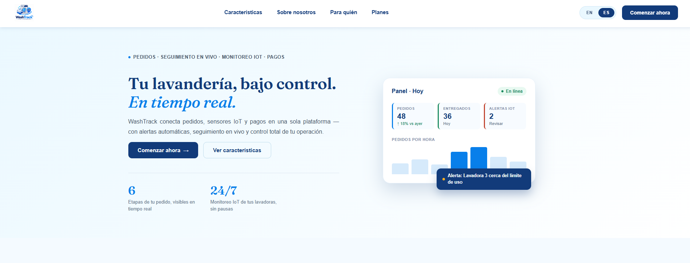

Presenta el mensaje principal "Tu lavandería, bajo control. En tiempo real.", junto con un panel visual que anticipa las funcionalidades clave del producto (pedidos, entregas, alertas IoT), evidenciando el cumplimiento de US01 – Conocer WashTrack.

**Sección de características — Funcionalidades del producto**

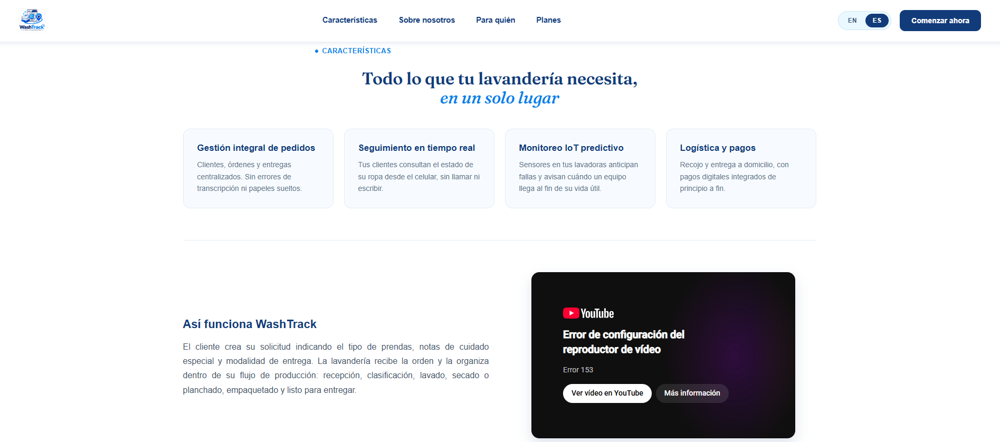

Muestra las cuatro funcionalidades principales de la plataforma (Gestión integral de pedidos, Seguimiento en tiempo real, Monitoreo IoT predictivo, Logística y pagos), reforzando la propuesta de valor comunicada en la sección Hero.

**Sección "Para quién" — Accesos diferenciados por segmento**

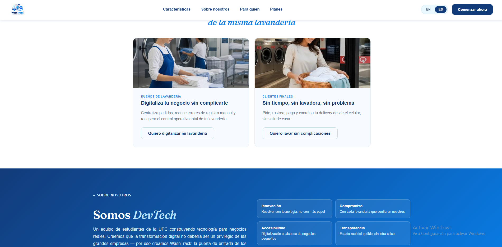

Presenta los dos segmentos objetivo (Dueños de lavandería y Clientes finales), cada uno con su propio mensaje y call-to-action, evidenciando el cumplimiento de US02 – Acceder como cliente y US03 – Acceder como proveedor.

**Selector de idioma — Internacionalización (i18n)**

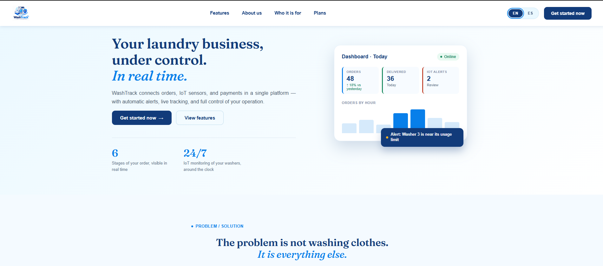

Evidencia el funcionamiento del selector de idioma (ES/EN) ubicado en la barra de navegación, mostrando la sección principal traducida al inglés, en línea con el enfoque de internacionalización definido para el proyecto.

* **Landing Page:** [DevTech Landing Page](https://1asi0730-2620-16129-g2-devtech.github.io/DevTech-LandingPage-16129-G2/)

##### 5.2.1.6. Services Documentation Evidence for Sprint Review

  Durante el Sprint 1, se ha avanzado en la definición y simulación de la captura de datos desde la interfaz de la Landing Page de WashTrack. Se estructuraron los formularios clave de interacción con el cliente y se definieron las especificaciones de los parámetros de entrada y respuestas del sistema (mock responses) para asegurar la integración fluida con la arquitectura de Web Services.

 

| Endpoint / Interacción | Acción (HTTP) | Parámetros (Input IDs) | Descripción del Response |
|---|---|---|---|
| `index.html#contactForm` | **POST (Mock)** | `nombre`, `correo`, `tipo`, `intereses`, `mensaje` | **202 Accepted:** Confirmación visual de envío mediante mensaje de éxito y reinicio automático de los campos del formulario (`reset`). |

- **URL del Repositorio de Landing Page:** [https://github.com/1ASI0730-2620-16129-G2-DevTech/DevTech-LandingPage-16129-G2](https://github.com/1ASI0730-2620-16129-G2-DevTech/DevTech-LandingPage-16129-G2)

##### 5.2.1.7. Software Deployment Evidence for Sprint Review

  Durante el Sprint 1, se llevaron a cabo las actividades de configuración y despliegue del producto correspondiente a la Landing Page del proyecto. Se seleccionó la plataforma de infraestructura en la nube de GitHub Pages por su integración nativa con el control de versiones y su soporte para entornos de producción con certificados HTTPS automáticos.

 

**Actividades realizadas**

  <ul>
    <li><b>Configuración del Entorno de GitHub Pages:</b> Habilitación y configuración del servicio de hosting en la nube a través del panel de administración del repositorio DevTech-LandingPage-16129-G2.</li> 
    <li><b>Vinculación de la Rama de Producción:</b> Configuración del flujo de publicación continua para tomar automáticamente la fuente del sitio desde la rama main, garantizando que cada actualización del código fuente active un build y despliegue del sitio estático.</li> 
    <li><b>Aprovisionamiento de SSL y Dominio Público:</b> Validación de la generación del certificado de seguridad SSL para habilitar la navegación segura vía HTTPS y verificación de la disponibilidad pública en la URL asignada por GitHub Pages.</li>
  </ul>

 

**Evidencia del deploy: Landing page web responsive**

  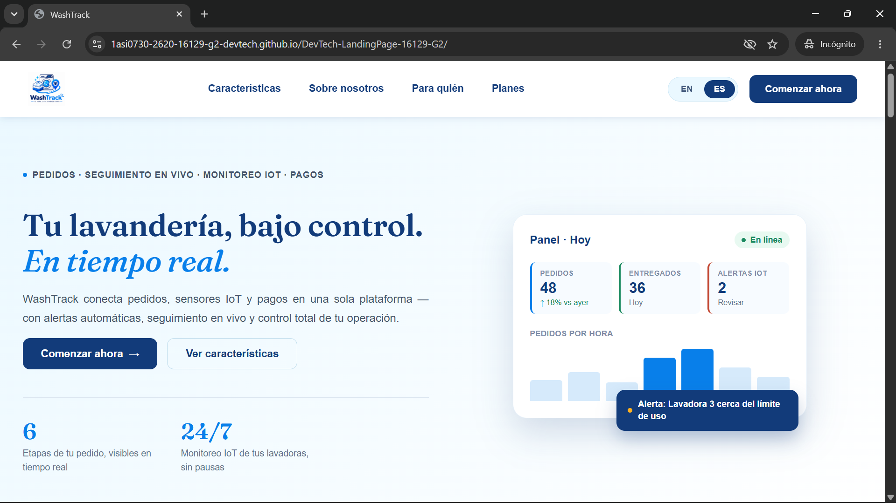
  
Deployed Landing Page - Web

  

 

**Evidencia del deploy: Landing page mobile responsive**

  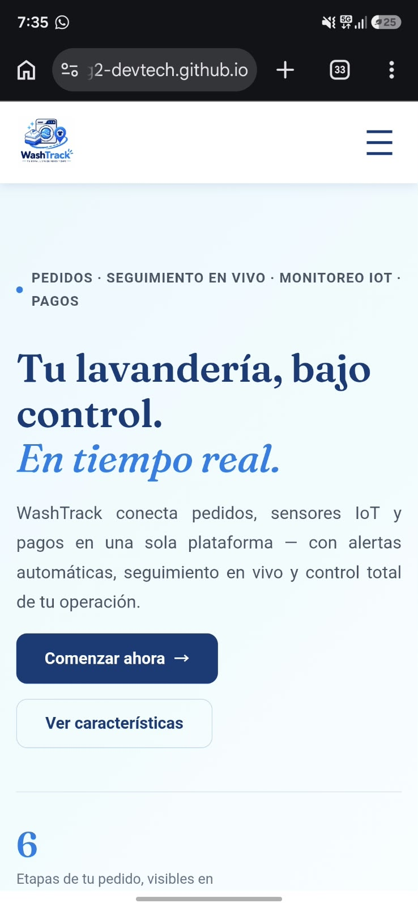
  
Deployed Landing Page - Mobile

  

 

- **Url del despliegue de la landing page:** [https://1asi0730-2620-16129-g2-devtech.github.io/DevTech-LandingPage-16129-G2/](https://1asi0730-2620-16129-g2-devtech.github.io/DevTech-LandingPage-16129-G2/) 

##### 5.2.1.8. Team Collaboration Insights during Sprint

## Explicación del trabajo en equipo - Report 

Durante el Sprint 1, los cinco integrantes trabajaron en paralelo con un flujo de **ramas `feature/`** creadas a partir de `develop`. Cada entregable se desarrolló en su propia rama y se integró mediante **Pull Request**, lo que permitió avanzar sin bloquearse entre sí y mantener `develop` estable.

Entre el 11 y el 18 de septiembre de 2026 se fusionaron **13 Pull Requests** (ninguno quedó abierto). Los 5 integrantes hicieron push: **106 commits** en todas las ramas, 63 de ellos en `develop`, con 109 archivos modificados (1850 líneas añadidas y 300 eliminadas). Los PRs cubrieron el despliegue del software, la documentación de servicios, la guía de estilo y convenciones de código, el reporte de collaboration insights y las conclusiones.

## Evidencia de participación de todos los miembros

| Integrante (GitHub) | Commits | Líneas añadidas | Líneas eliminadas |
|---|---|---|---|
| adriana832 | 64 | 1322 | 206 |
| ArianaPerez34 | 35 | 963 | 50 |
| SSayag0V | 13 | 1726 | 631 |
| LuisTufino2 | 13 | 797 | 21 |
| GabrielRamirez06 | 12 | 1058 | 95 |

*Fuente: GitHub Insights – Contributors (`develop`, sin commits de merge).*

## Capturas de GitHub

*Figura 1. Aporte individual y commits a lo largo del tiempo.*

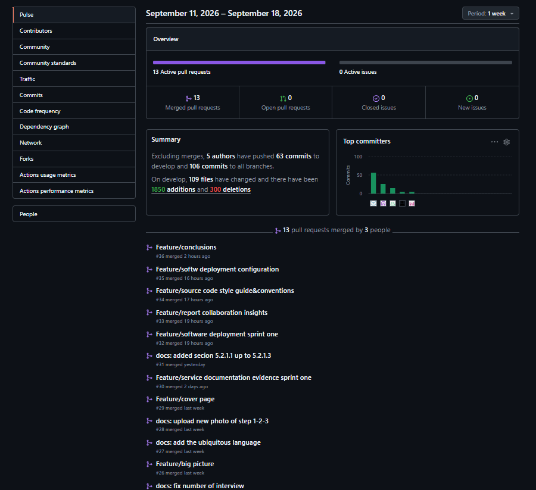
*Figura 2. Actividad del sprint y Pull Requests fusionados.*

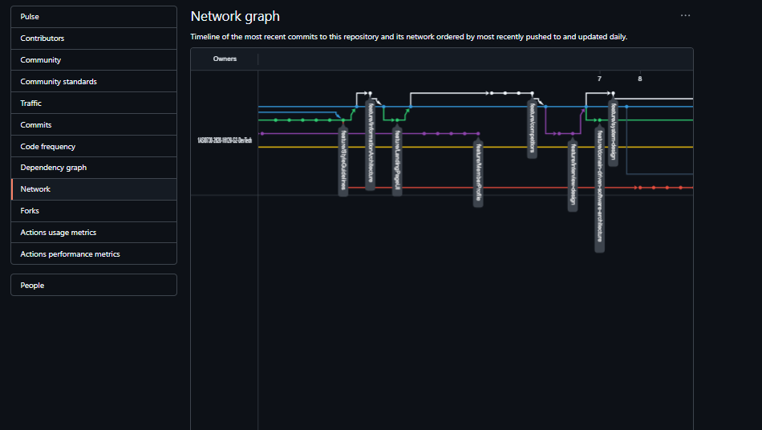
*Figura 3. Flujo de ramas `feature/` y merges.*

*Figura 4. Historial de commits del repositorio.*

----

## Explicación del trabajo en equipo - Landing Page 

El desarrollo de la Landing Page se organizó con un flujo de **ramas y Pull Requests**: la rama `feature/landing` se usó para la construcción inicial de la página y `feature/finalVersion` para la versión final. Ambas se integraron a `develop`, y `develop` se fusionó a `main` mediante Pull Request, lo que mantuvo `main` con una versión estable de la página.

La mayor parte del desarrollo se concentró entre finales de agosto y mediados de septiembre, con actividad en tres semanas consecutivas (aproximadamente 6, 7 y 1 commits a `main`, 14 en total). Entre el 11 y el 18 de septiembre de 2026 se cerró la etapa de ajustes finales: se fusionaron **2 Pull Requests** (#3 `docs: add id in form` y #4 `Develop`), realizados por 2 personas y sin ningún PR abierto. En el Network graph se observa que la rama `feature/finalVersion` acumuló varios commits antes de integrarse (16 de septiembre), y que `develop` se fusionó a `main` el 17 de septiembre.

## Evidencia de participación

| Integrante (GitHub) | Commits en `main` | Líneas añadidas | Líneas eliminadas |
|---|---|---|---|
| ArianaPerez34 | 13 | 4059 | 1575 |
| adriana832 | 1 | 1 | 1 |

*Fuente: GitHub Insights – Contributors (`main`, sin commits de merge, del 13 de junio al 12 de septiembre de 2026).*

## Capturas de GitHub

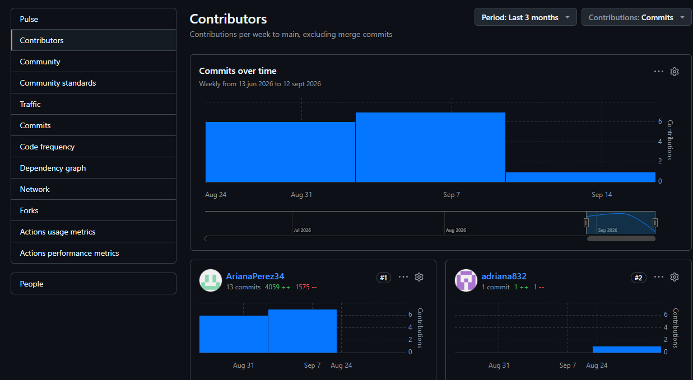
*Figura 1. Aporte individual y commits a lo largo del tiempo en `main`.*

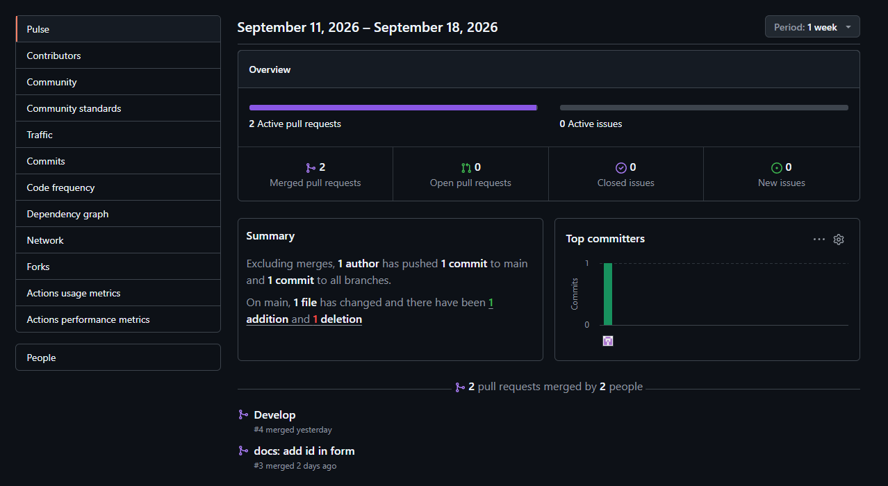
*Figura 2. Actividad de la última semana y Pull Requests fusionados.*

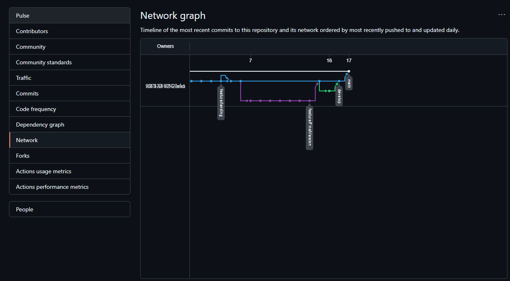
*Figura 3. Flujo de ramas `feature/landing`, `feature/finalVersion`, `develop` y `main`.*

*Figura 4. Historial de commits del repositorio de la Landing Page.*

### 5.3. Validation Interviews

#### 5.3.1. Diseño de Entrevistas
#### 5.3.2. Registro de Entrevistas
#### 5.3.3. Evaluaciones según heurísticas

### 5.4. Video About-the-Product

---

## Conclusiones

A partir del desarrollo del proyecto **WashTrack** que desarrollo nuestro equipo <b>DevTech</b>, se logró avanzar desde la identificación de las necesidades de los usuarios hasta la implementación y despliegue de una primera versión de la Landing Page. El proyecto permitió integrar las actividades de levantamiento y análisis de requisitos, especificación de requisitos, diseño del producto, gestión de configuración, implementación y despliegue, manteniendo una relación directa entre las necesidades identificadas y las funcionalidades propuestas para la solución.

* **En relación con los Problem Statements:** Se identificaron dificultades en los clientes de lavanderías relacionadas con la falta de información sobre el estado de sus prendas, la coordinación de los servicios de recojo y entrega, y la necesidad de contar con mayor visibilidad durante el procesamiento de sus pedidos. Desde la perspectiva de las lavanderías, también se identificó la necesidad de mejorar la gestión y seguimiento de sus operaciones. Frente a estas problemáticas, WashTrack plantea una solución digital orientada a centralizar la gestión de pedidos, facilitar el seguimiento de las prendas y mejorar la interacción entre clientes y proveedores del servicio.

* **Respecto a los Assumptions:** Los supuestos establecidos durante la etapa de *Requirements Elicitation & Analysis* fueron contrastados mediante entrevistas. La información obtenida permitió validar las necesidades inicialmente planteadas con el comportamiento y la voz real de los usuarios. Se identificó la importancia crítica de conocer el estado de las prendas durante el servicio y de contar con mecanismos que faciliten la coordinación del recojo y la entrega, orientando la propuesta hacia necesidades concretas del segmento objetivo.

* **En cuanto a los Hypotheses Statements:** Las necesidades identificadas se transformaron en hipótesis relacionadas principalmente con el seguimiento de pedidos, la gestión digital del servicio y la coordinación entre clientes y lavanderías. La primera versión implementada permitió llevar estas hipótesis a elementos concretos de la solución y establecer una base sólida para continuar validándolas en las siguientes iteraciones del producto.

* **Criterios de éxito definidos mediante Lean UX:** La primera versión de WashTrack permitió avanzar en la comprobación de aspectos relacionados con la comprensión de la propuesta de valor, la identificación de las funcionalidades principales y la presentación de una experiencia orientada a las necesidades del segmento. La Landing Page presenta la propuesta de WashTrack, sus características principales, los usuarios a los que se dirige y el funcionamiento general del servicio. Sin embargo, se concluye que algunos criterios cuantitativos requieren continuar siendo validados en futuras iteraciones mediante la implementación de las funcionalidades correspondientes al *Frontend Web Application* y los *Web Services*.

* **Product Implementation, Validation & Deployment:** Se estableció una base técnica para continuar con la evolución del proyecto. Se utilizaron herramientas y prácticas para la gestión del código fuente mediante GitHub, se definió un flujo de trabajo basado en ramas y se establecieron convenciones de desarrollo. Asimismo, se implementó la primera versión de la Landing Page utilizando HTML5, CSS3 y JavaScript, incorporando navegación responsive, cambio de idioma e interacción. Finalmente, se configuró su despliegue mediante GitHub Pages, permitiendo disponer de una versión accesible del producto.

* **Ejecución del Sprint 1:** El desarrollo del primer sprint permitió organizar las actividades mediante *Sprint Planning*, *Sprint Backlog* y una correcta distribución de responsabilidades entre los integrantes del equipo. Las evidencias de desarrollo, ejecución, documentación y despliegue permitieron realizar un seguimiento riguroso al avance de los entregables y establecer la base de trabajo para los siguientes sprints.

---

## Recomendaciones

Como parte de los siguientes pasos en el **Roadmap** de los productos digitales que forman parte del alcance del negocio, se recomienda:

1. **Desarrollo del Frontend Web Application:** Priorizar la implementación de la aplicación web comenzando por las funcionalidades principales del cliente, tales como la creación de pedidos, la consulta del estado de las prendas y el seguimiento del servicio.
2. **Implementación de Web Services RESTful API:** Desarrollar e integrar los servicios backend utilizando ASP.NET Core, Entity Framework Core y C#, permitiendo conectar la aplicación con la persistencia de datos en la base de datos y soportar la lógica del negocio.
3. **Módulo para Proveedores (Lavanderías):** Continuar con el desarrollo de las funcionalidades destinadas a las lavanderías, incorporando la gestión de pedidos, la actualización de las etapas del procesamiento y la administración de la información de los servicios.
4. **Validación Continua con Usuarios:** Realizar pruebas y validaciones con usuarios del segmento objetivo tras cada incremento significativo del producto. Los resultados obtenidos deberán utilizarse para reevaluar los *Assumptions* y *Hypotheses Statements*, contrastar los criterios de éxito de Lean UX y actualizar la priorización del *Product Backlog*, asegurando que WashTrack evolucione progresivamente hacia una solución digital integral.

---

# Bibliografía

* Instituto Nacional de Estadística e Informática [INEI]. (2024). *Encuesta Nacional de Uso del Tiempo (ENUT) 2024: Principales resultados*. Gobierno del Perú. Retrieved from [https://cdn.www.gob.pe/uploads/document/file/7838198/6610655-encuesta-nacional-de-uso-del-tiempo-2024-principales-resultados.pdf?v=1743092246](https://cdn.www.gob.pe/uploads/document/file/7838198/6610655-encuesta-nacional-de-uso-del-tiempo-2024-principales-resultados.pdf?v=1743092246)
* Instituto Nacional de Estadística e Informática [INEI]. (2026). *Condiciones de Vida en el Perú: I Trimestre 2026 (Resultados de la Encuesta Nacional de Hogares - ENAHO)*. Gobierno del Perú. Retrieved from [https://cdn.www.gob.pe/uploads/document/file/10184760/8285402-condiciones-de-vida-en-el-peru-i-trimestre-2025.pdf?v=1782145344](https://cdn.www.gob.pe/uploads/document/file/10184760/8285402-condiciones-de-vida-en-el-peru-i-trimestre-2025.pdf?v=1782145344)
* Jansen, S. M. (2019). *Practical Domain-Driven Design in Enterprise Java: Using Jakarta EE, NoSQL Databases, and Microservices*. Apress. Retrieved from [https://bit.ly/4flQyB7](https://bit.ly/4flQyB7)
* Microsoft. (n.d.). *What is ASP.NET Core?* Microsoft. Retrieved from [https://dotnet.microsoft.com/es-es/learn/aspnet/what-is-aspnet-core](https://dotnet.microsoft.com/es-es/learn/aspnet/what-is-aspnet-core)
* W3Schools. (n.d.). *Responsive Web Design*. W3Schools Online Web Tutorials. Retrieved from [https://www.w3schools.com/html/html_responsive.asp](https://www.w3schools.com/html/html_responsive.asp)
* MDN Web Docs. (n.d.). *Mobile-first design*. Mozilla. Retrieved from [https://developer.mozilla.org/en-US/docs/Web/Progressive_web_apps/Responsive/Mobile_first](https://developer.mozilla.org/en-US/docs/Web/Progressive_web_apps/Responsive/Mobile_first)
---

# Anexos

Video de entrevistas: [Microsoft Clipchamp](https://upcedupe-my.sharepoint.com/:v:/g/personal/u202018427_upc_edu_pe/IQBteAOvFWmaTb9BO9km69zHARlBa-PbkxSnjg9gsWnRY-I?e=qibbPs&nav=eyJyZWZlcnJhbEluZm8iOnsicmVmZXJyYWxBcHAiOiJTdHJlYW1XZWJBcHAiLCJyZWZlcnJhbFZpZXciOiJTaGFyZURpYWxvZy1MaW5rIiwicmVmZXJyYWxBcHBQbGF0Zm9ybSI6IldlYiIsInJlZmVycmFsTW9kZSI6InZpZXcifX0%3D)

URL del repositorio (report): [Repositorio Report](https://github.com/1ASI0730-2620-16129-G2-DevTech/DevTechReport-16129-G2)

URL del repositorio (landing-page): [Repositorio Landing Page](https://github.com/1ASI0730-2620-16129-G2-DevTech/DevTech-LandingPage-16129-G2)

URL de landing page (GithubPage): [Landing Page](https://1asi0730-2620-16129-g2-devtech.github.io/DevTech-LandingPage-16129-G2/)

URL de exposición (AV1): [Exposición AV1]()

---
